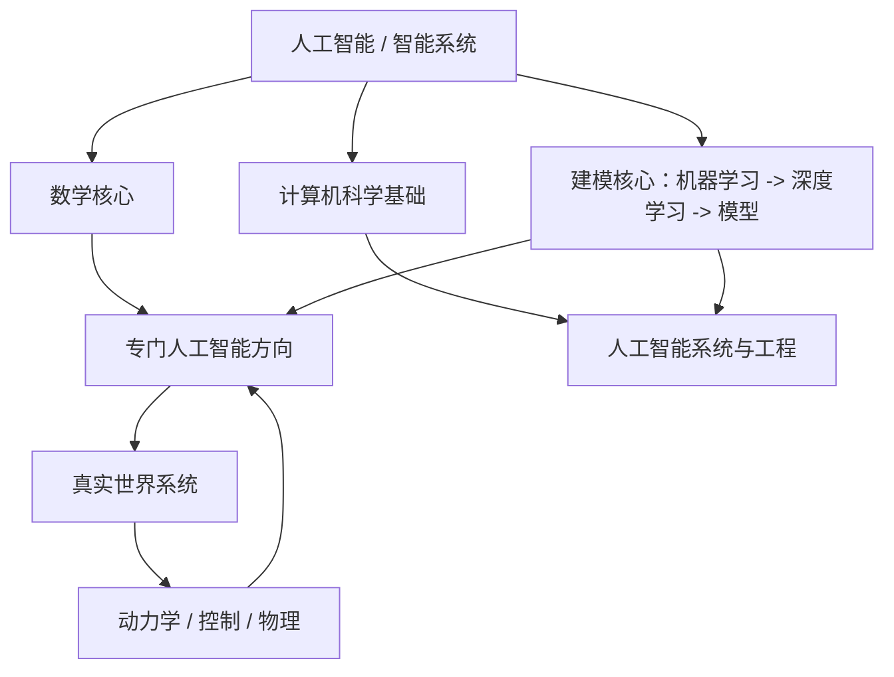
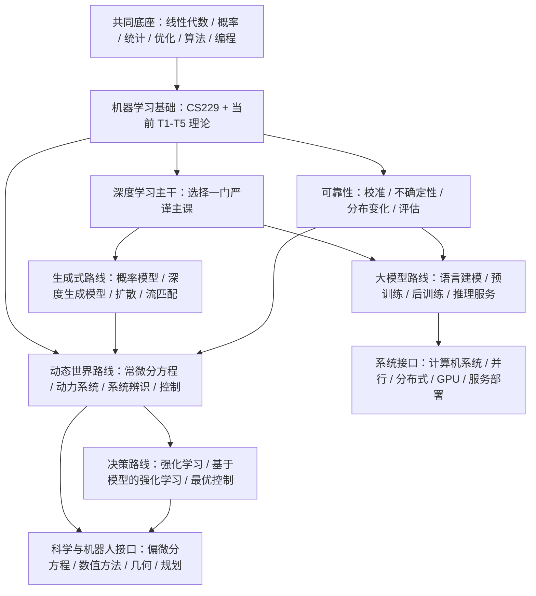
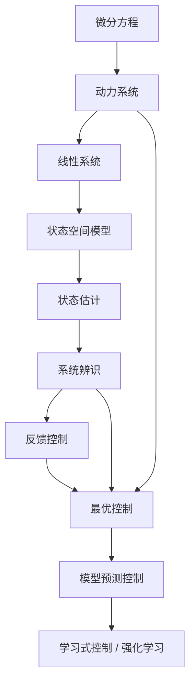
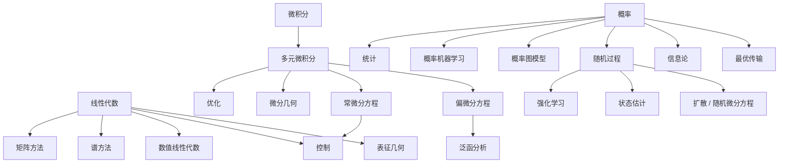
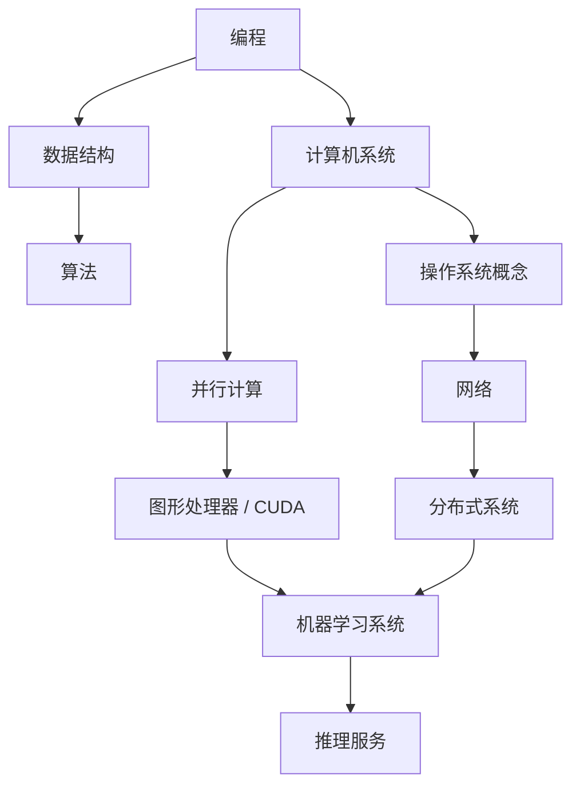

# 人工智能、机器学习、深度学习、数学与计算机科学知识体系路线图

> 来源复查日期：2026-08-17
> 适用仓库：`ML-DL-NLP-Lab`

这份文档是长期维护的知识图谱、课程地图和研究路线图。它不是课程名字堆砌，也不是“下一门课学什么”的短期清单。它要解决的问题是：当数学、计算机科学、机器学习、深度学习、生成式人工智能、强化学习、大语言模型、概率机器学习、世界模型、控制、机器人、人工智能安全、机器学习系统等知识同时出现时，它们到底属于什么层级、怎样依赖、哪些方向共享基础、哪些课程重复、当前应该深入什么、了解什么、暂时跳过什么。

当前仓库已经完成 `Learning From Data / 机器学习理论 T1-T5`。因此本文把已有理论笔记放入更大的知识系统，而不是重新写一套入门机器学习理论。

说明：为了避免术语误解，少数专业缩写和课程编号会保留，例如 AI、ML、DL、LLM、RL、CS229、Flow Matching、Diffusion Models、Transformer、vLLM。除课程正式名称、缩写和必要术语外，本文尽量使用中文。图里的节点也使用中文。

## 目录

- 0. 使用方式
- 1. 三个坐标轴
- 2. 总知识树
  - 2.2 方向到知识体系总览
  - 2.3 方向之间的真实关系
- 3. 生成模型与生成式人工智能
- 4. 生成式人工智能术语地图
- 5. 生成式建模课程主线
- 6. 强化学习路线
- 7. 自然语言处理、大语言模型、推理与智能体
- 8. 概率、概率机器学习与概率图模型
- 9. 世界模型
- 10. 机器人与具身智能
- 11. 动力学与控制
- 12. 科学机器学习与物理约束机器学习
- 13. 人工智能安全、机器学习可靠性与负责任人工智能
- 14. 为什么机器学习和深度学习课程这么多
- 15. 现代人工智能所需数学
- 16. 计算机科学基础
- 17. 基础模型与人工智能工程栈
- 18. 课程去重表
- 19. 十一条研究路线
- 20. 优先级矩阵
- 21. 当前主干
- 22. 时间有限时的最短路径
- 23. 研究核心与就业核心
- 24. 课程优先级总表
- 25. 课程重叠结论
- 26. “理解世界”到底需要什么
- 27. 当前研究方向建议
- 28. 我现在到底该深入学什么
- 29. 来源复查与公开材料说明

## 0. 使用方式

本文的判断标准不是“这门课有名，所以学”，而是：

```text
知识层级
+ 研究方向
+ 学习深度
+ 机会成本
+ 当前仓库已有进度
```

使用原则：

- 不把不同抽象层级的对象并列成“方向”。
- 不重复刷同类入门课程。
- C/D 不表示永远没用，只表示当前不应完整投入。
- 课程只是获得知识的载体，真正要维护的是依赖关系图。
- 正式开始一门课前，要重新检查课程主页和公开材料状态，尤其是斯坦福、CMU、伯克利的当前课程页。

## 1. 三个坐标轴

### 1.1 知识层级

```text
数学
计算机科学基础
机器学习基础
深度学习基础
专门人工智能方向
人工智能系统与工程
领域知识与科学知识
```

这些不是平行课程目录，而是知识层。许多课程跨层。例如 Stanford CS336 同时涉及大语言模型结构、数据管线、预训练、分布式计算和评估。

### 1.2 研究方向

```text
生成式建模
强化学习与决策
自然语言处理与大语言模型
概率机器学习
世界模型
人工智能安全
科学机器学习与动力系统
表征学习
机器学习系统
机器人
```

研究方向是问题组织方式，不是基础层级。一个研究方向通常共享多层基础。

### 1.3 学习深度

| 标记 | 深度 | 要求 |
| --- | --- | --- |
| S | 深入掌握 / 核心 | 系统课程、数学推导、作业、实现、能读论文 |
| A | 系统掌握 / 重要 | 主体课程、核心推导、核心实验，不必覆盖所有专题 |
| B | 结构性了解 / 选择性学习 | 理解为什么存在、和主线关系、关键章节，不完整刷课 |
| C | 按研究需求学习 | 当前不学完整课程，遇到论文或项目需求再补 |
| D | 暂时跳过 | 知识可能重要，但当前机会成本太高 |

## 2. 总知识树

```text
                         人工智能 / 智能系统
                                  |
          +-----------------------+-----------------------+
          |                       |                       |
       数学核心              计算机科学基础              建模核心
          |                       |              机器学习 -> 深度学习 -> 模型
          |                       |
          +---------------+-------+---------------+
                          |                       |
                    专门人工智能方向          人工智能系统
                          |                       |
                生成式 / 强化学习 /           训练 / 推理服务 /
                大语言模型 / 世界模型          分布式 / 智能体
                          |
                          |
                      真实世界系统
                          |
                  动力学 / 控制 / 物理
```



### 2.1 同一个词，可能不是同一层级

| 概念 | 正确层级 | 不能误解为 |
| --- | --- | --- |
| 注意力机制 | 信息交互算子 | 生成模型 |
| Transformer | 模型结构族 | 天然就是大语言模型或基础模型 |
| 大语言模型 | 模型族 / 规模范式 | 全部自然语言处理 |
| 预训练 | 训练阶段 | 模型结构 |
| 后训练 | 训练阶段 / 方法族 | 简单调一个参数 |
| vLLM | 推理服务系统 | 模型、推理算法或 VLM |
| 智能体 | 系统结构 | 强化学习本身 |
| 流匹配 | 连续时间生成建模方法族 | 扩散模型本身 |
| 物理约束神经网络 | 物理约束机器学习的一种方法 | 全部科学机器学习 |
| 人工智能安全 | 安全、对齐、评估、监督等宽领域 | 只有公平性或只有对齐 |

### 2.2 方向到知识体系总览

如果只看一张表，应先看这张。课程只是最后一列的学习载体；真正的结构是“研究问题需要什么数学、计算机科学和建模能力”。

| 方向 | 核心问题 | 数学底座 | 计算机科学底座 | 机器学习 / 人工智能底座 | 当前深度 |
| --- | --- | --- | --- | --- | --- |
| 通用机器学习 / 可信机器学习 | 有限数据下如何做可靠预测，并知道何时不可靠 | 线性代数、概率、统计、优化、学习理论 | Python、算法、实验工程 | CS229、T1-T5、深度学习、校准、分布变化 | S/A |
| 动态系统表征 / 机制学习 | 从带噪观测中恢复状态、机制、变化规律 | 线性代数、概率、统计、常微分方程、动力系统、数值分析 | 算法、科学计算、实验管线 | 表征学习、状态空间模型、系统辨识、不确定性 | S/A，当前主线 |
| 生成式建模 | 学习数据分布并能采样、条件生成或估计似然 | 概率、统计、优化、常微分方程、随机过程、最优传输 | Python、深度学习实现、矩阵计算 | 深度学习、概率机器学习、CS236、扩散、流匹配 | B 现在，主线时 A/S |
| 强化学习 / 决策 | 行动会改变未来数据分布时如何学习策略 | 概率、马尔可夫链、动态规划、随机过程、优化 | 算法、仿真、实验工程 | 马尔可夫决策过程、价值函数、策略、探索、深度强化学习 | B/A |
| 世界模型 | 学习环境的状态表征和动力学，用于预测、模拟、规划、控制 | 概率、动力系统、状态估计、系统辨识、控制 | 仿真、序列建模实现、实验系统 | 表征学习、生成模型、状态空间模型、基于模型的强化学习 | A，路线 B 的扩展 |
| 大语言模型 / 基础模型 | 大规模预训练模型如何形成能力，如何评估和塑造行为 | 概率、线性代数、优化、信息论 | 数据管线、分布式训练、推理服务 | Transformer、语言建模、预训练、后训练、评估 | B 现在，主线时 A/S |
| 人工智能安全 / 可靠性 | 模型在变化环境、攻击、误用和交互中如何保持可评估、可控、可靠 | 概率、统计、因果思维、决策理论 | 监控、评估系统、软件工程 | 校准、不确定性、鲁棒性、红队、监督、智能体安全 | 可靠性 A，广义安全 B |
| 科学机器学习 | 用机器学习建模物理或科学系统，同时尊重数值和领域规律 | 线性代数、常微分方程、偏微分方程、数值分析、傅里叶、优化 | 科学计算、并行计算、数据处理 | 数据驱动动力学、算子学习、替代模型、系统发现 | B/A，方向触发 |
| 机器人 / 具身智能 | 在真实物理环境中感知、估计、规划、控制和学习 | 线性代数、几何、李群、动力学、控制、优化 | C++、系统、实时性、仿真 | 状态估计、规划、控制、机器人学习、强化学习 | B，转主线时 A/S |
| 人工智能系统 / 基础设施 | 如何高效训练、部署、服务和监控模型 | 算法复杂度、数值线性代数、优化常识 | 计算机系统、并行、分布式、网络、GPU/CUDA、编译器 | 分布式训练、推理加速、服务调度、机器学习系统内部机制 | B，基础设施主线时 A/S |
| 通用软件 / 就业能力 | 如何构建可靠软件并通过通用计算机科学能力进入工程岗位 | 离散数学、复杂度、基本概率统计 | 编程、数据结构、算法、系统、网络、数据库、软件工程 | 机器学习工程、实验复现、代码质量 | 就业能力路线为 A/S |

共享基础可以压缩成这张图：



这张图表达的结论是：当前最值得深挖的不是“同时学所有热门方向”，而是先把共同底座和动态世界路线打牢，再按研究问题把生成式、强化学习、大模型、机器人和系统作为接口接入。

### 2.3 方向之间的真实关系

上一节表格不是为了把知识硬拆成很多平行方向。更准确的读法是：少数跨度很大的研究问题构成一级方向，其他内容要么是子问题，要么是接口，要么是横向能力。

最简结构是：

```text
共同基础
├── 主线：真实世界表征 + 动力系统 + 可靠性
│   ├── 世界模型
│   ├── 科学机器学习
│   ├── 控制 / 系统辨识
│   └── 机器人相关部分
├── 分布建模支线：生成模型
├── 决策支线：强化学习 / 控制
├── 大模型支线：大语言模型 / 基础模型 / 智能体
└── 横向能力：人工智能安全、人工智能系统、软件工程
```

真正的大方向不是越分越多，而是围绕几个跨度大的问题组织：

```text
学习分布
学习状态和动力学
学习决策
构建基础模型
保证可靠性
把系统跑起来
```

具体联系如下：

| 关系 | 正确理解 |
| --- | --- |
| 世界模型、科学机器学习、机器人 | 都围绕“从观测中学习世界状态和变化规律”，只是应用场景不同 |
| 生成式建模与世界模型 | 生成模型提供分布学习和未来状态生成工具，但不等于世界模型 |
| 强化学习与控制 | 控制偏“已知或近似知道动力学时求最优动作”；强化学习偏“通过交互学习策略” |
| 大语言模型与真实世界建模 | 大语言模型可以做表征器、规划器或工具调用中枢，但不自动解决状态估计、动力学和系统辨识 |
| 人工智能安全 / 可靠性 | 不是单独模型方向，而是横向约束：校准、不确定性、分布变化、失败检测、监控、可控性 |
| 人工智能系统 | 不是模型理论本身，而是训练、推理、服务、分布式、显存、调度、监控的工程承载层 |
| 通用软件 / 就业能力 | 不是人工智能研究方向，而是可迁移的工程能力底座 |

因此，当前文档中列出的路线不应被理解为“同级赛道”。当前真正的主线仍是：

```text
真实世界表征
+ 动力系统
+ 可靠性
+ 机制 / 环境变化
```

生成模型、强化学习、大语言模型、机器人、人工智能系统都应按研究问题作为接口接入，而不是同时推进为五条主线。

## 3. 生成模型与生成式人工智能

问题：

> 现在说的“生成式人工智能”和 CS229 中生成式模型、判别式模型里的“生成式”是不是同一个意思？

结论：

```text
同源，但不是完全相同层级。
```

### 3.1 判别式建模

判别式建模直接学习条件预测：

```math
P(Y \mid X)
```

或者直接学习决策边界 / 预测器，例如逻辑回归、支持向量机、神经网络分类器。

它回答的是：

```text
给定输入 x，预测输出 y
```

### 3.2 生成式建模

生成式建模学习数据生成分布，例如：

```math
P(X,Y)
```

或者：

```math
P(X)
```

因此它可以支持：

- 采样；
- 似然估计；
- 潜变量建模；
- 条件生成；
- 缺失数据推断；
- 贝叶斯后验推断。

### 3.3 现代生成式人工智能

现代生成式人工智能是更宽的技术和应用类别：

```text
学习分布或条件分布
向下
生成语言 / 图像 / 音频 / 视频 / 结构 / 动作
```

它与经典生成式建模有共同根源：都关心数据生成分布。但是：

```text
生成式人工智能
不等于
某一个数学模型族
```

生成式人工智能可以由自回归模型、扩散模型、流匹配、变分自编码器、归一化流、能量模型、多模态基础模型等实现。Transformer 只是常见结构，不等于生成式人工智能本身。

## 4. 生成式人工智能术语地图

| 概念 | 它是什么 | 数学核心 | 所属层级 |
| --- | --- | --- | --- |
| 注意力机制 | 信息交互与加权汇聚机制 | 查询、键、值，相似度，加权求和 | 算子 / 机制 |
| Transformer | 模型结构族 | 自注意力、残差流、前馈块、归一化 | 深度学习结构 |
| 自回归模型 | 按历史变量分解联合分布的生成模型 | `p(x)=prod_t p(x_t | x_<t)` | 概率模型族 |
| 语言模型 | 对词元序列建模 | `P(x_1,...,x_T)` 或下一个词元条件分布 | 模型族 / 训练目标 |
| 变分推断 | 近似概率推断框架 | 证据下界、后验近似、KL 散度 | 推断方法 |
| 变分自编码器 | 潜变量生成模型 | 编码器、解码器、证据下界、潜变量先验 | 生成模型 |
| 扩散模型 | 逐步加噪和学习反向去噪过程 | 概率、随机过程、随机微分方程、得分匹配 | 生成模型族 |
| 流匹配 | 学习向量场，把简单分布经连续动力学搬运到目标分布 | 常微分方程、向量场、连续性方程、概率，可连接最优传输 | 连续时间生成建模 |
| 能量模型 | 用能量函数描述未归一化概率 | `p_theta(x) proportional exp(-E_theta(x))`，配分函数 | 生成 / 概率模型族 |
| 基础模型 | 在广泛数据上预训练、可适配多任务的通用模型 | 规模化、表征、自监督目标 | 模型规模与使用范式 |
| 预训练 | 大规模自监督训练阶段 | 目标函数、数据、分布式优化 | 训练阶段 |
| 后训练 | 预训练之后塑造模型行为的方法族 | 监督微调、偏好学习、强化学习式调整、蒸馏 | 训练阶段 / 方法族 |
| vLLM | 高吞吐大语言模型推理服务引擎 | 键值缓存、批处理、显存管理、调度 | 人工智能系统 / 推理服务 |
| VLM | 视觉语言模型 | 多模态表征与对齐 | 多模态建模 |
| 智能体式人工智能 | 模型、状态、记忆、工具、规划循环、环境交互、评估安全的系统结构 | 搜索、工具调用、交互、反馈 | 系统结构 |

重要区分：

```text
流匹配
不等于
扩散模型
```

二者相邻，都与连续时间生成建模、概率、常微分方程、随机微分方程、向量场、得分或传输相关，但训练目标和路径解释不同。

能量模型的关键难点是配分函数：

```math
p_\theta(x)
=
\frac{\exp(-E_\theta(x))}{Z_\theta}
```

其中：

```math
Z_\theta = \int \exp(-E_\theta(x)) dx
```

这使采样、推断和似然训练变困难，也把它连接到概率、统计物理和马尔可夫链蒙特卡洛。

## 5. 生成式建模课程主线

不要把多个生成模型课程完整重复刷。主线是：

```text
概率
向下
CS229 层级机器学习
向下
深度学习
向下
Stanford CS236 深度生成模型
向下
现代扩散模型、流匹配论文和专题教程
```

Stanford CS236：<https://cs236.stanford.edu/>

定位：

```text
A/S 级生成式建模主课
```

它适合作为变分自编码器、自回归模型、流模型、能量模型、得分模型、扩散模型的统一入口。流匹配再通过现代论文专题补充，不需要额外再找三门重复的生成模型课程。

## 6. 强化学习路线

### 6.1 强化学习与监督学习的根本区别

```text
监督学习：
数据集近似固定

强化学习：
智能体动作
向下
改变未来观测
向下
数据分布依赖策略
```

强化学习的核心对象：

```text
马尔可夫决策过程
状态
动作
转移
奖励
策略
价值函数
贝尔曼方程
探索
信用分配
```

### 6.2 数学核心

核心：

- 概率；
- 条件期望；
- 马尔可夫链；
- 动态规划；
- 优化。

更深入：

- 随机过程；
- 随机逼近；
- 控制理论；
- 凸优化与非凸优化。

### 6.3 课程路线

第一门课：

- Stanford CS234：<https://web.stanford.edu/class/cs234/>
- 深度：A
- 作用：建立强化学习理论主干，包括马尔可夫决策过程、动态规划、价值函数、策略搜索和近似强化学习。

深度强化学习专题，二选一：

- Berkeley CS285：<https://rail.eecs.berkeley.edu/deeprlcourse/>
- Stanford CS224R：<https://cs224r.stanford.edu/>

当前路线：

```text
CS234
向下
选择性学习 CS285 或 CS224R
```

不要变成：

```text
CS234
向下
CS285
向下
CS224R
```

CS285 更系统覆盖深度强化学习、控制、基于模型的强化学习。CS224R 更现代、更实践，并与大语言模型后训练、推理训练有接口。当前不需要全刷。

## 7. 自然语言处理、大语言模型、推理与智能体

必须拆开：

```text
自然语言处理
语言建模
大语言模型
推理
后训练
推理计算
大语言模型系统
智能体式人工智能
```

### 7.1 自然语言处理

自然语言处理研究语言结构和机器处理：

- 词向量；
- 句法；
- 语义；
- 序列建模；
- 翻译；
- 信息抽取；
- 问答。

Stanford CS224N：<https://web.stanford.edu/class/cs224n/>

定位：

```text
自然语言处理 + 神经语言建模基础
```

如果不是自然语言处理专门研究者：

```text
B/A，选择重点章节
```

不需要完整重复深度学习基础。

### 7.2 语言建模

语言建模学习：

```math
P(x_1,\dots,x_T)
```

或自回归条件分布：

```math
\prod_t P(x_t \mid x_{<t})
```

它是大语言模型的核心预训练目标之一，但不等于全部自然语言处理。

### 7.3 大语言模型

大语言模型是大规模预训练语言模型。核心知识至少拆为：

```text
结构
数据
预训练
优化
规模规律
评估
后训练
推理计算
服务部署
推理能力
安全
智能体
```

### 7.4 Stanford CS336 的定位

Stanford CS336：<https://cs336.stanford.edu/>

定位：

```text
从零构建语言模型
```

它不是“另一门自然语言处理课”。它更像：

```text
大语言模型结构
+ 数据管线
+ 预训练
+ 分布式计算
+ 评估
```

属于：

```text
模型 + 训练 + 系统
```

对于基础模型 / 大语言模型工程：

```text
S/A
```

对于纯动力系统 / 科学机器学习路线：

```text
B
```

### 7.5 vLLM

vLLM 通常指开源高吞吐大语言模型推理服务引擎。

它不是：

- 一个语言模型；
- 一个推理算法；
- Transformer 结构。

它属于：

```text
人工智能系统
向下
大语言模型推理
向下
服务部署 / 显存管理 / 调度 / 键值缓存
```

如果原意是 VLM，即视觉语言模型，则属于多模态建模。

```text
vLLM 不等于 VLM
```

### 7.6 推理模型路线

```text
基础语言建模
向下
后训练
向下
推理训练
向下
推理时搜索 / 测试时计算
向下
验证器
向下
工具使用 / 智能体
```

知识包括：

- 监督微调；
- 偏好学习；
- 奖励模型；
- 人类反馈强化学习 / 人工智能反馈强化学习；
- PPO / DPO / GRPO 等方法族的概念关系；
- 过程奖励与结果奖励；
- 验证器；
- 搜索；
- 自一致性；
- 树搜索式推理；
- 测试时计算；
- 工具调用。

这不是一门稳定的基础课。当前建议：

```text
CS336
+ CS234 / CS224R 选择性内容
+ 当前论文
```

### 7.7 智能体式人工智能

智能体式人工智能：

```text
大语言模型
+ 状态 / 记忆
+ 工具
+ 规划 / 控制循环
+ 环境交互
+ 评估 / 安全
```

智能体不等于强化学习。很多智能体系统没有在线强化学习，只是把大语言模型放进软件系统、工具调用、规划、搜索和反馈循环中。

## 8. 概率、概率机器学习与概率图模型

```text
概率
不等于
概率机器学习
不等于
概率图模型
```

### 8.1 概率

概率是数学语言：随机变量、分布、期望、条件概率、集中不等式、随机过程。

### 8.2 概率机器学习

概率机器学习直接把以下对象写成概率模型：

- 不确定性；
- 潜变量；
- 似然；
- 后验；
- 预测。

典型问题：

```text
什么被观测？
什么是潜变量？
什么是不确定的？
假设了什么条件独立结构？
需要什么后验分布或预测分布？
```

### 8.3 概率图模型

概率图模型用图表示随机变量的条件依赖结构。

核心：

```text
贝叶斯网络
马尔可夫随机场
因子图
精确推断
近似推断
变分推断
马尔可夫链蒙特卡洛
参数学习
结构学习
时间模型
```

### 8.4 概率图模型课程去重

选择一门系统课：

- Stanford CS228：<https://cs.stanford.edu/~ermon/cs228/>
- CMU 10-708：<https://www.cs.cmu.edu/~epxing/Class/10708-20/>

推荐策略：

```text
以 CS228 作为系统主干
```

如果已经有同等深度的概率推断课程：

```text
只选择性使用 CS228 或 10-708
```

不要两门完整重复学习。CMU 10-708 更偏研究生和理论；CS228 更适合系统理解、推断和实现。

## 9. 世界模型

世界模型不是一个单独算法。

本质：

> 学习一个可以支持预测、模拟、规划或控制的环境 / 状态表征和动力学模型。

典型结构：

```text
观测
向下
潜在状态
向下
动力学模型
向下
未来状态 / 未来观测
向下
规划 / 预测 / 控制
```

连接：

```text
表征学习
状态空间模型
系统辨识
生成式建模
基于模型的强化学习
控制
序列模型
潜在动力学
```

因此世界模型最重要的基础不是“先学智能体”，而是：

```text
概率
+ 动力学
+ 表征
+ 系统辨识
+ 控制
+ 生成式建模
+ 强化学习
```

### 9.1 世界模型与智能体

```text
世界模型：
学习 / 预测环境

智能体：
选择动作并与环境交互
```

一个智能体可以：

- 有显式世界模型；
- 有隐式内部表征；
- 没有单独的世界模型模块。

不应直接从智能体进入世界模型。智能体是系统结构入口，世界模型是环境建模问题。

## 10. 机器人与具身智能

问题：

> 为了发展世界模型 / 真实世界建模，机器人课程是否有用？

结论：

```text
有用，但要选择机器人中的正确部分。
```

最相关：

```text
状态
动力学
状态估计
控制
规划
系统辨识
模型预测控制
部分可观测性
交互
```

相对不急：

```text
机器人硬件
机械设计
机械臂细节力学
```

除非后续转向具身机器人。

### 10.1 机器人知识分层

机器人数学：

- 坐标系；
- 旋转；
- SO(3)；
- SE(3)；
- 李群；
- 雅可比矩阵；
- 刚体动力学。

估计：

- 贝叶斯滤波；
- 卡尔曼滤波；
- 粒子滤波；
- 同步定位与建图。

规划：

- 搜索；
- 轨迹优化；
- 采样式规划。

控制：

- 反馈；
- 线性二次调节；
- 模型预测控制；
- 非线性控制。

机器人学习：

- 模仿学习；
- 强化学习；
- 表征；
- 基于模型的学习。

### 10.2 Modern Robotics 是否值得完整学

Northwestern Modern Robotics：<https://modernrobotics.northwestern.edu/>

覆盖：

- 构型空间；
- 刚体运动；
- 运动学；
- 动力学；
- 轨迹生成；
- 控制；
- 规划。

定位：

```text
如果进入机器人 / 具身智能：A/S
如果主要研究真实世界动力系统 / 世界模型：B
```

当前重点：

```text
构型 / 状态
刚体几何概念
动力学
控制
规划
```

不必现在完整完成所有机械臂细节。

## 11. 动力学与控制

这是当前路线的重要主干。

```text
微分方程
向下
动力系统
向下
线性系统
向下
状态空间模型
向下
状态估计
向下
系统辨识
向下
反馈控制
向下
最优控制
向下
模型预测控制
向下
学习式控制 / 强化学习
```



### 11.1 微分方程

MIT 18.03：<https://ocw.mit.edu/courses/18-03-differential-equations-spring-2010/>

深度：

```text
动力系统路线为 S/A
```

核心：

```text
常微分方程
线性系统
稳定性
相平面行为
外力响应
特征值动力学
```

用途：

- 动力系统；
- 科学机器学习；
- 流匹配；
- 连续时间模型；
- 控制。

### 11.2 微分方程与动力系统的区别

微分方程关注：

```text
如何描述 / 求解动态变化
```

动力系统关注：

```text
长期行为
稳定性
平衡点
吸引子
分岔
混沌
相空间
```

动力系统是世界建模、控制、物理、时空动态建模的重要数学语言。

### 11.3 线性与非线性动力系统

线性：

```math
\dot x = Ax + Bu
```

具有：

- 叠加性；
- 特征值稳定性；
- 可控性；
- 可观测性；
- 线性控制。

非线性：

```math
\dot x = f(x,u)
```

需要：

- 局部线性化；
- 李雅普诺夫方法；
- 相图；
- 分岔；
- 非线性控制；
- 数值方法。

推荐顺序：

```text
常微分方程
向下
线性系统 / 控制
向下
非线性动力学
向下
非线性控制
```

### 11.4 MIT 2.160：辨识、估计与学习

MIT 2.160：<https://ocw.mit.edu/courses/2-160-identification-estimation-and-learning-spring-2006/>

深度：

```text
真实世界动力系统 / 机制学习路线为 S
```

它把以下内容放进一个系统：

```text
最小二乘
估计
卡尔曼滤波
噪声动力学
系统表示
函数逼近
系统辨识
实验设计
模型选择
信息准则
模型验证
```

它实际回答：

> 从带噪观测中，我们究竟怎样恢复一个动力系统的状态、参数或模型？

这比单纯学一个预测模型更接近“理解真实系统”。

### 11.5 最优控制

CMU 16-745：<https://optimalcontrol.ri.cmu.edu/>

深度：

```text
动力学 / 控制主线之后学习，A
```

知识：

```text
非线性动力学
线性系统
轨迹优化
线性二次调节
模型预测控制
状态估计
系统辨识
强化学习
```

最优控制是：

> 已知或近似知道动力学时，如何选择一系列动作，使长期目标最优。

强化学习可以看作在动力学或奖励未知、只能通过交互学习时的一条相关路线。但二者不应简单等价。

### 11.6 MIT Underactuated Robotics

MIT Underactuated Robotics：<https://underactuated.csail.mit.edu/>

深度：

```text
A/B
```

对非线性动力学、最优 / 鲁棒控制、规划、学习与物理系统非常有价值。

当前选择：

```text
动力学
稳定性
线性二次调节
最优控制
轨迹优化
系统辨识
学习 / 控制
```

不用完整学习所有机器人案例。

## 12. 科学机器学习与物理约束机器学习

### 12.1 三个不同概念

物理约束机器学习：

```text
把已知物理规律或约束加入学习
```

例如：

```text
守恒律
常微分方程 / 偏微分方程约束
对称性
边界条件
```

科学机器学习：

```text
面向科学建模的机器学习
替代模型
算子学习
偏微分方程学习
系统发现
数据同化
降阶模型
```

数据驱动动力学：

```text
从数据发现或近似动力学
```

```text
物理约束机器学习
不等于
只有物理约束神经网络

科学机器学习
不等于
只有物理约束机器学习

数据驱动动力学
不等于
普通时间序列预测
```

### 12.2 科学机器学习数学先修

S：

- 线性代数；
- 概率；
- 常微分方程；
- 优化。

A：

- 数值分析；
- 动力系统；
- 偏微分方程；
- 傅里叶分析；
- 状态空间模型。

B/A，按主题触发：

- 泛函分析；
- 算子理论；
- 变分法；
- 随机微分方程。

不要在没有偏微分方程和数值逼近基础时直接学物理约束神经网络。

### 12.3 Brunton 数据驱动科学与工程

Brunton Data-Driven Science and Engineering：<https://www.databookuw.com/>

特别重要的内容：

```text
奇异值分解
傅里叶
稀疏性
压缩感知
回归
动态模态分解
稀疏辨识
动力学
控制
```

它构成：

```text
数据
向下
低维结构
向下
动态表征
向下
系统发现
向下
控制
```

对于真实世界动力系统 / 科学机器学习：

```text
A
```

### 12.4 稀疏性与压缩

不要把它理解成：

```text
模型剪枝 / 大语言模型压缩
```

这么窄。

数学核心：

```text
稀疏表征
L1 正则
压缩感知
基
测量
重构
低维结构
```

连接：

```text
信号处理
反问题
系统辨识
科学发现
传感器布置
模型降阶
```

普通机器学习：

```text
B
```

动力系统 / 科学机器学习：

```text
A
```

## 13. 人工智能安全、机器学习可靠性与负责任人工智能

必须分层。

### 13.1 机器学习可靠性 / 安全

包括：

```text
鲁棒性
分布变化
分布外问题
不确定性
校准
保形预测
对抗鲁棒性
隐私
可解释性
监控
失败检测
```

### 13.2 基础模型 / 人工智能安全

进一步包含：

```text
对齐
红队测试
滥用风险
越狱
监督
智能体安全
可控性
评估
可扩展监督
```

### 13.3 负责任人工智能

还可能包括：

```text
公平性
隐私
问责
治理
社会影响
```

不要把三者混为一谈。

### 13.4 课程

Stanford CS120：<https://web.stanford.edu/class/cs120/>

深度：

```text
B
```

作用：建立人工智能安全总地图。

Stanford CS329T：<https://web.stanford.edu/class/cs329t/>

当前版本更多偏：

```text
构建和评估可靠的智能体式 / 基础模型系统
```

归档版本曾覆盖：

```text
鲁棒性
隐私
公平性
可解释性
大语言模型可信性
```

因此：

```text
课程编号相同，但不同年份内容变化很大。
```

不要把整个 CS329T 当成固定大纲。当前研究主线应深入：

```text
可靠性
不确定性
分布变化
监控
评估
控制 / 干预
```

而不是无差别深入所有治理和对齐主题。

## 14. 为什么机器学习和深度学习课程这么多

它们实际分四类：

```text
机器学习基础
深度学习基础
机器学习理论
深度学习应用 / 实践
```

### 14.1 机器学习基础

主干只保留：

Stanford CS229：<https://cs229.stanford.edu/>

深度：

```text
S
```

用于：

- 监督学习；
- 生成式 / 判别式；
- 广义线性模型；
- 核方法；
- 聚类；
- 期望最大化；
- 优化；
- 机器学习建模。

现有 `Learning From Data / 机器学习理论 T1-T5` 补：

```text
学习理论
泛化
现代理论
```

因此不要再完整重复：

```text
CMU 入门机器学习
另一门通用机器学习网课
另一门 CS229 等价课程
```

除非学校正式课程要求。

### 14.2 深度学习主课去重

Stanford CS230：<https://cs230.stanford.edu/>

优点：

```text
深度学习基础清晰
训练实践
项目方法论
```

CMU 11-785：<https://deeplearning.cs.cmu.edu/>

更重：

```text
实现
作业
广泛实践
```

MIT 6.S191：<https://ocw.mit.edu/courses/6-s191-introduction-to-deep-learning-january-iap-2020/>

短而快的深度学习概览。

不要三门完整刷。

推荐：

```text
主课：CMU 11-785 或 Stanford CS230 二选一
```

如果目标是硬核实现：

```text
CMU 11-785 = A/S
```

CS230：

```text
选择性听课 / 项目方法论 = B/A
```

MIT 6.S191：

```text
概览 / 参考 = B
```

### 14.3 无监督学习

不是必须再单独学一门基础课。核心已分散在：

```text
CS229
概率图模型
生成模型
表征学习
```

包括：

- 聚类；
- 主成分分析；
- 潜变量；
- 密度建模。

### 14.4 自监督学习

不是简单“没有标签的监督学习”。

核心思想：

```text
从数据本身构造学习信号
向下
学习可迁移表征
```

与：

- 对比学习；
- 掩码建模；
- 语言模型预训练；
- 多模态学习；

相关。

属于：

```text
表征学习
+ 基础模型训练
```

当前：

```text
按表征研究需要，A/B
```

### 14.5 多任务学习与元学习

多任务学习：

```text
共享表征，同时解决多个任务。
```

元学习：

```text
学习如何跨任务快速适应 / 快速学习
```

连接：

- 迁移；
- 小样本；
- 适应；
- 持续学习；
- 强化学习。

当前：

```text
B/C
```

如果未来研究：

```text
变化环境下的适应
```

再升为 A。

## 15. 现代人工智能所需数学

数学体系不能写成：

```text
线性代数 -> 机器学习
概率 -> 机器学习
```

这种浅映射。应该看具体数学对象怎样支撑建模、推断、控制和系统行为。

### 15.1 第 0 层：数学语言

微积分：

- 导数；
- 梯度；
- 雅可比矩阵；
- 海森矩阵；
- 泰勒展开。

多元微积分：

- 高维参数空间中的梯度；
- 向量场；
- 约束优化；
- 局部线性化。

线性代数：

- 向量空间；
- 投影；
- 特征值；
- 奇异值分解；
- 矩阵分解；
- 状态空间模型。

概率：

- 随机变量；
- 条件结构；
- 期望；
- 集中不等式；
- 随机过程。

统计：

- 估计；
- 不确定性；
- 置信区间 / 可信区间；
- 假设检验；
- 模型验证。

这些是所有机器学习的最低核心。

### 15.2 线性代数

MIT 18.06：<https://ocw.mit.edu/courses/18-06-linear-algebra-spring-2010/>

深度：

```text
S
```

核心：

```text
向量空间
子空间
线性映射
秩
正交性
特征值
正定矩阵
奇异值分解
```

人工智能映射：

```text
奇异值分解
向下
低秩结构
向下
主成分分析
向下
潜在表征
向下
模型降阶
向下
动态模态分解
```

```text
特征值
向下
线性动力学稳定性
向下
谱图方法
向下
控制
```

```text
正交 / 投影
向下
最小二乘
向下
回归
向下
残差分析
向下
状态估计
```

### 15.3 矩阵方法

MIT 18.065：<https://ocw.mit.edu/courses/18-065-matrix-methods-in-data-analysis-signal-processing-and-machine-learning-spring-2018/>

它不是 18.06 的重复替代。

```text
18.06 = 线性代数语言
18.065 = 面向数据、统计、优化、机器学习的矩阵视角
```

路线：

```text
18.06
向下
18.065
```

深度：

```text
18.065 = A
```

重点：

- 奇异值分解；
- 低秩；
- 主成分分析；
- 矩阵分解；
- 优化；
- 神经网络。

### 15.4 概率与统计

至少四层：

```text
初等概率
向下
统计推断
向下
随机过程
向下
测度论概率
```

概率 + 统计：

```text
S
```

随机过程：

```text
强化学习、时间序列、动力学、扩散、状态估计路线为 A
```

测度论概率：

```text
理论研究为 B/A
```

它不是当前所有项目的前置课，但在高级概率、学习理论、随机分析时需要补。

人工智能映射：

```text
条件概率结构
向下
概率图模型
向下
潜在状态
向下
状态估计
向下
贝叶斯滤波
```

```text
集中不等式
向下
泛化界
向下
校准 / 可靠性声明
```

```text
随机过程
向下
马尔可夫链
向下
强化学习
向下
扩散 / 随机微分方程
向下
滤波
```

### 15.5 优化

Stanford EE364A：<https://ee364a.stanford.edu/>

深度：

```text
S/A
```

核心：

```text
凸集 / 凸函数
KKT 条件
对偶
最小二乘
线性规划 / 二次规划
约束优化
```

连接：

```text
机器学习训练
支持向量机
正则化
控制
反问题
强化学习
```

EE364B：

```text
只有深入优化 / 控制 / 理论时再学，B/C
```

### 15.6 微分方程

MIT 18.03：

```text
动力系统路线为 A/S
```

人工智能映射：

```text
常微分方程
向下
连续动力学
向下
控制
向下
神经常微分方程
向下
流匹配
```

### 15.7 实分析

实分析提供：

```text
极限
连续性
紧性
收敛
函数列
严格微积分
```

作用：

- 高级概率；
- 优化理论；
- 学习理论；
- 泛函分析。

当前：

```text
B/A
```

不需要抢在机器学习和动力学基础前全部学完。

### 15.8 复分析

MIT 18.04：<https://ocw.mit.edu/courses/18-04-complex-variables-with-applications-spring-2018/>

用途：

```text
信号
频域分析
控制
偏微分方程
物理
```

普通人工智能：

```text
C
```

信号 / 控制 / 物理深入：

```text
B
```

当前不是优先主课。

### 15.9 傅里叶 / 调和分析

连接：

```text
信号
谱分析
偏微分方程
卷积
时间序列
谱图方法
算子学习
```

对于时空动态系统：

```text
A/B
```

### 15.10 图论

区分：

离散图论：

```text
组合、连通性、路径
```

谱图论：

```text
图拉普拉斯、特征值、扩散
```

图机器学习：

```text
图神经网络、消息传递
```

不要混为一个东西。

MIT Mathematics for CS：<https://ocw.mit.edu/courses/6-042j-mathematics-for-computer-science-fall-2010/>

深度：

```text
A/B
```

用于：

- 证明；
- 离散结构；
- 图；
- 计数。

对于图学习，再补：

```text
谱图论
```

而不是只学普通图算法。

### 15.11 微分几何

MIT 18.950：<https://ocw.mit.edu/courses/18-950-differential-geometry-fall-2008/>

核心：

```text
曲线
曲面
曲率
几何结构
```

普通机器学习：

```text
C
```

如果进入：

```text
几何机器学习
流形学习
表征几何
机器人几何
```

则：

```text
B/A
```

不要因为看到“表征流形”就立即完整学微分几何。

### 15.12 流形几何

MIT 18.965：<https://ocw.mit.edu/courses/18-965-geometry-of-manifolds-fall-2004/>

更高级：

```text
光滑流形
切丛
微分形式
李群
黎曼几何
```

当前：

```text
C
```

只有研究真正进入几何表征、信息几何、李群机器人、流形动力学时再深入。

### 15.13 微分拓扑

关注光滑映射的整体拓扑结构：

- 流形；
- 横截性；
- Sard 定理；
- 嵌入。

普通机器学习：

```text
D/C
```

不需要现在学。

### 15.14 信息论

Stanford EE376A / EE276 系列：<https://web.stanford.edu/class/ee376a/>

核心：

```text
熵
条件熵
KL 散度
互信息
编码
压缩
信道容量
```

与机器学习的连接：

```text
表征
变分目标
生成模型
泛化
压缩
信息瓶颈
```

当前：

```text
A/B
```

值得系统学，但优先级低于线性代数、概率、优化。

### 15.15 信息几何

信息几何不是信息论。

它研究：

> 概率分布 / 统计模型组成的流形的几何。

核心：

```text
Fisher 信息度量
统计流形
自然梯度
散度
对偶联络
```

数学先修：

```text
概率 / 统计
多元微积分
线性代数
微分几何
```

当前：

```text
C
```

只有表征几何 / 统计几何研究深入后再学。

### 15.16 最优传输

最优传输连接：

```text
概率分布
生成式建模
流匹配
领域自适应
几何
```

当前：

```text
B/C
```

生成式建模 / 分布几何路线升为 A。

### 15.17 数值分析

人工智能与动力系统最容易漏的一块。

包括：

```text
浮点数
条件数
迭代方法
数值线性代数
常微分方程求解器
偏微分方程离散化
优化数值方法
```

对于科学机器学习、动力学、控制、大规模机器学习系统非常重要。

```text
A
```

### 15.18 偏微分方程

普通机器学习：

```text
C
```

对于：

```text
物理约束机器学习
科学机器学习
流体
气候
时空物理系统
算子学习
```

则：

```text
A/S
```

顺序：

```text
常微分方程
向下
偏微分方程
向下
数值偏微分方程
向下
科学机器学习
```

### 15.19 数学依赖图

```text
微积分
├── 多元微积分
│   ├── 优化
│   ├── 微分几何
│   └── 常微分方程 / 偏微分方程
│
线性代数
├── 矩阵方法
├── 谱方法
├── 数值线性代数
├── 控制
└── 表征几何
│
概率
├── 统计
├── 概率机器学习
├── 概率图模型
├── 随机过程
│   ├── 强化学习
│   ├── 状态估计
│   └── 扩散 / 随机微分方程
└── 信息论
```



## 16. 计算机科学基础

```text
编程
向下
数据结构
向下
算法
向下
计算机系统
向下
网络 / 分布式系统
向下
并行计算
向下
机器学习系统
```



### 16.1 算法

MIT 6.006：<https://ocw.mit.edu/courses/6-006-introduction-to-algorithms-spring-2020/>

深度：

```text
S/A
```

核心：

```text
数据结构
排序
图
最短路
动态规划
复杂度
```

对人工智能研究者的价值不是刷题本身，而是：

```text
计算思维
算法设计
正确性
复杂度
实现能力
```

高级算法只在需要时补。

### 16.2 计算机系统

CMU 15-213：<https://www.cs.cmu.edu/~213/>

深度：

```text
A
```

特别适合补非计算机本科背景。

核心：

```text
机器表示
汇编
内存
缓存
链接
进程
虚拟内存
并发
网络基础
```

对 C++、图形处理器、分布式训练、推理系统都是底层基础。

### 16.3 计算机网络

Stanford CS144：<https://stanford.edu/class/cs144/>

深度：

```text
B
```

如果走机器学习基础设施、分布式系统、服务部署，升为 A。主要做模型研究时，不用现在完整深学。

### 16.4 C++

Stanford CS106L：<https://web.stanford.edu/class/cs106l/>

深度：

```text
A/B
```

用途：

- 系统；
- 机器人；
- 性能；
- CUDA 扩展；
- 推理引擎。

明确：

```text
C++ 语言学习
不等于
算法训练
```

两者需要分别练。

### 16.5 并行计算

Stanford CS149：<https://cs149.stanford.edu/>

深度：

```text
人工智能系统 / 图形处理器 / 训练与推理优化路线为 A
纯机器学习理论路线为 B
```

核心：

```text
单指令多数据
多核
线程
内存带宽
延迟
图形处理器式并行
性能分析
```

### 16.6 人工智能 / 机器学习系统

机器学习系统设计：

Stanford CS329S：<https://web.stanford.edu/class/cs329s/>

关注：

```text
数据
训练
部署
监控
迭代
生产机器学习生命周期
```

机器学习系统内部机制：

CMU 15-779：<https://www.cs.cmu.edu/~zhihaoj2/15-779/>

关注：

```text
图形处理器
CUDA
机器学习编译器
算子内核
分布式训练
分布式推理
显存优化
FlashAttention
```

两者不是重复课。

人工智能基础设施：

```text
15-213
向下
CS149
向下
CMU 15-779
```

产品机器学习：

```text
机器学习
向下
CS329S
```

## 17. 基础模型与人工智能工程栈

完整层级：

```text
数据收集
向下
词元化 / 表征
向下
模型结构
向下
预训练
向下
分布式训练
向下
评估
向下
后训练
向下
推理优化
向下
服务部署
向下
智能体系统
向下
监控 / 安全
```

### 17.1 预训练

预训练不是模型。它是训练阶段。

典型：

```text
大规模自监督目标
+ 海量数据
+ 分布式优化
```

### 17.2 基础模型

基础模型不是一种具体结构。

定义：

> 在广泛数据上训练，可以适配大量下游任务的通用预训练模型。

Transformer 常用于基础模型，但：

```text
Transformer
不等于
基础模型
```

### 17.3 后训练

后训练包括：

```text
监督微调
偏好学习
人类反馈强化学习
人工智能反馈强化学习
DPO 方法族
基于强化学习的推理训练
蒸馏
工具使用训练
```

它不是“只调一个模型参数”，而是：

```text
预训练之后的行为塑造
```

### 17.4 推理加速

知识包括：

```text
键值缓存
批处理
量化
推测解码
FlashAttention
显存管理
并行
服务调度器
```

这是系统主题，不是模型理论。

## 18. 课程去重表

| 知识 | 主课 | 辅助参考 | 不要完整重复 |
| --- | --- | --- | --- |
| 线性代数 | MIT 18.06 | MIT 18.065 作为应用扩展 | 不是重复；18.06 -> 18.065 是顺序关系 |
| 机器学习 | Stanford CS229 | 已有 Learning From Data / T1-T5 理论笔记 | CMU 入门机器学习 + 其他通用机器学习课 |
| 深度学习 | CMU 11-785 或 Stanford CS230 | MIT 6.S191 概览 | CS230 + 11-785 + 6.S191 全刷 |
| 概率图模型 | CS228 或 CMU 10-708 | 另一门选择性查阅 | 两门完整重复 |
| 强化学习 | Stanford CS234 | CS285 或 CS224R | CS234 -> CS285 -> CS224R 全刷 |
| 自然语言处理 / 大语言模型 | CS224N 选择性 | 大语言模型路线深入 CS336 | 把 CS224N 当作 CS336 替代 |
| 生成式建模 | Stanford CS236 | 现代扩散 / 流匹配论文 | 多门生成模型课程全刷 |
| 系统 | 15-213 -> CS149 -> 15-779 | CS329S 学生命周期 | 把 CS329S 与 15-779 当重复 |
| 动力学 | 18.03 -> 2.160 -> 最优控制 / Underactuated | Brunton 数据驱动动力学 | 用预测模型替代系统辨识 |
| 机器人 | Modern Robotics 选择性 | Underactuated 学动力学 / 控制 | 用机器人学习直接替代机器人基础 |
| 安全 | CS120 总地图 | CS329T 按年份和主题选择 | 把人工智能安全当成只有对齐 |

## 19. 十一条研究路线

### 路线 A：通用机器学习 / 可信机器学习研究

```text
数学：
线性代数
概率
统计
优化

计算机科学：
算法
Python
系统常识

机器学习：
CS229
Learning From Data 理论 T1-T5
深度学习

专题：
不确定性量化
校准
保形预测
分布变化
鲁棒性
可解释性
```

深度：基础 A/S，专题 B/A。

### 路线 B：动态系统中的表征 / 机制学习

这是当前最重要路线之一。

```text
数学
├── 线性代数 S
├── 概率 S
├── 统计 S
├── 优化 A
├── 常微分方程 A/S
├── 动力系统 A
├── 数值分析 A
├── 信息论 B/A
├── 图 / 谱方法 A
├── 偏微分方程 按应用 B/A
└── 微分几何 后续 B

机器学习
├── CS229
├── 深度学习
├── 表征学习
├── 概率机器学习
├── 状态空间模型
├── 系统辨识
├── 不确定性 / 分布变化
└── 生成模型选择性学习

动力学
├── MIT 2.160
├── Brunton 数据驱动动力学
├── 控制
├── 最优控制
└── 非线性系统

研究问题
├── 状态表征
├── 观测机制
├── 分布变化
├── 表征漂移
├── 结构动力学
└── 适应
```

深度：S/A 主干。

### 路线 C：生成式建模

```text
概率 S
统计 A
线性代数 S
优化 A
深度学习 S
概率机器学习 A
常微分方程 A
随机过程 A
随机微分方程 B/A
最优传输 B

CS236 S
向下
扩散模型
向下
流匹配
向下
现代论文
```

只有当生成式建模成为主研究方向时升为 S。

### 路线 D：强化学习 / 决策

```text
概率
随机过程
优化
动态规划
深度学习
CS234
向下
CS285 / CS224R
向下
控制 / 基于模型的强化学习 / 机器人
```

如果决策研究活跃，当前 A；否则 B/A。

### 路线 E：世界模型

```text
表征
+ 生成模型
+ 状态空间模型
+ 动力学
+ 系统辨识
+ 基于模型的强化学习
+ 控制
```

不要先从智能体进入世界模型。

深度：作为路线 B 的扩展，A/S。

### 路线 F：大语言模型 / 基础模型研究

```text
概率
线性代数
优化
深度学习
Transformer
CS224N 选择性
CS336
生成式 / 语言模型理论
后训练
评估
推理能力
```

系统分支：

```text
15-213
向下
CS149
向下
CMU 15-779
向下
vLLM / 服务部署
```

只有当大语言模型成为主路线时升为 A/S，否则 B。

### 路线 G：人工智能安全 / 可靠性

分为：

```text
统计可靠性
模型鲁棒性
基础模型安全
智能体安全
人类监督
```

当前研究重点优先：

```text
不确定性
校准
分布变化
失败检测
监控
干预
评估
```

深度：可靠性 A，广义人工智能安全地图 B。

### 路线 H：科学机器学习 / 物理约束机器学习

```text
线性代数
常微分方程
偏微分方程
数值分析
动力系统
优化
傅里叶
物理领域知识
向下
科学机器学习
向下
物理约束神经网络 / 算子学习
向下
系统发现 / 替代模型 / 控制
```

如果科学物理系统成为主线，A/S。

### 路线 I：机器人 / 具身智能

```text
线性代数
微积分
常微分方程
几何 / 李群
动力学
控制
优化
规划
估计
强化学习
计算机视觉
机器人学习
```

Modern Robotics：

```text
机器人成为主方向时 A
否则 B，选择性学习
```

### 路线 J：人工智能系统 / 基础设施

```text
算法
C++
计算机系统
操作系统概念
网络
并行计算
图形处理器 / CUDA
分布式系统
机器学习编译器
分布式训练
推理服务
```

基础设施路线 A/S，否则 B。

### 路线 K：通用软件 / 计算机科学就业能力

```text
编程
向下
数据结构
向下
MIT 6.006
向下
C++
向下
15-213
向下
软件工程
向下
数据库 / 网络基础
向下
算法题式实现训练
```

人工智能研究代码和通用软件工程代码有重叠，但不是同一种能力。

## 20. 优先级矩阵

### 20.1 数学优先级矩阵

单元格使用 S/A/B/C/D。最后一列说明原因。

| 数学主题 | 通用机器学习 | 生成式 | 强化学习 | 大语言模型 | 世界模型 | 科学机器学习 | 机器人 | 机器学习理论 | 人工智能系统 | 原因 |
| --- | --- | --- | --- | --- | --- | --- | --- | --- | --- | --- |
| 线性代数 | S | S | S | S | S | S | S | S | A | 向量空间、投影、矩阵、奇异值分解、状态表征 |
| 概率 | S | S | S | A | S | S | A | S | B | 不确定性、数据分布、随机动力学、泛化 |
| 统计 | S | A | A | A | S | S | B | S | B | 估计、验证、校准、实验证据 |
| 优化 | S | A | A | A | A | A | A | A | A | 训练、正则化、控制、反问题 |
| 离散数学 | B | C | A | B | B | C | B | B | A | 证明、计数、图、算法、系统推理 |
| 图论 | B | B | B | B | A | A | A | B | B | 依赖结构、图算法、谱方法、图学习 |
| 数值分析 | B | A | B | B | A | S | A | B | A | 条件数、求解器、仿真、可扩展计算 |
| 常微分方程 | B | A | A | C | S | S | S | B | C | 连续动力学、控制、流模型、物理系统 |
| 偏微分方程 | C | B | C | D | B | S | B | C | D | 物理场、算子学习、流体、气候 |
| 动力系统 | B | B | A | C | S | S | S | B | C | 稳定性、相空间、环境动力学 |
| 随机过程 | B | A | S | B | A | A | A | A | C | 马尔可夫链、扩散、滤波、强化学习 |
| 信息论 | A/B | A | B | A | A/B | B | C | A | B | 熵、KL、互信息、压缩、表征 |
| 实分析 | B | B | B | C | B | A | C | A | D | 收敛、概率和优化理论严谨性 |
| 复分析 | C | C | C | D | C | B | B | C | D | 频域、控制、偏微分方程、物理 |
| 微分几何 | C | B | C | C | B | B | A | C | D | 流形、机器人几何、几何表征 |
| 流形几何 | C | B/C | C | C | C/B | B | A | C | D | 高级几何，只在几何成为主线时深入 |
| 微分拓扑 | D | D | D | D | C | C | C | C | D | 机会成本高，当前不是一阶需求 |
| 最优传输 | B/C | A | C | B | A | B | C | B | D | 分布几何、生成式传输、领域自适应 |
| 泛函分析 | C | B | C | C | B | A/S | C | A | D | 算子、偏微分方程、核方法、无限维逼近 |

### 20.2 计算机科学优先级矩阵

| 主题 | 机器学习研究 | 动力系统 / 世界模型 | 生成式 | 大语言模型 | 人工智能系统 | 机器人 | 就业能力 | 原因 |
| --- | --- | --- | --- | --- | --- | --- | --- | --- |
| Python | S | S | S | S | A | A | S | 实验和机器学习工作流默认语言 |
| C++ | B | B/A | B | B/A | A/S | A | A | 性能、系统、机器人、CUDA 扩展 |
| 算法 | A/S | A | A | A | A/S | A | S | 正确性、复杂度、实现 |
| 计算机系统 | B | B | B | A | S | A | A | 内存、进程、性能、基础设施 |
| 操作系统 | C/B | C/B | C | B | A | B | A | 调度、并发、内存、服务部署 |
| 网络 | C | C | C | B | A | B | B | 分布式训练、推理服务、机器人系统 |
| 数据库 | C | C | C | B | A | C | A | 数据系统、生产工作流 |
| 并行计算 | B | B | A | A | S | A | B/A | 图形处理器、算子、吞吐、仿真 |
| 分布式系统 | C | C | B | A | S | B | B/A | 大规模训练和服务 |
| 图形处理器 / CUDA | C/B | B | A | A | S | A | B | 加速和自定义算子 |
| 编译器 | C | C | B | B | A | C | B | 机器学习编译器、计算图降低、优化 |
| 软件工程 | A | A | A | A | S | A | S | 可复现、可维护、可测试系统 |

### 20.3 机器学习 / 人工智能知识矩阵

| 知识 | 层级 | 当前深度 | 主要路线 | 说明 |
| --- | --- | --- | --- | --- |
| 经典机器学习 | 机器学习基础 | S | A、B、C | CS229 + 当前手写实现仓库 |
| 学习理论 | 机器学习理论 | 已经较强，S | A、G | 现有 T1-T5 是主干 |
| 深度学习 | 深度学习基础 | 一门 A/S | 全部人工智能路线 | 选择一个严谨主课 |
| 表征学习 | 专门人工智能 | A | B、E、F、G | 机制和世界建模核心 |
| 无监督学习 | 机器学习基础 / 概率机器学习 | B/A | B、C、E | 分散在 CS229、概率图模型、生成模型 |
| 自监督学习 | 基础模型训练 | A/B | B、F | 表征和预训练信号 |
| 生成式建模 | 专门人工智能 | 之后 A，目前 B | C、E、F、H | CS236 作为主线 |
| 概率图模型 | 概率机器学习 | 之后 A，目前 B | B、C、E、G | CS228 或 10-708 |
| 强化学习 | 决策 | B/A | D、E、I、F | CS234 先行 |
| 自然语言处理 | 专门人工智能 | B/A 选择性 | F | CS224N 不等于 CS336 |
| 大语言模型 | 基础模型 | 按路线 B/A | F、J、G | 真深入再学 CS336 |
| 多模态 | 专门人工智能 | B/C | F、I | VLM 路线，不是 vLLM |
| 元学习 | 适应 | B/C | B、D、G | 适应成为主线时升级 |
| 持续学习 | 适应 / 可靠性 | B/C | B、G | 变化环境下重要 |
| 世界模型 | 环境建模 | A | B、E、I | 不是智能体同义词 |
| 人工智能安全 | 安全 / 可靠性 | B/A 选择性 | G、F、J | 当前聚焦可靠性 |
| 科学机器学习 | 领域建模 | 之后 A | H、B | 需要数值、偏微分方程和领域知识 |
| 机器学习系统 | 系统 | 按路线 B/A | J、F | 区分 CS329S 和 15-779 |
| 智能体 | 系统结构 | B/C | F、G、E | 不等于强化学习 |

## 21. 当前主干

不要一次学习所有路线。去重后的主干：

```text
MIT 18.06
向下
MIT 18.065

概率 / 统计
向下
CS229
向下
Learning From Data 理论 T1-T5

MIT 6.006
+ 一门深度学习主课
```

研究主干：

```text
MIT 18.03
向下
MIT 2.160
向下
动力系统
向下
表征 / 概率建模
向下
控制 / 系统辨识
向下
可靠的动态系统机器学习
```

工程主干：

```text
算法
向下
C++
向下
CMU 15-213
向下
并行 / 系统常识
```

## 22. 时间有限时的最短路径

### 第 1 阶段：通用基础

```text
18.06
概率 / 统计
6.006
CS229
```

### 第 2 阶段：人工智能基础

```text
一门深度学习主课
Learning From Data 理论 T1-T5
18.065
优化
```

### 第 3 阶段：动态 / 世界建模

```text
18.03
2.160
动力系统
表征
概率模型
```

### 第 4 阶段：研究专题

选择一个：

```text
生成式建模 -> CS236
强化学习 -> CS234
概率图模型 -> CS228
世界模型 -> 控制 + 基于模型的强化学习
科学机器学习 -> 偏微分方程 / 数值方法
大语言模型 -> CS336
人工智能系统 -> 15-213 -> CS149 -> 15-779
机器人 -> Modern Robotics / Underactuated
```

不要全部并行。

## 23. 研究核心与就业核心

两条底层能力可以共存。

研究：

```text
数学
建模
论文
实验
科学推理
```

就业：

```text
编程
算法
系统
软件工程
机器学习工程
```

共享：

```text
Python
算法
机器学习
深度学习
实验能力
Git
软件质量
```

因此无需在：

```text
研究
和
软件就业能力
```

之间做完全二选一。

## 24. 课程优先级总表

| 课程 | 作用 | 深度 | 前置 | 后续 | 主路线 | 重叠关系 |
| --- | --- | --- | --- | --- | --- | --- |
| [MIT 18.06](https://ocw.mit.edu/courses/18-06-linear-algebra-spring-2010/) | 线性代数语言 | S | 微积分 | 18.065、机器学习、控制 | 全部 | 不被 18.065 替代 |
| [MIT 18.065](https://ocw.mit.edu/courses/18-065-matrix-methods-in-data-analysis-signal-processing-and-machine-learning-spring-2018/) | 面向数据和机器学习的矩阵方法 | A | 18.06 | 主成分分析、奇异值分解、动态模态分解、表征 | B、H | 顺序扩展 |
| [MIT 18.03](https://ocw.mit.edu/courses/18-03-differential-equations-spring-2010/) | 常微分方程和线性动力学 | A/S | 微积分、线性代数 | 动力学、控制、流模型 | B、H、I | 不等于动力系统 |
| [Stanford EE364A](https://ee364a.stanford.edu/) | 凸优化 | S/A | 线性代数、微积分 | 机器学习、控制、反问题 | 全部 | EE364B 可选 |
| [MIT 6.042J](https://ocw.mit.edu/courses/6-042j-mathematics-for-computer-science-fall-2010/) | 证明、离散数学、计数、图 | A/B | 基础数学 | 算法、图论 | J、K | 不等于谱图论 |
| [Stanford EE376A / EE276 系列](https://web.stanford.edu/class/ee376a/) | 信息论 | A/B | 概率 | 表征、压缩、变分目标 | B、C、F | 不等于信息几何 |
| [Stanford CS229](https://cs229.stanford.edu/) | 机器学习基础 | S | 线性代数、概率、微积分 | 深度学习、概率图模型、强化学习、生成模型 | 全部 | 不等于 CS230 |
| Caltech CS156 / 当前 T1-T5 笔记 | 学习理论与泛化 | 已经 S | CS229 层级机器学习 | 现代理论、可靠性 | A、G | 补充 CS229 |
| [Stanford CS230](https://cs230.stanford.edu/) | 深度学习基础 / 项目方法论 | B/A 或作为主课 | CS229、Python | 深度学习项目 | 全部 | 与 11-785、6.S191 部分重叠 |
| [CMU 11-785](https://deeplearning.cs.cmu.edu/) | 实现更重的深度学习主课 | 选中则 A/S | CS229、Python | 深度模型 | 全部 | 与 CS230 二选一作为主课 |
| [MIT 6.S191](https://ocw.mit.edu/courses/6-s191-introduction-to-deep-learning-january-iap-2020/) | 快速深度学习概览 | B | 有 CS229 更好 | 方向定位 | 全部 | 不当完整主课 |
| [Stanford CS236](https://cs236.stanford.edu/) | 深度生成模型 | A/S | 深度学习、概率 | 扩散、流匹配 | C、E、F | 不等于 CS336 |
| [Stanford CS228](https://cs.stanford.edu/~ermon/cs228/) | 概率图模型主干 | A | 概率、机器学习 | 概率机器学习、状态模型 | B、C、E | 10-708 的替代选择 |
| [CMU 10-708](https://www.cs.cmu.edu/~epxing/Class/10708-20/) | 更偏研究生和理论的概率图模型 | B/A 选择性或作为主课 | 概率、机器学习 | 高级概率图模型 | B、C | 不要和 CS228 全刷 |
| [Stanford CS234](https://web.stanford.edu/class/cs234/) | 强化学习基础 | A | 概率、动态规划 | CS285 / 224R | D、E、I | 深度强化学习前置 |
| [Berkeley CS285](https://rail.eecs.berkeley.edu/deeprlcourse/) | 深度强化学习、控制、基于模型的强化学习 | B/A 选择性 | CS234、深度学习 | 基于模型强化学习 | D、E、I | 与 CS224R 二选一 |
| [Stanford CS224R](https://cs224r.stanford.edu/) | 现代实践深度强化学习 | B/A 选择性 | CS234、深度学习 | 后训练 / 推理训练接口 | D、F | 与 CS285 二选一 |
| [Stanford CS224N](https://web.stanford.edu/class/cs224n/) | 自然语言处理与神经语言模型基础 | B/A 选择性 | 深度学习 | 大语言模型路线 | F | 不等于 CS336 |
| [Stanford CS336](https://cs336.stanford.edu/) | 从零构建语言模型 | 大语言模型路线 S/A | 深度学习、系统基础 | 预训练、评估、工程 | F、J | 不是另一门自然语言处理课 |
| [Stanford CS25](https://web.stanford.edu/class/cs25/) | Transformer 讲座 / 综述 | B | 深度学习 | 方向定位 | F | 不是严谨主干 |
| [MIT 2.160](https://ocw.mit.edu/courses/2-160-identification-estimation-and-learning-spring-2006/) | 辨识、估计与学习 | 动力系统路线 S | 18.03、线性代数、概率 | 系统辨识、控制 | B、E、H | 不等于预测 |
| [MIT Underactuated Robotics](https://underactuated.csail.mit.edu/) | 非线性动力学、控制、规划 | A/B | 常微分方程、控制基础 | 最优 / 鲁棒控制 | B、I | 非机器人路线选章节 |
| [CMU 16-745](https://optimalcontrol.ri.cmu.edu/) | 最优控制 | A | 动力学、优化 | 模型预测控制、轨迹优化 | D、E、I | 不等于强化学习 |
| [Modern Robotics](https://modernrobotics.northwestern.edu/) | 机器人力学、规划、控制 | B；机器人主线 A/S | 线性代数、微积分、常微分方程 | 具身智能 | I | 不等于机器人学习 |
| [Brunton 数据驱动科学与工程](https://www.databookuw.com/) | 数据驱动动力学、奇异值分解、动态模态分解、稀疏辨识 | A | 线性代数、常微分方程、回归 | 科学机器学习、系统发现 | B、H | 不等于通用机器学习 |
| [Stanford CS120](https://web.stanford.edu/class/cs120/) | 人工智能安全地图 | B | 机器学习 / 深度学习 | 安全专题 | G | 广义入门 |
| [Stanford CS329T](https://web.stanford.edu/class/cs329t/) | 可信人工智能 / 可靠智能体，按年份变化 | B/A 选择性 | 机器学习 / 深度学习 | 评估、可靠性 | G、F | 大纲随年份变化 |
| [MIT 6.006](https://ocw.mit.edu/courses/6-006-introduction-to-algorithms-spring-2020/) | 算法 | S/A | 编程 | 系统、就业 | J、K | 不只是刷题 |
| [CMU 15-213](https://www.cs.cmu.edu/~213/) | 计算机系统 | A | C 基础有帮助 | CS149、15-779 | J、K、F | 基础设施底座 |
| [Stanford CS106L](https://web.stanford.edu/class/cs106l/) | 标准 C++ | A/B | 编程 | 系统 / 机器人 | J、I、K | 不等于算法 |
| [Stanford CS144](https://stanford.edu/class/cs144/) | 计算机网络 | B；基础设施路线 A | 系统基础 | 分布式服务 | J、K | 模型研究非首要 |
| [Stanford CS149](https://cs149.stanford.edu/) | 并行计算 | A | 系统、C/C++ | 图形处理器、机器学习系统 | J、F | 不等于 15-779 |
| [Stanford CS329S](https://web.stanford.edu/class/cs329s/) | 机器学习系统设计 / 生命周期 | B/A | 机器学习基础 | 生产机器学习 | J、G | 不等于系统内部机制 |
| [CMU 15-779](https://www.cs.cmu.edu/~zhihaoj2/15-779/) | 机器学习系统内部机制 | 基础设施路线 A | 15-213、CS149 | 分布式训练 / 推理 | J、F | 不只是运维 |

## 25. 课程重叠结论

```text
CS229
不等于
CS230

CS230
与
CMU 11-785 / MIT 6.S191
部分重叠

CS228
与
CMU 10-708
属于同一知识家族

CS234
先于
CS285 / CS224R

CS224N
不等于
CS336

CS236
不等于
CS336

CS149
不等于
CMU 15-779

CS329S
不等于
CMU 15-779

Modern Robotics
不等于
机器人学习

最优控制
不等于
强化学习

系统辨识
不等于
预测

信息论
不等于
信息几何

生成模型
不等于
生成式人工智能

Transformer
不等于
大语言模型
不等于
基础模型
不等于
智能体
```

必须避免的错误等价：

```text
世界模型 = 强化学习
生成式人工智能 = Transformer
大语言模型 = 自然语言处理
智能体 = 强化学习
物理约束机器学习 = 物理约束神经网络
人工智能安全 = 只有对齐
机器学习系统 = 只有机器学习运维
概率机器学习 = 只有概率图模型
信息几何 = 信息论
深度学习 = 基础模型
机器人 = 机器人学习
控制 = 强化学习
```

这些要么是错的，要么严重不完整。

## 26. “理解世界”到底需要什么

不要把“世界理解”等同于：

```text
更大的 Transformer
```

应拆成：

```text
观测
向下
状态
向下
表征
向下
动力学
向下
不确定性
向下
交互
向下
干预
向下
适应
```

对应知识：

```text
概率
表征学习
生成式建模
动力学
系统辨识
控制
强化学习
因果 / 机制推理
科学建模
```

机器人课程的价值在于它迫使：

```text
预测
```

进入：

```text
动作 -> 环境反馈 -> 新观测
```

因此它对世界模型和交互式学习有价值。但这不意味着现在要转成完整机器人学生。

## 27. 当前研究方向建议

结合当前仓库和已经完成的 Learning From Data / 机器学习理论 T1-T5，推荐：

### 主要研究主干

```text
真实世界表征
+ 动力系统
+ 可靠性
+ 机制 / 环境变化
```

需要深入：

```text
机器学习基础
学习理论
表征
概率
动力学
系统辨识
状态估计
优化
分布变化 / 不确定性
```

### 次级扩展

```text
生成模型
世界模型
控制
科学机器学习
```

### 可选接口

```text
强化学习
机器人
智能体
基础模型
```

不要现在把这四个接口当作四条同时推进的主线。

## 28. 我现在到底该深入学什么

### 现在深入

- 线性代数：S。所有表征、优化、奇异值分解、主成分分析、动力学、控制的共同语言。
- 矩阵方法：A。把 18.06 推到数据、信号、机器学习、动态模态分解和低秩表征。
- 概率 / 统计：S。不确定性、泛化、概率图模型、强化学习、状态估计、校准的基础。
- 优化：A/S。机器学习训练、正则化、控制、反问题共用。
- 算法：A/S。算法设计、复杂度、动态规划、图、实现纪律。
- 机器学习基础：S。CS229 + 当前手写实现仓库。
- 学习理论：仓库已有 S。T1-T5 继续作为研究审计框架。
- 一门严谨深度学习主课：A/S。CMU 11-785 或 CS230，不要全刷。
- 微分方程：A/S。进入动力学、控制、连续时间生成模型。
- MIT 2.160 / 系统辨识：当前真实世界动力系统路线为 S。

### 之后系统学习

- 概率图模型：A。CS228 或 10-708 二选一。
- 生成式建模：如果路线 C 活跃，A/S，以 CS236 为主。
- 控制 / 最优控制：动力学和优化之后，A。
- 信息论：核心概率之后，A/B。
- 数值方法：科学机器学习、动力学、系统路线为 A。
- 科学 / 动力系统机器学习：常微分方程、数值分析、系统辨识之后，A。

### 选择性理解

- CS224N：B/A，除非自然语言处理成为主线。
- CS336：现在 B；如果大语言模型 / 基础模型工程成为主线，A/S。
- CS234：B/A；如果决策或世界模型路线需要主动强化学习，A。
- CS285 / CS224R：B/A，CS234 之后二选一。
- Modern Robotics：除非具身智能成为主线，否则 B。
- Underactuated Robotics：为非线性动力学 / 控制选择性学习，B/A。
- CS329T：按年份和主题 B/A，不当固定大纲。
- CS329S：产品机器学习生命周期 B/A。
- CS149 / 15-779：现在 B；人工智能基础设施路线成为主线时 A/S。

### 研究触发再学

- 偏微分方程：气候、流体、算子学习、科学机器学习触发后升 A/S。
- 泛函分析：算子理论、偏微分方程、核理论触发后升 A。
- 微分几何：几何机器学习、流形机器人、表征几何触发后升 A。
- 信息几何：统计流形、自然梯度研究触发后升 A。
- 最优传输：分布几何、生成式传输、领域自适应触发后升 A。
- 深度强化学习：基于模型的强化学习、控制、推理训练成为中心后升级。
- 完整机器人课程：具身智能成为主线后升级。
- 大语言模型系统：推理服务 / 分布式训练成为中心后升级。

### 现在跳过

- 微分拓扑：D/C。机会成本高，当前机器学习 / 动力学主线不需要。
- 完整复分析：C。信号、控制、物理有用，但当前不是第一优先。
- 完整流形几何：C。高级内容，等明确几何研究需求。
- 多门入门机器学习：D。CS229 + 当前理论笔记已覆盖该层。
- 多门深度学习：D。选择一个主课。
- 多门强化学习基础：D。CS234 后按需选一条深度强化学习路线。
- 完整 CS144：C/B，除非基础设施路线成为中心。
- 硬件细节很重的完整机器人课程：C/D，除非具身机器人变成主方向。

## 29. 来源复查与公开材料说明

### 29.1 官方来源种子

本文使用以下官方课程或项目页面作为来源种子：

- Stanford CS229：<https://cs229.stanford.edu/>
- Stanford CS230：<https://cs230.stanford.edu/>
- Stanford CS236：<https://cs236.stanford.edu/>
- Stanford CS234：<https://web.stanford.edu/class/cs234/>
- Berkeley CS285：<https://rail.eecs.berkeley.edu/deeprlcourse/>
- Stanford CS224R：<https://cs224r.stanford.edu/>
- Stanford CS224N：<https://web.stanford.edu/class/cs224n/>
- Stanford CS336：<https://cs336.stanford.edu/>
- Stanford CS228：<https://cs.stanford.edu/~ermon/cs228/>
- CMU 10-708：<https://www.cs.cmu.edu/~epxing/Class/10708-20/>
- MIT 18.06：<https://ocw.mit.edu/courses/18-06-linear-algebra-spring-2010/>
- MIT 18.065：<https://ocw.mit.edu/courses/18-065-matrix-methods-in-data-analysis-signal-processing-and-machine-learning-spring-2018/>
- MIT 18.03：<https://ocw.mit.edu/courses/18-03-differential-equations-spring-2010/>
- Stanford EE364A：<https://ee364a.stanford.edu/>
- MIT 6.042J：<https://ocw.mit.edu/courses/6-042j-mathematics-for-computer-science-fall-2010/>
- Stanford EE376A：<https://web.stanford.edu/class/ee376a/>
- MIT 2.160：<https://ocw.mit.edu/courses/2-160-identification-estimation-and-learning-spring-2006/>
- MIT Underactuated Robotics：<https://underactuated.csail.mit.edu/>
- CMU 16-745：<https://optimalcontrol.ri.cmu.edu/>
- Modern Robotics：<https://modernrobotics.northwestern.edu/>
- Brunton Data-Driven Science and Engineering：<https://www.databookuw.com/>
- Stanford CS120：<https://web.stanford.edu/class/cs120/>
- Stanford CS329T：<https://web.stanford.edu/class/cs329t/>
- MIT 6.006：<https://ocw.mit.edu/courses/6-006-introduction-to-algorithms-spring-2020/>
- CMU 15-213：<https://www.cs.cmu.edu/~213/>
- Stanford CS106L：<https://web.stanford.edu/class/cs106l/>
- Stanford CS144：<https://stanford.edu/class/cs144/>
- Stanford CS149：<https://cs149.stanford.edu/>
- Stanford CS329S：<https://web.stanford.edu/class/cs329s/>
- CMU 15-779：<https://www.cs.cmu.edu/~zhihaoj2/15-779/>
- Stanford CS25：<https://web.stanford.edu/class/cs25/>
- MIT 18.04：<https://ocw.mit.edu/courses/18-04-complex-variables-with-applications-spring-2018/>
- MIT 18.950：<https://ocw.mit.edu/courses/18-950-differential-geometry-fall-2008/>
- MIT 18.965：<https://ocw.mit.edu/courses/18-965-geometry-of-manifolds-fall-2004/>
- vLLM 文档：<https://docs.vllm.ai/>

### 29.2 来源诚实性

- 本文对课程定位的描述以官方页面为来源种子，并用自己的语言概括。
- 本文不声称所有课程都有完整公开视频。
- MIT 开放课程页面通常提供结构化公开材料；具体是否有完整视频仍应在对应页面重新检查。
- 斯坦福、CMU、伯克利当前课程页会随学期变化；录像可能是公开、部分公开、归档公开或仅限选课学生。
- 对 CS329T，同一个课程编号在不同年份主题变化很大；必须分别查看当前页和归档页。
- 对 CS336、CS224R、CS25、CS149、CS329S、CMU 15-779 等当前课程，如果课程页没有明确列出可访问录像，应标记为：

```text
公开材料状态需要重新检查
```

### 29.3 最终审计

本文已经显式区分：

- 知识层级、研究方向、学习深度；
- 生成模型与生成式人工智能；
- 注意力机制、Transformer、大语言模型、基础模型、智能体；
- 概率、概率机器学习、概率图模型；
- 世界模型与智能体；
- 机器人基础与机器人学习；
- 微分方程与动力系统；
- 线性系统与非线性系统；
- 最优控制与强化学习；
- 人工智能安全、机器学习可靠性、负责任人工智能；
- 机器学习系统设计与机器学习系统内部机制；
- 信息论与信息几何。

当前工作结论：

```text
主要方向：
真实世界表征 + 动力系统 + 可靠性 + 机制 / 环境变化

次级扩展：
生成模型 + 世界模型 + 控制 + 科学机器学习

可选接口：
强化学习 + 机器人 + 智能体 + 基础模型
```
