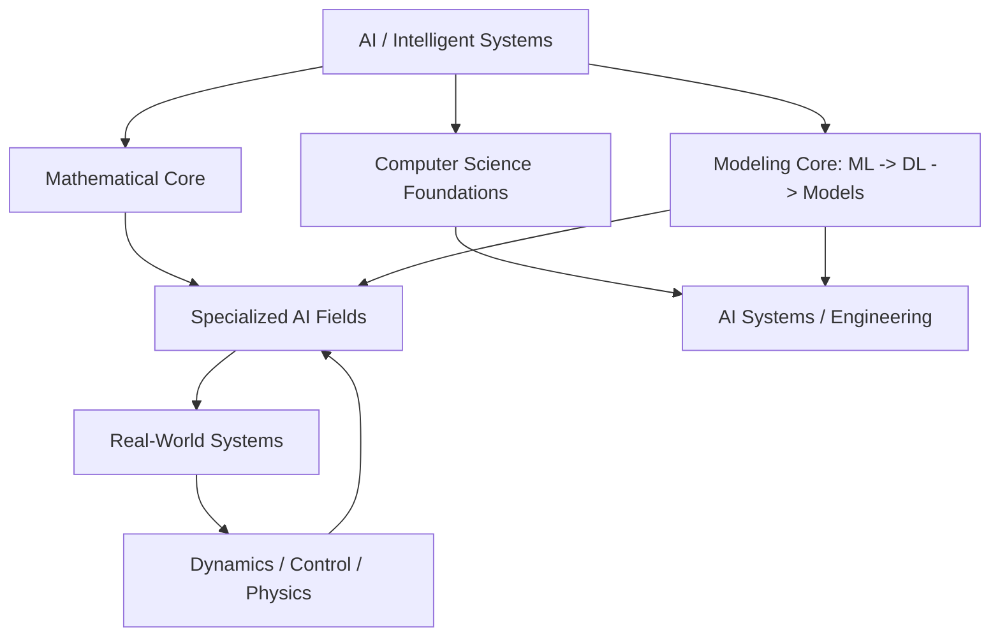
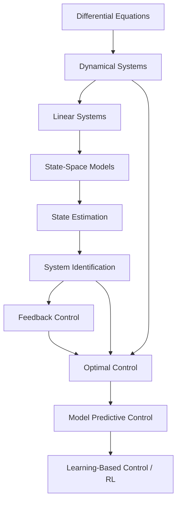
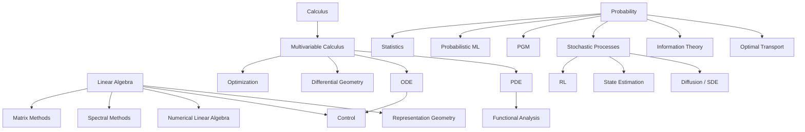
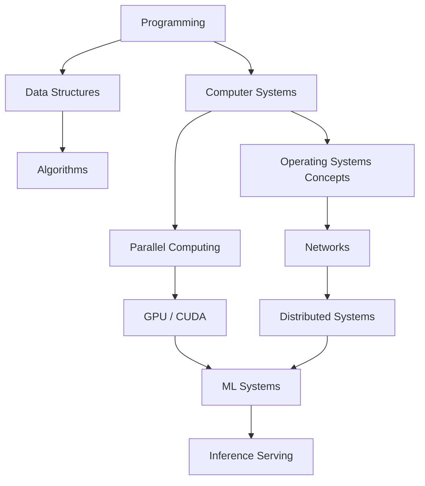

# AI / ML / DL / Mathematics / Computer Science Knowledge System & Course Roadmap

> Last source review: 2026-08-17
> Scope: `ML-DL-NLP-Lab` long-term knowledge graph, curriculum map, and research roadmap.

这份文档不是课程清单，也不是下一门课的待办列表。它的用途是把数学、CS、ML、DL、Generative AI、RL、LLM、概率 ML、world models、control、robotics、AI Safety、ML Systems 等知识放回正确层级：哪些是基础语言，哪些是模型族，哪些是训练阶段，哪些是系统工程，哪些只是某个研究方向中的工具。

当前仓库已经有 `Learning From Data / ML Theory T1-T5`。因此这里不会重复建立一套 introductory ML theory notes，而是把它们放入更大的知识系统。

## Table of Contents

- [0. Reading Contract](#0-reading-contract)
- [1. Three Axes](#1-three-axes)
- [2. Top-Level Knowledge Tree](#2-top-level-knowledge-tree)
- [3. Generative Models vs Generative AI](#3-generative-models-vs-generative-ai)
- [4. Generative AI Terminology Map](#4-generative-ai-terminology-map)
- [5. Generative Modeling Course Spine](#5-generative-modeling-course-spine)
- [6. Reinforcement Learning Route](#6-reinforcement-learning-route)
- [7. NLP / LLM / Reasoning / Agents](#7-nlp--llm--reasoning--agents)
- [8. Probability, Probabilistic ML, and PGM](#8-probability-probabilistic-ml-and-pgm)
- [9. World Models](#9-world-models)
- [10. Robotics and Embodied AI](#10-robotics-and-embodied-ai)
- [11. Dynamics and Control](#11-dynamics-and-control)
- [12. Scientific ML / Physics-Informed ML](#12-scientific-ml--physics-informed-ml)
- [13. AI Safety / ML Safety / Responsible AI](#13-ai-safety--ml-safety--responsible-ai)
- [14. Why There Are So Many ML / DL Courses](#14-why-there-are-so-many-ml--dl-courses)
- [15. Mathematics for Modern AI](#15-mathematics-for-modern-ai)
- [16. Computer Science Core](#16-computer-science-core)
- [17. Foundation Model / AI Engineering Stack](#17-foundation-model--ai-engineering-stack)
- [18. Course Deduplication Table](#18-course-deduplication-table)
- [19. Research Route Cards](#19-research-route-cards)
- [20. Priority Matrices](#20-priority-matrices)
- [21. Core Spine](#21-core-spine)
- [22. If I Only Have Limited Time](#22-if-i-only-have-limited-time)
- [23. Research Core vs Employment Core](#23-research-core-vs-employment-core)
- [24. Course Priority Summary](#24-course-priority-summary)
- [25. Course Overlap Conclusions](#25-course-overlap-conclusions)
- [26. What Does World Understanding Require?](#26-what-does-world-understanding-require)
- [27. Research Direction Recommendation](#27-research-direction-recommendation)
- [28. What I Should Actually Study Deeply](#28-what-i-should-actually-study-deeply)
- [29. Source Validation and Public-Material Caveats](#29-source-validation-and-public-material-caveats)

## 0. Reading Contract

本文的判断标准不是“这门课有名，所以学”，而是：

```text
knowledge layer
+ research direction
+ learning depth
+ opportunity cost
+ current repository progress
```

使用原则：

- 不把不同 abstraction level 的对象并列为“方向”。
- 不重复刷同一类 introductory course。
- C/D 不等于永远没用，只表示当前不应完整投入。
- 课程只是获得知识的载体；真正要维护的是 dependency graph。
- 所有 course public-material status 都应在正式学习前重新检查，尤其是 Stanford / CMU 当前课程页。

## 1. Three Axes

### 1.1 Knowledge Layer

```text
Mathematics
Computer Science Foundations
Machine Learning Foundations
Deep Learning Foundations
Specialized AI Fields
AI Systems / Engineering
Domain / Scientific Knowledge
```

这些不是平行课程目录，而是知识层。许多课程跨层，例如 Stanford CS336 同时属于 LLM model、pretraining、data pipeline、distributed training 和 evaluation。

### 1.2 Research Direction

```text
Generative Modeling
RL / Decision Making
NLP / LLM
Probabilistic ML
World Models
AI Safety
Scientific ML / Dynamics
Representation Learning
ML Systems
Robotics
```

方向是研究问题组织方式，不是基础层级。一个方向通常共享数学和 CS 基础。

### 1.3 Learning Depth

| Label | Depth | Meaning |
| --- | --- | --- |
| S | 深入掌握 / Core | 系统课程、数学推导、作业、implementation、能读论文 |
| A | 系统掌握 / Important | 主体课程、核心推导、核心实验、不必覆盖所有专题 |
| B | 结构性了解 / Selective | 理解为什么存在、和主线关系、学关键章节、不完整刷课 |
| C | 按研究需求学习 / On Demand | 当前不学完整课程，遇到论文或项目需求再补 |
| D | 暂时跳过 | 知识可能重要，但当前 opportunity cost 太高 |

## 2. Top-Level Knowledge Tree

```text
                       AI / Intelligent Systems
                                |
          +---------------------+---------------------+
          |                     |                     |
   Mathematical Core       Computer Science       Modeling Core
          |                  Foundations                |
          |                     |                 ML -> DL -> Models
          |                     |
          +--------------+------+--------------+
                         |                     |
                  Specialized AI         AI Systems
                         |                     |
                Generative / RL /       Training / Serving /
                LLM / World Models      Distributed / Agents
                         |
                         |
                 Real-World Systems
                         |
            Dynamics / Control / Physics
```



### 2.1 Same Word, Different Layer

很多所谓“方向”不是同一层级：

| Term | Correct Layer | Not This |
| --- | --- | --- |
| Attention | mechanism / operator | not a generative model |
| Transformer | architecture family | not automatically an LLM or foundation model |
| LLM | model family / scale regime | not all NLP |
| Pretraining | training stage | not a model architecture |
| Post-training | training stage / methodology family | not just fine-tuning one parameter |
| vLLM | inference / serving system | not a model, not VLM |
| Agent | system architecture | not equivalent to RL |
| Flow Matching | continuous-time generative modeling method family | not Diffusion Models |
| PINN | one Physics-Informed ML method | not all Scientific ML |
| AI Safety | broader safety / alignment / evaluation field | not only fairness or only alignment |

## 3. Generative Models vs Generative AI

问题：

> 现在说的“生成式 AI”和 CS229 中 generative vs discriminative 的 generative 是不是同一个意思？

结论：

```text
同源，但不是完全相同层级。
```

### 3.1 Classical Discriminative Modeling

Discriminative modeling 直接学习 conditional prediction：

```math
P(Y \mid X)
```

或者直接学习 decision boundary / predictor，例如 logistic regression、SVM、neural classifier。

它回答：

```text
given x, predict y
```

### 3.2 Classical Generative Modeling

Generative modeling 学习数据生成分布，例如：

```math
P(X,Y)
```

或者：

```math
P(X)
```

因此可以支持：

- sampling；
- likelihood estimation；
- latent-variable modeling；
- conditional generation；
- missing-data inference；
- Bayesian posterior reasoning。

### 3.3 Modern Generative AI

现代 Generative AI 是更宽的技术和应用类别：

```text
learn distribution / conditional distribution
down
generate language / image / audio / video / structure / action
```

它与 classical generative modeling 有共同根源：都关心 data-generating distribution。但是：

```text
Generative AI
!= one mathematical model family
```

Generative AI 可以由 autoregressive models、Diffusion Models、Flow Matching、VAE、normalizing flows、Energy-Based Models、multimodal foundation models 等实现。Transformer 也只是常见 architecture，不等于 Generative AI 本身。

## 4. Generative AI Terminology Map

| Concept | 它是什么 | 数学核心 | 属于哪个层级 |
| --- | --- | --- | --- |
| Attention | 信息交互 / weighted aggregation mechanism | query-key-value similarity, weighted sum | operator / mechanism |
| Transformer | architecture family | self-attention, residual stream, MLP blocks, normalization | DL architecture |
| Autoregressive Model | 用历史 token 分解联合分布的生成模型 | `p(x)=prod_t p(x_t | x_<t)` | probabilistic model family |
| Language Model | 对 token sequence 建模 | `P(x_1,...,x_T)` or conditional next-token distribution | model family / objective |
| Variational Inference | approximate probabilistic inference framework | ELBO, posterior approximation, KL | inference methodology |
| VAE | latent-variable generative model | encoder/decoder, ELBO, latent prior | generative model |
| Diffusion Model | noise corruption + learned reverse process / score | probability, stochastic processes, SDE, score matching | generative model family |
| Flow Matching | 学习 vector field，把简单 distribution 通过 continuous dynamics transport 到 target distribution | ODE, vector fields, continuity equation, probability, optional optimal transport | continuous-time generative modeling |
| Energy-Based Model | 用 energy 描述未归一化概率 | `p_theta(x) proportional exp(-E_theta(x))`, partition function | generative / probabilistic model family |
| Foundation Model | 在广泛数据上预训练、可适配多任务的通用 model | scaling, representation, self-supervised objectives | model scale/use regime |
| Pretraining | 大规模 self-supervised training stage | objective, data, distributed optimization | training stage |
| Post-training | pretraining 后塑造行为的方法族 | SFT, preference learning, RLHF/RLAIF, DPO-family, distillation | training stage / methodology |
| vLLM | high-throughput LLM inference / serving engine | KV cache, batching, memory paging, scheduling | AI Systems / LLM Inference |
| VLM | Vision-Language Model | multimodal representation / alignment | multimodal modeling |
| Agentic AI | LLM + state/memory + tools + planning/control loop + evaluation/safety | system architecture, search, tool use, interaction | AI system architecture |

Important:

```text
Flow Matching != Diffusion
```

二者相邻，都在 continuous-time generative modeling 中与 probability、ODE/SDE、vector field、score/transport 相关，但训练目标和路径解释不同。

Energy-Based Model 的关键难点是 partition function：

```math
p_\theta(x)
=
\frac{\exp(-E_\theta(x))}{Z_\theta}
```

其中：

```math
Z_\theta = \int \exp(-E_\theta(x)) dx
```

这使 sampling / inference / likelihood training 变困难，也把它连接到 probability、statistical physics 和 MCMC。

## 5. Generative Modeling Course Spine

不要把多个生成模型课程完整重复刷。主线是：

```text
Probability
down
CS229-level ML
down
Deep Learning
down
Stanford CS236 Deep Generative Models
down
Modern Flow Matching / Diffusion primary papers and tutorials
```

Stanford CS236：<https://cs236.stanford.edu/>

定位：

```text
A/S generative modeling 主课
```

它适合作为 VAE、autoregressive models、flows、energy-based models、score-based / diffusion methods 的统一入口。Flow Matching 再通过现代论文专题补充，不需要额外再找三门重复的生成模型课。

## 6. Reinforcement Learning Route

### 6.1 RL vs Supervised Learning

根本区别：

```text
Supervised Learning:
dataset approximately fixed

RL:
agent action
down
changes future observations
down
data distribution depends on policy
```

RL 的核心对象：

```text
MDP
state
action
transition
reward
policy
value function
Bellman equation
exploration
credit assignment
```

### 6.2 RL Mathematical Core

Core:

- probability；
- conditional expectation；
- Markov chains；
- dynamic programming；
- optimization。

Deeper:

- stochastic processes；
- stochastic approximation；
- control theory；
- convex/nonconvex optimization。

### 6.3 Course Route

First course:

- Stanford CS234: <https://web.stanford.edu/class/cs234/>
- Depth: A
- Role: RL theory backbone; MDP, dynamic programming, value functions, policy search, approximate RL.

Deep RL specialization, choose one:

- Berkeley CS285: <https://rail.eecs.berkeley.edu/deeprlcourse/>
- Stanford CS224R: <https://cs224r.stanford.edu/>

Current route:

```text
CS234
-> selective CS285 / CS224R
```

Not:

```text
CS234
-> CS285
-> CS224R
```

CS285 更系统覆盖 deep RL / control / model-based RL。CS224R 更现代、practical，并与 LLM RL / post-training / reasoning training 有接口。当前不需要全刷。

## 7. NLP / LLM / Reasoning / Agents

必须拆开：

```text
NLP
Language Modeling
LLM
Reasoning
Post-training
Inference
LLM Systems
Agentic AI
```

### 7.1 NLP

NLP 研究语言结构和机器处理：

- embeddings；
- syntax；
- semantics；
- sequence modeling；
- translation；
- information extraction；
- QA。

Stanford CS224N：<https://web.stanford.edu/class/cs224n/>

定位：

```text
NLP + neural language modeling foundation
```

如果不是 NLP 专门研究者：

```text
B/A selective
```

重点章节即可，不需要完整重复 DL 基础。

### 7.2 Language Modeling

Language Modeling 学习：

```math
P(x_1,\dots,x_T)
```

或 autoregressive conditional distribution：

```math
\prod_t P(x_t \mid x_{<t})
```

它是 LLM 的核心 pretraining objective 之一，但不等于所有 NLP。

### 7.3 LLM

LLM 是大规模 pretrained language model。核心知识至少拆为：

```text
Architecture
Data
Pretraining
Optimization
Scaling
Evaluation
Post-training
Inference
Serving
Reasoning
Safety
Agents
```

### 7.4 Stanford CS336

Stanford CS336：<https://cs336.stanford.edu/>

定位：

```text
Language Modeling from Scratch
```

它不是“另一个 NLP 课”。它更像：

```text
LLM architecture
+
data pipeline
+
pretraining
+
distributed computation
+
evaluation
```

属于：

```text
Model + Training + Systems
```

对于 Foundation Model / LLM Engineering：

```text
S/A
```

对于 pure dynamics / scientific ML：

```text
B
```

### 7.5 vLLM

vLLM 通常指开源 high-throughput LLM inference / serving engine。

它不是：

- 一个语言模型；
- 一个 reasoning algorithm；
- Transformer architecture。

它属于：

```text
AI Systems
-> LLM Inference
-> Serving / Memory / Scheduling / KV Cache
```

如果原意是 VLM，即 Vision-Language Model，则属于 multimodal modeling。

```text
vLLM != VLM
```

### 7.6 Reasoning Model Route

```text
Base Language Modeling
down
Post-training
down
Reasoning Training
down
Inference-time Search / Test-Time Compute
down
Verification
down
Tool Use / Agents
```

知识包括：

- SFT；
- preference learning；
- reward models；
- RLHF / RLAIF；
- PPO / DPO / GRPO conceptual family；
- process/outcome reward；
- verifier；
- search；
- self-consistency；
- tree/search-based reasoning；
- test-time compute；
- tool calling。

这不是一门稳定的基础课。当前建议：

```text
CS336
+
CS234 / CS224R selective
+
current papers
```

### 7.7 Agentic AI

Agentic AI：

```text
LLM
+
state / memory
+
tools
+
planning / control loop
+
environment interaction
+
evaluation / safety
```

Agent 不等于 RL。很多 agent system 没有 online RL，只是把 LLM 放进软件系统、tool calling、planning/search 和 feedback loop 中。

## 8. Probability, Probabilistic ML, and PGM

```text
Probability
!= Probabilistic Machine Learning
!= Probabilistic Graphical Models
```

### 8.1 Probability

Probability 是数学语言：random variables、distribution、expectation、conditional probability、concentration、stochastic process。

### 8.2 Probabilistic ML

Probabilistic ML 直接把以下对象写成概率模型：

- uncertainty；
- latent variables；
- likelihood；
- posterior；
- prediction。

典型问题：

```text
what is observed?
what is latent?
what is uncertain?
what conditional independence is assumed?
what posterior / predictive distribution is needed?
```

### 8.3 PGM

Probabilistic Graphical Models 用 graph 表示 random variables 的 conditional dependence structure。

核心：

```text
Bayesian Networks
Markov Random Fields
Factor Graphs
Exact Inference
Approximate Inference
Variational Inference
MCMC
Parameter Learning
Structure Learning
Temporal Models
```

### 8.4 PGM Course Dedup

选择一门系统课：

- Stanford CS228: <https://cs.stanford.edu/~ermon/cs228/>
- CMU 10-708: <https://www.cs.cmu.edu/~epxing/Class/10708-20/>

推荐策略：

```text
CS228 as systematic backbone
```

如果已经有同等深度概率推理课程：

```text
only use CS228 / 10-708 selectively
```

不要两门完整重复学习。CMU 10-708 更 graduate / theory-heavy；CS228 更适合系统理解 + inference + implementation。

## 9. World Models

World Model 不是一个单独算法。

本质：

> 学习一个可以支持预测、模拟、规划或控制的 environment/state representation and dynamics model。

典型结构：

```text
Observation
down
Latent State
down
Dynamics Model
down
Future State / Observation
down
Planning / Prediction / Control
```

连接：

```text
Representation Learning
State-Space Models
System Identification
Generative Models
Model-Based RL
Control
Sequence Models
Latent Dynamics
```

因此 world model 最重要的基础不是“先学 Agent”，而是：

```text
Probability
+
Dynamics
+
Representation
+
System Identification
+
Control
+
Generative Modeling
+
RL
```

### 9.1 World Model vs Agent

```text
World Model:
learn / predict environment

Agent:
choose actions and interact with environment
```

一个 agent 可以：

- 有显式 world model；
- 有隐式 internal representation；
- 没有单独 world model。

不应直接从 Agent 进入 World Model。Agent 是系统架构入口，World Model 是环境建模问题。

## 10. Robotics and Embodied AI

问题：

> 为了发展 world models / real-world modeling，机器人课程是否有用？

结论：

```text
有用，但要选择机器人中的正确部分。
```

最相关：

```text
State
Dynamics
State Estimation
Control
Planning
System Identification
Model Predictive Control
Partial Observability
Interaction
```

相对不急：

```text
Robot hardware
mechanical design
detailed manipulator mechanics
```

除非后续转向 embodied robotics。

### 10.1 Robotics Layers

Robotics Mathematics:

- coordinate frames；
- rotations；
- SO(3)；
- SE(3)；
- Lie groups；
- Jacobians；
- rigid-body dynamics。

Estimation:

- Bayes filters；
- Kalman filters；
- particle filters；
- SLAM。

Planning:

- search；
- trajectory optimization；
- sampling-based planning。

Control:

- feedback；
- LQR；
- MPC；
- nonlinear control。

Robot Learning:

- imitation learning；
- RL；
- representation；
- model-based learning。

### 10.2 Modern Robotics

Northwestern Modern Robotics：<https://modernrobotics.northwestern.edu/>

覆盖：

- configuration space；
- rigid motions；
- kinematics；
- dynamics；
- trajectory generation；
- control；
- planning。

定位：

```text
If robotics / embodied AI becomes major direction: A/S
If mainly real-world dynamic systems / world modeling: B
```

当前重点：

```text
configuration / state
rigid-body geometry concepts
dynamics
control
planning
```

不必现在完整完成所有 manipulator details。

## 11. Dynamics and Control

这是当前路线的重要主干。

```text
Differential Equations
down
Dynamical Systems
down
Linear Systems
down
State-Space Models
down
Estimation
down
System Identification
down
Feedback Control
down
Optimal Control
down
Model Predictive Control
down
Learning-Based Control / RL
```



### 11.1 Differential Equations

MIT 18.03：<https://ocw.mit.edu/courses/18-03-differential-equations-spring-2010/>

Depth:

```text
S/A for dynamics route
```

核心：

```text
ODE
linear systems
stability
phase behavior
forcing
eigenvalue dynamics
```

用途：

- dynamic systems；
- scientific ML；
- Flow Matching；
- continuous-time models；
- control。

### 11.2 Differential Equations vs Dynamical Systems

Differential Equations 关注：

```text
如何描述 / 求解 dynamics
```

Dynamical Systems 关注：

```text
长期行为
stability
equilibrium
attractor
bifurcation
chaos
phase space
```

Dynamical Systems 是 world modeling、control、physics、spatiotemporal dynamics 的数学语言。

### 11.3 Linear vs Nonlinear Dynamical Systems

Linear:

```math
\dot x = Ax + Bu
```

具有：

- superposition；
- eigenvalue stability；
- controllability；
- observability；
- linear control。

Nonlinear:

```math
\dot x = f(x,u)
```

需要：

- local linearization；
- Lyapunov；
- phase portrait；
- bifurcation；
- nonlinear control；
- numerical methods。

推荐顺序：

```text
ODE
-> linear systems / control
-> nonlinear dynamics
-> nonlinear control
```

### 11.4 MIT Identification, Estimation, and Learning

MIT 2.160：<https://ocw.mit.edu/courses/2-160-identification-estimation-and-learning-spring-2006/>

Depth:

```text
S for real-world dynamic systems / mechanism learning
```

它把以下内容放进一个系统：

```text
Least Squares
Estimation
Kalman Filtering
Noise Dynamics
System Representation
Function Approximation
System Identification
Experiment Design
Model Selection
Information Criteria
Model Validation
```

它实际回答：

> 从 noisy observations 中，我们究竟怎样恢复一个 dynamic system 的 state / parameters / model？

这比单纯学一个 forecasting model 更接近“理解真实系统”。

### 11.5 Optimal Control

CMU 16-745：<https://optimalcontrol.ri.cmu.edu/>

Depth:

```text
A after dynamics / control spine
```

知识：

```text
nonlinear dynamics
linear systems
trajectory optimization
LQR
MPC
state estimation
system identification
RL
```

Optimal Control 是：

> 已知或近似知道 dynamics 时，如何选择一系列 action，使长期 objective 最优。

RL 可以看作在 dynamics / reward unknown 或只能通过 interaction 学习时的一条相关路线。但二者不应简单等价。

### 11.6 MIT Underactuated Robotics

MIT Underactuated Robotics：<https://underactuated.csail.mit.edu/>

Depth:

```text
A/B
```

对于 nonlinear dynamics、optimal/robust control、planning、learning + physical systems 极有价值。

当前选择：

```text
dynamics
stability
LQR
optimal control
trajectory optimization
system identification
learning / control
```

不用完整学习所有机器人案例。

## 12. Scientific ML / Physics-Informed ML

### 12.1 Three Different Concepts

Physics-Informed ML:

```text
把已知 physical laws / constraints 加入 learning
```

例如：

```text
conservation laws
ODE / PDE constraints
symmetry
boundary conditions
```

Scientific Machine Learning:

```text
ML for scientific modeling
surrogate models
operator learning
PDE learning
system discovery
data assimilation
reduced-order models
```

Data-Driven Dynamics:

```text
从数据发现 / 近似 dynamics
```

```text
Physics-informed ML != PINN only
Scientific ML != Physics-informed ML only
Data-driven dynamics != generic time-series forecasting only
```

### 12.2 Scientific ML Math Prerequisites

S:

- Linear Algebra；
- Probability；
- ODE；
- Optimization。

A:

- Numerical Analysis；
- Dynamical Systems；
- PDE；
- Fourier Analysis；
- State-Space Models。

B/A by topic:

- Functional Analysis；
- Operator Theory；
- Calculus of Variations；
- Stochastic Differential Equations。

不要直接学 PINN 而没有 PDE / numerical approximation 基础。

### 12.3 Brunton Data-Driven Science and Engineering

Brunton Data-Driven Science and Engineering：<https://www.databookuw.com/>

特别重要的内容：

```text
SVD
Fourier
Sparsity
Compressed Sensing
Regression
DMD
SINDy
Dynamics
Control
```

它构成：

```text
data
-> low-dimensional structure
-> dynamic representation
-> system discovery
-> control
```

对于 real-world dynamic / scientific ML：

```text
A
```

### 12.4 Sparsity and Compression

不要把它理解成：

```text
model pruning / LLM compression
```

这么窄。

数学核心：

```text
sparse representation
L1
compressed sensing
basis
measurement
reconstruction
low-dimensional structure
```

连接：

```text
signal processing
inverse problems
system identification
scientific discovery
sensor placement
model reduction
```

General ML:

```text
B
```

Dynamics / Scientific ML:

```text
A
```

## 13. AI Safety / ML Safety / Responsible AI

必须分层。

### 13.1 Machine Learning Reliability / Safety

包括：

```text
robustness
distribution shift
OOD
uncertainty
calibration
conformal prediction
adversarial robustness
privacy
interpretability
monitoring
failure detection
```

### 13.2 Foundation-Model / AI Safety

进一步包含：

```text
alignment
red teaming
misuse
jailbreaks
oversight
agent safety
controllability
evaluation
scalable oversight
```

### 13.3 Responsible AI

还可能包括：

```text
fairness
privacy
accountability
governance
societal impact
```

不要把三者混为一谈。

### 13.4 Courses

Stanford CS120：<https://web.stanford.edu/class/cs120/>

Depth:

```text
B
```

Role: 建立 AI Safety 总地图。

Stanford CS329T：<https://web.stanford.edu/class/cs329t/>

当前版本更多偏：

```text
building / evaluating reliable agentic / foundation-model systems
```

Archived CS329T 版本曾覆盖：

```text
robustness
privacy
fairness
interpretability
LLM trustworthiness
```

因此：

```text
课程编号相同，但不同年份内容变化较大。
```

不要把整个 CS329T 当成固定 syllabus。当前研究主线深入：

```text
reliability
uncertainty
shift
monitoring
evaluation
control / intervention
```

而不是无差别深入所有 AI governance / alignment 主题。

## 14. Why There Are So Many ML / DL Courses

它们实际分四类：

```text
ML Foundations
DL Foundations
ML Theory
DL Applications / Practice
```

### 14.1 ML Foundations

主干只保留：

Stanford CS229：<https://cs229.stanford.edu/>

Depth:

```text
S
```

用于：

- supervised learning；
- generative / discriminative；
- GLM；
- kernel；
- clustering；
- EM；
- optimization；
- ML modeling。

现有 `Learning From Data / ML Theory T1-T5` 补：

```text
learning theory
generalization
modern theory
```

因此不要再完整重复：

```text
CMU intro ML
another general ML MOOC
another CS229-equivalent course
```

除非学校正式课程要求。

### 14.2 Deep Learning Course Dedup

Stanford CS230：<https://cs230.stanford.edu/>

优点：

```text
clear DL fundamentals
training practice
project methodology
```

CMU 11-785 Deep Learning：<https://deeplearning.cs.cmu.edu/>

更重：

```text
implementation
assignments
broad practical DL
```

MIT 6.S191：<https://ocw.mit.edu/courses/6-s191-introduction-to-deep-learning-january-iap-2020/>

短而快的 DL overview。

不要三门完整刷。

推荐：

```text
Main: CMU 11-785 or Stanford CS230, choose one
```

如果目标是硬核 implementation：

```text
CMU 11-785 = A/S
```

CS230：

```text
selected lectures / project methodology = B/A
```

MIT 6.S191：

```text
overview / reference = B
```

### 14.3 Unsupervised Learning

不是必须再单独学一门基础课。核心已分散在：

```text
CS229
PGM
Generative Models
Representation Learning
```

包括：

- clustering；
- PCA；
- latent variable；
- density modeling。

### 14.4 Self-Supervised Learning

不是简单“没有标签的 supervised learning”。

核心思想：

```text
construct learning signals from data itself
down
learn transferable representation
```

与：

- contrastive learning；
- masked modeling；
- language-model pretraining；
- multimodal learning；

相关。

属于：

```text
Representation Learning
+
Foundation Model Training
```

当前：

```text
A/B by representation research need
```

### 14.5 Multi-Task Learning / Meta-Learning

Multi-task:

```text
共享 representation，同时解决多个任务。
```

Meta-learning:

```text
learn how to adapt / learn quickly across tasks
```

连接：

- transfer；
- few-shot；
- adaptation；
- continual learning；
- RL。

当前：

```text
B/C
```

如果未来研究：

```text
adaptation under changing environments
```

再升为 A。

## 15. Mathematics for Modern AI

数学体系不是：

```text
Linear Algebra -> ML
Probability -> ML
```

而是不同 mathematical objects 支撑不同建模、推断、控制和系统行为。

### 15.1 Mathematics Layer 0: Mathematical Language

Calculus:

- derivative；
- gradient；
- Jacobian；
- Hessian；
- Taylor expansion。

Multivariable Calculus:

- gradients in high-dimensional parameter space；
- vector fields；
- constrained optimization；
- local linearization。

Linear Algebra:

- vector spaces；
- projections；
- eigenvalues；
- SVD；
- matrix factorizations；
- state-space models。

Probability:

- random variables；
- conditional structure；
- expectation；
- concentration；
- stochastic process。

Statistics:

- estimation；
- uncertainty；
- confidence / credible intervals；
- hypothesis testing；
- model validation。

These are the minimum core of all ML.

### 15.2 Linear Algebra

MIT 18.06：<https://ocw.mit.edu/courses/18-06-linear-algebra-spring-2010/>

Depth:

```text
S
```

核心：

```text
vector spaces
subspaces
linear maps
rank
orthogonality
eigenvalues
positive definite matrices
SVD
```

AI mapping:

```text
SVD
-> low-rank structure
-> PCA
-> latent representation
-> model reduction
-> dynamic mode decomposition
```

```text
Eigenvalues
-> linear dynamics stability
-> spectral graph methods
-> control
```

```text
Orthogonality / projection
-> least squares
-> regression
-> residual analysis
-> state estimation
```

### 15.3 Matrix Methods

MIT 18.065：<https://ocw.mit.edu/courses/18-065-matrix-methods-in-data-analysis-signal-processing-and-machine-learning-spring-2018/>

不是 18.06 的重复替代。

```text
18.06 = linear algebra language
18.065 = matrix viewpoint applied to data / statistics / optimization / ML
```

Route:

```text
18.06 -> 18.065
```

Depth:

```text
18.065 = A
```

重点：

- SVD；
- low rank；
- PCA；
- matrix factorization；
- optimization；
- neural networks。

### 15.4 Probability / Statistics

至少四层：

```text
Elementary Probability
down
Statistical Inference
down
Stochastic Processes
down
Measure-Theoretic Probability
```

Probability + Statistics:

```text
S
```

Stochastic Processes:

```text
A for RL, time series, dynamics, diffusion, state estimation
```

Measure-Theoretic Probability:

```text
B/A for theoretical research
```

不是当前所有项目的前置课，但在 advanced probability、learning theory、stochastic analysis 时补。

AI mapping:

```text
Conditional probability
-> PGM
-> latent states
-> state estimation
-> Bayesian filtering
```

```text
Concentration
-> generalization bounds
-> calibration / reliability claims
```

```text
Stochastic processes
-> Markov chains
-> RL
-> diffusion / SDE
-> filtering
```

### 15.5 Optimization

Stanford EE364A：<https://ee364a.stanford.edu/>

Depth:

```text
S/A
```

核心：

```text
convex sets / functions
KKT
duality
least squares
LP / QP
constrained optimization
```

连接：

```text
ML training
SVM
regularization
control
inverse problems
RL
```

EE364B:

```text
B/C unless doing optimization / control / theory deeply
```

### 15.6 Differential Equations

MIT 18.03:

```text
A/S for dynamics route
```

AI mapping:

```text
ODE
-> continuous dynamics
-> control
-> Neural ODE
-> Flow Matching
```

### 15.7 Real Analysis

Real Analysis 提供：

```text
limits
continuity
compactness
convergence
function sequences
rigorous calculus
```

作用：

- advanced probability；
- optimization theory；
- learning theory；
- functional analysis。

当前：

```text
B/A
```

不需要抢在 ML / dynamics 基础前全部学完。

### 15.8 Complex Analysis

MIT 18.04：<https://ocw.mit.edu/courses/18-04-complex-variables-with-applications-spring-2018/>

用途：

```text
signals
frequency analysis
control
PDE
physics
```

General AI:

```text
C
```

Signal / control / physics 深入：

```text
B
```

当前不是优先主课。

### 15.9 Fourier / Harmonic Analysis

连接：

```text
signals
spectral analysis
PDE
convolution
time series
graph spectral methods
operator learning
```

对于 spatiotemporal / dynamics：

```text
A/B
```

### 15.10 Graph Theory

区分：

Discrete Graph Theory:

```text
combinatorics / connectivity / paths
```

Spectral Graph Theory:

```text
Laplacian / eigenvalues / diffusion
```

Graph ML:

```text
GNN / message passing
```

不要混为一个东西。

MIT Mathematics for CS：<https://ocw.mit.edu/courses/6-042j-mathematics-for-computer-science-fall-2010/>

Depth:

```text
A/B
```

用于：

- proof；
- discrete structures；
- graph；
- counting。

对于图学习，再补：

```text
spectral graph theory
```

而不是只学普通 graph algorithms。

### 15.11 Differential Geometry

MIT 18.950：<https://ocw.mit.edu/courses/18-950-differential-geometry-fall-2008/>

核心：

```text
curves
surfaces
curvature
geometric structure
```

General ML:

```text
C
```

如果进入：

```text
geometric ML
manifold learning
representation geometry
robotics geometry
```

则：

```text
B/A
```

不要因为看到 “representation manifold” 就立即完整学微分几何。

### 15.12 Geometry of Manifolds

MIT 18.965：<https://ocw.mit.edu/courses/18-965-geometry-of-manifolds-fall-2004/>

更高级：

```text
smooth manifolds
tangent bundles
differential forms
Lie groups
Riemannian geometry
```

当前：

```text
C
```

只有研究真正进入 geometric representation、information geometry、Lie-group robotics、manifold dynamics 再深入。

### 15.13 Differential Topology

关注 smooth maps 的 global / topological structure：

- manifolds；
- transversality；
- Sard theorem；
- embeddings。

普通 ML：

```text
D/C
```

不需要现在学。

### 15.14 Information Theory

Stanford EE376A / EE276 family：<https://web.stanford.edu/class/ee376a/>

核心：

```text
entropy
conditional entropy
KL
mutual information
coding
compression
channel capacity
```

与 ML 的连接：

```text
representation
variational objectives
generative models
generalization
compression
information bottleneck
```

当前：

```text
A/B
```

值得系统学，但优先级低于 linear algebra、probability、optimization。

### 15.15 Information Geometry

Information Geometry 不是 Information Theory。

它研究：

> probability distributions / statistical models 组成的 manifold 的几何。

核心：

```text
Fisher information metric
statistical manifold
natural gradient
divergence
dual connections
```

数学先修：

```text
probability / statistics
multivariable calculus
linear algebra
differential geometry
```

当前：

```text
C
```

只有 representation / statistical geometry 研究深入后再学。

### 15.16 Optimal Transport

Optimal Transport 连接：

```text
probability distributions
generative modeling
flow matching
domain adaptation
geometry
```

当前：

```text
B/C
```

Generative / distribution geometry 路线升 A。

### 15.17 Numerical Analysis

AI 与 dynamic systems 最容易漏的一块。

包括：

```text
floating point
conditioning
iterative methods
numerical linear algebra
ODE solvers
PDE discretization
optimization numerics
```

对于 scientific ML、dynamics、control、large-scale ML systems 非常重要。

```text
A
```

### 15.18 PDE

General ML:

```text
C
```

对于：

```text
physics-informed ML
scientific ML
fluids
climate
spatiotemporal physical systems
operator learning
```

则：

```text
A/S
```

顺序：

```text
ODE
-> PDE
-> Numerical PDE
-> Scientific ML
```

### 15.19 Mathematics Dependency Graph

```text
Calculus
├── Multivariable Calculus
│   ├── Optimization
│   ├── Differential Geometry
│   └── ODE/PDE
│
Linear Algebra
├── Matrix Methods
├── Spectral Methods
├── Numerical Linear Algebra
├── Control
└── Representation Geometry
│
Probability
├── Statistics
├── Probabilistic ML
├── PGM
├── Stochastic Processes
│   ├── RL
│   ├── State Estimation
│   └── Diffusion / SDE
└── Information Theory
```



## 16. Computer Science Core

```text
Programming
down
Data Structures
down
Algorithms
down
Computer Systems
down
Networks / Distributed Systems
down
Parallel Computing
down
ML Systems
```



### 16.1 Algorithms

MIT 6.006：<https://ocw.mit.edu/courses/6-006-introduction-to-algorithms-spring-2020/>

Depth:

```text
S/A
```

核心：

```text
data structures
sorting
graphs
shortest path
DP
complexity
```

对 AI researcher 的价值不是 LeetCode 本身，而是：

```text
computational thinking
algorithm design
correctness
complexity
implementation
```

Advanced algorithms 只在需要时补。

### 16.2 Computer Systems

CMU 15-213：<https://www.cs.cmu.edu/~213/>

Depth:

```text
A
```

特别适合补非 CS 本科背景。

核心：

```text
machine representation
assembly
memory
cache
linking
process
virtual memory
concurrency
network basics
```

对 C++、GPU、distributed training、inference systems 都是底层基础。

### 16.3 Computer Networks

Stanford CS144：<https://stanford.edu/class/cs144/>

Depth:

```text
B
```

如果走 ML infra / distributed systems / serving，升为 A。主要 research model 不用现在完整深学。

### 16.4 C++

Stanford CS106L：<https://web.stanford.edu/class/cs106l/>

Depth:

```text
A/B
```

用途：

- systems；
- robotics；
- performance；
- CUDA extensions；
- inference engines。

明确：

```text
C++ language learning != algorithms training
```

两者需要分别练。

### 16.5 Parallel Computing

Stanford CS149：<https://cs149.stanford.edu/>

Depth:

```text
A for AI systems / GPU / training / inference optimization
B for pure ML theory
```

核心：

```text
SIMD
multicore
threads
memory bandwidth
latency
GPU-style parallelism
performance
```

### 16.6 AI / ML Systems

ML System Design:

Stanford CS329S：<https://web.stanford.edu/class/cs329s/>

关注：

```text
data
training
deployment
monitoring
iteration
production ML lifecycle
```

ML Systems Internals:

CMU 15-779：<https://www.cs.cmu.edu/~zhihaoj2/15-779/>

关注：

```text
GPU
CUDA
ML compilers
kernels
distributed training
distributed serving
memory optimization
FlashAttention
```

两者不是重复课。

AI infra:

```text
15-213
-> CS149
-> CMU 15-779
```

Product ML:

```text
ML
-> CS329S
```

## 17. Foundation Model / AI Engineering Stack

完整层级：

```text
Data Collection
down
Tokenization / Representation
down
Architecture
down
Pretraining
down
Distributed Training
down
Evaluation
down
Post-training
down
Inference Optimization
down
Serving
down
Agent System
down
Monitoring / Safety
```

### 17.1 Pretraining

Pretraining 不是模型。它是 training stage。

典型：

```text
large-scale self-supervised objective
+
massive data
+
distributed optimization
```

### 17.2 Foundation Model

Foundation Model 不是一种具体 architecture。

定义：

> 在广泛数据上训练，可以适配大量 downstream tasks 的通用 pretrained model。

Transformer 常用于 foundation model，但：

```text
Transformer != Foundation Model
```

### 17.3 Post-training

Post-training 包括：

```text
SFT
Preference Learning
RLHF
RLAIF
DPO-family
RL-based reasoning
distillation
tool-use training
```

它不是“只调一个模型参数”，而是：

```text
behavior shaping after pretraining
```

### 17.4 Inference Acceleration

知识包括：

```text
KV cache
batching
quantization
speculative decoding
FlashAttention
memory management
parallelism
serving scheduler
```

这是 systems topic，不是模型理论。

## 18. Course Deduplication Table

| Knowledge | Main Course | Secondary Reference | Do Not Fully Repeat |
| --- | --- | --- | --- |
| Linear Algebra | MIT 18.06 | MIT 18.065 as applied extension | 不重复；18.06 -> 18.065 是 sequential |
| ML | Stanford CS229 | existing Learning From Data / T1-T5 theory track | CMU intro ML + another generic ML MOOC |
| DL | CMU 11-785 or Stanford CS230 | MIT 6.S191 overview | CS230 + 11-785 + 6.S191 全刷 |
| PGM | CS228 or CMU 10-708 | the other one selective | 两门完整重复 |
| RL | Stanford CS234 | CS285 or CS224R | CS234 -> CS285 -> CS224R 全刷 |
| NLP / LLM | CS224N selective | CS336 deep if LLM route | 把 CS224N 当 CS336 替代 |
| Generative | Stanford CS236 | modern diffusion / flow matching papers | 多门生成模型课全刷 |
| Systems | 15-213 -> CS149 -> 15-779 | CS329S for lifecycle | 把 CS329S 与 15-779 当重复 |
| Dynamics | 18.03 -> 2.160 -> optimal control / underactuated | Brunton data-driven dynamics | 只学 forecasting model 替代 system-ID |
| Robotics | Modern Robotics selective | Underactuated for dynamics/control | robot learning 直接替代机器人基础 |
| Safety | CS120 map | CS329T by year/topic | 把 AI Safety 当 alignment-only |

## 19. Research Route Cards

### Route A: General ML / Trustworthy ML Research

```text
Math:
Linear Algebra
Probability
Statistics
Optimization

CS:
Algorithms
Python
systems literacy

ML:
CS229
Learning Theory T1-T5
DL

Specialization:
UQ
Calibration
Conformal
Shift
Robustness
Interpretability
```

Depth: current A/S for foundations, B/A for specialization.

### Route B: Representation / Mechanism Learning in Dynamic Systems

当前最重要路线之一。

```text
Math
├── Linear Algebra S
├── Probability S
├── Statistics S
├── Optimization A
├── ODE A/S
├── Dynamical Systems A
├── Numerical Analysis A
├── Information Theory B/A
├── Graph / Spectral Methods A
├── PDE B/A by application
└── Differential Geometry B later

ML
├── CS229
├── DL
├── Representation Learning
├── Probabilistic ML
├── State-Space Models
├── System Identification
├── UQ / Shift
└── Generative Models selective

Dynamics
├── MIT 2.160
├── Brunton Data-Driven Dynamics
├── Control
├── Optimal Control
└── nonlinear systems

Research questions
├── state representation
├── observation mechanism
├── distribution shift
├── representation drift
├── structural dynamics
└── adaptation
```

Depth: S/A primary backbone.

### Route C: Generative Modeling

```text
Probability S
Statistics A
Linear Algebra S
Optimization A
DL S
Probabilistic ML A
ODE A
Stochastic Processes A
SDE B/A
Optimal Transport B

CS236 S
-> diffusion
-> flow matching
-> modern papers
```

Depth: S only if generative modeling becomes primary research.

### Route D: RL / Decision Making

```text
Probability
Stochastic Processes
Optimization
Dynamic Programming
DL
CS234
down
CS285 / CS224R
down
Control / Model-Based RL / Robotics
```

Depth: A now if decision-making research is active; otherwise B/A.

### Route E: World Models

```text
Representation
+
Generative Models
+
State-Space Models
+
Dynamics
+
System Identification
+
Model-Based RL
+
Control
```

Do not enter from Agent first.

Depth: A/S for Route B extension.

### Route F: LLM / Foundation Model Research

```text
Probability
Linear Algebra
Optimization
DL
Transformer
CS224N selective
CS336
Generative / LM theory
Post-training
Evaluation
Reasoning
```

Systems branch:

```text
15-213
-> CS149
-> CMU 15-779
-> vLLM / serving
```

Depth: A/S only if LLM becomes primary route; otherwise B.

### Route G: AI Safety / Reliability

分：

```text
Statistical Reliability
Model Robustness
Foundation Model Safety
Agent Safety
Human Oversight
```

当前研究重点优先：

```text
uncertainty
calibration
shift
failure detection
monitoring
intervention
evaluation
```

Depth: A for reliability, B for broad AI Safety map.

### Route H: Scientific ML / Physics-Informed ML

```text
Linear Algebra
ODE
PDE
Numerical Analysis
Dynamical Systems
Optimization
Fourier
Physics domain
down
Scientific ML
down
PINN / Operator Learning
down
System Discovery / Surrogate / Control
```

Depth: A/S if scientific physical systems become main route.

### Route I: Robotics / Embodied AI

```text
Linear Algebra
Calculus
ODE
Geometry / Lie Groups
Dynamics
Control
Optimization
Planning
Estimation
RL
Computer Vision
Robot Learning
```

Modern Robotics:

```text
A if robotics becomes major direction
B selective otherwise
```

### Route J: AI Systems / Infra

```text
Algorithms
C++
Computer Systems
Operating Systems concepts
Networks
Parallel Computing
GPU / CUDA
Distributed Systems
ML Compilers
Distributed Training
Inference Serving
```

Depth: A/S if infra route; B otherwise.

### Route K: General Software / CS Employability

```text
Programming
down
Data Structures
down
MIT 6.006
down
C++
down
15-213
down
Software Engineering
down
Database / Network basics
down
LeetCode-style implementation practice
```

AI research coding 和 general software engineering coding 有重叠但不是同一种能力。

## 20. Priority Matrices

### 20.1 Math Priority Matrix by Direction

Cells are S/A/B/C/D. The final column gives the reason for the pattern across directions.

| Math Topic | General ML | Generative | RL | LLM | World Models | Scientific ML | Robotics | ML Theory | AI Systems | Reason |
| --- | --- | --- | --- | --- | --- | --- | --- | --- | --- | --- |
| Linear Algebra | S | S | S | S | S | S | S | S | A | vector spaces, projections, matrices, SVD, state representations |
| Probability | S | S | S | A | S | S | A | S | B | uncertainty, data distributions, stochastic dynamics, generalization |
| Statistics | S | A | A | A | S | S | B | S | B | estimation, validation, calibration, experiment evidence |
| Optimization | S | A | A | A | A | A | A | A | A | training, regularization, control, inverse problems |
| Discrete Math | B | C | A | B | B | C | B | B | A | proof, counting, graphs, algorithms, systems reasoning |
| Graph Theory | B | B | B | B | A | A | A | B | B | dependency structures, graph algorithms, spectral methods, GNNs |
| Numerical Analysis | B | A | B | B | A | S | A | B | A | conditioning, solvers, simulation, scalable computation |
| ODE | B | A | A | C | S | S | S | B | C | continuous dynamics, control, flow models, physical systems |
| PDE | C | B | C | D | B | S | B | C | D | physical fields, operator learning, fluids/climate |
| Dynamical Systems | B | B | A | C | S | S | S | B | C | stability, phase space, environment dynamics |
| Stochastic Processes | B | A | S | B | A | A | A | A | C | Markov chains, diffusion, filtering, RL |
| Information Theory | A/B | A | B | A | A/B | B | C | A | B | entropy, KL, MI, compression, representation |
| Real Analysis | B | B | B | C | B | A | C | A | D | convergence, rigor for probability/optimization/theory |
| Complex Analysis | C | C | C | D | C | B | B | C | D | frequency, control, PDE, physics; not core AI |
| Differential Geometry | C | B | C | C | B | B | A | C | D | manifolds, robotics geometry, geometric representation |
| Manifold Geometry | C | B/C | C | C | C/B | B | A | C | D | advanced geometry; only when geometry becomes central |
| Differential Topology | D | D | D | D | C | C | C | C | D | high-cost pure math, rarely first-order for current work |
| Optimal Transport | B/C | A | C | B | A | B | C | B | D | distribution geometry, generative transport, domain adaptation |
| Functional Analysis | C | B | C | C | B | A/S | C | A | D | operators, PDE, kernels, infinite-dimensional approximation |

### 20.2 Computer Science Priority Matrix

| CS Topic | Research ML | Dynamics / World | Generative | LLM | AI Systems | Robotics | Employability | Reason |
| --- | --- | --- | --- | --- | --- | --- | --- | --- |
| Python | S | S | S | S | A | A | S | experiment and ML workflow default |
| C++ | B | B/A | B | B/A | A/S | A | A | performance, systems, robotics, CUDA extensions |
| Algorithms | A/S | A | A | A | A/S | A | S | correctness, complexity, implementation |
| Computer Systems | B | B | B | A | S | A | A | memory, processes, performance, infra |
| Operating Systems | C/B | C/B | C | B | A | B | A | scheduling, concurrency, memory, serving |
| Networks | C | C | C | B | A | B | B | distributed training/serving and robotic systems |
| Databases | C | C | C | B | A | C | A | data systems, production workflows |
| Parallel Computing | B | B | A | A | S | A | B/A | GPUs, kernels, throughput, simulation |
| Distributed Systems | C | C | B | A | S | B | B/A | training and serving at scale |
| GPU / CUDA | C/B | B | A | A | S | A | B | acceleration and custom kernels |
| Compilers | C | C | B | B | A | C | B | ML compilers, graph lowering, optimization |
| Software Engineering | A | A | A | A | S | A | S | reproducible, maintainable, testable systems |

### 20.3 ML / AI Knowledge Matrix

| Knowledge | Layer | Current Depth | Main Routes | Notes |
| --- | --- | --- | --- | --- |
| Classical ML | ML Foundations | S | A, B, C | CS229 + current scratch repo |
| Learning Theory | ML Theory | S already strong | A, G | Existing T1-T5 is the backbone |
| Deep Learning | DL Foundations | A/S one course | all AI routes | Choose one rigorous backbone |
| Representation Learning | Specialized AI | A | B, E, F, G | Core for mechanism and world modeling |
| Unsupervised Learning | ML Foundations / PML | B/A | B, C, E | Distributed across CS229/PGM/generative |
| Self-Supervised Learning | Foundation training | A/B | B, F | Representation and pretraining signal |
| Generative Modeling | Specialized AI | A later / B now | C, E, F, H | CS236 main spine |
| PGM | Probabilistic ML | A later / B now | B, C, E, G | CS228 or 10-708 |
| RL | Decision Making | B/A | D, E, I, F | CS234 first |
| NLP | Specialized AI | B/A selective | F | CS224N not equal CS336 |
| LLM | Foundation Models | B/A by route | F, J, G | CS336 if serious |
| Multimodal | Specialized AI | B/C | F, I | VLM route, not vLLM |
| Meta-Learning | Adaptation | B/C | B, D, G | Upgrade if adaptation central |
| Continual Learning | Adaptation / reliability | B/C | B, G | Important under changing environments |
| World Models | Environment modeling | A | B, E, I | Not an agent synonym |
| AI Safety | Safety / reliability | B/A selective | G, F, J | Focus reliability now |
| Scientific ML | Domain modeling | A later | H, B | Needs numerics/PDE/domain |
| ML Systems | Systems | B/A by route | J, F | CS329S vs 15-779 distinction |
| Agents | System architecture | B/C | F, G, E | Not equivalent to RL |

## 21. Core Spine

不要一次学习所有路线。去重后的主干：

```text
MIT 18.06
down
MIT 18.065

Probability / Statistics
down
CS229
down
Learning Theory T1-T5

MIT 6.006
+
one deep-learning backbone
```

Research Spine:

```text
MIT 18.03
down
MIT 2.160
down
Dynamical Systems
down
Representation / Probabilistic Modeling
down
Control / System Identification
down
Reliable Dynamic-System ML
```

Engineering Spine:

```text
Algorithms
down
C++
down
CMU 15-213
down
Parallel / Systems literacy
```

## 22. If I Only Have Limited Time

### Phase 1: Universal Foundations

```text
18.06
Probability / Statistics
6.006
CS229
```

### Phase 2: AI Foundation

```text
one DL backbone
Learning Theory T1-T5
18.065
optimization
```

### Phase 3: Dynamic / World Modeling

```text
18.03
2.160
Dynamical Systems
Representation
Probabilistic Models
```

### Phase 4: Research Specialization

Choose one:

```text
Generative -> CS236
RL -> CS234
PGM -> CS228
World Models -> control + model-based RL
Scientific ML -> PDE / numerics
LLM -> CS336
AI Systems -> 15-213 -> CS149 -> 15-779
Robotics -> Modern Robotics / Underactuated
```

不要全部并行。

## 23. Research Core vs Employment Core

两条底层能力可以共存。

Research:

```text
math
modeling
papers
experiments
scientific reasoning
```

Employment:

```text
coding
algorithms
systems
software engineering
ML engineering
```

Shared:

```text
Python
algorithms
ML
DL
experimentation
Git
software quality
```

因此无需在：

```text
research vs software employability
```

之间做完全二选一。

## 24. Course Priority Summary

| Course | Role | Depth | Before | After | Main Route | Overlap |
| --- | --- | --- | --- | --- | --- | --- |
| [MIT 18.06](https://ocw.mit.edu/courses/18-06-linear-algebra-spring-2010/) | Linear algebra language | S | Calculus | 18.065, ML, control | all | Not replaced by 18.065 |
| [MIT 18.065](https://ocw.mit.edu/courses/18-065-matrix-methods-in-data-analysis-signal-processing-and-machine-learning-spring-2018/) | Applied matrix methods for data/ML | A | 18.06 | PCA, SVD, DMD, representation | B, H | Sequential extension |
| [MIT 18.03](https://ocw.mit.edu/courses/18-03-differential-equations-spring-2010/) | ODE and linear dynamics | A/S | calculus, LA | dynamics, control, flow models | B, H, I | Not same as dynamical systems |
| [Stanford EE364A](https://ee364a.stanford.edu/) | Convex optimization | S/A | LA, calculus | ML, control, inverse problems | all | EE364B optional |
| [MIT 6.042J](https://ocw.mit.edu/courses/6-042j-mathematics-for-computer-science-fall-2010/) | Proof / discrete math / counting / graphs | A/B | basic math | algorithms, graph theory | J, K | Not spectral graph theory |
| [Stanford EE376A / EE276 family](https://web.stanford.edu/class/ee376a/) | Information theory | A/B | probability | representation, compression, variational objectives | B, C, F | Not information geometry |
| [Stanford CS229](https://cs229.stanford.edu/) | ML foundations | S | LA, probability, calculus | DL, PGM, RL, generative | all | Not CS230 |
| Caltech CS156 / current T1-T5 notes | Learning theory and generalization | S already | CS229-level ML | modern theory, reliability | A, G | Complements CS229 |
| [Stanford CS230](https://cs230.stanford.edu/) | DL fundamentals / project methodology | B/A or main if chosen | CS229, Python | DL projects | all | Overlaps 11-785 and 6.S191 |
| [CMU 11-785](https://deeplearning.cs.cmu.edu/) | Implementation-heavy DL backbone | A/S if chosen | CS229, Python | deep models | all | Choose instead of CS230 as main |
| [MIT 6.S191](https://ocw.mit.edu/courses/6-s191-introduction-to-deep-learning-january-iap-2020/) | Fast DL overview | B | CS229 helpful | orientation | all | Do not treat as full DL backbone |
| [Stanford CS236](https://cs236.stanford.edu/) | Deep generative models | A/S | DL, probability | diffusion, flow matching | C, E, F | Not CS336 |
| [Stanford CS228](https://cs.stanford.edu/~ermon/cs228/) | PGM backbone | A | probability, ML | PML, state models | B, C, E | Alternative to 10-708 |
| [CMU 10-708](https://www.cs.cmu.edu/~epxing/Class/10708-20/) | Graduate/theory-heavy PGM | B/A selective or main | probability, ML | advanced PGM | B, C | Do not fully repeat CS228 |
| [Stanford CS234](https://web.stanford.edu/class/cs234/) | RL foundations | A | probability, DP | CS285/224R | D, E, I | Precedes deep RL |
| [Berkeley CS285](https://rail.eecs.berkeley.edu/deeprlcourse/) | Deep RL / control / model-based RL | B/A selective | CS234, DL | model-based RL | D, E, I | Choose vs CS224R |
| [Stanford CS224R](https://cs224r.stanford.edu/) | Modern practical deep RL | B/A selective | CS234, DL | RLHF/reasoning links | D, F | Choose vs CS285 |
| [Stanford CS224N](https://web.stanford.edu/class/cs224n/) | NLP + neural LM foundations | B/A selective | DL | LLM route | F | Not CS336 |
| [Stanford CS336](https://cs336.stanford.edu/) | Language modeling from scratch | S/A for LLM | DL, systems basics | LLM pretraining/eval | F, J | Not another NLP course |
| [Stanford CS25](https://web.stanford.edu/class/cs25/) | Transformer talks / survey | B | DL | orientation | F | Not a rigorous backbone |
| [MIT 2.160](https://ocw.mit.edu/courses/2-160-identification-estimation-and-learning-spring-2006/) | Identification, estimation, learning | S for dynamics | 18.03, LA, probability | system-ID, control | B, E, H | Not forecasting |
| [MIT Underactuated Robotics](https://underactuated.csail.mit.edu/) | Nonlinear dynamics/control/planning | A/B | ODE, control basics | optimal/robust control | B, I | Select chapters if not robotics |
| [CMU 16-745](https://optimalcontrol.ri.cmu.edu/) | Optimal control | A | dynamics, optimization | MPC, trajectory optimization | D, E, I | Not RL |
| [Modern Robotics](https://modernrobotics.northwestern.edu/) | Robotics mechanics/planning/control | B or A/S if robotics | LA, calculus, ODE | embodied AI | I | Not robot learning |
| [Brunton Data-Driven Science & Engineering](https://www.databookuw.com/) | Data-driven dynamics / SVD / DMD / SINDy | A | LA, ODE, regression | scientific ML, system discovery | B, H | Not generic ML |
| [Stanford CS120](https://web.stanford.edu/class/cs120/) | AI Safety map | B | ML/DL | safety topics | G | Broad orientation |
| [Stanford CS329T](https://web.stanford.edu/class/cs329t/) | Trustworthy AI / reliable agents by year | B/A selective | ML/DL | eval/reliability | G, F | Syllabus varies by year |
| [MIT 6.006](https://ocw.mit.edu/courses/6-006-introduction-to-algorithms-spring-2020/) | Algorithms | S/A | programming | systems, employability | J, K | Not just LeetCode |
| [CMU 15-213](https://www.cs.cmu.edu/~213/) | Computer systems | A | C basics helpful | CS149, 15-779 | J, K, F | Foundation for infra |
| [Stanford CS106L](https://web.stanford.edu/class/cs106l/) | Standard C++ | A/B | programming | systems/robotics | J, I, K | Not algorithms |
| [Stanford CS144](https://stanford.edu/class/cs144/) | Computer networking | B or A for infra | systems basics | distributed serving | J, K | Not first priority for model research |
| [Stanford CS149](https://cs149.stanford.edu/) | Parallel computing | A | systems, C/C++ | GPU, ML systems | J, F | Not 15-779 |
| [Stanford CS329S](https://web.stanford.edu/class/cs329s/) | ML system design / lifecycle | B/A | ML basics | production ML | J, G | Not internals |
| [CMU 15-779](https://www.cs.cmu.edu/~zhihaoj2/15-779/) | ML systems internals | A for infra | 15-213, CS149 | distributed training/serving | J, F | Not MLOps-only |

## 25. Course Overlap Conclusions

```text
CS229 != CS230

CS230 overlaps partly with
CMU 11-785 / MIT 6.S191

CS228 ~= same knowledge family as CMU 10-708

CS234 precedes deeper CS285 / CS224R

CS224N != CS336

CS236 != CS336

CS149 != CMU 15-779

CS329S != CMU 15-779

Modern Robotics != Robot Learning

Optimal Control != Reinforcement Learning

System Identification != forecasting

Information Theory != Information Geometry

Generative Model != Generative AI

Transformer != LLM
!= Foundation Model
!= Agent
```

Avoid false equivalence:

```text
world model = RL
generative AI = transformer
LLM = NLP
agent = RL
physics-informed ML = PINN
AI safety = alignment only
ML systems = MLOps only
probabilistic ML = PGM only
information geometry = information theory
deep learning = foundation models
robotics = robot learning
control = RL
```

All of these are false or at least dangerously incomplete.

## 26. What Does World Understanding Require?

不要把 world understanding 等同于：

```text
bigger transformer
```

拆成：

```text
Observation
down
State
down
Representation
down
Dynamics
down
Uncertainty
down
Interaction
down
Intervention
down
Adaptation
```

对应知识：

```text
Probability
Representation Learning
Generative Modeling
Dynamics
System Identification
Control
RL
Causal / Mechanism Reasoning
Scientific Modeling
```

Robotics 的价值在于它迫使：

```text
prediction
```

进入：

```text
action -> environment feedback -> new observation
```

因此它对 world model / interactive learning 的理解有价值。但这不意味着现在要转成完整 robotics student。

## 27. Research Direction Recommendation

结合当前 repo 和已经完成的 Learning From Data / ML Theory T1-T5，推荐：

### Primary Research Backbone

```text
Real-World Representation
+
Dynamic Systems
+
Reliability
+
Mechanism / Environment Change
```

需要深入：

```text
ML foundations
learning theory
representation
probability
dynamics
system identification
state estimation
optimization
shift / uncertainty
```

### Secondary Expansion

```text
Generative models
World models
Control
Scientific ML
```

### Optional Interface

```text
RL
Robotics
Agents
Foundation Models
```

不要现在把这四个 interface 当作四条同时推进的主线。

## 28. What I Should Actually Study Deeply

### Deep Now

- Linear Algebra: S。所有表示、优化、SVD、PCA、dynamics、control 的共同语言。
- Matrix Methods: A。把 18.06 推到 data / signal / ML / DMD / low-rank representation。
- Probability / Statistics: S。不确定性、generalization、PGM、RL、state estimation、calibration 的基础。
- Optimization: A/S。ML training、regularization、control、inverse problems 共用。
- Algorithms: A/S。算法设计、复杂度、DP、graph、implementation discipline。
- ML Foundations: S。CS229 + current scratch implementation。
- Learning Theory: S already in repo。T1-T5 继续作为 research audit lens 使用。
- One rigorous DL backbone: A/S。CMU 11-785 or CS230，不要全刷。
- Differential Equations: A/S。进入 dynamics、control、continuous-time generative models。
- MIT 2.160 / System Identification: S for current real-world dynamic-system route。

### Systematically Later

- PGM: A。CS228 or 10-708, choose one。
- Generative Modeling: A/S if route C becomes active, CS236 main。
- Control / Optimal Control: A after dynamics and optimization。
- Information Theory: A/B after core probability。
- Numerical Methods: A for scientific/dynamics and systems。
- Scientific / Dynamical ML: A after ODE, numerical analysis, system-ID。

### Selective Understanding

- CS224N: B/A selective unless NLP becomes primary。
- CS336: B now; A/S if LLM / foundation-model engineering becomes primary。
- CS234: B/A; A if decision-making/world-model route needs active RL。
- CS285 / CS224R: B/A selective, choose one only after CS234。
- Modern Robotics: B unless embodied AI becomes primary。
- Underactuated Robotics: B/A selective for nonlinear dynamics/control。
- CS329T: B/A by year/topic, not fixed syllabus。
- CS329S: B/A for product ML lifecycle。
- CS149 / 15-779: B now; A/S if AI infra route becomes central。

### Research-Triggered Only

- PDE: upgrade to A/S for climate/fluids/operator learning/scientific ML。
- Functional Analysis: upgrade to A for operator theory/PDE/kernel theory。
- Differential Geometry: upgrade to A for geometric ML/manifold robotics/representation geometry。
- Information Geometry: upgrade to A only for statistical manifold / natural-gradient research。
- Optimal Transport: upgrade to A for distribution geometry, generative transport, domain adaptation。
- Deep RL: upgrade when model-based RL/control/reasoning training becomes central。
- Full Robotics Curriculum: upgrade when embodied AI becomes primary。
- LLM Systems: upgrade when inference serving / distributed training becomes central。

### Skip for Now

- Differential Topology: D/C。High opportunity cost; not needed for current ML/dynamics spine。
- Full Complex Analysis: C。Useful for signal/control/physics, not current first priority。
- Full Geometry of Manifolds: C。Advanced; wait for explicit geometry research need。
- Multiple Intro ML Courses: D。CS229 + current theory notes cover the layer。
- Multiple DL Courses: D。Choose one main DL backbone。
- Multiple RL Foundations: D。CS234 then one specialized deep RL path if needed。
- Full CS144: C/B unless infrastructure route becomes central。
- Full hardware-heavy robotics: C/D unless embodied robotics becomes the main direction。

## 29. Source Validation and Public-Material Caveats

### 29.1 Official Source Seeds

The following official course/project pages are the source seeds for this roadmap:

- Stanford CS229: <https://cs229.stanford.edu/>
- Stanford CS230: <https://cs230.stanford.edu/>
- Stanford CS236: <https://cs236.stanford.edu/>
- Stanford CS234: <https://web.stanford.edu/class/cs234/>
- Berkeley CS285: <https://rail.eecs.berkeley.edu/deeprlcourse/>
- Stanford CS224R: <https://cs224r.stanford.edu/>
- Stanford CS224N: <https://web.stanford.edu/class/cs224n/>
- Stanford CS336: <https://cs336.stanford.edu/>
- Stanford CS228: <https://cs.stanford.edu/~ermon/cs228/>
- CMU 10-708: <https://www.cs.cmu.edu/~epxing/Class/10708-20/>
- MIT 18.06: <https://ocw.mit.edu/courses/18-06-linear-algebra-spring-2010/>
- MIT 18.065: <https://ocw.mit.edu/courses/18-065-matrix-methods-in-data-analysis-signal-processing-and-machine-learning-spring-2018/>
- MIT 18.03: <https://ocw.mit.edu/courses/18-03-differential-equations-spring-2010/>
- Stanford EE364A: <https://ee364a.stanford.edu/>
- MIT 6.042J: <https://ocw.mit.edu/courses/6-042j-mathematics-for-computer-science-fall-2010/>
- Stanford EE376A: <https://web.stanford.edu/class/ee376a/>
- MIT 2.160: <https://ocw.mit.edu/courses/2-160-identification-estimation-and-learning-spring-2006/>
- MIT Underactuated Robotics: <https://underactuated.csail.mit.edu/>
- CMU 16-745: <https://optimalcontrol.ri.cmu.edu/>
- Modern Robotics: <https://modernrobotics.northwestern.edu/>
- Brunton Data-Driven Science and Engineering: <https://www.databookuw.com/>
- Stanford CS120: <https://web.stanford.edu/class/cs120/>
- Stanford CS329T: <https://web.stanford.edu/class/cs329t/>
- MIT 6.006: <https://ocw.mit.edu/courses/6-006-introduction-to-algorithms-spring-2020/>
- CMU 15-213: <https://www.cs.cmu.edu/~213/>
- Stanford CS106L: <https://web.stanford.edu/class/cs106l/>
- Stanford CS144: <https://stanford.edu/class/cs144/>
- Stanford CS149: <https://cs149.stanford.edu/>
- Stanford CS329S: <https://web.stanford.edu/class/cs329s/>
- CMU 15-779: <https://www.cs.cmu.edu/~zhihaoj2/15-779/>
- Stanford CS25: <https://web.stanford.edu/class/cs25/>
- MIT 18.04: <https://ocw.mit.edu/courses/18-04-complex-variables-with-applications-spring-2018/>
- MIT 18.950: <https://ocw.mit.edu/courses/18-950-differential-geometry-fall-2008/>
- MIT 18.965: <https://ocw.mit.edu/courses/18-965-geometry-of-manifolds-fall-2004/>
- vLLM documentation: <https://docs.vllm.ai/>

### 29.2 Source Honesty

- Course descriptions in this file use official pages as source seeds and are paraphrased.
- This file does not claim every course has full public videos.
- MIT OCW pages commonly expose structured public materials; exact lecture-video availability should still be checked on the specific OCW page before starting.
- Stanford / CMU / Berkeley current course pages often change by term; lecture recordings may be public, partial, archived, or enrolled-only.
- For CS329T, the same course number has had materially different themes across years; always inspect the current and archived pages separately.
- For CS336, CS224R, CS25, CS149, CS329S, CMU 15-779 and similar current courses, mark video status as:

```text
public-material status should be rechecked
```

unless the current page explicitly lists accessible recordings.

### 29.3 Final Audit

This roadmap explicitly separates:

- Knowledge Layer vs Research Direction vs Learning Depth；
- Generative Model vs Generative AI；
- Attention / Transformer / LLM / Foundation Model / Agent；
- Probability vs Probabilistic ML vs PGM；
- World Model vs Agent；
- Robotics foundations vs Robot Learning；
- Differential Equations vs Dynamical Systems；
- Linear vs nonlinear systems；
- Optimal Control vs RL；
- AI Safety vs ML reliability vs Responsible AI；
- MLOps / ML System Design vs ML Systems Internals；
- Information Theory vs Information Geometry。

Current working conclusion:

```text
Primary:
real-world representation + dynamic systems + reliability + mechanism/environment change

Secondary:
generative models + world models + control + scientific ML

Optional interfaces:
RL + robotics + agents + foundation models
```
