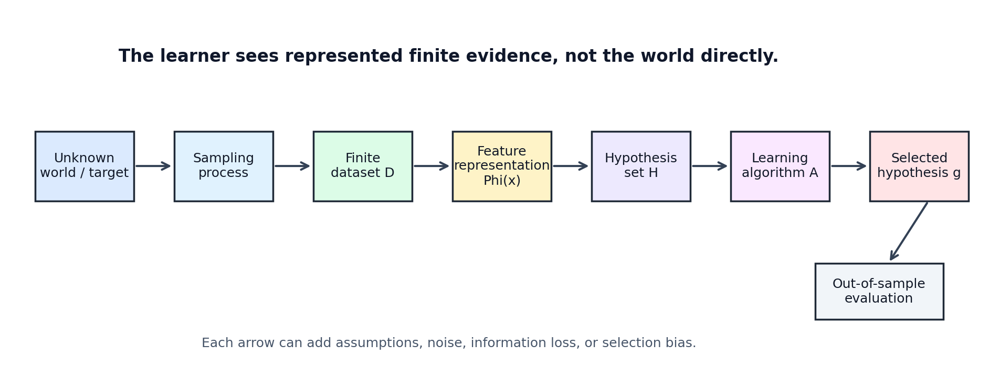
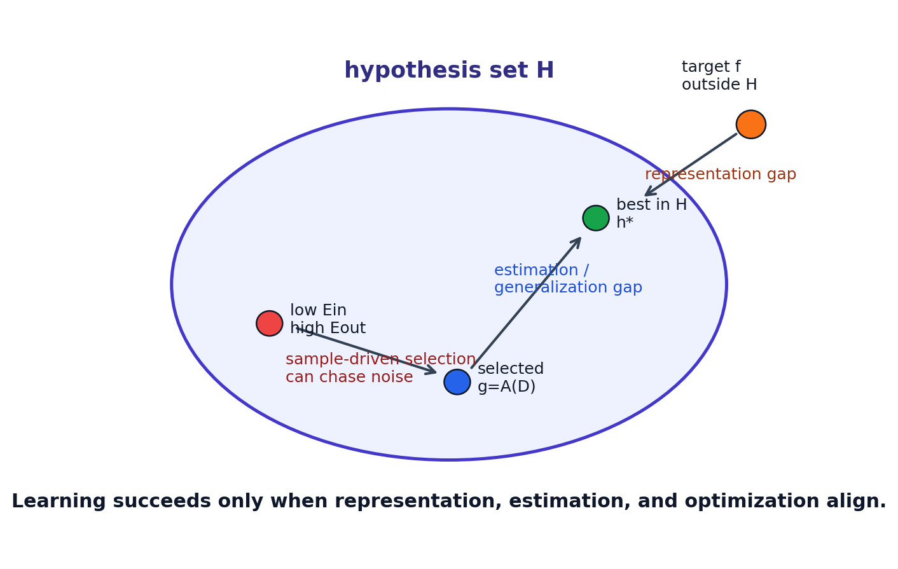

# Machine Learning Theory Map: From World to Data to Generalization

[← Back to Learning From Data Theory Notebook](README.md)

本章是 T1 的 ontology map。它先不讨论某个具体算法是否强大，而是定义 machine learning 问题本身：世界中有某种未知结构，learner 只能看到有限、带 representation bias 的数据，并且必须在未见输入上做 prediction 或 decision。后续所有关于 VC dimension、regularization、validation、distribution shift、calibration、representation learning 的问题，都可以回到这张图。



图 1：从 unknown world 到 selected hypothesis 的 learning system。读图时要注意，learner 并不直接接触世界本身；它接触的是 sampling、measurement、representation 与 hypothesis set 共同过滤后的 finite dataset。

## 0. Source Separation

- **Caltech Core**：learning diagram、target function、training examples、hypothesis set、learning algorithm、final hypothesis，以及 Lecture 2-4 中的 distribution、error measure、noisy target 与 nonlinear transformation。
- **Stanford / Theory Extension**：把 learning problem 解释为 empirical evidence 与 population behavior 之间的 statistical-learning-theory question，尤其是后续 uniform convergence 的入口。
- **Modern Perspective**：representation learning、world models、distribution shift、calibration 与 evaluation protocol 都回到同一 ontology。
- **Research Reflection**：用本章 ontology 审计 ML paper 的 assumptions、evidence、objective、distribution 与 failure type。

## 1. What problem is machine learning actually solving?

### Caltech Core

Caltech `Learning From Data` 的起点不是某个模型，而是一个问题：当我们无法直接写出 desired mapping 时，是否可以用 examples 让机器产生一个有用的 approximation？这个问题看似工程化，本质上是 finite information inference。

我们需要区分几层对象：

- **the world**：产生现象的真实环境、机制、population 或 task context；
- **observations of the world**：通过 measurement 或 sampling 得到的有限记录；
- **representation of observations**：被编码成向量、token、图像、表格字段、label 等机器可处理形式的数据；
- **unknown target**：我们希望预测或决策时追踪的对象，可以是 deterministic function，也可以是 conditional distribution；
- **hypothesis class**：learner 被允许选择的函数集合；
- **learning algorithm**：从 dataset 中选择 hypothesis 的过程；
- **learned hypothesis**：训练结束后实际得到的函数；
- **prediction or decision**：部署时在新输入上的输出。

这几层不能合并。把 model 写成一个函数 `g(x)` 并不意味着 `g` 就是世界，也不意味着 training dataset 完整代表世界。ML research 的困难在于：我们只能观察有限信息，却需要对未观察部分作出判断。

### Intuition

如果一个任务可以被完全写成规则，machine learning 不是必要条件。例如已知精确物理公式或确定性数据库查询时，程序员可以直接实现 mapping。machine learning 出现于另一些场景：人脸识别、手写数字、语音识别、医学风险、语言建模、用户行为预测。这些任务中，人类可以提供 examples 或 feedback，但很难给出完整规则。

因此 learning 不是“让计算机自动发现真理”，而是在有限 evidence、representation、algorithmic search 与 inductive assumptions 下构造一个可评估的 approximation。

### Modern Perspective

现代 deep learning 常把大量 representation、optimization 与 data engineering 封装在一个端到端 pipeline 中。这会让基本 ontology 被遮蔽：输入图片、token 或 tabular row 已经是 representation；network architecture 已经限定 hypothesis family；loss 与 optimizer 已经定义 search behavior；train/validation/test split 已经定义 evidence policy。理论笔记的任务之一，就是把这些被工程框架隐藏的假设重新显式化。

## 2. The canonical learning system

### Formal Setup

一个 supervised learning problem 常写作：

```math
\mathcal{X}: \text{input space}
```

```math
\mathcal{Y}: \text{output space}
```

```math
P: \text{unknown data-generating distribution over } \mathcal{X}\times\mathcal{Y}
```

```math
D = \{(x_1,y_1),\ldots,(x_N,y_N)\}
```

其中 dataset $D$ 通常被建模为从 $P$ 独立同分布抽样得到的 realized sample：

```math
(x_i,y_i) \sim P,\quad i=1,\ldots,N
```

在 deterministic target 的理想化 setting 中，可以写：

```math
y_i = f(x_i)
```

其中 $f:\mathcal{X}\to\mathcal{Y}$ 是 unknown target function。在 noisy 或 probabilistic setting 中，更合适的是写：

```math
Y \mid X=x \sim P(\cdot \mid x)
```

此时 target 不再是单个 deterministic mapping，而是 conditional behavior，具体 prediction target 取决于 loss。例如 squared loss 下的 Bayes predictor 是 conditional mean，0/1 loss 下的 Bayes classifier 是 conditional mode。

learner 还需要：

```math
\mathcal{H} = \{h: \mathcal{X}\to\mathcal{Y}\}
```

这是 hypothesis set。learning algorithm 是一个映射：

```math
A: D \mapsto g
```

其中：

```math
g \in \mathcal{H}
```

`g` 是 selected hypothesis，也就是训练完成后用于 prediction 的函数。

### Conceptual Roles

这些对象承担不同角色：

| Object | Conceptual role | Common confusion |
| ------ | --------------- | ---------------- |
| `f` or `P(Y \mid X)` | target / data-generating structure | 被误当成 model |
| `D` | finite observed evidence | 被误当成 population |
| `H` | allowed functions | 被误当成 algorithm |
| model parameters | 某个 parameterized family 内的坐标 | 被误当成 hypothesis set 本身 |
| `A` | search/selection procedure | 被误当成 hypothesis |
| `g` | final selected function | 被误当成 true target |

### Assumption

上述 canonical setup 常依赖一个强假设：training examples 与 deployment examples 来自同一个或可控相关的 distribution。如果 training distribution 与 deployment distribution 不同，则 `E_out` 的定义必须说明 out-of-sample 是在哪个 distribution 上计算。后续 Week 4 real canvas distribution shift 已经显示，benchmark `load_digits` 上表现良好的 scratch MLP 并不自动代表真实 canvas 输入上的表现。

## 3. World, representation, and information loss

### Caltech Core

Caltech 前几讲把 learning problem 写成 examples、target function、hypothesis set、learning algorithm 与 final hypothesis。这已经暗含 representation：examples 必须以某种形式进入 learner。Lecture 3 的 linear model 与 nonlinear transform 更明确地说明，学习不是直接在“世界”上发生，而是在 feature representation 上发生。

### Representation Chain

更细的链条可以写成：

```text
world state
→ measurement
→ data representation
→ model input
```

在手写数字任务中，这条链可以具体化为：

```text
person writes digit
→ image captured on canvas
→ preprocessing to grayscale 8 x 8 array
→ 64-dimensional model input
```

每一步都可能丢失或扭曲信息：

- measurement 可能受传感器、分辨率、采样频率、标注规范影响；
- data representation 可能丢失时序、空间上下文、笔画顺序、背景条件；
- preprocessing 可能改变尺度、中心、厚度、亮度分布；
- model input 可能只保留任务相关结构的一部分。

### Technical Consequence

如果 relevant structure 在 representation 之前已经丢失，后面的 learner 无法靠更复杂的 optimization 恢复它。例如把动态书写轨迹压缩为低分辨率静态图像后，模型无法直接利用笔顺；把临床叙述强行压成几个二值字段后，语言中的不确定性和上下文被弱化；把图像裁剪到只剩局部纹理后，global shape 可能丢失。

### Modern Perspective

Representation learning 并不推翻这条链，而是在链条中增加可学习变换。classical feature engineering 手动指定 $\Phi(x)$；deep networks 学习一系列内部 representations：

```math
x \mapsto z_1 \mapsto z_2 \mapsto \cdots \mapsto z_L \mapsto \hat{y}
```

但 learned representation 仍受 data、architecture、loss、optimization 与 compute 约束。world models、mechanistic interpretability、distribution shift 研究都可以被看作对这条链的进一步追问：模型内部表示捕捉了哪些 world-relevant variables？哪些只是 training distribution 中的 shortcuts？

## 4. What is the role of the computer?

### Caltech Core

在 `Learning From Data` 的 framing 中，computer 执行 learning algorithm：它接收 examples，在 hypothesis set 中搜索或计算，最终输出 hypothesis。computer 是执行 substrate，不是自动产生正确 inductive structure 的魔法实体。

### Execution Substrate

computer 主要提供：

- representation storage：把 examples、features、labels、parameters 存储为可计算对象；
- numerical calculation：执行 matrix multiplication、loss evaluation、gradient computation；
- optimization：用 gradient descent、closed-form solvers、coordinate search 或其他方法寻找低 objective 的 parameters；
- search：在 hypothesis set 中进行显式或隐式选择；
- statistical estimation：用 finite sample 估计 population quantities；
- simulation：构造 synthetic data、stress tests、ablation 和 Monte Carlo evidence。

这些能力非常强，但它们不自动保证正确 generalization。一个计算机可以精确地最小化错误的 objective，可以高效地记住 training set，可以在 spurious feature 上获得低 training loss，也可以在 distribution shift 下非常自信地出错。

### Constraint Statement

机器能学到什么取决于：

```math
\text{observations}
+ \text{representation}
+ \mathcal{H}
+ \text{objective}
+ A
+ \text{compute}
+ \text{inductive assumptions}
```

任何一个环节错位，learning system 的失败都可能不是“模型不够大”造成的。

## 5. Four failure sources in learning



图 2：T1 图中已经展示了 target、hypothesis set、finite sample selection 与 optimization 的关系。T2 以后需要更精确地区分四类 failure/error source：information/representation failure、approximation/specification error、estimation/generalization error、optimization/computational error。stochastic target 中的 irreducible uncertainty 还要另行处理，不能混入这些由 learner 选择造成的误差。

### Information / Representation Failure

问题：observable representation 是否仍然包含 target-relevant information？

机器学习系统不会直接观察 world state。它观察的是 measurement 和 representation：

```text
world
→ measurement
→ representation
```

如果在 measurement 或 representation 阶段，区分 target 所需的信息已经丢失，则再大的 model class 也不能从当前 input 恢复该信息。例如两个不同 world states 被映射成完全相同的 feature vector，但它们需要不同 decisions；此时问题不是 $\mathcal{H}$ 不够灵活，而是 representation 对任务来说不充分。

### Approximation / Specification Error

问题：relevant information 存在于 representation 中，但 chosen hypothesis family 是否能表达 desired mapping？

给定 representation 后，若：

如果：

```math
f \notin \mathcal{H}
```

则即使有无限数据、完美 optimization，也无法在 $\mathcal{H}$ 内恢复真实 target。此时最好的结果是 approximation：

```math
h^*_{\mathcal{H}} = \arg\min_{h\in\mathcal{H}} E_{\mathrm{out}}(h)
```

其中 $h^*_{\mathcal{H}}$ 是在 allowed family 内最好的 hypothesis，不必等于 unrestricted/reference optimum $h^*$ 或 deterministic target $f$。

若使用 feature map $\Phi$，真正被检查的是 induced family：

```math
\mathcal{H}_{\Phi}
=
\{x \mapsto h(\Phi(x)) : h\in\mathcal{H}\}
```

因此 representation 改变的是学习问题本身：它可能让 target 更容易表达，也可能让原本可表达的 distinction 消失。

### Estimation / Generalization Gap

问题：finite samples 能否识别出 out-of-sample 表现好的 hypothesis？

learner 只能看到 empirical evidence：

```math
E_{\mathrm{in}}(h)
=
\frac{1}{N}\sum_{i=1}^{N}\ell(h(x_i),y_i)
```

但真正关心的是：

```math
E_{\mathrm{out}}(h)
=
\mathbb{E}_{(X,Y)\sim P}
\left[
\ell(h(X),Y)
\right]
```

generalization gap 是：

```math
E_{\mathrm{out}}(h)-E_{\mathrm{in}}(h)
```

更严格地，learning theory 常要求同时控制所有或许多 $h\in\mathcal{H}$ 的 gap，这就是 uniform convergence 的入口。

### Optimization / Computation Gap

问题：algorithm 能否实际找到 desired hypothesis？

即使 $\mathcal{H}$ 中存在好 hypothesis，实际训练也可能失败，因为：

- objective non-convex；
- gradients noisy 或 ill-conditioned；
- search space 太大；
- compute budget 不足；
- implementation 或 numerical stability 出问题；
- optimizer 找到低 training objective 但不代表低 population risk。

Week 3 optimization notes 已经展示了 gradient descent、SGD、Momentum、Adam 的不同 trajectory；这些差异属于 computation gap 的一部分，而不是 learning theory 的抽象 bounds 能完全覆盖的内容。

### Irreducible Stochastic Uncertainty

T1 Lecture 4 已经说明，target 也可能是 stochastic 的。即使 representation 充分、$\mathcal{H}$ 足够大、sample size 足够、optimization 完美，若 $Y|X=x$ 本身有随机性，prediction 仍然存在不可消除的不确定性。这个 quantity 通常来自 data-generating distribution，而不是 learner 的 representation、estimation 或 optimization 失败。

## 6. Learning as constrained inference

### Diagram

```text
Unknown world / target
        ↓
Sampling process
        ↓
Finite dataset
        ↓
Representation
        ↓
Hypothesis set
        ↓
Learning algorithm
        ↓
Selected hypothesis
        ↓
Out-of-sample evaluation
```

### Formal Reading

这张图不是装饰性的流程图。它表达了一个 constrained inference problem：

1. unknown target 或 population distribution 不可直接访问；
2. sampling process 只给出 finite realized dataset；
3. representation 决定 learner 能看见哪些 variables；
4. hypothesis set 决定 learner 允许输出哪些 functions；
5. learning algorithm 以某个 objective 或 selection rule 选择 $g$；
6. out-of-sample evaluation 才检验 $g$ 是否能在未见样本上工作。

### Failure Mode

如果任何环节被误解，研究结论就会被过度解释：

- 把 training loss 当成 population risk；
- 把 validation reuse 当成 independent evidence；
- 把 benchmark distribution 当成 deployment distribution；
- 把 model confidence 当成 calibrated probability；
- 把 architecture success 当成已理解 causal mechanism；
- 把 representation 中的 shortcut 当成 task-relevant structure。

### Generalization credibility layer

T2 在这张 map 上增加一层专门用于判断 research claim 是否可信的结构：

```text
sample
→ adaptive selection
→ capacity control
→ uniform guarantee
→ out-of-sample claim
```

fixed hypothesis 的 concentration 只能说明一个预先固定的 $h$ 在独立样本上的 empirical error 接近 population error。training 中真正出现的是 selected hypothesis：

```math
g = A(D)
```

它依赖同一个 dataset $D$。因此 credible out-of-sample claim 需要说明 adaptive selection 被怎样控制：finite hypothesis set 的 union bound、growth function、VC dimension、明确约束的 regularization、stability，或其他 formal capacity/algorithm-control argument；独立 validation/test protocol 则提供 evidence-control，而不是 capacity-control 本身。没有这些论证或证据，low training error 只是关于 observed sample 的事实，不是 generalization 的结论。

### Adaptive Selection Layer

T3 在 selected-hypothesis 问题上再加一层：实际研究中的 learner 往往不是单次 optimizer call，而是完整的 adaptive procedure。

最基本的信息流应写成：

```text
D_train
→ parameter fitting

D_val
→ model / hyperparameter / checkpoint selection

D_test
→ final evaluation only
```

如果 validation/dev outcome 被反复用于改变后续候选集合，信息流会变成：

```text
validation feedback
→ researcher / search procedure
→ new preprocessing, architecture, hyperparameters, prompts, checkpoints
→ new candidates
```

因此 generalization 相关的 algorithm 可能是：

```text
full adaptive selection procedure
```

而不是：

```text
one optimizer run on one fixed architecture
```

这不是说所有 adaptive development 都不可用，而是说每个 dataset role 必须按 information flow 解释。validation 可以服务 model selection；final test 若要估计 frozen procedure 的 performance，就必须留在 development loop 外。

### Selection / Evaluation Failure

T3 还引入一个 cross-cutting research-process failure mode：

```text
Selection / Evaluation Failure
```

它包括：

- validation overuse；
- test-set reuse；
- benchmark adaptation；
- checkpoint selection using test behavior；
- excessive hyperparameter search without accounting for selection；
- researcher feedback loops；
- preprocessing selected after observing validation failures。

这不是新的 population-risk decomposition term。它指 evaluation interpretation 的 assumptions 被破坏：某个数据集原本被当作 independent evidence，但实际已经影响了 final procedure。此时问题不一定在 representation、approximation、estimation 或 optimization 本身，而在 evidence role 被改变。

## 7. Geometry and Similarity Layer

T4 adds a layer that was implicit in T1-T3:

```text
Representation Phi(x)
down
Geometry
├── distance
├── inner product
├── angle
├── margin
└── locality
down
Learning algorithm
```

Geometry is not independent of representation. Once observations are mapped to

```math
z=\Phi(x),
```

distance, angle, inner product, margin, and local neighborhood are defined in the represented space, not directly in the raw world.

This matters for SVMs, kernels, RBF models, and neural networks:

- an SVM margin is measured using the norm in the feature representation;
- a kernel declares an inner-product geometry through pairwise evaluations;
- an RBF model declares locality around centers under a chosen metric;
- a neural network learns a representation, so the geometry itself becomes data-dependent.

The new failure mode is a refinement of representation failure:

```text
representation failure
-> geometry / similarity failure
```

For example, a representation may preserve class labels on the training data but induce unstable similarity under environmental shift. Two images may be close in a learned feature space because of shared background, stroke artifact, or acquisition condition rather than the predictive mechanism. Under deployment shift, the same similarity relation can become wrong even if the nominal classifier, optimizer, and validation score looked acceptable on the development distribution.

Technically, this means a learning claim should identify:

- which representation induces the geometry;
- which norm, kernel, metric, or neighborhood structure is used;
- whether geometry-defining hyperparameters were selected adaptively;
- whether the sampling process makes that geometry valid for the target population;
- whether evaluation tests geometry/similarity failure, not only average accuracy.

## 8. Modern Generalization Lens

T5 在 T4 的 geometry layer 上再加一层：modern learner 不只是在 fixed $\mathcal H$ 中选 hypothesis，它还通过 algorithm、optimization trajectory 与 learned representation 共同产生最终 predictor。

核心对象是：

```text
Hypothesis family H
+
Data S
+
Learning algorithm A
+
Optimization trajectory
+
Representation dynamics
down
Selected predictor
```

这意味着 modern generalization claim 不能只问一个 scalar complexity。至少要区分四个问题：

```text
Can H represent?
Can A find?
Why does selected g generalize?
Does it remain valid under environment change?
```

对应到 learned representation，T4 的链条：

```text
World
down
Observation
down
Representation Phi
down
Geometry
down
Learning
```

在 modern setting 中变成：

```text
World
down
Observation
down
Learned representation Phi_theta
up/down
optimization trajectory
down
selected geometry
down
prediction
```

这不是说 classical theory 被推翻。更准确地说，T5 把 classical class-dependent control 扩展成一组 scoped lenses：

- data-dependent complexity：在当前 sample / geometry 上控制 richness；
- algorithmic stability：控制 $A(S)$ 对 neighboring datasets 的 sensitivity；
- margin/norm：控制 selected solution 的 geometric / functional complexity；
- implicit bias：研究 optimizer 和 parameterization 偏向哪个 solution；
- NTK：刻画 lazy / tangent-kernel training regime；
- domain adaptation：把 source generalization 与 target-environment reliability 分开。

这些 lenses 回答不同问题，不应被合并成一个 universal complexity number。

## 9. Research lens

这个 ontology 可以直接用于阅读 ML paper。对每篇论文，至少追问：

- What is unknown?
- What is observed?
- What is assumed?
- What is represented?
- What hypothesis family is allowed?
- What objective is optimized?
- What evidence supports generalization?
- Under which distribution?
- What happens if the environment changes?
- Which failure is representational, statistical, or computational?
- Which data influenced fitting, validation selection, hyperparameter search, checkpoint choice, and final reporting?

### Research Reflection

这些问题能把“模型效果好不好”变成可审计的研究判断。例如在 digit canvas 项目中，`load_digits` test performance 回答的是 sklearn digits distribution 上的 out-of-sample behavior；real canvas diagnostics 回答的是另一个 observation mechanism 下的 behavior；calibration notes 回答的是 confidence 是否可解释为 probability-like evidence；abstention notes 回答的是在允许拒答时 selective risk 如何变化。它们不是同一个问题，因此不能用一个 scalar metric 混合解释。

## 10. Conceptual conclusion

T1 的核心地图可以压缩成一句话：

```text
Machine learning is constrained inference from finite represented observations
to a selected hypothesis whose value is judged out of sample under an explicit
distribution, loss, and evidence protocol.
```

后续章节会分别展开四个基础问题：

- [Lecture 1 note](part1_learning_problem/01_caltech_l01_learning_problem_target_hypothesis_inductive_bias.md)：什么叫 learn；
- [Lecture 2 note](part1_learning_problem/02_caltech_l02_finite_sample_generalization_hoeffding_uniform_convergence.md)：finite sample 如何支持 generalization；
- [Lecture 3 note](part1_learning_problem/03_caltech_l03_hypothesis_spaces_linear_models_feature_transforms.md)：representation 与 linear models 如何定义 hypothesis geometry；
- [Lecture 4 note](part1_learning_problem/04_caltech_l04_error_measures_noise_target_distribution.md)：loss、noise 与 target distribution 如何成为问题定义的一部分。

Source traceability is recorded in [Source Traceability](sources/source_traceability.md), and symbols are standardized in [Terminology and Notation](sources/t1_terminology_notation_learning_problem_generalization.md).

[← Back to Learning From Data Theory Notebook](README.md)
