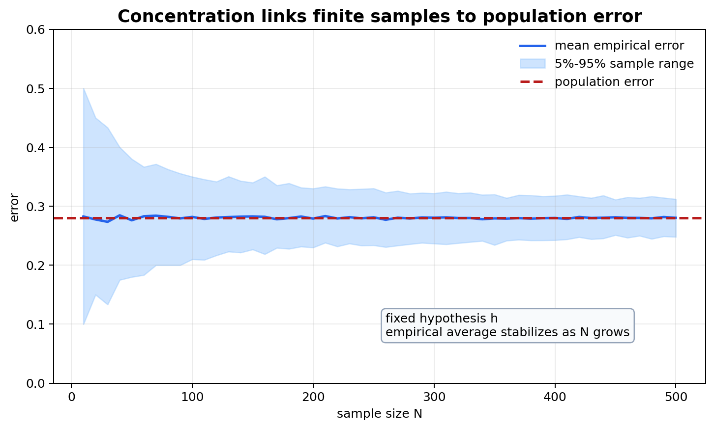

# From Finite Data to Generalization: Is Learning Feasible?

[← Back to Learning From Data Theory Notebook](../README.md)

本章主要对应 Caltech `Learning From Data` Lecture 2, `Is Learning Feasible?`。它回答 Lecture 1 留下的根本问题：如果 learner 只看见有限 training examples，为什么它对未见 points 的 prediction 可以被信任？Caltech 的主线用 bin model、Hoeffding inequality、in-sample error 与 out-of-sample error 建立直觉；Stanford / theory extension 则把这个问题推向 uniform convergence。



图 1：concentration 是从 finite sample 到 population statement 的桥。固定 hypothesis 时，sample error 可以估计 population error；data-dependent selection 则需要同时控制许多 hypotheses。

## 0. Source Separation

- **Caltech Core**：in-sample error、out-of-sample error、bin model、Hoeffding inequality、fixed hypothesis 与 selected hypothesis 的区别。
- **Stanford / Theory Extension**：uniform convergence 作为同时控制 $\mathcal{H}$ 中多个 hypotheses 的 generalization statement。
- **Modern Perspective**：adaptive validation reuse、data snooping、large hypothesis spaces 与 evaluation protocol 的现代风险。
- **Research Reflection**：解释为什么 sample size、hypothesis complexity 与 evidence protocol 必须一起解读。

## 1. The central paradox

### Caltech Core

学习的 paradox 是：

```text
training set is finite, but prediction domain is not.
```

如果 $\mathcal{X}$ 很大或连续，training set 只覆盖极小一部分 input space。那为什么 training performance 能告诉我们 out-of-sample performance？

这不是哲学疑问，而是数学问题。我们需要说明：

1. training examples 如何与未来 examples 相连；
2. empirical average 为什么能接近 population expectation；
3. 这种接近在选择 hypothesis 后是否仍然成立；
4. hypothesis set 太大时需要付出什么 complexity cost。

### Required Assumption

最基本的 feasibility argument 需要 sampling assumption。通常假设：

```math
(x_1,y_1),\ldots,(x_N,y_N)
\text{ are iid samples from } P
```

其中 $P$ 是 unknown data-generating distribution。这个假设把 training examples 与 future examples 放在同一概率机制下。如果 training data 与 deployment data 来自不同 distribution，那么从 $D$ 推断 future behavior 的桥梁会断裂或至少需要重新建模。

### Intuition

finite data 本身并不神奇。它有用，是因为它被假设为 population 的随机样本。random sampling 让 sample average 可以估计 population average；concentration inequality 则量化“估计得多可靠”。

## 2. In-sample and out-of-sample quantities

### Definition

给定 hypothesis $h$ 和 loss function $\ell$，in-sample error 是 training dataset 上的 average loss：

```math
E_{\mathrm{in}}(h)
=
\frac{1}{N}
\sum_{i=1}^{N}
\ell(h(x_i),y_i)
```

out-of-sample error 是 data-generating distribution 上的 expected loss：

```math
E_{\mathrm{out}}(h)
=
\mathbb{E}_{(X,Y)\sim P}
\left[
\ell(h(X),Y)
\right]
```

在 binary classification with 0/1 loss 中：

```math
\ell(h(x),y)
=
\mathbf{1}\{h(x)\neq y\}
```

于是：

```math
E_{\mathrm{in}}(h)
=
\frac{1}{N}
\sum_{i=1}^{N}
\mathbf{1}\{h(x_i)\neq y_i\}
```

```math
E_{\mathrm{out}}(h)
=
\Pr_{(X,Y)\sim P}[h(X)\neq Y]
```

### What Randomness Each Depends On

对固定 $h$ 而言，$E_{\mathrm{out}}(h)$ 是 population quantity。它由 $h$、loss 与 $P$ 决定，不依赖具体抽到的 training set。

$E_{\mathrm{in}}(h)$ 是 random quantity，因为它依赖 realized dataset $D$。如果重新采样一个 training set，同一个 $h$ 的 in-sample error 可能不同。

当 $h$ 是 algorithm 从 $D$ 中选择出来的 $g=A(D)$ 时，情况更复杂：$g$ 本身也是 random 的，并且与 $D$ 强相关。这就是 fixed hypothesis 与 selected hypothesis 的关键区别。

## 3. Hoeffding-style reasoning

### Setup

先考虑一个固定 hypothesis $h$，它在看到 dataset 之前已经确定。定义每个 sample 上的 error random variable：

```math
Z_i
=
\ell(h(X_i),Y_i)
```

在 0/1 loss 下：

```math
Z_i\in\{0,1\}
```

若 examples iid，则 $Z_1,\ldots,Z_N$ 也是 iid bounded random variables。它们的 population mean 是：

```math
\mu
=
\mathbb{E}[Z_i]
=
E_{\mathrm{out}}(h)
```

它们的 sample mean 是：

```math
\nu
=
\frac{1}{N}
\sum_{i=1}^{N}
Z_i
=
E_{\mathrm{in}}(h)
```

因此 fixed hypothesis 的 generalization question 变成：

```math
\text{How close is } \nu \text{ to } \mu?
```

### Formal Derivation

Hoeffding inequality 对 bounded independent variables 给出 concentration bound。对 $Z_i\in[0,1]$，有：

```math
\Pr\left[
\left|
\frac{1}{N}\sum_{i=1}^{N}Z_i
-
\mathbb{E}[Z_i]
\right|
>
\epsilon
\right]
\le
2\exp(-2\epsilon^2N)
```

代入 learning notation：

```math
\Pr\left[
\left|
E_{\mathrm{in}}(h)
-
E_{\mathrm{out}}(h)
\right|
>
\epsilon
\right]
\le
2\exp(-2\epsilon^2N)
```

这个式子回答的问题是：对一个固定 hypothesis，training error 偏离 true error 超过 $\epsilon$ 的概率有多大。

### Why Each Object Matters

- $Z_i$ 是 per-example loss random variable；
- $\nu$ 是 empirical frequency 或 empirical average；
- $\mu$ 是 population probability 或 expected loss；
- $N$ 是 sample size；
- $\epsilon$ 是允许的 deviation；
- exponential term 说明 sample size 增大时 large deviation probability 快速下降。

### Intuition

concentration 的含义不是“training error 总是等于 test error”。它说的是：在 iid sampling 与 bounded loss 下，固定 hypothesis 的 empirical loss 通常不会离 population loss 太远。sample average 是 noisy estimate；sample size 越大，estimate 越稳定。

### Assumption

这个 reasoning 依赖：

1. $h$ fixed before observing the sample；
2. examples independent；
3. train and future examples share the same $P$；
4. loss bounded in $[0,1]$，或已经满足相应 bounded/sub-Gaussian 条件；
5. $E_{\mathrm{out}}$ 相对于明确 distribution 定义。

### Failure Mode

若 label noise heavy-tailed、samples dependent、data collection biased、deployment distribution shifted，或者 loss unbounded，简单 Hoeffding bound 不能直接使用。它仍然提供 conceptual bridge，但需要新的 assumptions 和 concentration tools。

## 4. Coin-bin analogy

### Caltech Core

Caltech Lecture 2 用 coin/bin analogy 解释 feasibility。一个 bin 中有大量 red/green balls；随机抽样后，用 sample fraction $\nu$ 估计 bin 中真实 green fraction $\mu$。Hoeffding inequality 说明 sample fraction 通常接近真实 fraction。

对应到 learning：

| Bin model | Learning problem |
| --------- | ---------------- |
| bin | fixed hypothesis $h$ |
| ball | possible input-output example |
| green/red | correct/incorrect 或 low/high loss |
| sample from bin | training dataset |
| $\nu$ | $E_{\mathrm{in}}(h)$ |
| $\mu$ | $E_{\mathrm{out}}(h)$ |

### Where the Analogy Works

当 $h$ fixed 时，dataset 中每个 example 对 $h$ 来说只是一次 random draw of success/failure。于是 $E_{\mathrm{in}}(h)$ 像 sample frequency，$E_{\mathrm{out}}(h)$ 像 population frequency。这个 analogy 清楚展示了为什么有限样本可以估计 out-of-sample error。

### Where It Breaks

learning algorithm 不是随机选一个 fixed bin 后估计它。通常它会看见 data，然后从很多 hypotheses 中选择一个 training error 小的 $g$。这相当于先查看 many bins 的 samples，再挑一个 sample 看起来最绿的 bin。这样选出的 bin 的 sample fraction 会有 selection bias。

这就是为什么：

```math
\Pr\left[
\left|
E_{\mathrm{in}}(h)
-
E_{\mathrm{out}}(h)
\right|
>
\epsilon
\right]
```

对 fixed $h$ 的 guarantee 不等于：

```math
\Pr\left[
\left|
E_{\mathrm{in}}(A(D))
-
E_{\mathrm{out}}(A(D))
\right|
>
\epsilon
\right]
```

的 guarantee。

## 5. Fixed hypothesis versus selected hypothesis

### Critical Distinction

如果 $h$ 在 dataset 之前固定，$E_{\mathrm{in}}(h)$ 是 $E_{\mathrm{out}}(h)$ 的普通 empirical estimate。

如果 $g=A(D)$ 是看过 dataset 后选择的，$g$ 往往被选择为 training error 小的 hypothesis。此时 $g$ 与 $D$ 不独立，training error 会倾向于 optimistic。

### Finite Hypothesis Set Preview

如果 $\mathcal{H}$ 有 $M$ 个 hypotheses，可以对每个 fixed $h$ 应用 Hoeffding，再用 union bound：

```math
\Pr\left[
\exists h\in\mathcal{H}:
\left|
E_{\mathrm{in}}(h)
-
E_{\mathrm{out}}(h)
\right|
>
\epsilon
\right]
\le
2M\exp(-2\epsilon^2N)
```

这就是 simultaneous control。它说明如果所有 hypotheses 的 in/out gap 都小，那么 algorithm 无论选择哪个 $g\in\mathcal{H}$，都不会因为 selection 而逃出 bound。

### Why This Prepares VC Theory

当 $M$ 很大或 infinite 时，直接使用 $M$ 会使 bound useless。Lecture 5-7 会用 growth function 和 VC dimension 替代 naive number of hypotheses。核心思想不是“数参数”，而是数 hypothesis set 在 finite sample 上能产生多少 distinct dichotomies。

### Consequence

learning feasibility 不是由低 training error 单独给出的，而是由两件事共同给出：

```math
E_{\mathrm{in}}(g) \text{ small}
\quad \text{and} \quad
E_{\mathrm{in}}(h)\approx E_{\mathrm{out}}(h)
\text{ uniformly over relevant } h
```

如果第一项好但第二项失败，就是 overfitting 或 data snooping 的入口。

### Generalization Claim Discipline

从 $E_{\mathrm{in}}$ 到 $E_{\mathrm{out}}$ 的任何 statement 都必须说明 claim strength。T1 至少区分三种层级：

| Claim type | 可以说什么 | 不能说什么 |
| ---------- | ---------- | ---------- |
| fixed-hypothesis estimate | 对预先固定的 $h$，$E_{\mathrm{in}}(h)$ 在 iid、bounded loss 下以 high probability 接近 $E_{\mathrm{out}}(h)$ | 不能推出 data-dependent $g=A(D)$ 自动 generalize |
| finite-class uniform control | 对 finite $\mathcal{H}$，union bound 可以同时控制所有 $h$ 的 gap，但代价随 $M=|\mathcal{H}|$ 增大 | 不能在 infinite 或 highly adaptive model search 中直接把 $M$ 忽略 |
| theory-ready uniform convergence | 若 $\sup_{h\in\mathcal{H}}|E_{\mathrm{in}}(h)-E_{\mathrm{out}}(h)|\le\epsilon$，ERM 的 population risk 可接近 $\mathcal{H}$ 内最优 | 不能说明 $\mathcal{H}$ 外的 target representation gap，也不能自动处理 distribution shift |

因此，严谨的 conclusion 不能写成“test error 通常接近 training error”。更准确的说法是：在明确 sampling assumption、loss condition、hypothesis-control mechanism 与 evaluation distribution 后，empirical performance 可以支持一个有界强度的 out-of-sample claim。

## 6. Stanford / Theory Extension

### Uniform Convergence

Stanford STATS214 / CS229M 的 machine learning theory framing 把这一问题抽象为：learning algorithm 的 success 需要把 empirical objective 与 population objective 联系起来。一个常见 sufficient condition 是 `uniform convergence`：

```math
\sup_{h\in\mathcal{H}}
\left|
E_{\mathrm{in}}(h)
-
E_{\mathrm{out}}(h)
\right|
\le
\epsilon
```

with high probability over the draw of $D$。

### Meaning

这个 statement 控制的不是某个单独 hypothesis，而是整个 hypothesis set 的 worst-case deviation。若它成立，则 ERM 所选的 hypothesis 可以被证明接近 population-optimal hypothesis in $\mathcal{H}$。

设：

```math
\hat{h}
\in
\arg\min_{h\in\mathcal{H}}
E_{\mathrm{in}}(h)
```

以及：

```math
h^*
\in
\arg\min_{h\in\mathcal{H}}
E_{\mathrm{out}}(h)
```

如果 uniform convergence gap 不超过 $\epsilon$，则：

```math
E_{\mathrm{out}}(\hat{h})
\le
E_{\mathrm{in}}(\hat{h})+\epsilon
```

由于 $\hat{h}$ minimizes empirical error：

```math
E_{\mathrm{in}}(\hat{h})
\le
E_{\mathrm{in}}(h^*)
```

再用 uniform convergence：

```math
E_{\mathrm{in}}(h^*)
\le
E_{\mathrm{out}}(h^*)+\epsilon
```

合并得到：

```math
E_{\mathrm{out}}(\hat{h})
\le
E_{\mathrm{out}}(h^*)+2\epsilon
```

### What This Does Not Prove Yet

这里还没有证明 uniform convergence 什么时候成立，也没有处理 deep learning 中 enormous parameterized models 的全部现象。T2 会进入 VC dimension、growth function 与更完整 bounds。Stanford extension 的作用是在 T1 阶段先让读者看到：generalization theory 要控制的是 data-dependent selection，而不是 fixed hypothesis 的 sample estimate。

## 7. Research interpretation

### More Data Is Not Automatically Enough

增加 $N$ 通常改善 concentration，但如果 hypothesis complexity 同时增长、data distribution 改变、labels 更噪、validation 被反复重用，更多数据不自动保证更好 science。sample size 必须相对于 task difficulty、hypothesis set、loss、noise 与 evidence protocol 解读。

### Hypothesis Complexity Matters

如果 $\mathcal{H}$ 太灵活，它可能在 training data 上找到偶然一致的 rule。低 $E_{\mathrm{in}}$ 可能是 signal，也可能是 selection artifact。现代 large models 的成功并没有取消这个问题，只是让有效 complexity、implicit regularization、data scale、optimization bias 与 distribution structure 的关系更复杂。

### Adaptive Reuse of Data

如果 researcher 反复查看 validation set 并调整 preprocessing、features、architecture、hyperparameters，validation set 也会变成 selection process 的一部分。此时它不再提供 clean estimate of out-of-sample performance。Caltech 后续 data snooping 与 validation 主题在 Lecture 2 已经埋下伏笔。

### Existing Repository Link

Week 5 的 [evaluation artifact and report-link audit](../../../reports/week5/04_evaluation_artifact_audit_and_link_consistency.md) 属于 research evidence discipline：它不改变模型，但让 evaluation artifacts、registry 与 report links 可审计。理论上，这对应“不要把 evidence protocol 弄乱后再解释 generalization”。

## 8. Conceptual conclusion

Lecture 2 的核心不是“Hoeffding inequality 本身”，而是下面的逻辑：

```text
iid sampling
→ empirical averages concentrate
→ fixed hypothesis can be evaluated from finite data
→ selected hypothesis requires simultaneous control
→ uniform convergence / VC theory is needed for learning guarantees
```

这条链解释了为什么 feasibility 是有条件的。learning from finite data 可能，但不是因为 data 会自动代表世界，而是因为 sampling assumptions、bounded losses、controlled hypothesis complexity 与 careful selection protocol 共同成立。

[← Back to Learning From Data Theory Notebook](../README.md)
