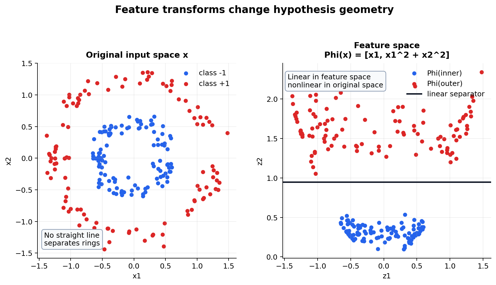

# Hypothesis Spaces, Linear Models, and Representation

[← Back to Learning From Data Theory Notebook](../README.md)

本章主要对应 Caltech `Learning From Data` Lecture 3, `The Linear Model I`。Lecture 3 的关键作用是把 abstract learning setup 落到具体 hypothesis spaces：linear classification、linear regression 与 nonlinear transforms。它同时引出一个长期主题：representation 不是输入数据的中性包装，而是改变 hypothesis geometry 的核心决定。



图 1：原始输入空间中不可线性分离的结构，经过 feature transform $\Phi(x)$ 后可能在 feature space 中被 linear hypothesis 分离。读图重点不是“变换总是有用”，而是 representation 改变了 hypothesis set 对原始输入的几何形状。

## 0. Source Separation

- **Caltech Core**：linear classification、linear regression、matrix formulation、normal equations、nonlinear transform。
- **Stanford / Theory Extension**：hypothesis class complexity、ERM view 与后续 generalization bounds 的 representation dependence。
- **Modern Perspective**：classical feature transform 与 neural representation learning 的连续性和差异。
- **Research Reflection**：分析哪些 structure 被 representation encoded，哪些被 learned，哪些 distinctions 被丢失。

## 1. Linear classification

### Caltech Core

linear classification 假设输入 $x\in\mathbb{R}^d$，二分类标签 $y\in\{-1,+1\}$。一个 linear classifier 由 weight vector $w\in\mathbb{R}^d$ 与 bias $b\in\mathbb{R}$ 定义：

```math
s(x)=w^\top x+b
```

hard prediction 是：

```math
h_{w,b}(x)=\mathrm{sign}(w^\top x+b)
```

其中 $s(x)$ 是 score 或 signed distance 的未归一化版本。decision boundary 是：

```math
w^\top x+b=0
```

### Geometric Interpretation

在 $\mathbb{R}^d$ 中，$w^\top x+b=0$ 是一个 hyperplane。vector $w$ 垂直于 hyperplane；$b$ 决定 boundary 相对于 origin 的位置。点 $x$ 落在 hyperplane 哪一侧由 $w^\top x+b$ 的符号决定。

如果：

```math
y_i(w^\top x_i+b)>0
```

则 sample $i$ 被正确分类。若对所有 training samples 都成立，则 dataset 在当前 representation 下 linearly separable。

### Assumption

linear classifier 的 inductive bias 是：类别差异可以由 input representation 中的一个 affine boundary 捕捉。这个假设强但可解释。它不只是“简单模型”，而是明确规定了哪些 distinctions 可以被表达。

### Failure Mode

如果同一类别在 input space 中围成环形、异或结构或复杂 manifold，linear boundary 可能无法表达 correct classification。此时 failure 可能不是 optimization failure，而是 approximation/specification error：在当前 representation 上，$\mathcal{H}$ 中没有足够好的 classifier。若 measurement 或 representation 本身已经丢掉 target-relevant information，则问题更早发生，属于 information/representation failure。

## 2. Linear regression

### Hypothesis

linear regression 处理 continuous target $y\in\mathbb{R}$。hypothesis 写作：

```math
h_{w,b}(x)=w^\top x+b
```

对 dataset $D=\{(x_i,y_i)\}_{i=1}^{N}$，prediction 为：

```math
\hat{y}_i=w^\top x_i+b
```

### Squared-Error Objective

常见 training objective 是 mean squared error：

```math
E_{\mathrm{in}}(w,b)
=
\frac{1}{N}
\sum_{i=1}^{N}
(w^\top x_i+b-y_i)^2
```

这个 objective 惩罚 prediction 与 target 的平方偏差。平方损失的数学便利来自 convexity、可微性与 closed-form least-squares solution；它的统计含义将在 Lecture 4 中通过 Gaussian noise assumption 进一步解释。

### Matrix Formulation

把 samples 堆成矩阵：

```math
X
=
\begin{bmatrix}
x_1^\top\\
\vdots\\
x_N^\top
\end{bmatrix}
\in\mathbb{R}^{N\times d}
```

把 bias 合并进 augmented feature：

```math
\tilde{x}_i
=
\begin{bmatrix}
1\\
x_i
\end{bmatrix},
\quad
\tilde{w}
=
\begin{bmatrix}
b\\
w
\end{bmatrix}
```

于是：

```math
\hat{y}
=
\tilde{X}\tilde{w}
```

empirical squared loss 写作：

```math
E_{\mathrm{in}}(\tilde{w})
=
\frac{1}{N}
\lVert
\tilde{X}\tilde{w}-y
\rVert_2^2
```

### Normal Equations

最小化未除以 $N$ 的 residual sum of squares：

```math
J(\tilde{w})
=
\lVert
\tilde{X}\tilde{w}-y
\rVert_2^2
```

展开：

```math
J(\tilde{w})
=
(\tilde{X}\tilde{w}-y)^\top
(\tilde{X}\tilde{w}-y)
```

对 $\tilde{w}$ 求梯度：

```math
\nabla_{\tilde{w}}J
=
2\tilde{X}^\top(\tilde{X}\tilde{w}-y)
```

令梯度为零：

```math
\tilde{X}^\top\tilde{X}\tilde{w}
=
\tilde{X}^\top y
```

这就是 normal equations。若 $\tilde{X}^\top\tilde{X}$ 可逆：

```math
\tilde{w}
=
(\tilde{X}^\top\tilde{X})^{-1}
\tilde{X}^\top y
```

### What Is Actually Being Estimated

linear regression 并不直接估计“世界”。它估计的是：在 chosen representation 与 squared loss 下，hypothesis family 中最能降低 empirical residual 的 affine function。

若 data 来自：

```math
Y = w_*^\top X+b_*+\epsilon
```

并且 noise 满足 appropriate assumptions，则 least squares 可以被解释为估计 underlying linear signal。若真实 target 是 nonlinear、noise 非均匀、samples biased 或 loss 不匹配，learned weights 仍然只是 objective-relative estimate。

### Connection to Repository Implementation

[Week 2 Linear / Logistic Regression](../../../reports/week2_linear_logistic_regression.md) 的 scratch implementation 使用 NumPy 明确实现：

```math
\hat{y}=Xw+b
```

```math
L=\mathrm{mean}((\hat{y}-y)^2)
```

```math
dw=\frac{2}{N}X^\top(\hat{y}-y)
```

```math
db=\frac{2}{N}\sum_{i=1}^{N}(\hat{y}_i-y_i)
```

这对应 gradient-based least squares，而不是 normal-equation solver。理论上两者优化同一 empirical objective；工程上，它们体现了不同 computation choices。

## 3. Nonlinear transforms

### Caltech Core

Lecture 3 的 nonlinear transform 是 T1 中最重要的 representation idea。核心形式是：

```text
x
→ feature transform Phi(x)
→ linear model in feature space
```

数学上，设：

```math
\Phi:\mathcal{X}\to\mathcal{Z}
```

其中 $\mathcal{Z}$ 是 feature space。linear model 不再直接作用于 $x$，而是作用于 transformed features：

```math
h(x)
=
\mathrm{sign}
\left(
w^\top \Phi(x)+b
\right)
```

或者 regression setting：

```math
h(x)
=
w^\top \Phi(x)+b
```

### Linear in Parameters, Nonlinear in Input

这一区分非常关键。若：

```math
\Phi(x)
=
\begin{bmatrix}
x\\
x^2
\end{bmatrix}
```

则模型：

```math
h(x)
=
w_0+w_1x+w_2x^2
```

对 parameters $w_0,w_1,w_2$ 是 linear 的，但对 original input $x$ 是 nonlinear 的。

更一般地：

```math
h(x)
=
\sum_{j=1}^{m}
w_j\phi_j(x)
```

这是 basis expansion。optimization 可以保留 linear least-squares structure，但 hypothesis 在 original input space 中可以表示 curved boundaries 或 nonlinear functions。

### Why This Matters

如果直接在 original input 上使用 linear classifier，decision boundary 是 hyperplane。经过 $\Phi$ 后，feature space 的 hyperplane 对 original input 来说可能是 curve、surface 或更复杂 set：

```math
w^\top\Phi(x)+b=0
```

例如二次特征可以产生 conic boundary；radial features 可以产生 localized regions；interaction features 可以表达 variables 之间的组合关系。

## 4. Representation changes hypothesis geometry

### Separability

同一 dataset 在原始 representation 下不可线性分离，在 transformed feature space 中可能可分。是否 separable 不是 dataset 的绝对属性，而是 dataset + representation + hypothesis family 的联合属性。

### Expressivity

feature transform 不是自动“增大”可表达函数集合。更精确地说，representation 或 feature map 会改变原始 input domain 上的 effective hypothesis family。给定 base hypothesis family $\mathcal{H}$ 和 feature map $\Phi$，它诱导：

```math
\mathcal{H}_{\Phi}
=
\{x \mapsto h(\Phi(x)) : h\in\mathcal{H}\}
```

不同的 $\Phi$ 会在 original $x$ 上诱导不同的 function family。它可能扩大 effective expressivity，也可能限制它；可能重新组织 geometry，也可能把原本可区分的 inputs collapse 到同一个 representation；可能丢弃 irrelevant variation，也可能丢弃 target-relevant information。只有在证明了两个 family 之间存在 inclusion relation 时，才可以严格说一个 representation 的 hypothesis family 包含另一个。

### Dimensionality

增加 features 常常提高 expressivity，但这不是逻辑必然；它同时会改变 generalization behavior。若 transformed family 更灵活，learner 更容易 fit finite sample 的偶然模式。若 transform collapse 了重要 distinctions，则即使 feature dimension 更高也可能让 target 不可表达。Lecture 2 的 selected-hypothesis problem 在这里重新出现：representation 改变了 effective hypothesis set，也改变了需要被 generalization theory 控制的对象。

### Model Complexity

complexity 不只是 parameter count。feature scale、feature correlations、margin、norm constraints、regularization、sample distribution 都会影响 effective complexity。例如 high-dimensional feature map 加 strong norm regularization，可能比 low-dimensional but poorly matched representation generalize 得更好。

### Generalization Behavior

representation 的好坏不是看 training error，而是看它是否把 target-relevant structure 变得 easier to learn，同时不放大 spurious structure。一个 transform 可以让 training data separable，却因为过度 flexible 而损害 out-of-sample behavior。

## 5. Representation lens

### Classical Feature Transforms

classical ML 中，researcher 手动设计 $\Phi$：

- polynomial features；
- radial basis functions；
- Fourier features；
- bag-of-words；
- hand-crafted image descriptors；
- standardized tabular features。

这种方法把 domain assumptions 明确编码进 representation。

### Modern Representation Learning

现代 neural networks 通常学习 internal transformations：

```math
\Phi_{\theta}(x)
=
z_L
```

然后在 final representation 上做 linear 或 nonlinear prediction：

```math
h(x)
=
Wz_L+b
```

这与 classical feature transform 有连续性：二者都试图构造让 prediction 简单的 representation。但二者不完全相同。neural representation 是 data-dependent、optimization-dependent、architecture-dependent 的；它不是预先固定的 $\Phi$，因此 generalization analysis 更复杂。

### Connection to MLP Notes

[Week 3 MLP notes](../../../reports/week3/03_mlp_forward_and_backprop.md) 中的 hidden layer 可以读作 learned nonlinear transform：

```math
a^{[1]}=\tanh(XW^{[1]}+b^{[1]})
```

final layer 在 hidden representation 上做 prediction。这个 view 把 Lecture 3 的 nonlinear transform 与 later deep learning 自然连接起来。

## 6. Research reflection

### Which Structure Is Encoded?

每个 representation 都编码某种 assumption。例如 standardization 编码 scale comparability；convolution 编码 locality 与 translation sharing；tokenization 编码语言单位；augmentation 编码 invariance；feature crossing 编码 interaction relevance。

### Which Structure Is Learned?

如果 representation 是 learned，就要追问 learning signal 是否足以识别 desired structure。一个 network 可能学到 shape，也可能学到 background、texture、shortcut 或 annotation artifact。仅凭 final accuracy 无法区分这些 mechanism。

### Which Distinctions Are Lost?

representation 可能合并本应区分的 cases。例如低分辨率 digit preprocessing 可能让某些 `3` 与 `8` 的笔画差异消失；bag-of-words 可能丢失 word order；mean pooling 可能丢失 token interaction；aggressive normalization 可能丢失 domain-relevant intensity。

### Apparent Model Failure

当模型失败时，不应立刻归因于 optimizer 或 architecture。failure 可能来自 representation：

```text
world distinction exists
→ measurement loses it
→ representation hides it
→ hypothesis cannot recover it
→ prediction fails
```

Week 4 [Interactive App and Distribution Shift](../../../reports/week4/06_interactive_app_and_distribution_shift.md) 正是这种 representation analysis 的实践：canvas preprocessing 改变了 input distribution，模型看到的 64-dimensional representation 不再与 training benchmark 完全一致。

## 7. Conceptual conclusion

Lecture 3 的长期价值在于：linear models 不是“过时简单模型”，而是解释 hypothesis space、optimization、geometry 与 representation 的基础实验台。

核心 map 是：

```text
raw input x
→ representation Phi(x)
→ hypothesis family in feature space
→ selected hypothesis
→ generalization under P
```

如果不说明 representation，就没有完整的 learning problem。

[← Back to Learning From Data Theory Notebook](../README.md)
