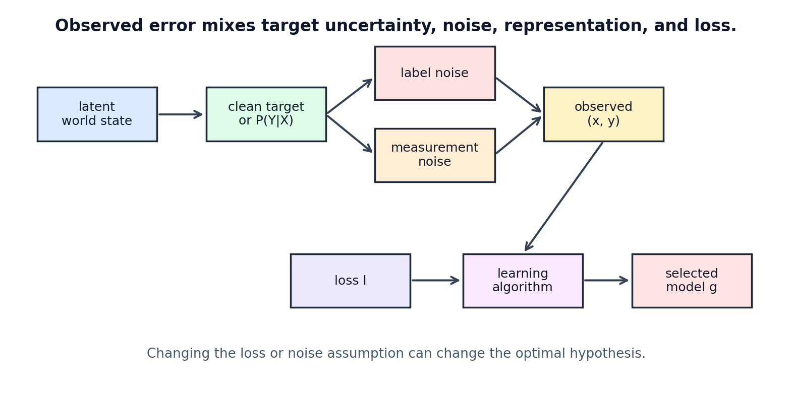

# Error, Noise, and the Target Distribution

[← Back to Learning From Data Theory Notebook](../README.md)

本章主要对应 Caltech `Learning From Data` Lecture 4, `Error and Noise`。Lecture 4 把 learning problem 从“找一个像 target 的 hypothesis”推进到更严谨的问题定义：什么叫 error？target 是否 deterministic？noise 来自哪里？同一个 observed dataset 在不同 loss、target definition 与 noise model 下，可能导向不同的 learned hypothesis。



图 1：observed label 可能由 latent target、conditional uncertainty、measurement process 与 label noise 共同产生。loss 决定 learner 试图逼近 conditional distribution 的哪个 aspect。

## 0. Source Separation

- **Caltech Core**：error measure 是 learning problem 的一部分；classification/regression error；noisy targets；target distribution。
- **Stanford / Theory Extension**：loss、risk、Bayes predictor 与 population objective 的 statistical-learning interpretation。
- **Modern Perspective**：probabilistic target、loss-likelihood connection、calibration、abstention 与 distribution shift。
- **Research Reflection**：同一 observed dataset 在不同 target definitions、noise mechanisms 与 losses 下可以导向不同 model。

## 1. Why an error measure is part of the problem definition

### Caltech Core

在 Lecture 1-3 中，我们已经有 target、examples、hypothesis set 与 learning algorithm。但还缺一个关键对象：error measure。没有 error measure，就无法定义什么 hypothesis 更好。

error measure 不是 implementation detail。它回答：

```text
When prediction differs from target, how bad is that difference?
```

不同回答会改变 optimization objective，也会改变 final hypothesis。

### Formal Setup

loss function 定义单个 prediction 的代价：

```math
\ell:\mathcal{Y}\times\mathcal{Y}\to\mathbb{R}_{\ge 0}
```

通常写作：

```math
\ell(h(x),y)
```

empirical error 是：

```math
E_{\mathrm{in}}(h)
=
\frac{1}{N}
\sum_{i=1}^{N}
\ell(h(x_i),y_i)
```

population risk 或 out-of-sample error 是：

```math
E_{\mathrm{out}}(h)
=
\mathbb{E}_{(X,Y)\sim P}
\left[
\ell(h(X),Y)
\right]
```

learning algorithm 常近似执行 empirical risk minimization：

```math
g
\in
\arg\min_{h\in\mathcal{H}}
E_{\mathrm{in}}(h)
```

但真正希望的是 low $E_{\mathrm{out}}(g)$。

### Consequence

改变 $\ell$ 会改变“最优”的含义。一个模型可能在 squared loss 下最优，却不是 absolute loss 下最优；一个 classifier 可能 accuracy 高，但在 false negative cost 很高的任务中不可接受。

## 2. Error measures and consequences

### Classification

二分类中最直接的 loss 是 0/1 loss：

```math
\ell_{0/1}(h(x),y)
=
\mathbf{1}\{h(x)\neq y\}
```

它对应 misclassification probability：

```math
E_{\mathrm{out}}(h)
=
\Pr[h(X)\neq Y]
```

但 0/1 loss 对 false positive 与 false negative 一视同仁。现实任务经常不是这样。例如医学 screening 中 false negative 可能比 false positive 更严重；内容审核中不同错误类型的社会成本不同；金融风控中拒绝好用户与放过坏用户代价不同。

可以定义 asymmetric cost：

```math
\ell(h(x),y)
=
\begin{cases}
0, & h(x)=y,\\
c_{\mathrm{FP}}, & h(x)=1,y=0,\\
c_{\mathrm{FN}}, & h(x)=0,y=1.
\end{cases}
```

当 $c_{\mathrm{FN}}>c_{\mathrm{FP}}$ 时，optimal decision threshold 通常不再是 $0.5$。这说明 threshold 是 decision rule 的一部分，而不只是 post-processing。

### Regression

常见 regression losses 包括 squared loss：

```math
\ell(\hat{y},y)
=
(\hat{y}-y)^2
```

absolute loss：

```math
\ell(\hat{y},y)
=
|\hat{y}-y|
```

Huber-style loss 在小误差时像 squared loss，在大误差时像 absolute loss。不同 loss 对 outliers 的敏感度不同，也对应不同 target functional：

- squared loss 的 population minimizer 是 conditional mean；
- absolute loss 的 population minimizer 是 conditional median；
- quantile loss 的 minimizer 是 conditional quantile。

### Formal Derivation: Squared Loss Target

给定 $X=x$，寻找常数 prediction $a$ 最小化 conditional squared risk：

```math
R_x(a)
=
\mathbb{E}
\left[
(Y-a)^2
\mid X=x
\right]
```

展开：

```math
R_x(a)
=
\mathbb{E}[Y^2\mid X=x]
-2a\mathbb{E}[Y\mid X=x]
+a^2
```

对 $a$ 求导并令零：

```math
\frac{dR_x(a)}{da}
=
-2\mathbb{E}[Y\mid X=x]+2a
=0
```

得到：

```math
a^*(x)
=
\mathbb{E}[Y\mid X=x]
```

因此 squared loss 下，best possible predictor 是 conditional mean，而不是 necessarily noise-free label。

## 3. Noisy targets

### Deterministic Target

deterministic target 假设：

```math
Y=f(X)
```

给定 $X=x$，输出完全确定。若 learner 有足够 representation、data 与 computation，可以希望逼近 $f$。

### Stochastic Target

stochastic target 假设给定 $X=x$，$Y$ 仍然随机：

```math
Y\mid X=x \sim P(\cdot\mid x)
```

这种 setting 中，不存在一个 deterministic function 能对所有 examples 永远正确。最优 predictor 取决于 loss。

### Observation Noise

observation noise 指 input measurement 本身带噪：

```math
\tilde{X}=X+\eta
```

learner 看到的是 $\tilde{X}$，不是 latent clean $X$。如果 noise 改变了 feature distribution，model 可能学到 measurement artifact。

### Label Noise

label noise 指 observed label 不是 true latent label：

```math
\tilde{Y}=Y \text{ with possible corruption}
```

例如标注者错误、规则不一致、数据录入错误、弱监督 signal 偏差。label noise 会让 training loss 的最小化与 true target 的最小化产生偏离。

### Irreducible Uncertainty

irreducible uncertainty 是即使知道所有 observable features 后仍无法消除的不确定性。例如同样症状可能对应不同疾病，同样用户行为可能有不同未来选择。它不是模型失败，而是 task 本身的 conditional randomness。

## 4. Probabilistic target interpretation

### From Function to Conditional Distribution

在 noisy setting 中，把 target 理解为 deterministic $f$ 可能过窄。更一般地，target 是 conditional distribution：

```math
P(Y\mid X=x)
```

learning 不一定要恢复整个 distribution；它可能只需要恢复与 loss 有关的 functional。例如：

- 0/1 classification 关心最可能类别；
- squared regression 关心 conditional mean；
- probabilistic forecasting 关心 full predictive distribution；
- calibration 关心 predicted confidence 与 empirical frequency 的一致性。

### Bayes Classifier

在 binary classification with 0/1 loss 中，设：

```math
\eta(x)=\Pr(Y=1\mid X=x)
```

预测 1 的 conditional risk 是：

```math
R_x(1)=\Pr(Y=0\mid X=x)=1-\eta(x)
```

预测 0 的 conditional risk 是：

```math
R_x(0)=\Pr(Y=1\mid X=x)=\eta(x)
```

因此 optimal decision 是：

```math
h^*(x)
=
\begin{cases}
1, & \eta(x)\ge 1/2,\\
0, & \eta(x)<1/2.
\end{cases}
```

这说明 classification target 可以从 conditional probability 中导出，而不必假设 deterministic true label。

### Connection to Logistic Regression

[Week 2 logistic regression](../../../reports/week2_linear_logistic_regression.md) 中：

```math
p_\theta(x)
=
\mathrm{sigmoid}(w^\top x+b)
```

可以解释为估计：

```math
\Pr(Y=1\mid X=x)
```

binary cross entropy 训练鼓励 predicted probability 接近 observed label distribution。这个 probabilistic view 为 later calibration notes 提供基础：模型输出 probability-like value，并不自动意味着它 calibrated。

## 5. Loss, likelihood, and probabilistic modeling

### Likelihood Connection

某些 losses 可以从 negative log-likelihood 推导。例如 Bernoulli model：

```math
Y\mid X=x
\sim
\mathrm{Bernoulli}(p_\theta(x))
```

单样本 likelihood：

```math
p_\theta(x)^y
(1-p_\theta(x))^{1-y}
```

negative log-likelihood 是：

```math
-y\log p_\theta(x)
-(1-y)\log(1-p_\theta(x))
```

这就是 binary cross entropy。

Gaussian regression model：

```math
Y\mid X=x
\sim
\mathcal{N}(h_\theta(x),\sigma^2)
```

negative log-likelihood 去掉与 $\theta$ 无关的常数后正比于：

```math
(Y-h_\theta(x))^2
```

因此 squared loss 可由 homoscedastic Gaussian noise assumption 支持。

### Important Limitation

不能反过来说每个 loss 都必须来自 likelihood。很多 losses 是 decision-theoretic、robustness-driven、ranking-driven、margin-based 或 operational cost-driven。即使一个 loss 有 likelihood interpretation，也不代表该 probabilistic assumption 在真实数据中正确。

### Research Consequence

loss choice 同时包含：

- statistical assumption；
- optimization convenience；
- decision cost；
- robustness preference；
- evaluation alignment。

如果论文只报告“we minimize loss X”而不解释 why this loss matches the research question，就缺少 problem-definition 层面的论证。

## 6. Different definitions lead to different learned models

### Same Dataset, Different Targets

同一 observed dataset 可以支持不同 problem definitions：

- predict expected outcome；
- predict probability of event；
- minimize high-cost false negatives；
- rank candidates；
- abstain when uncertainty is high；
- estimate calibrated confidence；
- detect distribution shift。

这些目标可能共享 data，却不共享 optimal hypothesis。

### Four Objects That Must Not Be Collapsed

| Object | 它回答的问题 | 改变它会发生什么 |
| ------ | ------------ | ---------------- |
| target definition | learner 应该追踪什么：class label、conditional mean、conditional probability、ranking、decision utility | “正确答案”的含义改变，同一 observed dataset 可支持不同 tasks |
| data-generating distribution $P$ | training/evaluation/deployment examples 从哪里来 | $E_{\mathrm{out}}$ 的对象改变；iid test claim 不能自动转移到 shifted environment |
| noise mechanism | observed $X$ 或 $Y$ 如何偏离 latent state / latent target | achievable risk、calibration、robustness 与 overfitting noise 的解释改变 |
| loss $\ell$ | prediction 偏离 observed target 时如何计价 | optimal predictor 与 optimization pressure 改变，例如 mean、median、mode、quantile 或 asymmetric decision |

这四个对象相互作用，但概念上不能合并。尤其不能把 observed label 直接等同于 target function，也不能把 chosen loss 直接等同于真实世界 utility；它们都需要独立说明 assumptions 和 evidence。

### Observation Mechanisms

如果 data collection mechanism 改变，target interpretation 也可能改变。例如 benchmark digits dataset 与 local canvas samples 不只是“同一任务的更多数据”；它们来自不同 drawing interface、preprocessing pipeline 与 user behavior。对应的 $P(X,Y)$ 不完全相同。

### Noise Mechanisms

label noise、ambiguous classes、measurement artifacts 会改变 achievable risk。若 irreducible error 存在，把 training loss 压到零可能意味着 overfitting noise，而不是学到 better target。

### Loss Functions

不同 loss 对错误的权重不同。MSE 会放大大 residual；cross entropy 会强烈惩罚 confident wrong probabilities；0/1 loss 忽略 confidence；ECE-like calibration metrics 关心 predicted confidence 与 empirical correctness 的关系，而不是直接优化 accuracy。

## 7. Reliability and distribution-shift research implications

### Calibration

[Week 5 calibration notes](../../../reports/week5/02_calibration_metrics_and_reliability_diagrams.md) 研究的不是单纯 classification accuracy，而是 probability estimates 是否可靠。一个模型可以 accuracy 高但 confidence 不 calibrated；也可以 average loss 改善但 reliability bins 仍有 systematic error。

### Abstention

[Week 5 abstention notes](../../../reports/week5/03_confidence_thresholding_and_abstention_policy.md) 把 decision rule 改成允许 reject 或 abstain。这等于改变 operational loss：错误预测与拒绝回答有不同成本。因此 selective prediction 不是普通 accuracy 的附属指标，而是新的 decision problem。

### Distribution Shift

[Week 4 shift diagnostics](../../../reports/week4/07_shift_and_confidence_diagnostics.md) 与 real canvas validation 显示：即使 label space 相同，$P(X,Y)$ 改变也会改变 $E_{\mathrm{out}}$。如果 evaluation distribution 未说明，out-of-sample error 这个概念本身是不完整的。

## 8. Research reflection

### Questions to Ask

对于任何 ML research problem，要明确：

- label 是 deterministic truth、noisy measurement，还是 human convention；
- input representation 是否保留 target-relevant information；
- loss 是否匹配实际 cost；
- likelihood interpretation 是否只是 mathematical convenience；
- evaluation metric 是否与 training loss 一致，若不一致为什么合理；
- deployment distribution 是否与 training/test distribution 一致；
- irreducible uncertainty 是否被误解释为 model weakness。

### Failure Mode

最危险的做法是把 observed label 当成绝对 target，把 cross entropy 当成唯一合理 loss，把 benchmark accuracy 当成真实 deployment utility。Lecture 4 提醒我们：error measure、noise model 与 target definition 是学习问题的一部分，而不是训练结束后才解释的附属项。

## 9. Conceptual conclusion

T1 到这里形成完整基础：

```text
Learning problem
→ finite-sample feasibility
→ hypothesis space and representation
→ error measure, noise, and target distribution
```

如果没有 loss，就没有“好 hypothesis”的定义；如果没有 noise model，就无法解释 irreducible error；如果没有 distribution，就无法定义 out-of-sample error；如果没有 representation analysis，就无法判断 failure 来自 world、data、model 还是 algorithm。

[← Back to Learning From Data Theory Notebook](../README.md)
