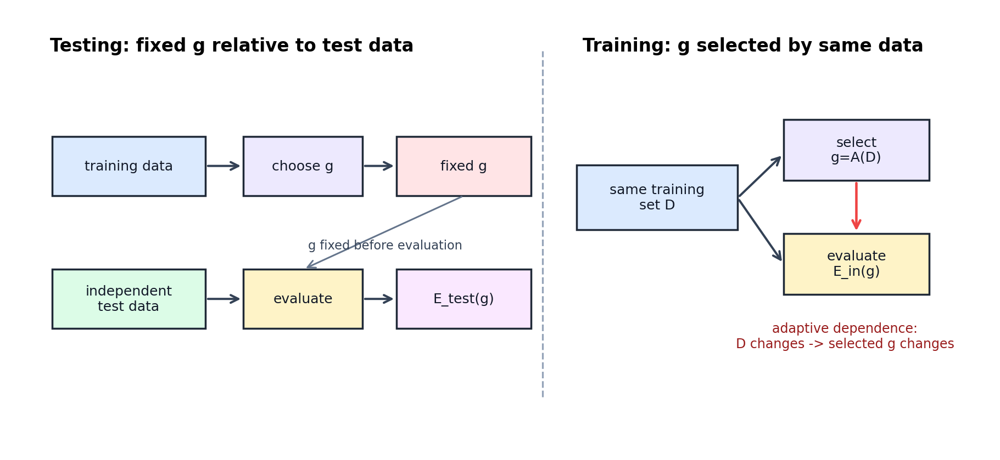

# Training versus Testing: Fixed Evaluation, Adaptive Selection, and Model Selection



图 1：testing 与 training 的关键差异不是有没有 sample error，而是 hypothesis 是否已经相对于 evaluation sample 固定。独立 test set 评估的是已选定的 $g$；training error 评估的 $g=A(D)$ 正是由同一份 $D$ 选择出来的。

[← Back to Learning From Data Theory Notebook](../README.md)

## Source Separation

### Caltech Core

对应 Learning From Data Lecture 5, `Training versus Testing`。主线问题是：为什么 test error 可以直接作为 fixed hypothesis 的估计，而 training error 不能被同样解释。

### Formal Derivation

本 note 形式化 fixed-hypothesis test concentration 与 finite-class union bound，并显式推导 $\log M$ sample-complexity term 的来源。

### Stanford / Theory Extension

使用 empirical risk minimization、uniform convergence 与 data-dependent selection 的术语，解释为什么 generalization theory 需要 simultaneous control。

### Modern Perspective

validation reuse、leaderboard overfitting、hyperparameter search 与 researcher degrees of freedom 是同一依赖结构的现代形式。

### Research Lens

任何论文中的 reported test performance 都必须先问：which data influenced the selected hypothesis?

### What This Does NOT Imply

Lecture 5 的 testing logic 不自动证明 robustness、calibration、causal mechanism 或 repeated-benchmark validity；这些 non-implications 在各 theorem 与第 7 节中单独列出。

## 1. Why Training and Testing Are Fundamentally Different

Caltech Lecture 5 的核心区分可以写成两条 information-flow：

```text
testing:
training data -> choose g
independent test data -> evaluate already-chosen g

training:
same data -> choose g -> evaluate g on that same data
```

在 testing 中，假设 $g$ 已经由 training process 决定。只要 test set 独立于这个选择过程，并且来自同一个 data-generating distribution，test error 是一个 fixed hypothesis 的 sample average。

在 training 中，最终 hypothesis 是：

```math
g = A(D)
```

这里 $A$ 是 learning algorithm，$D$ 是 training dataset。只要 $D$ 改变，$g$ 就可能改变；而 $E_{\mathrm{in}}(g)$ 又在同一个 $D$ 上计算。因此 training error 不是 fixed $h$ 的 unbiased-looking independent estimate，而是 selection rule 已经适配过的数据表现。

### Caltech Core

Lecture 5 的直觉是：testing is estimation; training is search plus estimation。testing 的难点主要是 sample size；training 的难点还包括选择过程如何利用了 sample 中的偶然性。

### What This Does NOT Imply

这并不意味着 test error 永远可靠。test set 一旦被反复用于 model selection、threshold tuning、prompt selection 或论文迭代，它也会进入 adaptive selection loop，独立性会被削弱。

## 2. Fixed-Hypothesis Testing

### Problem

给定一个已经固定的 hypothesis $h$，我们想用 independent test set 估计它的 population risk。

### Definitions

令 test examples：

```math
T =
\{(X_i,Y_i)\}_{i=1}^{N_{\mathrm{test}}}
```

独立同分布采样自 $P$。给定 bounded loss：

```math
0 \le \ell(h(X_i),Y_i) \le 1
```

定义 population risk：

```math
E_{\mathrm{out}}(h)
=
\mathbb{E}_{(X,Y)\sim P}
\left[
\ell(h(X),Y)
\right]
```

定义 empirical test error：

```math
E_{\mathrm{test}}(h)
=
\frac{1}{N_{\mathrm{test}}}
\sum_{i=1}^{N_{\mathrm{test}}}
\ell(h(X_i),Y_i)
```

### Theorem: Fixed-Hypothesis Test Concentration

#### Assumptions

- $h$ 在看到 test set 前已经固定；
- test examples 独立同分布采样自同一个 $P$；
- loss bounded in $[0,1]$；
- test examples 与选择 $h$ 的过程独立；
- deviation tolerance $\epsilon>0$；
- confidence parameter $\delta\in(0,1)$。

#### Claim

对 fixed $h$：

```math
\mathbb{P}
\left(
\left|
E_{\mathrm{test}}(h)-E_{\mathrm{out}}(h)
\right|
>
\epsilon
\right)
\le
2\exp(-2N_{\mathrm{test}}\epsilon^2)
```

等价地，若：

```math
N_{\mathrm{test}}
\ge
\frac{1}{2\epsilon^2}
\log\frac{2}{\delta}
```

则以至少 $1-\delta$ 的概率：

```math
\left|
E_{\mathrm{test}}(h)-E_{\mathrm{out}}(h)
\right|
\le
\epsilon
```

#### Derivation / Proof Idea

对每个 test example 定义 random variable：

```math
Z_i =
\ell(h(X_i),Y_i)
```

因为 $h$ 已固定，而 $(X_i,Y_i)$ i.i.d.，所以 $Z_1,\ldots,Z_{N_{\mathrm{test}}}$ 也是 independent bounded random variables，且：

```math
\mathbb{E}[Z_i]
=
E_{\mathrm{out}}(h)
```

empirical test error 是 sample mean：

```math
E_{\mathrm{test}}(h)
=
\frac{1}{N_{\mathrm{test}}}
\sum_{i=1}^{N_{\mathrm{test}}}Z_i
```

Hoeffding-style concentration 说明 bounded independent observations 的 sample mean 很少远离 expectation。把 sample mean 和 expectation 分别替换为 $E_{\mathrm{test}}(h)$ 与 $E_{\mathrm{out}}(h)$，就得到上面的 high-probability deviation bound。

#### Interpretation

test set 的作用不是“证明模型正确”，而是在固定 hypothesis、固定 distribution、固定 loss 的条件下，用 finite sample 估计 population risk。样本越多，允许的 deviation 越小；要求的 confidence 越高，需要的样本越多。

#### What This Does NOT Imply

- 不保证 train distribution 与 deployment distribution 相同；
- 不保证 model 学到了 correct mechanism；
- 不保证 probability outputs calibrated；
- 不保证如果 test set 被反复查看仍然独立；
- 不保证 $E_{\mathrm{test}}$ 与 $E_{\mathrm{out}}$ 完全相等，只给出概率控制。

#### Research Use

读论文时，fixed-test logic 只支持这样的 claim：在 test protocol 与 sampling assumptions 成立时，reported metric 是该 selected model 在目标 distribution 上的风险估计。它不自动支持 robustness、causal mechanism、fairness、calibration 或 deployment safety。

## 3. Training Selection Breaks the Fixed-Hypothesis Argument

对 training set：

```math
D =
\{(X_i,Y_i)\}_{i=1}^{N}
```

learning algorithm 输出：

```math
g_D = A(D)
```

training error 是：

```math
E_{\mathrm{in}}(g_D)
=
\frac{1}{N}
\sum_{i=1}^{N}
\ell(g_D(X_i),Y_i)
```

这里每一项不仅依赖 $(X_i,Y_i)$，还依赖整个 dataset 通过 $g_D$ 产生的反馈：

```text
D changes
→ selected g_D changes
→ E_in(g_D) changes
```

如果我们把 $g_D$ 当成 fixed $h$，直接套 fixed-hypothesis theorem，就忽略了 $g_D$ 是为了在同一份数据上表现好而被选择出来的。这正是 T1 Lecture 2 中 coin-bin analogy 的断点：一个固定 coin 的 frequency 可以集中；但如果先观察许多 coins，再挑出最极端的 coin，selected coin 的 frequency 会带有 selection bias。

### Formal Dependence

fixed theorem 需要 $h$ 与 evaluation sample 独立。training 中：

```math
g_D = A(D)
```

所以事件：

```math
\left|
E_{\mathrm{in}}(g_D)-E_{\mathrm{out}}(g_D)
\right|
>
\epsilon
```

不是某个预先 fixed $h$ 的 deviation event，而是 union over possible choices produced by $A$ 的 data-dependent event。为了控制它，我们需要同时控制 $\mathcal{H}$ 中许多 hypotheses。

## 4. Finite Hypothesis Set and Union Bound

### Setup

设 finite hypothesis set：

```math
\mathcal{H}
=
\{h_1,\ldots,h_M\}
```

对每个 $h_j$ 定义 bad event：

```math
B_j
=
\left\{
\left|
E_{\mathrm{in}}(h_j)-E_{\mathrm{out}}(h_j)
\right|
>
\epsilon
\right\}
```

“存在某个 hypothesis generalization gap 太大”的事件是：

```math
B
=
\bigcup_{j=1}^{M}B_j
```

### Theorem: Finite-Class Simultaneous Generalization Bound

#### Assumptions

- $D$ 由 $N$ 个 i.i.d. examples 构成；
- train 和 future evaluation 来自同一 distribution $P$；
- loss bounded in $[0,1]$；
- $\mathcal{H}$ 是包含 $M$ 个 hypotheses 的 finite class；
- learning algorithm $A$ 可以任意使用 $D$ 在 $\mathcal{H}$ 中选择 $g$；
- $\epsilon>0$，$\delta\in(0,1)$。

#### Claim

对所有 $h\in\mathcal{H}$ 同时成立的 high-probability statement：

```math
\mathbb{P}
\left(
\exists h\in\mathcal{H}:
\left|
E_{\mathrm{in}}(h)-E_{\mathrm{out}}(h)
\right|
>
\epsilon
\right)
\le
2M\exp(-2N\epsilon^2)
```

因此若：

```math
N
\ge
\frac{1}{2\epsilon^2}
\log\frac{2M}{\delta}
```

则以至少 $1-\delta$ 的概率，所有 $h\in\mathcal{H}$ 都满足：

```math
\left|
E_{\mathrm{in}}(h)-E_{\mathrm{out}}(h)
\right|
\le
\epsilon
```

特别地，data-selected $g=A(D)$ 也满足该 bound，因为 $g\in\mathcal{H}$。

#### Derivation / Proof Idea

对每个 fixed $h_j$，Hoeffding 给出：

```math
\mathbb{P}(B_j)
\le
2\exp(-2N\epsilon^2)
```

我们真正关心的是 any bad hypothesis 是否存在：

```text
bad event for any h
⊆ union of bad events
```

使用 union bound：

```math
\mathbb{P}(B)
=
\mathbb{P}
\left(
\bigcup_{j=1}^{M}B_j
\right)
\le
\sum_{j=1}^{M}\mathbb{P}(B_j)
\le
2M\exp(-2N\epsilon^2)
```

为了让右侧不超过 $\delta$，要求：

```math
2M\exp(-2N\epsilon^2)
\le
\delta
```

取 log：

```math
\log(2M)-2N\epsilon^2
\le
\log\delta
```

整理得到：

```math
N
\ge
\frac{1}{2\epsilon^2}
\log\frac{2M}{\delta}
```

这里的 $\log M$ 来自“同时控制 $M$ 个可能选择”的代价。

#### Interpretation

finite-class bound 的关键不是 hypothesis 一定由哪个 algorithm 选出，而是整个 $\mathcal{H}$ 被同时控制了。只要 uniform event 成立，任何基于 $D$ 选择出来的 $g$ 都不会因为同一份 data reuse 而逃出 bound。

#### What This Does NOT Imply

- $M$ 小不等于 population risk 小；若 $\mathcal{H}$ 不能表达 target，approximation error 仍然大；
- bound 控制 generalization gap，不直接控制 optimization error；
- 如果 data 不是 i.i.d. 或 train/deployment distributions 不一致，claim 改变；
- 如果 validation/test set 被反复用于选择，不能继续当作 independent sample；
- bound 可能 numerically vacuous，即形式正确但数值太松。

#### Research Use

finite-class result 给 research methodology 一个基本原则：每一次 model selection 都有 multiplicity cost。报告最好的一个 model 时，需要说明 selection space、validation discipline、test isolation 和 hyperparameter search 的范围，否则低 validation/test error 可能只是 adaptive search 的结果。

## 5. Testing versus Training Information Flow

图 1 把 Lecture 5 的 core distinction 可视化：

- **Testing**：training data 影响 $g$，但 independent test data 只测量 fixed $g$；
- **Training**：同一份 data 同时影响 $g$ 的选择与 $E_{\mathrm{in}}(g)$ 的计算；
- **Model selection**：validation set 若被用于反复调参，它也从 evaluation sample 变成 selection sample。

这解释了为什么 “training accuracy high” 与 “test accuracy high” 的理论含义不同。前者说明 search 成功找到 fit observed data 的 hypothesis；后者在独立性成立时才支持 out-of-sample risk estimate。

## 6. Data Reuse and Research Methodology

现代 ML research 中，training/testing 的依赖结构经常以更隐蔽的形式出现：

- validation reuse：多次看 validation performance 并调 hyperparameters；
- repeated benchmark tuning：研究方向在同一个 public benchmark 上迭代；
- leaderboard overfitting：public score 影响 model selection；
- prompt search：prompt 或 instruction 被根据 benchmark feedback 反复修改；
- researcher degrees of freedom：preprocessing、filtering、early stopping、seed selection、metric choice 都可能隐式参与选择。

这些现象不等于 classical union bound 可以直接解决所有 adaptive-data-analysis 问题。union bound 给出的是 conceptual lineage：一旦 evaluation data 参与 selection，fixed-hypothesis reasoning 就不再充分，需要额外的 control mechanism 或真正 held-out evidence。

### Cross-links to Existing Experiments

- Week 3 的 [Empirical Risk and Overfitting](../../../reports/week3/02_gradient_risk_and_sampling.md) 展示了低 empirical risk 不等于低 expected risk。
- Week 4 的 [Canvas Dataset Protocol](../../../reports/week4/13_canvas_dataset_protocol_and_next_stage_experiment_design.md) 明确区分 Canvas-Train/Val/Test，正是为了防止 diagnostic samples 被误当作 final evidence。
- Week 5 的 [Evaluation Artifact Audit](../../../reports/week5/04_evaluation_artifact_audit_and_link_consistency.md) 说明 evaluation artifacts 与 report links 需要可追踪，否则 evidence chain 会变模糊。

## 7. What This Does NOT Imply

Training/testing 区分本身不能推出：

- test set 永远可信；反复查看和选择会污染 test independence；
- independent test performance 自动代表 deployment robustness；
- small train-test gap 表示模型学到了 correct mechanism；
- validation performance 可以无限次复用而不付出 selection cost；
- classical finite-class bound 能完整解释 modern overparameterized deep learning；
- 更大的 test set 可以弥补 train-test distribution mismatch。

## 8. Research Lens

当论文声称 “our model generalizes better” 时，先把 evidence path 写成：

```text
data used for gradient updates
→ data used for hyperparameter/model/prompt selection
→ data used for final reporting
→ target population being claimed
```

如果最后一项没有被前面的 selection process 污染，并且 sampling/distribution/loss assumptions 清楚，那么 reported evaluation 才接近 fixed-hypothesis testing。否则，claim 应被降级为 exploratory evidence 或 benchmark-conditioned observation。
