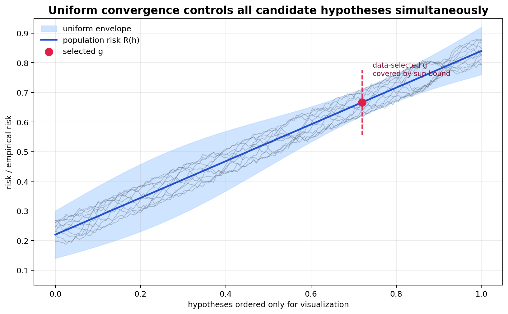
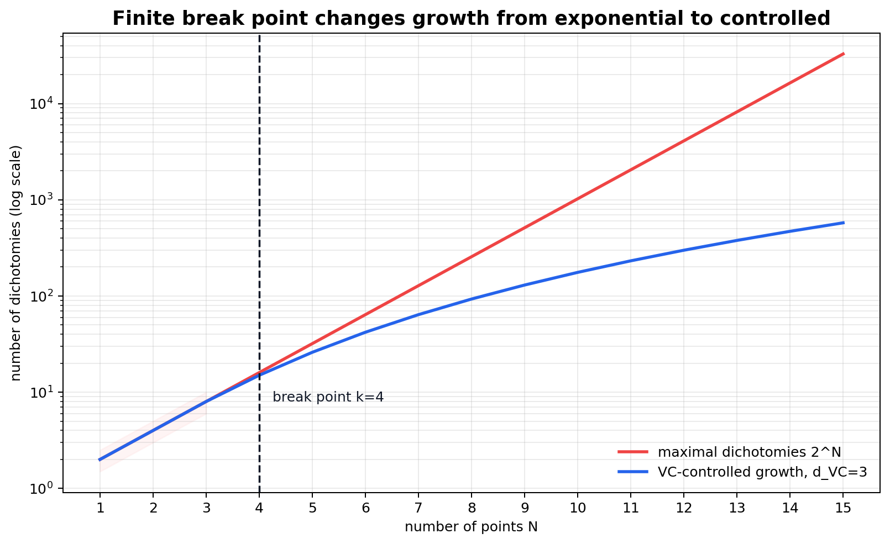

# Theory of Generalization: Growth Function, Break Point, and Uniform Control



图 1：uniform convergence 不是只看某一个 $h$ 的 empirical/population 差异，而是试图控制整个 $\mathcal{H}$ 上的最大偏差。只要 envelope 足够窄，data-dependent selected hypothesis 也被覆盖。



图 2：growth function 在没有 break point 前可能达到 $2^N$；一旦存在 finite break point，最大 dichotomy 数量会被 polynomial-style growth 控制。这是无限 hypothesis set 可以被有限样本分析的关键。

[← Back to Learning From Data Theory Notebook](../README.md)

## Source Separation

### Caltech Core

对应 Learning From Data Lecture 6, `Theory of Generalization`。主线是从 finite hypothesis counting 进入 dichotomy、growth function、break point 与 VC-style generalization。

### Formal Derivation

本 note 展开 growth function、break point、Sauer-type growth control、VC-style uniform bound，并给出 uniform convergence 推出 ERM `2 epsilon` near-optimality 的推导。

### Stanford / Theory Extension

用 empirical process / uniform convergence 的语言解释 why simultaneous control solves data-dependent selection。

### Modern Perspective

classical uniform convergence 是 foundational，但对 overparameterized deep learning 的解释能力有限。

### Research Lens

任何 generalization claim 都必须说明它控制的是 pointwise error 还是 uniformly over a selection class。

### What This Does NOT Imply

Lecture 6 的 growth-function 和 uniform-convergence framework 不自动处理 arbitrary distribution shift、optimization failure、representation insufficiency、calibration 或所有 modern deep-learning generalization。

## 1. Why Counting Hypotheses Is Insufficient

Lecture 5 的 finite-class bound 需要 $|\mathcal{H}|=M$。如果：

```math
|\mathcal{H}|=\infty
```

直接把 $M$ 放进 union bound 会得到无意义结果。但 infinite cardinality 本身不是 effective complexity 的正确尺度。

例如 real-valued thresholds：

```math
h_a(x)=\mathbf{1}\{x\ge a\},
\quad
a\in\mathbb{R}
```

有无限多个 hypotheses，因为 $a$ 连续取值。但在一个有限 sample 上，不同 thresholds 只能产生有限多个 label patterns。learning theory 关心的不是 global syntactic count，而是 $\mathcal{H}$ 在 observed points 上能表现出多少 distinct behaviors。

### What This Does NOT Imply

不能因为 $\mathcal{H}$ infinite 就断定不可学习；也不能因为参数个数有限就断定 generalization 好。需要分析 hypothesis class 在 finite sample 上的 effective shattering behavior。

## 2. Dichotomies

给定 $N$ 个 input points：

```math
x_1,\ldots,x_N
```

对 binary classification，hypothesis $h$ 在这些点上诱导一个 labeling pattern：

```math
\left(
h(x_1),\ldots,h(x_N)
\right)
\in
\{-1,+1\}^{N}
```

这个 pattern 称为一个 dichotomy。一个 hypothesis class $\mathcal{H}$ 在这组 points 上能实现的 dichotomies 集合是：

```math
\Pi_{\mathcal{H}}(x_1,\ldots,x_N)
=
\left\{
(h(x_1),\ldots,h(x_N)) : h\in\mathcal{H}
\right\}
```

重要问题从：

```text
How many hypotheses exist globally?
```

变成：

```text
How many distinct labelings can H induce on N observed points?
```

如果很多 hypotheses 在 sample 上给出同一个 dichotomy，那么从 empirical error 的角度它们暂时不可区分。generalization analysis 可以先控制 dichotomies，而不是控制无限多个 algebraically different functions。

## 3. Growth Function

### Definition

growth function 定义为：

```math
m_{\mathcal{H}}(N)
=
\max_{x_1,\ldots,x_N\in\mathcal{X}}
\left|
\Pi_{\mathcal{H}}(x_1,\ldots,x_N)
\right|
```

它表示 $\mathcal{H}$ 在任意 $N$ 个 points 上最多能实现多少种 dichotomies。

### Distinctions

| Object | Measures | Depends on sample size? | Controls selection? |
| --- | --- | --- | --- |
| $|\mathcal{H}|$ | hypotheses 的 global count | No | finite case useful |
| parameter count | 一个 parameterization 的维度 | No | indirect and model-dependent |
| dichotomy count | 给定 points 上的 label patterns | Yes | directly relevant |
| $m_{\mathcal{H}}(N)$ | worst-case dichotomy count over $N$ points | Yes | capacity proxy for uniform control |

growth function 永远满足：

```math
m_{\mathcal{H}}(N)
\le
2^N
```

因为 $N$ 个 binary labels 一共只有 $2^N$ 种可能。若等号成立，说明某些 $N$ points 可以被 $\mathcal{H}$ shatter。

## 4. Break Point

### Definition

如果存在整数 $k$，使得：

```math
m_{\mathcal{H}}(k)
<
2^k
```

则 $k$ 称为 $\mathcal{H}$ 的 break point。也就是说，从 $k$ 个 points 开始，$\mathcal{H}$ 不可能实现所有 possible dichotomies。

### Intuition

break point 的存在说明 hypothesis class 有结构限制。它不是任意 label pattern 都能 fit。这个限制会把 growth function 从 maximal exponential behavior 拉回可控增长。

### Small Examples

- positive rays on line：$h_a(x)=\mathbf{1}\{x\ge a\}$ 可以 shatter 一个点，但不能 shatter 两个有序点，因为 pattern $(+,-)$ 不可能出现；break point 是 $2$。
- intervals on line：$h_{a,b}(x)=\mathbf{1}\{a\le x\le b\}$ 可以 shatter 两个点，但不能 shatter 三个有序点的 pattern $(+,-,+)$；break point 是 $3$。
- 2D linear separators 可以 shatter 三个 non-collinear points，但不能 shatter 任意四个 points；break point 是 $4$。

### What This Does NOT Imply

break point 是 worst-case combinatorial quantity。它不说明某个具体 dataset 难不难，也不说明 optimizer 能不能找到对应 classifier。

## 5. Sauer-Type Growth Control

### Theorem: Finite Break Point Implies Polynomial Growth

#### Assumptions

- binary classification；
- hypothesis class $\mathcal{H}$ 在 input domain 上定义；
- 存在 break point $k$，即没有任何 $k$ 个 points 可以被 $\mathcal{H}$ shatter；
- $N\ge k$。

#### Claim

growth function 可以被 combinatorial sum 控制：

```math
m_{\mathcal{H}}(N)
\le
\sum_{i=0}^{k-1}
{N \choose i}
```

若 VC dimension $d_{\mathrm{VC}}=k-1$，常写作：

```math
m_{\mathcal{H}}(N)
\le
\sum_{i=0}^{d_{\mathrm{VC}}}
{N \choose i}
```

当 $d_{\mathrm{VC}}$ fixed 且 $N$ 增大时，右侧是 $N$ 的 polynomial order，而不是 $2^N$。

#### Derivation / Proof Idea

核心 proof idea 是对 $N$ points 的 dichotomies 做递归分解。考虑把最后一个 point $x_N$ 拿出来。所有 dichotomies 分成两类：

1. 在前 $N-1$ 个 points 上已经不同的 labelings；
2. 在前 $N-1$ 个 points 上相同、只在 $x_N$ 上不同的 paired labelings。

第一类最多是 $m_{\mathcal{H}}(N-1)$。第二类的数量受一个更强限制：如果太多 such pairs 存在，就会在前 $N-1$ 个 points 的某个 subset 上形成 shattering，从而推出原 class 在 $k$ 个 points 上 shatter，违反 break point。

这给出递归形式的上界。用 combinatorial identity 展开递归，可以得到：

```math
B(N,k)
=
B(N-1,k)+B(N-1,k-1)
```

其中：

```math
B(N,k)
=
\sum_{i=0}^{k-1}{N\choose i}
```

这个递归与 Pascal identity 对齐：

```math
{N\choose i}
=
{N-1\choose i}
+
{N-1\choose i-1}
```

因此 finite break point 导致 growth function 被 binomial sum 控制。直觉上，不能 shatter $k$ points 会限制所有更大 samples 上可出现的 label patterns。

#### Interpretation

这解释了 Caltech Lecture 6 的关键转折：无限 hypothesis set 不需要直接 count hypotheses；只要它在 finite samples 上不能产生太多 dichotomies，就可能有 uniform generalization。

#### What This Does NOT Imply

- polynomial growth 不保证 empirical risk 小；
- growth bound 是 worst-case over point configurations；
- 对 real-valued losses、多分类或 structured outputs，需要不同 complexity tools 或 reductions；
- constants 和 exact forms 依赖 theorem version；
- 该结果本身还不是 risk bound，需要再连接 concentration。

#### Research Use

当论文使用“模型虽然无限/连续参数，但可学习”这类论点时，应追问：它控制的是 global count、sample-induced behaviors、norm/margin class，还是 algorithm-selected subset？Sauer-style reasoning 控制的是 sample-induced dichotomy capacity。

## 6. From Growth Function to Uniform Generalization

Lecture 6 的 conceptual chain 是：

```text
finite sample
→ finitely many effective dichotomies
→ union-style simultaneous control
→ generalization bound
```

对 binary classification 的 0/1 loss，empirical error 只依赖 hypotheses 在 training points 上的 dichotomy。虽然 $\mathcal{H}$ 可能 infinite，但在 $N$ 或 ghost sample 上只出现有限数量的 distinct dichotomies。growth function 替代了 finite-class bound 中的 $M$。

### Theorem: VC-Style Uniform Generalization Bound

#### Assumptions

- binary classification；
- 0/1 loss；
- dataset $D$ 由 $N$ 个 i.i.d. examples 采样自 $P$；
- future/out-of-sample risk 使用同一个 $P$；
- hypothesis class $\mathcal{H}$ 有 growth function $m_{\mathcal{H}}(N)$；
- $\epsilon>0$。

#### Claim

一种 Caltech-style bound 的结构是：

```math
\mathbb{P}
\left(
\sup_{h\in\mathcal{H}}
\left|
E_{\mathrm{in}}(h)-E_{\mathrm{out}}(h)
\right|
>
\epsilon
\right)
\le
4m_{\mathcal{H}}(2N)
\exp
\left(
-\frac{N\epsilon^2}{8}
\right)
```

不同教材或证明路线中的 constants 可能不同；研究上更重要的是结构：

```text
probability of bad uniform deviation
≤ effective capacity term × concentration decay in N
```

#### Derivation / Proof Idea

固定 $h$ 的 Hoeffding 不够，因为 $h$ 会被 data 选择。证明的思路分三步。

第一，引入 ghost sample $D'$，它与 $D$ 独立同分布。若 $E_{\mathrm{in}}(h)$ 与 $E_{\mathrm{out}}(h)$ 差很多，那么在足够多样本下，$E_{\mathrm{in}}(h)$ 与 ghost empirical error $E'_{\mathrm{in}}(h)$ 也很可能差明显。这样 population quantity 被替换成两个 finite samples 的 comparison。

第二，在 $D\cup D'$ 的 $2N$ 个 points 上，$\mathcal{H}$ 只能产生至多 $m_{\mathcal{H}}(2N)$ 种 dichotomies。于是 infinite class 被 finite effective label patterns 替代。

第三，对这些 finite dichotomies 做 union-style concentration。每个 pattern 的 train/ghost discrepancy 可以被 Hoeffding-type argument 控制；再乘上 $m_{\mathcal{H}}(2N)$，得到 simultaneous bound。

#### Interpretation

growth function 让 union bound 从 “over hypotheses” 改成 “over distinguishable behaviors on finite samples”。这就是 infinite hypothesis set 可以被 finite data 学习的 mathematical mechanism。

#### What This Does NOT Imply

- 不保证 arbitrary distribution shift；
- 不保证 optimizer 找到 empirical minimizer；
- 不保证 $\mathcal{H}$ 包含 target；
- 不保证 bound 数值 tight；
- 不解释所有 overparameterized neural networks；
- 不说明 selected model 的 confidence calibrated。

#### Research Use

如果一个 model 是通过 training data 选择的，可信 generalization claim 需要某种 uniform or algorithm-dependent control。fixed-hypothesis test bound 不能单独解释 training success。

## 7. Uniform Convergence and ERM Consequence

uniform convergence 关注：

```math
\sup_{h\in\mathcal{H}}
\left|
E_{\mathrm{in}}(h)
-
E_{\mathrm{out}}(h)
\right|
```

如果这个 supremum 小于 $\epsilon$，则所有 hypotheses 的 empirical error 与 population error 同时接近。这样 data-dependent $g=A(D)$ 不需要单独分析，因为它也是 $\mathcal{H}$ 中的一个元素。

### Theorem: Uniform Convergence Gives ERM Near-Optimality

#### Assumptions

- $\mathcal{H}$ 固定；
- $E_{\mathrm{in}}$ 与 $E_{\mathrm{out}}$ 对所有 $h\in\mathcal{H}$ 同时满足：

```math
\left|
E_{\mathrm{in}}(h)-E_{\mathrm{out}}(h)
\right|
\le
\epsilon
```

- $\hat{h}$ 是 empirical risk minimizer：

```math
\hat{h}
\in
\arg\min_{h\in\mathcal{H}}
E_{\mathrm{in}}(h)
```

- $h^*$ 是 population-best member of $\mathcal{H}$：

```math
h^*
\in
\arg\min_{h\in\mathcal{H}}
E_{\mathrm{out}}(h)
```

#### Claim

在 uniform event 上：

```math
E_{\mathrm{out}}(\hat{h})
\le
E_{\mathrm{out}}(h^*)+2\epsilon
```

#### Derivation / Proof Idea

由 uniform convergence：

```math
E_{\mathrm{out}}(\hat{h})
\le
E_{\mathrm{in}}(\hat{h})+\epsilon
```

由 ERM definition：

```math
E_{\mathrm{in}}(\hat{h})
\le
E_{\mathrm{in}}(h^*)
```

再由 uniform convergence：

```math
E_{\mathrm{in}}(h^*)
\le
E_{\mathrm{out}}(h^*)+\epsilon
```

三行相加得到：

```math
E_{\mathrm{out}}(\hat{h})
\le
E_{\mathrm{out}}(h^*)+2\epsilon
```

#### Interpretation

$2\epsilon$ 结构说明：uniform convergence 不只是让 empirical risk 可估计 population risk，它还让 empirical minimization 成为 population minimization 的近似。

#### What This Does NOT Imply

- $\hat h$ 不一定接近 true target $f$，只接近 $\mathcal{H}$ 内最好的 $h^*$；
- 若 ERM 没被优化到位，还要加 optimization error；
- 若 $\mathcal{H}$ 太小，approximation error 可能主导；
- 若 distribution 改变，$E_{\mathrm{out}}$ 的定义也改变；
- bound 控制的是 risk，不是 interpretability 或 causal correctness。

#### Research Use

读实验论文时，看到 “training objective minimized” 还不够。需要问：是否有理由相信 empirical objective uniformly tracks population objective over the selected class or selected algorithm path?

## 8. Pointwise versus Uniform Statements

| Statement | Quantifier | Can justify data-dependent selection? |
| --- | --- | --- |
| fixed-$h$ concentration | one fixed hypothesis | No |
| finite-class simultaneous bound | all hypotheses in finite $\mathcal{H}$ | Yes |
| uniform convergence | all hypotheses in general $\mathcal{H}$ | Yes, under conditions |

这个表应成为 research-reading tool。很多错误的 generalization argument 都来自把第一行当成第三行使用。

## 9. Generalization Is a Probabilistic Claim

generalization theorem 通常不是：

```text
E_in = E_out
```

它是关于 deviation 的 probability statement。需要区分：

- deterministic equality：很少成立；
- expected bound：对 random sample 或 algorithm randomness 取 expectation；
- high-probability bound：以至少 $1-\delta$ 的概率成立；
- asymptotic convergence：$N\to\infty$ 时收敛；
- finite-sample guarantee：给定 $N,\epsilon,\delta$ 的明确控制。

如果论文没有说明 probability、sampling、loss、distribution 和 selection protocol，就不能把 empirical result 升级成强 generalization theorem。

## 10. What This Does NOT Imply

Lecture 6 的 theory of generalization 不推出：

- finite VC dimension 是所有现代 generalization 的必要条件；
- bound numerically non-vacuous；
- uniform convergence 解释每个 overparameterized deep model；
- training/test distribution mismatch 可以被忽略；
- low generalization gap 等于 low excess risk；
- selected model 的 mechanism 或 representation 一定正确。

## 11. Research Lens

把一个 generalization claim 翻译成理论问题：

```text
Which hypotheses could have been selected?
How many distinct behaviors can they realize on finite samples?
Is there simultaneous control over that selection class?
Does the evaluation distribution match the claimed population?
Does the bound control the quantity the paper reports?
```

这就是 T2 后续 VC dimension、bias-variance 与 research audit note 的共同入口。
