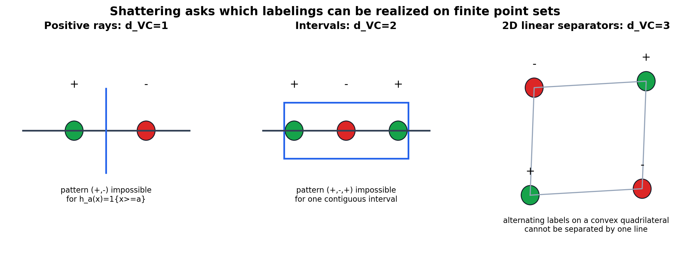
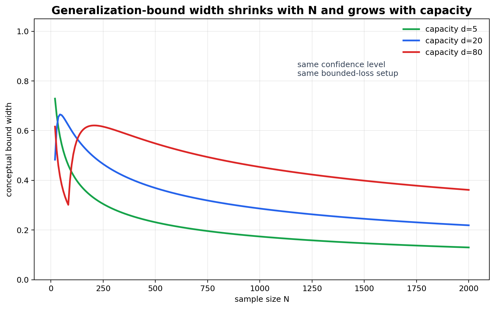

# VC Dimension, Capacity, and Sample Complexity



图 1：VC dimension 通过 shattering 衡量 hypothesis class 可以在有限点集上实现多少 label patterns。图中 positive rays、intervals 与 2D linear separators 展示了“可 shatter 某些点集”和“不能 shatter 更大任意点集”的区别。



图 2：capacity 增大通常会放宽 generalization bound；sample size 增大通常会收紧 bound。这个图表达的是 bound structure，不是实际 test error 的精确曲线。

[← Back to Learning From Data Theory Notebook](../README.md)

## Source Separation

### Caltech Core

对应 Learning From Data Lecture 7, `The VC Dimension`。主线是 shattering、VC dimension、generalization bound 与 sample complexity。

### Formal Derivation

本 note 通过 positive rays、intervals、2D linear separators 推导 VC examples，并从 growth-function bound 解出 VC generalization bound 与 sample-complexity scaling。

### Stanford / Theory Extension

把 VC dimension 放入 capacity control 与 PAC-style learnability 的语境中，区分 worst-case class complexity 与 algorithm-dependent complexity。

### Modern Perspective

用 overparameterized neural networks 的现象说明 VC theory 是 foundational worst-case theory，而不是现代 generalization 的全部解释。

### Research Lens

VC dimension 是评估 “which class could have been selected from?” 的工具，而不是 performance guarantee 的替代品。

### What This Does NOT Imply

VC dimension 不是 parameter count，不是 performance guarantee，也不能单独证明 robustness、optimization success 或 probability calibration。

## 1. What VC Dimension Measures

### Shattering

给定 $N$ 个 input points：

```math
S=\{x_1,\ldots,x_N\}
```

如果对所有 labelings：

```math
(y_1,\ldots,y_N)\in\{-1,+1\}^N
```

都存在某个 $h\in\mathcal{H}$ 使得：

```math
h(x_i)=y_i
\quad
\text{for all } i=1,\ldots,N
```

则称 $\mathcal{H}$ shatters $S$。

### VC Dimension

$\mathcal{H}$ 的 VC dimension 是它能够 shatter 的最大 point set size：

```math
d_{\mathrm{VC}}(\mathcal{H})
=
\max
\left\{
N:
\exists S\subseteq\mathcal{X}, |S|=N,
\mathcal{H}\text{ shatters }S
\right\}
```

如果可以 shatter 任意大的 finite set，则 $d_{\mathrm{VC}}=\infty$。

### What It Is Not

```text
VC dimension != number of hypotheses
VC dimension != parameter count
VC dimension != dataset dimension
```

VC dimension 衡量的是 hypothesis class 对 finite point configurations 的 worst-case labeling capacity。它可以和 parameter count 相关，但不是同一个对象。

### What This Does NOT Imply

高 VC dimension 不直接等于坏 performance；低 VC dimension 也不直接等于好 model。performance 还取决于 approximation error、data distribution、sample size、optimization、regularization、noise 和 evaluation protocol。

## 2. Geometric Examples

### Positive Rays on the Real Line

考虑：

```math
\mathcal{H}
=
\{h_a(x)=\mathbf{1}\{x\ge a\}:a\in\mathbb{R}\}
```

一个点可以被 shatter：选择 threshold 在点左侧得到 positive，选择在点右侧得到 negative。

但两个有序点 $x_1<x_2$ 不能总被 shatter。label pattern：

```math
(+,-)
```

要求 $x_1\ge a$ 且 $x_2<a$，这与 $x_1<x_2$ 矛盾。因此：

```math
d_{\mathrm{VC}}=1
```

### Intervals on the Real Line

考虑：

```math
\mathcal{H}
=
\{h_{a,b}(x)=\mathbf{1}\{a\le x\le b\}:a\le b\}
```

任意两个点可以被 shatter：empty interval、cover left point、cover right point、cover both points 都可以构造。

但三个有序点 $x_1<x_2<x_3$ 不能总被 shatter。pattern：

```math
(+,-,+)
```

要求一个 interval 同时包含 $x_1$ 和 $x_3$，但不包含中间的 $x_2$，这不可能。因此：

```math
d_{\mathrm{VC}}=2
```

### Linear Separators in Two Dimensions

2D perceptrons / linear separators：

```math
h_{w,b}(x)=\mathrm{sign}(w^\top x+b)
```

可以 shatter 三个 non-collinear points。直觉是：三点不共线时，每一种 binary labeling 都可以用一条 line 把 positive 与 negative 分开。

但不能 shatter 任意四个 points。若四点构成凸四边形，alternating labeling：

```math
(+,-,+,-)
```

沿四边形交替出现，任意直线都无法把两个 opposite positive vertices 与两个 opposite negative vertices 分开。因此 2D linear separators 的 VC dimension 是：

```math
d_{\mathrm{VC}}=3
```

更一般地，affine linear separators in $\mathbb{R}^d$ 的 VC dimension 是 $d+1$。

### Feature-Transformed Classes

若先使用 feature map：

```math
x\mapsto \Phi(x)
```

再在 feature space 中使用 linear separator，则 original domain 上的 effective class 是：

```math
\mathcal{H}_{\Phi}
=
\{x\mapsto h(\Phi(x)):h\in\mathcal{H}\}
```

VC dimension 应分析 $\mathcal{H}_{\Phi}$ 在 original inputs 上能 shatter 的点集。不同 $\Phi$ 可能增加、减少或重新组织 effective capacity。

## 3. Parameters versus Degrees of Freedom

classical parametric models 中，VC dimension 常与 parameter count 同阶。例如 $\mathbb{R}^d$ 中 affine linear separators 的 $d_{\mathrm{VC}}=d+1$。这使人容易把 capacity 简化成 “number of parameters”。

这个简化不可靠，原因包括：

- parameterization 可能冗余；
- constraints 会改变 effective class；
- norm bounds 与 margin 会比 raw parameter count 更 relevant；
- feature map 改变 geometry；
- learning algorithm 可能只访问 $\mathcal{H}$ 的一小部分；
- neural networks 的 worst-case VC dimension 与实际 trained solutions 的 generalization behavior 可能差距很大。

因此 parameter count 是 engineering diagnostic，不是理论上的 capacity definition。

## 4. Generalization Bound

### Theorem: VC Generalization Bound Structure

#### Assumptions

- binary classification；
- 0/1 loss；
- i.i.d. sampling；
- train 和 out-of-sample evaluation 来自同一个 $P$；
- hypothesis class $\mathcal{H}$ 的 VC dimension 为 $d_{\mathrm{VC}}<\infty$；
- $\delta\in(0,1)$。

#### Claim

使用 Lecture 6 的 growth-function bound，一种 high-probability structure 是：以至少 $1-\delta$ 的概率，对所有 $h\in\mathcal{H}$：

```math
\left|
E_{\mathrm{in}}(h)-E_{\mathrm{out}}(h)
\right|
\le
\sqrt{
\frac{8}{N}
\log
\frac{4m_{\mathcal{H}}(2N)}{\delta}
}
```

若使用 Sauer bound，当 $N$ 大于 $d_{\mathrm{VC}}$ 时：

```math
m_{\mathcal{H}}(2N)
\le
\left(
\frac{2eN}{d_{\mathrm{VC}}}
\right)^{d_{\mathrm{VC}}}
```

所以 bound 的主要结构是：

```text
generalization gap
≈
sqrt((d_VC log(N/d_VC) + log(1/delta)) / N)
```

常数与 log 细节依赖 theorem version；重要的是 $d_{\mathrm{VC}}$、$N$ 与 $\delta$ 的关系。

#### Derivation / Proof Idea

Lecture 6 给出：

```math
\mathbb{P}
\left(
\sup_{h\in\mathcal{H}}
\left|
E_{\mathrm{in}}(h)-E_{\mathrm{out}}(h)
\right|
>
\epsilon
\right)
\le
4m_{\mathcal{H}}(2N)
\exp
\left(
-\frac{N\epsilon^2}{8}
\right)
```

令右侧不超过 $\delta$：

```math
4m_{\mathcal{H}}(2N)
\exp
\left(
-\frac{N\epsilon^2}{8}
\right)
\le
\delta
```

取 log 并整理：

```math
\epsilon
\ge
\sqrt{
\frac{8}{N}
\log
\frac{4m_{\mathcal{H}}(2N)}{\delta}
}
```

再用 Sauer bound 将 $m_{\mathcal{H}}(2N)$ 替换成由 $d_{\mathrm{VC}}$ 控制的 polynomial term，得到 VC dimension 版本。

#### Interpretation

VC dimension 进入 bound 的方式不是简单除以 $N$，而是通过 growth function 控制 simultaneously possible dichotomies。sample size 增大让 concentration 变强；capacity 增大让同时控制变难；confidence 要求越高，$\delta$ 越小，bound 越宽。

#### What This Does NOT Imply

- small VC dimension 不保证 low $E_{\mathrm{out}}$，因为 approximation error 可能很大；
- large VC dimension 不保证 generalization failure；
- bound 可能 numerically vacuous；
- 不保证 optimizer 找到低 $E_{\mathrm{in}}$；
- 不处理 arbitrary distribution shift；
- 不说明 probability predictions calibrated。

#### Research Use

VC bound 支持这样的思考：reported performance 可信需要 capacity 与 sample size 相称，且 evaluation distribution 明确。它不能替代实验，也不能把 weak representation 变成 good hypothesis class。

## 5. Sample Complexity

sample complexity 问的是：为了达到 tolerance $\epsilon$ 和 confidence $1-\delta$，需要多少 samples？

从结构：

```math
\sqrt{
\frac{d_{\mathrm{VC}}\log(N/d_{\mathrm{VC}})+\log(1/\delta)}{N}
}
\le
\epsilon
```

可读出 qualitative scaling：

```math
N
\text{ grows with }
d_{\mathrm{VC}},
\frac{1}{\epsilon^2},
\log\frac{1}{\delta}
```

在 agnostic/uniform-convergence style analysis 中，经常得到：

```math
N
=
O
\left(
\frac{
d_{\mathrm{VC}}\log(1/\epsilon)+\log(1/\delta)
}{\epsilon^2}
\right)
```

在 realizable classification setup 中，若存在 consistent learner 且 assumptions 更强，某些 PAC bounds 可以呈现不同 scaling，例如 $1/\epsilon$ 而非 $1/\epsilon^2$ 的形式。T2 不把这些 variants 全部展开，关键是分清 assumptions：realizable 与 agnostic 不是同一个问题。

### What This Does NOT Imply

sample complexity bound 不是 dataset collection recipe 的全部。它通常不包含 data quality、measurement bias、label noise structure、class imbalance、distribution shift、compute limit 或 annotation policy。

## 6. Capacity Is Not Performance

更大的 hypothesis class 可以：

- reduce approximation error；
- increase estimation difficulty；
- enable overfitting under finite samples；
- make optimization harder or easier depending on geometry。

更小的 hypothesis class 可以：

- improve statistical control；
- increase approximation/specification error；
- enforce useful inductive bias；
- exclude the target-relevant mechanism。

这直接桥接到 Lecture 8 的 bias-variance：model failure 不是 “too simple or too complex” 一个轴就能解释。capacity、data randomness、algorithm stability、noise 与 representation 都会共同决定 risk。

## 7. Modern Limitation

现代 deep neural networks 往往 parameter count 远大于 sample size，却仍能 generalize。这不说明 VC theory “wrong”。更准确的说法是：

- VC dimension 是 worst-case hypothesis-class capacity；
- actual training algorithm 可能只选择某些 structured solutions；
- data geometry 可能远非 worst-case；
- margin、norm、stability、compression、implicit bias 可能给出更细的 control；
- overparameterized models 的 interpolation、double descent、benign overfitting 需要额外理论。

### Stanford / Theory Extension

Stanford-style theory notes 通常把 VC dimension 放在 uniform convergence family 中，并进一步引入 Rademacher complexity、margin bounds、stability 等工具。它们共同回答的问题是：selection class 或 algorithm path 的 effective complexity 如何随 sample 被控制？

### What This Does NOT Imply

不能从 “deep nets generalize despite high parameter count” 推出 classical learning theory 没价值。它仍然提供了 fixed-vs-selected distinction、uniform control logic、sample complexity language 与 overclaim audit framework。

## 8. Research Use

当论文声称：

```text
our model generalizes
```

至少追问：

- what notion of capacity is controlled?
- is the guarantee worst-case or algorithm-dependent?
- what distribution is covered?
- is the bound informative at the reported sample size?
- what changes if the model is overparameterized?
- is the evidence empirical, high-probability, or asymptotic?
- does the evaluation involve repeated benchmark tuning?

这些问题把 VC dimension 从 textbook definition 变成 research evidence audit tool。
