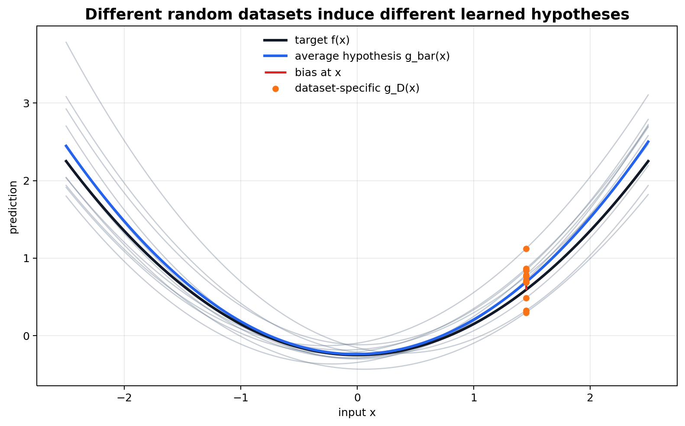
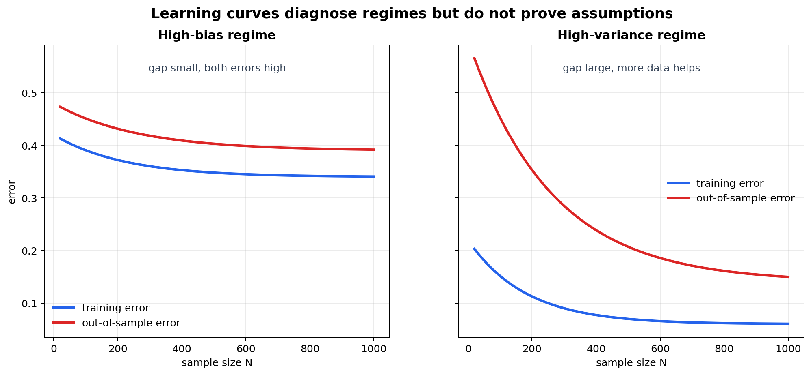
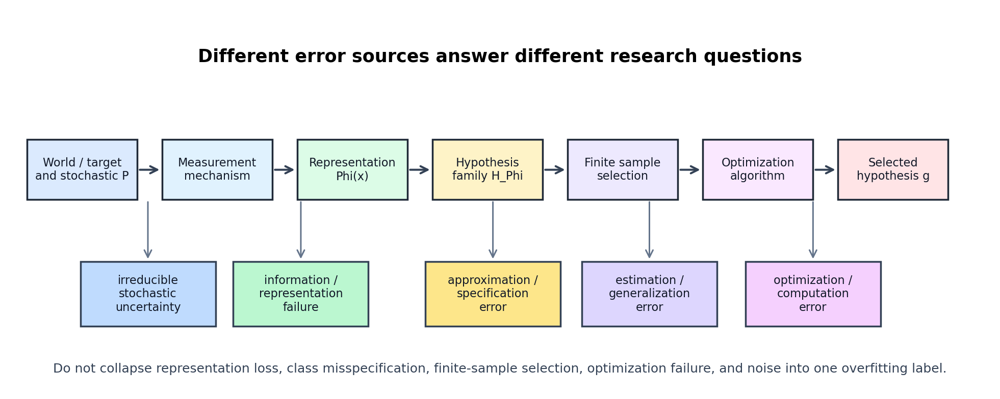

# Bias-Variance, Learning Curves, and Sources of Error



图 1：training dataset 是随机对象，因此 learned hypothesis $g_D$ 也是随机对象。不同 datasets 会产生不同 fitted predictors；bias 描述 average predictor 的系统偏差，variance 描述 predictors 围绕 average predictor 的波动。



图 2：learning curves 用 training error 与 out-of-sample/validation error 随 sample size 或 training progress 的变化来诊断 high-bias 与 high-variance regimes。但 curve 本身不能证明因果机制，也不能替代独立 evaluation。



图 3：T1/T2 的 error source map。information/representation failure、approximation/specification error、estimation/generalization error、optimization error 与 irreducible noise 是不同对象，不能被合并成一个“overfitting/underfitting”口号。

[← Back to Learning From Data Theory Notebook](../README.md)

## Source Separation

### Caltech Core

对应 Learning From Data Lecture 8, `Bias-Variance Tradeoff`。主线是把 expected out-of-sample error 分解为 bias、variance，并用 learning curves 解释 model complexity 与 data dependence。

### Formal Derivation

本 note 对 fixed input、random dataset、squared loss 下的 bias-variance decomposition 做逐步推导，并扩展到 stochastic target 的 irreducible noise term。

### Stanford / Theory Extension

把 bias-variance 与 approximation/estimation/optimization decomposition 区分开。

### Modern Perspective

classical U-shaped complexity cartoon 对 interpolation、double descent、benign overfitting 不够完整。

### Research Lens

错误诊断必须说明是在 representation、approximation、estimation、optimization、noise 还是 distribution 层面发生。

### What This Does NOT Imply

bias-variance 不是所有 learning failure 的总解释；它不等同于 approximation-estimation decomposition，也不能替代 distribution-shift、calibration 或 causal-mechanism evidence。

## 1. Why Generalization Error Needs Decomposition

说 “model generalization bad” 信息太少。失败可能来自：

- representation 已经丢失 target-relevant information；
- $\mathcal{H}$ 不能表达 desired mapping；
- finite sample 导致 selected hypothesis 偏离 population-best member；
- optimization 没找到 desired empirical or population solution；
- labels 或 target 本身有 irreducible stochastic uncertainty；
- train/test distributions 不一致。

Lecture 8 的 bias-variance 是其中一种数学分解，特别适合 squared loss 与 dataset randomness 的分析。它不是所有 error taxonomy 的替代品。

## 2. Dataset-Dependent Learned Hypothesis

训练集是 random draw：

```math
D\sim P^N
```

learning algorithm 输出：

```math
g_D=A(D)
```

因此 $g_D$ 是 random object。对于固定 input $x$，prediction：

```math
g_D(x)
```

也随 dataset 改变。

定义 average hypothesis：

```math
\bar{g}(x)
=
\mathbb{E}_{D}[g_D(x)]
```

这里 expectation 是 over possible training datasets，而不是 over test label noise。这个对象通常不可在真实实验中精确计算，因为我们只有一份 realized training set；它是理论分析工具。

## 3. Squared-Loss Bias-Variance Decomposition

### Deterministic Target Setup

先考虑 deterministic target：

```math
Y=f(X)
```

对固定 $x$，用 squared loss：

```math
\left(g_D(x)-f(x)\right)^2
```

我们分析 over random datasets $D$ 的 expected error：

```math
\mathbb{E}_{D}
\left[
\left(g_D(x)-f(x)\right)^2
\right]
```

### Theorem: Bias-Variance Decomposition for Squared Loss

#### Assumptions

- input point $x$ 固定；
- target deterministic，写作 $f(x)$；
- training dataset $D$ 随 $P^N$ 随机变化；
- learning algorithm $A$ 输出 $g_D$；
- squared loss；
- $\bar g(x)=\mathbb{E}_{D}[g_D(x)]$ 存在且二阶矩有限。

#### Claim

```math
\mathbb{E}_{D}
\left[
\left(g_D(x)-f(x)\right)^2
\right]
=
\left(\bar g(x)-f(x)\right)^2
+
\mathbb{E}_{D}
\left[
\left(g_D(x)-\bar g(x)\right)^2
\right]
```

第一项是 squared bias；第二项是 variance。

#### Derivation / Proof Idea

在括号中加减 $\bar g(x)$：

```math
g_D(x)-f(x)
=
\left(g_D(x)-\bar g(x)\right)
+
\left(\bar g(x)-f(x)\right)
```

平方并取 expectation：

```math
\mathbb{E}_{D}
\left[
\left(g_D(x)-f(x)\right)^2
\right]
=
\mathbb{E}_{D}
\left[
\left(g_D(x)-\bar g(x)\right)^2
\right]
+
2
\left(\bar g(x)-f(x)\right)
\mathbb{E}_{D}
\left[
g_D(x)-\bar g(x)
\right]
+
\left(\bar g(x)-f(x)\right)^2
```

中间交叉项为零，因为：

```math
\mathbb{E}_{D}
\left[
g_D(x)-\bar g(x)
\right]
=
\mathbb{E}_{D}[g_D(x)]-\bar g(x)
=
0
```

所以得到 decomposition。

#### Interpretation

bias 描述 average learned predictor 与 target 的系统差异；variance 描述不同 datasets 导致的 learned predictor 波动。二者都由 algorithm、hypothesis family、sample size、regularization 和 representation 共同决定。

#### What This Does NOT Imply

- bias 不等于一句 “underfitting”；
- variance 不等于一句 “overfitting”；
- 该 decomposition 依赖 squared loss；
- 对 classification、0/1 loss、cross entropy，需要不同分析；
- 它不自动包含 optimization error，除非 $g_D$ 定义为实际 algorithm output；
- 它不处理 distribution shift。

#### Research Use

如果一个实验只报告一次 train/test split，它观察到的是一个 realized $g_D$。bias-variance 视角提醒我们：多 seeds、多 splits、learning curves 和 stability checks 能揭示 dataset randomness 对 conclusions 的影响。

### Stochastic Target with Noise

若 target 是 stochastic：

```math
Y=f(x)+\eta
```

且：

```math
\mathbb{E}[\eta|X=x]=0,
\quad
\mathbb{V}[\eta|X=x]=\sigma^2(x)
```

并假设 label noise 与 training dataset randomness 在条件 $x$ 下独立，则：

```math
\mathbb{E}_{D,Y|x}
\left[
\left(g_D(x)-Y\right)^2
\right]
=
\left(\bar g(x)-f(x)\right)^2
+
\mathbb{E}_{D}
\left[
\left(g_D(x)-\bar g(x)\right)^2
\right]
+
\sigma^2(x)
```

第三项是 irreducible noise。它来自 $Y|X=x$ 的条件随机性，即使 learner 完美也不能消除。

### What This Does NOT Imply

noise term 不一定是 homoskedastic 常数；label noise 可能依赖 $x$，也可能系统性偏置。T1 Lecture 4 的 [Error, Noise, and Target Distribution](../part1_learning_problem/04_caltech_l04_error_measures_noise_target_distribution.md) 已经说明 target definition 与 observation mechanism 会改变 loss interpretation。

## 4. Bias

bias 是：

```math
\bar g(x)-f(x)
```

或 squared bias：

```math
\left(\bar g(x)-f(x)\right)^2
```

它不是简单的 “model too simple”。bias 可以来自：

- $\mathcal{H}$ 不包含 target-like functions；
- representation 丢失或扭曲 information；
- regularization 把 solutions 推向某个 systematic shape；
- optimization algorithm 的 implicit bias；
- training objective 与真实 evaluation loss 不一致；
- dataset sampling 不覆盖某些 regions，使 average predictor 在那里系统性偏离。

high bias 的经验表现可能是 train error 和 validation error 都高，但这只是 diagnostic symptom，不是 definition。

## 5. Variance

variance 是：

```math
\mathbb{E}_{D}
\left[
\left(g_D(x)-\bar g(x)\right)^2
\right]
```

它描述 learned predictor 对 sampled dataset 的 sensitivity。variance 受以下因素影响：

- sample size：更多 data 通常降低 sample-induced fluctuation；
- hypothesis flexibility：更灵活的 class 可能对 sample fluctuations 更敏感；
- algorithm stability：稳定算法对单个样本扰动不敏感；
- regularization：限制 effective degrees of freedom；
- early stopping：可能降低对噪声细节的适配；
- data geometry：稀疏或低密度 regions 中 predictions 更不稳定。

high variance 的经验表现常是 train error 很低但 validation/test error 高，或 across seeds/splits 波动大。但同样，这只是 symptom，不是数学定义。

## 6. Noise

noise 是 target/data-generating process 的属性，不是 model class 的属性。需要区分：

- **observation noise**：measurement 本身 noisy；
- **label noise**：observed label 与 intended target 不一致；
- **aleatoric uncertainty**：同一个 $x$ 下 $Y$ 本身随机；
- **epistemic uncertainty**：data 不足造成的 model uncertainty。

irreducible noise 不应被 optimization effort 或 larger model 误解释为可消除 error。相反，它要求改变 target definition、loss、data collection 或 uncertainty reporting。

## 7. Learning Curves

learning curves 通常比较：

- training error；
- validation/test error；
- sample size $N$；
- training time/epochs；
- model capacity or regularization strength。

典型 high-bias regime：

```text
training error high
validation error high
gap small
```

解释：model 或 representation 对 target structure 不够合适，fit training data 都困难。

典型 high-variance regime：

```text
training error low
validation error high
gap large
```

解释：model 可能适配了 sample-specific noise 或 spurious patterns。

### What Learning Curves Can Diagnose

- 增加 data 是否可能继续改善 validation error；
- training 是否仍在降低 empirical objective；
- model capacity 是否过低或过高；
- regularization 是否改变 train/validation gap；
- across seeds/splits 是否稳定。

### What Learning Curves Cannot Diagnose Alone

- deployment distribution 是否匹配；
- representation 是否保留了 causal mechanism；
- probability outputs 是否 calibrated；
- label noise 是否系统性偏置；
- improvement 是否来自 test leakage；
- fairness、interpretability 或 safety。

### Cross-links to Existing Experiments

- Week 3 的 [overfitting discussion](../../../reports/week3/02_gradient_risk_and_sampling.md) 记录了 empirical risk 继续下降而 expected-risk estimate 变差的情形。
- Week 4 的 [synthetic shift diagnostics](../../../reports/week4/07_shift_and_confidence_diagnostics.md) 说明 clean validation performance 不能直接推广到 shifted inputs。
- Week 4 的 [Canvas-Diagnostic-v1 findings](../../../reports/week4/12_real_canvas_validation_findings.md) 展示了 synthetic robustness 与 real canvas behavior 的差异。
- Week 5 的 [calibration note](../../../reports/week5/02_calibration_metrics_and_reliability_diagrams.md) 说明 generalization accuracy 不等于 probability calibration。
- Week 5 的 [abstention note](../../../reports/week5/03_confidence_thresholding_and_abstention_policy.md) 说明 selective prediction 改变 decision policy，但不自动修复 representation failure。

## 8. Bias-Variance Is Not Identical to Approximation-Estimation

这一区分是 T2 的核心 audit point。

### Approximation Error

给定 population risk $R(h)$ 和 hypothesis family $\mathcal{H}$，定义：

```math
h^*_{\mathcal{H}}
\in
\arg\min_{h\in\mathcal{H}}R(h)
```

相对于 unrestricted reference $h^*$，approximation error 是：

```math
R(h^*_{\mathcal{H}})-R(h^*)
```

它衡量 $\mathcal{H}$ 本身离 best possible rule 有多远。

### Estimation Error

若 $\hat h$ 是 finite data 选择的 hypothesis，estimation error 可写成：

```math
R(\hat h)-R(h^*_{\mathcal{H}})
```

它衡量 finite sample selection 与 population-best-in-class 的差距。

### Optimization Error

如果 algorithm output $\tilde h$ 没有达到 empirical objective 的理想解，可能需要比较：

```math
R(\tilde h)-R(\hat h)
```

但这不是唯一 canonical form，因为 optimization error 也可在 empirical objective 上定义。

### Bias / Variance Decomposition

bias-variance decomposition 是对 $g_D(x)$ 随 dataset randomness 的 squared-loss decomposition。它依赖：

- learning algorithm；
- target/noise setup；
- input point 或 distribution；
- loss function；
- averaging over datasets。

因此：

```text
generalization gap != excess risk
bias-variance != approximation-estimation-optimization
```

它们有关联，但回答的问题不同。approximation-estimation 分解常围绕 best-in-class risk；bias-variance 分解围绕 average learned predictor 与 dataset sensitivity。

## 9. Modern Perspective

classical bias-variance cartoon 常画成：complexity 增大，bias 降低、variance 上升，因此 test error 呈 U-shape。这是有用但不普遍的直觉。

现代现象包括：

- **interpolation**：model 可以 fit training data almost perfectly；
- **double descent**：test error 可能在 interpolation threshold 附近上升，然后在更大 model 下再次下降；
- **benign overfitting**：在某些 data/noise/algorithm 条件下，interpolating solution 仍能 generalize；
- **implicit regularization**：optimizer 与 architecture 选择了某些 structured solutions，即使 explicit class 很大。

这些现象不推翻 bias-variance 的数学 decomposition；它们说明 one-dimensional complexity cartoon 不是 universal law。需要分析 data geometry、algorithm path、norm/margin、noise structure 与 representation。

## 10. Research Lens

当实验失败或成功时，不要只问 “bias or variance?”，而应分层审计：

```text
Is the needed information observable?
Can H represent the target-like structure?
Does finite data select a stable hypothesis?
Did optimization find the intended solution?
How much uncertainty is irreducible?
Does evaluation distribution match the claim?
```

这套问题比 “underfit/overfit” 更适合后续 ML、DL、NLP 与 trustworthy ML research。
