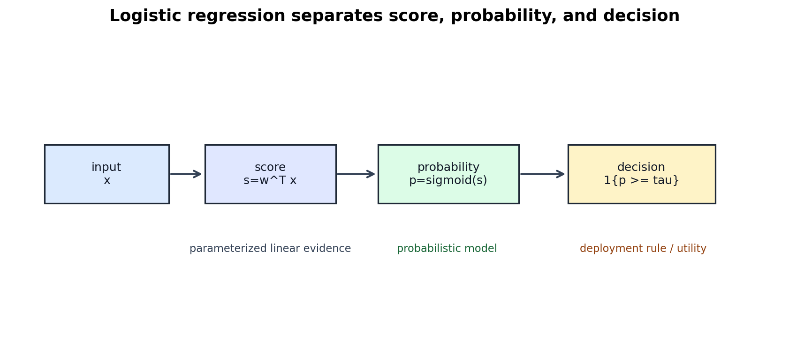

# Logistic Regression, Likelihood, and Optimization

[← Back to Learning From Data Theory Notebook](../README.md)

本章对应 Caltech `Learning From Data` Lecture 9: The Linear Model II。T1/T2 已经定义了 hypothesis set、population risk、empirical risk 与 selected hypothesis；本章进入 fitting 过程本身：当我们用 logistic regression 拟合一个 probabilistic classifier 时，究竟在选择什么？



图 1：logistic regression 先把 input 映射为 linear score，再通过 sigmoid 给出 conditional probability model，最后由 decision rule 转成分类决策。score、probability model 与 decision rule 是三个不同对象。

## 0. Source Separation

### Caltech Core

Lecture 9 把 linear model 推进到 logistic regression，并引入 likelihood、cross entropy 与 gradient descent。核心主线是：linear score 可以用于 classification，但若要得到 probability-like output，需要把 score 通过 nonlinear response function 转成概率，并用 likelihood 作为 fitting objective。

### Stanford CS229 Extension

CS229 的 supervised learning / GLM / logistic regression notes 提供了 conditional likelihood、log likelihood、gradient 与 Hessian 的标准推导。本章使用这些推导来补足 Caltech 讲义中的数学细节。

### Stanford CS229M / Theory Extension

CS229M 侧的启发在于：同一个 nominal hypothesis family 配合不同 optimizer、regularizer 或 stopping rule，会形成不同的 effective learning procedure。T3 暂不展开现代 optimization theory，只把这个分离建立清楚。

### Modern Perspective

perfect separation 下 unregularized logistic regression 的 finite MLE 可能不存在；gradient-based training 仍可能沿着某个方向继续变化。这不是 Caltech Core 的主线，但它说明 optimization trajectory 与 explicit regularization 会影响最终 solution。

## 1. Central Question

logistic regression 常被一句话概括为：

```text
linear model + sigmoid + cross entropy
```

但这句话容易把几个对象混在一起。更精确地说，fitting logistic regression 至少包含：

- **hypothesis family**：一族由参数 $w$ 表示的 conditional probability functions；
- **parameterization**：用 $w^\top x$ 作为 score；
- **probabilistic model**：把 score 解释为 $P(Y=1\mid X=x;w)$；
- **empirical objective**：negative log likelihood / cross entropy；
- **optimizer**：例如 gradient descent；
- **selected parameter vector**：训练后得到的 $\tilde w$；
- **selected function**：$g(x)=\sigma(\tilde w^\top x)$ 或由阈值产生的 classifier。

这些对象不相同。若一篇论文报告“logistic regression 表现很好”，研究者仍要追问：优化的是 likelihood 还是 classification error？报告的是 accuracy、NLL、calibration error 还是 downstream utility？概率输出是否真的被当作 calibrated probability 使用？

## 2. From Linear Score to Probability

### Caltech Core

linear classification 中，score 可以写为：

```math
s(x)=w^\top x
```

这里 $x\in\mathbb{R}^d$ 是 input representation，$w\in\mathbb{R}^d$ 是 parameter vector。若只做 hard classification，一个常见 decision rule 是：

```math
\hat y =
\begin{cases}
1, & w^\top x \ge 0,\\
0, & w^\top x < 0.
\end{cases}
```

logistic regression 增加了概率解释。定义 sigmoid function：

```math
\sigma(t)
=
\frac{1}{1+\exp(-t)}
```

于是：

```math
P(Y=1\mid X=x;w)
=
\sigma(w^\top x)
```

并且：

```math
P(Y=0\mid X=x;w)
=
1-\sigma(w^\top x)
```

### Intuition

sigmoid 把任意 real-valued score 压到 $(0,1)$。当 $w^\top x$ 很大时，模型给 $Y=1$ 高概率；当 $w^\top x$ 很小时，模型给 $Y=1$ 低概率；当 score 为 0 时，概率是 0.5。

但是概率输出不是 decision 本身。若部署时使用阈值 0.5：

```math
\hat y = 1\{\sigma(w^\top x)\ge 0.5\}
```

这等价于 $1\{w^\top x\ge 0\}$。如果真实成本不对称，阈值可以不是 0.5。因此 logistic model 同时包含三层：

```text
score
→ probability model
→ decision rule
```

这会在 Week 5 calibration 与 abstention 中再次出现：classification correctness、probability quality 与 selective decision policy 是不同评估问题。

## 3. Bernoulli Conditional Model

### Formal Setup

令 $y\in\{0,1\}$。给定 $x$ 后，logistic regression 假设 conditional label 遵循 Bernoulli model：

```math
Y\mid X=x \sim \mathrm{Bernoulli}(p_w(x))
```

其中：

```math
p_w(x)=\sigma(w^\top x)
```

于是单个样本的 conditional probability 可写成：

```math
p(y\mid x;w)
=
p_w(x)^y
\left(1-p_w(x)\right)^{1-y}
```

代入 $p_w(x)=\sigma(w^\top x)$：

```math
p(y\mid x;w)
=
\sigma(w^\top x)^y
\left(
1-\sigma(w^\top x)
\right)^{1-y}
```

### Why Conditioning on x Matters

这里建模的是 $P(Y\mid X=x;w)$，不是 $P(X,Y)$ 的完整 generative model。换言之，logistic regression 并不试图解释 inputs 如何产生；它只对给定 input 时 label 的 conditional distribution 建模。因此它是 discriminative probabilistic model。

这一区分影响研究解释：若 input distribution 在部署时发生 shift，即使 conditional model 在训练分布上拟合良好，也不自动保证新的 $P_{\mathrm{deploy}}(X)$ 下的 error 或 calibration。

## 4. Maximum Likelihood and Binary Cross Entropy

### Assumptions

本节推导依赖：

- binary labels $y_i\in\{0,1\}$；
- conditional Bernoulli model $P(Y=1\mid X=x;w)=\sigma(w^\top x)$；
- 给定 inputs 后，labels 的 conditional likelihood 可按样本相乘；
- fitting objective 是 conditional maximum likelihood；
- 这里推导的是 empirical objective，不是 generalization guarantee。

给定 dataset：

```math
D=\{(x_i,y_i)\}_{i=1}^{N}
```

conditional likelihood 是：

```math
L(w;D)
=
\prod_{i=1}^{N}
p(y_i\mid x_i;w)
```

代入 Bernoulli form：

```math
L(w;D)
=
\prod_{i=1}^{N}
\sigma(w^\top x_i)^{y_i}
\left(
1-\sigma(w^\top x_i)
\right)^{1-y_i}
```

log likelihood 是：

```math
\ell_D(w)
=
\sum_{i=1}^{N}
\left[
y_i\log\sigma(w^\top x_i)
+
(1-y_i)\log(1-\sigma(w^\top x_i))
\right]
```

maximum likelihood 选择：

```math
\hat w_{\mathrm{MLE}}
\in
\arg\max_w \ell_D(w)
```

等价于最小化 negative log likelihood：

```math
\hat w_{\mathrm{MLE}}
\in
\arg\min_w
\left[
-\ell_D(w)
\right]
```

平均 negative log likelihood 写作：

```math
\hat R_D(w)
=
\frac{1}{N}
\sum_{i=1}^{N}
\left[
-y_i\log p_w(x_i)
-
(1-y_i)\log(1-p_w(x_i))
\right]
```

这正是 binary cross entropy。于是：

```text
minimize binary cross entropy
=
conditional maximum likelihood
```

但这个等价关系依赖 Bernoulli conditional model。若这个 probabilistic assumption 不适合任务，cross entropy 仍可作为 smooth surrogate loss 使用，但它的 likelihood 解释就需要重新审视。

## 5. Loss Is Not Classification Error

### Required Distinction

0/1 classification error 是：

```math
\ell_{0/1}(h(x),y)
=
1\{h(x)\ne y\}
```

logistic negative log likelihood 是：

```math
\ell_{\mathrm{NLL}}(w;x,y)
=
-y\log p_w(x)
-
(1-y)\log(1-p_w(x))
```

二者不是同一个 objective。

一个 update 可能让 $p_w(x)$ 从 0.51 变成 0.90，对于 $y=1$ 的样本，classification decision 没变，accuracy 没变，但 NLL 明显下降。反过来，一个 update 也可能提升一些样本的 likelihood，却因阈值附近的变化导致 accuracy 暂时下降。

### Why Surrogate Losses Are Used

0/1 loss 对参数通常不可微、非凸且难以直接优化。cross entropy 是 smooth surrogate，它提供梯度信号，并且在 Bernoulli model 下有 maximum likelihood 解释。计算可优化性与统计/generalization 仍是不同问题：smooth loss 让 search 更可行，但不自动说明 selected model out of sample 可靠。

## 6. Gradient Derivation

### Single Example

令：

```math
z=w^\top x
```

```math
p=\sigma(z)
```

单样本 loss：

```math
L(w)
=
-y\log p
-
(1-y)\log(1-p)
```

第一步，sigmoid derivative：

```math
\frac{d\sigma(z)}{dz}
=
\sigma(z)(1-\sigma(z))
=
p(1-p)
```

第二步，对 $p$ 求导：

```math
\frac{dL}{dp}
=
-\frac{y}{p}
+
\frac{1-y}{1-p}
```

第三步，用 chain rule：

```math
\frac{dL}{dz}
=
\frac{dL}{dp}
\frac{dp}{dz}
```

代入：

```math
\frac{dL}{dz}
=
\left(
-\frac{y}{p}
+
\frac{1-y}{1-p}
\right)
p(1-p)
```

展开：

```math
\frac{dL}{dz}
=
-y(1-p)
+
(1-y)p
=
p-y
```

第四步，$z=w^\top x$，所以：

```math
\nabla_w z = x
```

因此：

```math
\nabla_w
\left[
-\log p(y\mid x;w)
\right]
=
(\sigma(w^\top x)-y)x
```

### Empirical-Risk Gradient

对整个 dataset 平均：

```math
\hat R_D(w)
=
\frac{1}{N}\sum_{i=1}^{N}
\ell_{\mathrm{NLL}}(w;x_i,y_i)
```

梯度为：

```math
\nabla_w \hat R_D(w)
=
\frac{1}{N}
\sum_{i=1}^{N}
\left(
\sigma(w^\top x_i)-y_i
\right)x_i
```

写成 matrix form。令 design matrix $X\in\mathbb{R}^{N\times d}$，第 $i$ 行是 $x_i^\top$；令 $p\in\mathbb{R}^{N}$，$p_i=\sigma(w^\top x_i)$；令 $y\in\mathbb{R}^N$ 是 label vector，则：

```math
\nabla_w \hat R_D(w)
=
\frac{1}{N}X^\top(p-y)
```

这正是 Week 2 scratch logistic regression 实现中的核心 gradient 结构。

## 7. Hessian and Convexity

### Formal Derivation

从 empirical gradient：

```math
\nabla_w \hat R_D(w)
=
\frac{1}{N}X^\top(p-y)
```

继续求导。因为：

```math
\frac{\partial p_i}{\partial w}
=
p_i(1-p_i)x_i
```

定义 diagonal matrix：

```math
S
=
\mathrm{diag}
\left(
p_1(1-p_1),\ldots,p_N(1-p_N)
\right)
```

则 Hessian 为：

```math
\nabla_w^2 \hat R_D(w)
=
\frac{1}{N}
X^\top S X
```

对任意 vector $v$：

```math
v^\top
\nabla_w^2 \hat R_D(w)
v
=
\frac{1}{N}
(Xv)^\top S (Xv)
=
\frac{1}{N}
\sum_{i=1}^{N}
p_i(1-p_i)(x_i^\top v)^2
\ge
0
```

因为 $p_i(1-p_i)\ge0$，所以 Hessian positive semidefinite，standard logistic-regression negative log likelihood 在 $w$ 上是 convex。

### What This Does NOT Imply

convex objective 不意味着 generalization 自动成立。convexity 只说明 optimization landscape 更容易处理：local minimum 是 global minimum，gradient-based search 有更强的 optimization theory。它不说明：

- training distribution 与 deployment distribution 相同；
- hypothesis family 包含 target-relevant structure；
- finite sample 足以支持 small population risk；
- probability estimates calibrated；
- reported metric 与 training objective 对齐；
- repeatedly tuned validation/test performance 仍独立。

## 8. Gradient Descent as Search

gradient descent update 是：

```math
w_{t+1}
=
w_t
-
\eta
\nabla_w \hat R_D(w_t)
```

这里 $\eta$ 是 learning rate。概念上：

```text
Hypothesis family
+ empirical objective
+ optimizer
→ selected parameters
→ selected function
```

gradient descent 不是 hypothesis family。loss 不是 hypothesis family。parameterization 也不等于 represented function。一个函数可能有多个 parameter representations；一个 optimizer 也可能因为 initialization、step size、batching、early stopping 而选择不同 solution。

这一区分是 T3 的核心：credible model selection 需要审计完整 selection procedure，而不是只说“用了某个模型”。

## 9. Perfect Separation Pathology

### Modern Perspective

若 binary data 线性可分，存在某个 direction $u$ 使得所有正类满足 $u^\top x_i>0$，所有负类满足 $u^\top x_i<0$。对于 logistic NLL，沿着 $cu$ 且 $c\to\infty$ 时，训练样本的 predicted probability 会越来越接近正确 label 的 0 或 1，training NLL 可以继续下降。

因此 unregularized logistic regression 在 perfect separation 下可能没有 finite maximum-likelihood parameter：存在越来越大的 norm 让 likelihood 更好，但没有有限 $w$ 达到最大值。

### What This Does NOT Imply

这不意味着 logistic regression “不能训练”，也不意味着 separable data 一定会 generalize 差。它说明：

- finite optimizer output 可能由 stopping time、learning rate、initialization 与 numerical constraints 决定；
- explicit regularization 可改变 objective，使 finite solution 更明确；
- implicit bias 研究会追问 gradient-based trajectory 在无有限 MLE 时偏好哪类 direction；
- training likelihood 的改善不等于 probability calibration 或 out-of-sample correctness。

## 10. Research Lens

阅读使用 logistic regression 或 cross entropy 的研究时，应至少问：

- 什么 probabilistic assumption 被引入？
- optimized objective 是 NLL、regularized NLL、0/1 surrogate，还是别的 loss？
- reported metric 是 accuracy、BCE/NLL、AUROC、calibration error、selective risk，还是 deployment utility？
- objective 与 reported metric 是否对齐？
- probability quality 是否重要？
- low NLL 是否真的 imply calibration？通常不直接 imply。
- low training NLL 是否 imply generalization？需要 T2 的 capacity/evidence conditions。
- validation 或 test metrics 是否影响过 feature、threshold、regularization 或 hyperparameter selection？

### Existing Repository Links

- Week 2 logistic-regression scratch work connects directly to the likelihood/gradient derivation: [Week 2 report](../../../reports/week2_linear_logistic_regression.md).
- Week 5 calibration work shows why probability output quality differs from classification accuracy: [calibration metrics](../../../reports/week5/02_calibration_metrics_and_reliability_diagrams.md).
- Week 5 abstention work shows why decision policy can differ from probability model and accuracy metric: [abstention policy](../../../reports/week5/03_confidence_thresholding_and_abstention_policy.md).

[← Back to Learning From Data Theory Notebook](../README.md)
