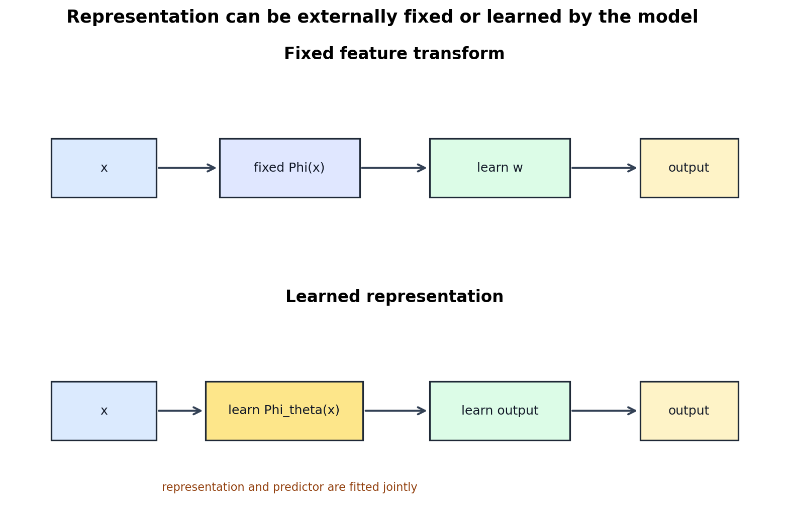
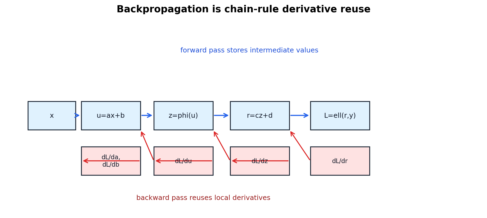

# Neural Networks, Backpropagation, and Learned Representation

[← Back to Learning From Data Theory Notebook](../README.md)

本章对应 Caltech `Learning From Data` Lecture 10: Neural Networks。它不是现代 deep learning 教程，而是为了回答一个理论问题：当 representation 不再由研究者固定指定，而是与 predictor 一起通过数据学习时，learning system 的对象结构发生了什么变化？



图 1：classical feature transform 固定 $\Phi(x)$，再在 transformed space 中学习 predictor；neural network 把 $\Phi_\theta(x)$ 本身参数化，并与输出层一起训练。二者有连续性，但不能简单视为完全相同。

## 0. Source Separation

### Caltech Core

Lecture 10 引入 neural-network hypothesis、hidden layers 与 backpropagation。Caltech 的核心意图不是堆叠现代架构术语，而是说明 nonlinear hypotheses 可以通过 layered parameterized computation 表达，并通过 chain rule 高效计算梯度。

### Stanford CS229 Extension

CS229 neural-network notes 提供 forward propagation、loss gradients 与 backpropagation 的推导支撑。本章用这些标准 derivations 来补全计算图层面的细节。

### Stanford CS229M / Theory Extension

CS229M 的相关视角是：neural networks 使 representation、optimization landscape 与 algorithm-dependent solution selection 成为 generalization 问题的一部分。T3 只建立概念接口；深层理论如 NTK、implicit bias 与 overparameterized regimes 在现代扩展 note 中预览。

### Modern Perspective

learned representation 不等于 semantic understanding。hidden states 是数据与 objective 共同塑造的 intermediate variables；它们可能编码 task-relevant information，也可能编码 shortcuts。

## 1. From Fixed Transform to Learned Transform

T1 Lecture 3 中 classical nonlinear transform 写作：

```math
x
\mapsto
\Phi(x)
\mapsto
w^\top \Phi(x)
```

这里 $\Phi$ 是研究者或 preprocessing pipeline 预先指定的 feature map。对应的 induced hypothesis family 是：

```math
\mathcal{H}_{\Phi}
=
\{x\mapsto h(\Phi(x)):h\in\mathcal{H}\}
```

neural networks 把 transform 自身参数化：

```math
x
\mapsto
\Phi_{\theta}(x)
\mapsto
v^\top\Phi_{\theta}(x)
```

其中 $\theta$ 是 hidden representation 的参数，$v$ 是输出层参数。学习不再只是选择 final linear predictor，也在选择 intermediate representation。

### What Changes

固定 feature transform 的 inductive bias 主要来自人工指定的 $\Phi$。neural network 的 inductive bias 来自：

- architecture；
- activations；
- parameterization；
- initialization；
- loss；
- optimizer；
- data augmentation；
- regularization；
- stopping rule；
- training data geometry。

因此 T3 之后说“model”时，必须区分 architecture、parameterization、objective、optimizer 与 selection procedure。

## 2. Network as Function Composition

### Formal Setup

一个 $L$ 层 network 可写成 function composition：

```math
h_\theta(x)
=
f_L
\circ
f_{L-1}
\circ
\cdots
\circ
f_1(x)
```

更具体地，令：

```math
z_0=x
```

对 hidden layer $\ell=1,\ldots,L-1$：

```math
a_\ell
=
W_\ell z_{\ell-1}+b_\ell
```

```math
z_\ell
=
\phi_\ell(a_\ell)
```

输出层：

```math
a_L
=
W_L z_{L-1}+b_L
```

然后根据 task 选择 output transform，例如 binary classification 中：

```math
\hat y
=
\sigma(a_L)
```

或 multi-class classification 中用 softmax。

### Object Roles

- $W_\ell,b_\ell$ 是 parameters；
- $a_\ell$ 是 pre-activation；
- $z_\ell$ 是 hidden representation / hidden state；
- $\phi_\ell$ 是 activation function；
- $h_\theta$ 是由全部 parameters 决定的 function；
- loss 定义 training objective；
- optimizer 决定怎样搜索 parameter space。

这些对象都不是同一个东西。

## 3. Forward Computation

### Small Network Equations

考虑一个一隐层 network，input $x=(x_1,x_2)$，hidden layer 有两个 neurons，输出是 scalar：

```math
a_1
=
w_{11}^{(1)}x_1+w_{12}^{(1)}x_2+b_1^{(1)}
```

```math
a_2
=
w_{21}^{(1)}x_1+w_{22}^{(1)}x_2+b_2^{(1)}
```

hidden activations：

```math
z_1=\phi(a_1),
\quad
z_2=\phi(a_2)
```

output score：

```math
s
=
w_1^{(2)}z_1+w_2^{(2)}z_2+b^{(2)}
```

若做 binary probabilistic prediction：

```math
p=\sigma(s)
```

若 loss 是 binary cross entropy：

```math
L
=
-y\log p-(1-y)\log(1-p)
```

### Matrix Form

同一计算写成：

```math
a^{(1)}=W^{(1)}x+b^{(1)}
```

```math
z^{(1)}=\phi(a^{(1)})
```

```math
s=W^{(2)}z^{(1)}+b^{(2)}
```

```math
p=\sigma(s)
```

matrix form 简洁，但初学时容易隐藏 chain rule 的依赖结构。backpropagation 正是利用这些依赖结构高效计算所有 partial derivatives。

## 4. Backpropagation from Chain Rule



图 2：backpropagation 不是神秘的“学习机制”，而是从 loss 节点向前面参数节点反向传播 derivatives 的 chain-rule bookkeeping。

### Scalar Computational Graph

先看最小 scalar example：

```math
u=ax+b
```

```math
z=\phi(u)
```

```math
r=cz+d
```

```math
L=\ell(r,y)
```

目标是求 $\partial L/\partial a,\partial L/\partial b,\partial L/\partial c,\partial L/\partial d$。

chain rule 给出：

```math
\frac{\partial L}{\partial c}
=
\frac{\partial L}{\partial r}
\frac{\partial r}{\partial c}
=
\frac{\partial L}{\partial r}z
```

```math
\frac{\partial L}{\partial d}
=
\frac{\partial L}{\partial r}
```

对 hidden part：

```math
\frac{\partial L}{\partial z}
=
\frac{\partial L}{\partial r}
\frac{\partial r}{\partial z}
=
\frac{\partial L}{\partial r}c
```

```math
\frac{\partial L}{\partial u}
=
\frac{\partial L}{\partial z}
\frac{\partial z}{\partial u}
=
\frac{\partial L}{\partial z}\phi'(u)
```

于是：

```math
\frac{\partial L}{\partial a}
=
\frac{\partial L}{\partial u}
\frac{\partial u}{\partial a}
=
\frac{\partial L}{\partial u}x
```

```math
\frac{\partial L}{\partial b}
=
\frac{\partial L}{\partial u}
```

### Reuse of Intermediate Derivatives

关键不是 chain rule 本身，而是 reusable local derivative。比如 $\partial L/\partial r$ 被同时用于 $c,d,z$ 的 gradients；$\partial L/\partial u$ 被同时用于 $a,b$。在大型网络中，如果对每个 parameter 从头展开 chain rule，会造成巨大重复计算。backpropagation 通过从输出到输入保存并复用 error signals，使一次 backward pass 给出所有 parameter gradients。

### Vector / Matrix Backprop for One Hidden Layer

对上一节一隐层 network，令 binary cross entropy with sigmoid output。已知：

```math
\frac{\partial L}{\partial s}
=
p-y
```

输出层 gradients：

```math
\frac{\partial L}{\partial W^{(2)}}
=
(p-y)(z^{(1)})^\top
```

```math
\frac{\partial L}{\partial b^{(2)}}
=
p-y
```

hidden representation 的 gradient：

```math
\frac{\partial L}{\partial z^{(1)}}
=
(W^{(2)})^\top(p-y)
```

hidden pre-activation 的 error signal：

```math
\delta^{(1)}
=
\frac{\partial L}{\partial a^{(1)}}
=
\left[
(W^{(2)})^\top(p-y)
\right]
\odot
\phi'(a^{(1)})
```

于是：

```math
\frac{\partial L}{\partial W^{(1)}}
=
\delta^{(1)}x^\top
```

```math
\frac{\partial L}{\partial b^{(1)}}
=
\delta^{(1)}
```

这里 $\odot$ 表示 elementwise product。

### Backpropagation Is Not Gradient Descent

backpropagation computes gradients。gradient descent uses gradients to update parameters：

```math
\theta_{t+1}
=
\theta_t
-
\eta
\nabla_\theta \hat R_D(\theta_t)
```

如果把二者混为一谈，就会错误地把 derivative computation、optimizer dynamics 与 learning algorithm 的统计性质混在一起。

## 5. Function Space versus Parameter Space

### Mandatory Distinction

neural network 的 parameter vector $\theta$ 与 represented function $h_\theta$ 通常不是一一对应。

#### Neuron Permutation Symmetry

在一个 hidden layer 中，若交换两个 hidden neurons，同时交换输出层对应 weights，整体 input-output function 不变。于是两个不同 parameter vectors 可表示同一个 function。

#### Scaling Symmetry

对 ReLU network，某些层的 incoming weights 乘以正数 $c$，下一层对应 outgoing weights 除以 $c$，在适当条件下可保持函数不变，因为：

```math
\mathrm{ReLU}(cu)=c\,\mathrm{ReLU}(u)
\quad
c>0
```

因此：

```text
parameter distance
!=
function distance
```

这影响 optimization analysis、representation comparison 与 mechanistic interpretability。两个 checkpoints 在 parameter space 中距离较大，不一定表示预测函数差异大；两个 functions 差异大，也不一定能从简单 parameter norm 看出。

## 6. Hidden Representation

第 $\ell$ 层 hidden representation 可记为：

```math
z_\ell
=
\Phi_{\theta,\ell}(x)
```

技术上，$z_\ell$ 是 input 经过前 $\ell$ 层 parameterized transformations 后的 intermediate vector。研究 representation 时，不应说“网络理解了概念 X”，而应问更可检验的问题：

- 哪些 input distinctions 被保留？
- 哪些 distinctions 被压缩或丢失？
- 哪些 variables 变得 linearly accessible？
- representation 对 noise、augmentation、shift 是否稳定？
- 是否存在 shortcut features？
- 在不同 seeds、datasets、optimizers 下 representation 是否一致？

### Connection to T1 Representation Failure

learned representation 可以修复某些人工 feature 的不足，也可能引入新的 shortcuts。如果 training distribution 中背景、笔画厚度或采集方式与 label 偶然相关，network 可能学习这些 easier signals，而非期望的 task mechanism。

## 7. Non-Convexity

multilayer neural-network objective 一般是 parameters 的非凸函数。原因是 parameters 在多层 composition 中相乘并通过 nonlinear activations 交互。例如一隐层网络：

```math
h_\theta(x)
=
v^\top \phi(Wx+b)
```

loss 对 $v$ 固定时可能较简单；对 $W$ 固定时也可能较简单；但同时对 $(W,v)$ 优化时通常不是 convex。

### What This Does NOT Imply

non-convex 不意味着 impossible to optimize。它只说明 classical convex optimization guarantee 不直接适用。实际 neural-network training 的可优化性可能来自：

- overparameterization；
- initialization；
- architecture；
- normalization；
- optimizer dynamics；
- data geometry；
- loss landscape 的特殊结构。

这些属于 CS229M / modern theory 讨论的问题，不能用“非凸所以一定失败”或“实验成功所以理论无关”来替代。

## 8. Research Lens

一个 neural-network paper 的可信解释必须同时审计：

- **Representation**：哪些 hidden variables 被学习？是否稳定？
- **Hypothesis family**：architecture 允许哪些 functions？
- **Parameterization**：是否存在 symmetries、scale effects、ill-conditioning？
- **Objective**：优化的 loss 是什么？
- **Optimizer**：backprop 只算 gradient，实际 update rule 是 SGD、Adam、momentum 还是别的？
- **Selection**：哪些 checkpoints、seeds、hyperparameters、preprocessing choices 影响最终 model？
- **Evaluation**：validation/test 是否仍保持其声称角色？

### Existing Repository Links

- Week 3 MLP/backprop work provides the local implementation context: [MLP forward and backprop report](../../../reports/week3/03_mlp_forward_and_backprop.md).
- Week 3 optimizer comparisons illustrate that optimizer trajectory is a separate object from hypothesis family: [optimization algorithms report](../../../reports/week3/01_optimization_algorithms.md).
- Week 4 digits and Canvas diagnostics show learned functions can behave differently under changed input mechanism: [Canvas validation findings](../../../reports/week4/12_real_canvas_validation_findings.md).

[← Back to Learning From Data Theory Notebook](../README.md)
