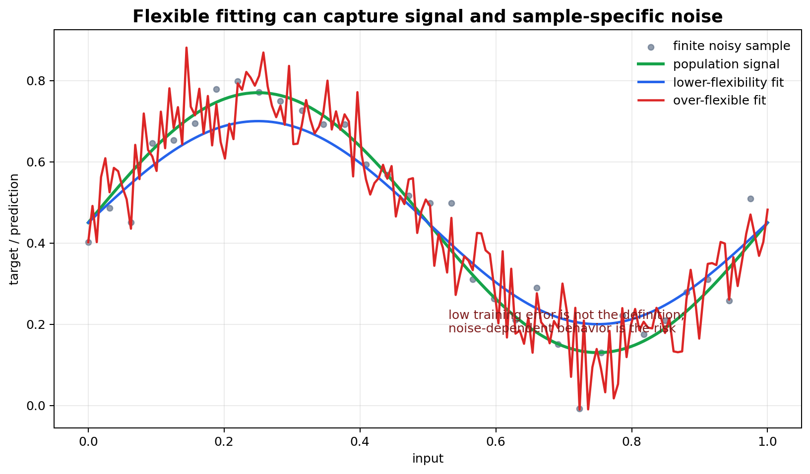

# Overfitting, Noise, and Effective Complexity

[← Back to Learning From Data Theory Notebook](../README.md)

本章对应 Caltech `Learning From Data` Lecture 11: Overfitting。T2 已说明 selected hypothesis 的 generalization 需要 simultaneous control；本章进一步问：即使 learning 在理论上可行，为什么实际 fitting 过程仍可能选择一个对 observed sample 过度适配、对 population 不可靠的 model？



图 1：随着 effective flexibility 增加，模型更容易同时拟合 signal 与 sample-specific noise。低 training error 只是症状；关键是 selected function 是否利用了无法 out-of-sample 重现的结构。

## 0. Source Separation

### Caltech Core

Lecture 11 讨论 overfitting、fitting data too well、stochastic noise 与 deterministic noise。核心直觉是：过大的 flexibility 可以让 learning procedure 解释训练样本中的 accidental structure，导致 out-of-sample behavior 变差。

### Formal Derivation

本章不引入新的完整 generalization theorem，而是复用 T2 的 empirical/population risk、approximation/estimation/optimization 与 bias-variance vocabulary，说明 overfitting 的机制。

### Stanford CS229M / Theory Extension

现代 learning theory 使 “complexity” 不再只等于 parameter count 或 raw class size。regularization、optimizer、margin、norm、stability、data geometry 与 implicit bias 都可能改变 effective complexity。

### Modern Perspective

interpolation、double descent 与 benign overfitting 表明 `zero training error` 不是 universal failure diagnosis。T3 只把边界讲清楚；不在本章完整推导这些现代结果。

## 1. What Does Overfitting Mean?

### Definition by Comparison

overfitting 不能只定义为：

```text
training error is low
```

更合理的表述是：在一组 competing learning procedures、hypothesis families、regularization strengths、features、checkpoints 或 hyperparameters 中，某个选择因为过度适配 finite sample 中的 accidental structure，使其 out-of-sample risk 相比更稳健的选择变差。

形式化地，若同一 dataset-driven selection procedure 产生 $g_1,g_2,\ldots$，某个 $g_a$ 有更低 training error：

```math
E_{\mathrm{in}}(g_a)
<
E_{\mathrm{in}}(g_b)
```

但 population risk 更高：

```math
E_{\mathrm{out}}(g_a)
>
E_{\mathrm{out}}(g_b)
```

则我们会说相对这个比较集和选择机制，$g_a$ overfits。overfitting 是关于 finite-sample fitting 与 out-of-sample behavior 的错配，不是 low $E_{\mathrm{in}}$ 本身。

### What This Does NOT Imply

- zero training error 不必然意味着 overfitting；
- training error 高也可能 generalization 差；
- train/test gap 大可能来自 overfitting，也可能来自 distribution shift、preprocessing mismatch 或 evaluation bug；
- overfitting 不是单个模型结构的静态属性，而与 data、loss、optimizer、regularization 和 selection procedure 有关。

## 2. Fitting Signal versus Fitting Noise

T1 Lecture 4 区分了 target、noise 与 loss。现在把它放入 fitting 过程。

训练数据可以分解为：

```text
target-relevant structure
+ sample-specific fluctuation
+ measurement / label noise
+ representation artifacts
```

flexible learning procedure 不知道哪些 pattern 会在 future samples 中重现。它只看到 finite dataset。因此当 hypothesis family 或 selection process 足够灵活时，它可能把 sample-specific fluctuation 当作真实 structure。

### Statistical View

令 population risk 为：

```math
R(h)
=
\mathbb{E}_{(X,Y)\sim P}
\left[
\ell(h(X),Y)
\right]
```

empirical risk 为：

```math
\hat R_D(h)
=
\frac{1}{N}
\sum_{i=1}^{N}
\ell(h(x_i),y_i)
```

overfitting 的核心不是 $\hat R_D(h)$ 小，而是 selected $g$ 在 training data 上利用了 $\hat R_D$ 相对 $R$ 的偏差：

```math
\hat R_D(g)
\ll
R(g)
```

尤其当 $g=A(D)$ 依赖 $D$ 时，pointwise concentration 不足以解释这个 gap，需要 T2 的 uniform / simultaneous control 或独立 evaluation evidence。

## 3. Deterministic Noise

### Caltech Core

Caltech 的 deterministic noise 指：即使 target function 本身 deterministic，当 chosen hypothesis family 无法表达 target 时，目标中无法被该 family 捕捉的部分会表现为“噪声”。这种 noise 不是随机 label error，而是相对于 model class 的 residual structure。

### Connection to Approximation / Specification Error

若真实 target $f$ 不在 $\mathcal{H}$ 中，population-best-in-class 是：

```math
h^*_{\mathcal{H}}
\in
\arg\min_{h\in\mathcal{H}}
R(h)
```

即使训练数据没有 stochastic label noise，$f-h^*_{\mathcal{H}}$ 代表的 residual structure 也可能在 empirical sample 中呈现复杂 pattern。一个更灵活的 class $\mathcal{H}'$ 也许能捕捉其中一部分 target structure，但也可能捕捉 sample-specific residual。

### Failure Mode

deterministic noise 容易与 random noise 混淆。二者区别是：

- deterministic noise 来自 target 与 chosen representation / hypothesis family 的 mismatch；
- stochastic noise 来自 $Y\mid X$ 的随机性、measurement variation 或 label randomness；
- 两者都可能被 flexible procedure 过度拟合；
- 两者都不能通过低 training loss 直接区分。

## 4. Stochastic Noise

stochastic noise 出现在：

```math
Y\mid X=x
```

不是 deterministic 的情形。例如：

- labeler 不一致；
- sensor measurement 有随机误差；
- 类别边界本身概率性；
- input 缺失了决定 label 的 hidden variables；
- same $x$ 下存在不同合理 outputs。

在 squared-loss regression 中可写为：

```math
Y=f(X)+\eta
```

并假设：

```math
\mathbb{E}[\eta\mid X]=0
```

即使 $f$ 可被表示，$\eta$ 也造成 irreducible uncertainty。若 learning procedure 试图用 high flexibility 精确解释每个 noisy realization，它可能降低 training loss，却提高 future risk。

## 5. Effective Complexity

### Beyond Parameter Count

不能把 complexity 简化为：

```text
number of parameters
```

effective complexity 取决于完整 learning procedure：

- hypothesis class；
- representation；
- feature preprocessing；
- regularization；
- constraints；
- optimizer；
- initialization；
- early stopping；
- data augmentation；
- data geometry；
- validation / checkpoint selection；
- researcher iteration。

一个高参数模型可能因为 strong regularization、large margin、stable algorithm 或 data geometry 而表现出较低 effective complexity。一个小模型也可能因为大量 manual feature search、validation tuning 或 threshold hacking 而具有很大的 effective selection space。

### Research Consequence

报告“模型只有很少参数”并不能自动证明低 overfitting risk；报告“模型参数很多”也不能自动证明一定 overfits。需要说明实际被搜索和选择的 candidate family，以及哪些 data signals 影响了 selection。

## 6. Classical Complexity Curve

Caltech overfitting 讲法常用 classical curve：

```text
complexity increases
→ E_in tends to decrease
→ E_out may eventually increase
```

这个图像有很强的教学价值：它说明 empirical fit 与 population performance 之间存在 tradeoff，也为 regularization 和 validation 做准备。

### What This Does NOT Imply

它不是 universal theorem。它不保证：

- complexity 单调增加时 $E_{\mathrm{out}}$ 一定先降后升；
- zero training error 一定差；
- parameter count 是唯一 complexity axis；
- modern overparameterized networks 必须遵循同一条 U-shaped curve；
- validation-selected model 一定没有 overfit validation。

现代 double descent 和 benign overfitting 研究说明，某些 regimes 中 interpolation 之后 test risk 还可能下降。本章只把这个 caveat 放在正确位置：classical curve 是有用的 warning，不是所有 ML 的完整解释。

## 7. Why Overfitting Is a Selection Phenomenon

### Candidate-Level View

假设研究者探索：

```text
features
architectures
lambda values
optimizers
seeds
checkpoints
thresholds
augmentations
```

每个 choice 产生一个 candidate model 或 candidate procedure。若 validation feedback 被用于反复修改候选集合，最终 model 不是单次 training run 的简单输出，而是：

```text
candidate-generation procedure
+ validation feedback
+ selection rule
```

的输出。

形式上可以写为：

```math
g_{\mathrm{selected}}
=
S(D_{\mathrm{train}},D_{\mathrm{val}},\mathcal{C})
```

其中 $\mathcal{C}$ 是 candidate-generation process。若 $\mathcal{C}$ 也由过去 validation results 改变，则 $S$ 是 adaptive procedure。

### Connection to T2

T2 的 fixed hypothesis → selected hypothesis 断点在这里扩大：不只是 optimizer 从 $\mathcal{H}$ 中选择 $g$，整个 research process 也在从更大的 candidate space 中选择 final reported model。若这个选择使用 validation 或 benchmark feedback，相关 evaluation estimate 不能再被解释为完全 independent evidence。

## 8. Existing Experiment Connection

### Week 3 Overfitting

Week 3 MLP 实验中出现过 extremely low train BCE 与 much worse validation BCE 的差异。这说明 flexible MLP 可以把 training sample 拟合得很好，同时 validation risk 不同步下降。对应报告见：[Week 3 backprop/MLP](../../../reports/week3/03_mlp_forward_and_backprop.md) 与 [Week 3 gradient risk and sampling](../../../reports/week3/02_gradient_risk_and_sampling.md)。

这证明了：

```text
low training BCE
!=
low validation/population risk
```

但它不单独证明具体 mechanism 一定是 label noise、deterministic noise、optimization failure 或 distribution shift；需要结合数据生成机制、representation、learning curves 与 validation protocol 分析。

### Week 4 Canvas-Diagnostic-v1

Week 4 real canvas diagnostics 显示 scratch digits model 在真实 canvas 输入上可能出现不同 failure mode。对应报告见：[Canvas validation findings](../../../reports/week4/12_real_canvas_validation_findings.md) 与 [Canvas protocol](../../../reports/week4/13_canvas_dataset_protocol_and_next_stage_experiment_design.md)。

这里必须区分：

```text
overfitting
!=
distribution shift
```

overfitting 关注 finite-sample selection 与 same-distribution population behavior 的错配；distribution shift 关注 training/evaluation/deployment distributions 的改变。二者可以同时存在，但不是同一概念。

## 9. Modern Perspective

### Interpolation

interpolation 指模型可以达到 near-zero 或 zero training error。classical intuition 会担心这必然 fit noise，但现代结果显示，在某些 high-dimensional regimes、algorithmic biases 与 data geometries 下，interpolating solutions 也可能 generalize。

### Double Descent

double descent 描述 model complexity 经过 interpolation threshold 后，test risk 可能再次下降。这扩展了 classical U-shaped curve。

### Benign Overfitting

benign overfitting 研究某些模型在拟合 noise 的同时仍能在 prediction risk 上保持良好表现的条件。

### Boundary

这些现代现象不取消 overfitting 概念。它们说明：

- overfitting 不能由 zero training error 单独诊断；
- 需要考虑 data distribution、algorithm、norm/margin、implicit bias 与 task structure；
- classical capacity control 是重要起点，但不是完整现代解释。

## 10. Research Lens

阅读或设计实验时，对 overfitting 的审计应问：

- compared procedures 是什么？
- 低 training error 是否对应低 independent validation/test error？
- observed gap 是 same-distribution generalization gap，还是 distribution shift？
- noise 是 stochastic、deterministic/specification residual，还是 preprocessing artifact？
- candidate search space 有多大？
- validation feedback 是否反复改变了 candidate generation？
- reported final test 是否在 selection loop 外？

[← Back to Learning From Data Theory Notebook](../README.md)
