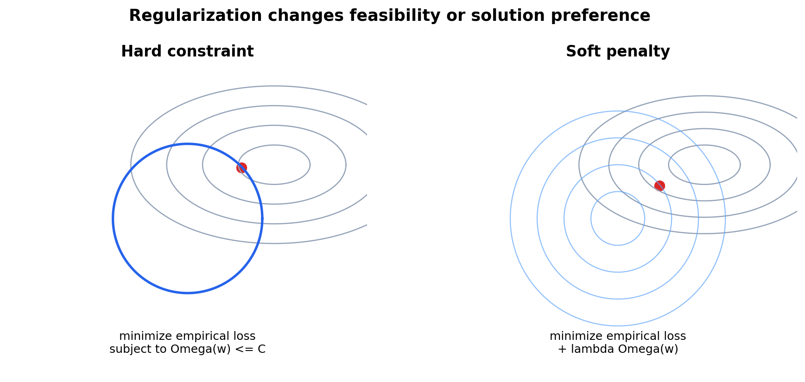
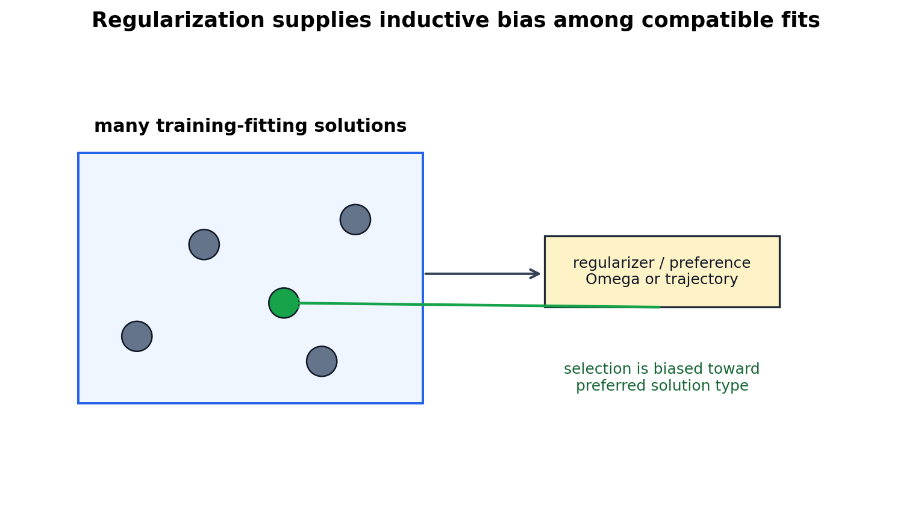

# Regularization, Constraints, and Inductive Bias

[← Back to Learning From Data Theory Notebook](../README.md)

本章对应 Caltech `Learning From Data` Lecture 12: Regularization。T2 说明 capacity control 是 generalization 的核心；T3 需要更精确地问：regularization 到底改变了什么？它是缩小 hypothesis set、改变 objective、改变 optimizer trajectory，还是改变 final solution preference？



图 1：hard constraint 直接限制 feasible region；soft penalty 改变 objective 的等高线与最优点。二者在凸优化中常有关联，但在任意非凸问题中不能随意声称一一对应。

## 0. Source Separation

### Caltech Core

Lecture 12 介绍 hard constraints、soft constraints、augmented error 与 weight decay。核心思想是：为了避免 fitting data too well，可以加入额外 preference 或 constraint，让 learning procedure 不只追求 empirical fit。

### Stanford CS229 Extension

CS229 regularization 与 model selection 材料支持 L2/L1 penalty、MAP interpretation 与 validation-based regularization tuning 的标准推导。

### Stanford CS229M / Theory Extension

CS229M 视角强调 explicit regularization 不是唯一 solution-selection mechanism；optimizer、initialization、early stopping 与 data geometry 也可能影响 selected solution。现代扩展 note 会进一步展开。

## 1. Why Regularization Exists

T2 的 uniform convergence 告诉我们：如果 hypothesis class 或 effective procedure 太灵活，empirical risk minimizer 可能不可靠。practical regularization 常通过下面方式介入：

- constraints；
- penalties；
- optimization trajectory；
- solution preference；
- stopping rule；
- data augmentation induced invariance。

因此 regularization 不应被简单描述为“防止过拟合”的按钮。更准确地说，它改变 learning procedure 对候选 solutions 的 preference。

## 2. Hard Constraint

### Formal Setup

给定 empirical risk：

```math
\hat R_D(w)
=
\frac{1}{N}
\sum_{i=1}^{N}
\ell(h_w(x_i),y_i)
```

hard-constrained optimization 写作：

```math
\min_w \hat R_D(w)
\quad
\text{subject to}
\quad
\Omega(w)\le C
```

其中 $\Omega(w)$ 是 complexity measure 或 parameter penalty，例如 $\|w\|_2^2$，$C$ 控制 feasible region 大小。

### Interpretation

hard constraint 确实改变 feasible parameter space：

```math
\Theta_C
=
\{w:\Omega(w)\le C\}
```

对应的 feasible hypothesis family 是：

```math
\mathcal{H}_C
=
\{h_w:w\in\Theta_C\}
```

在这个意义上，hard regularization 可以 shrink effective feasible family。但 shrink 的是 parameter-defined feasible set；如果 parameterization 有冗余，parameter constraint 与 function-space constraint 的关系还需要具体分析。

## 3. Soft Constraint / Penalized Objective

soft regularization 或 penalized objective 写作：

```math
\min_w
\hat R_D(w)
+
\lambda\Omega(w)
```

这里：

- $\hat R_D(w)$ 鼓励 empirical fit；
- $\Omega(w)$ 惩罚不被偏好的 solutions；
- $\lambda\ge0$ 是 regularization coefficient；
- $\lambda$ 越大，penalty 在 objective 中越重要。

### What It Changes

soft penalty 不一定改变 nominal family：

```math
\mathcal{H}
=
\{h_w:w\in\Theta\}
```

因为所有 $w\in\Theta$ 仍可被表示。但它改变 selection criterion，使某些 solutions 更容易被选中。

这正是 T3 的 object separation：

```text
nominal hypothesis family
!=
objective
!=
selected solution
```

## 4. Hard versus Soft Regularization

### Lagrangian Reasoning

在适当 convexity、regularity 与 strong-duality 条件下，constrained problem：

```math
\min_w \hat R_D(w)
\quad
\text{subject to}
\quad
\Omega(w)\le C
```

可通过 Lagrangian：

```math
\mathcal{L}(w,\lambda)
=
\hat R_D(w)
+
\lambda(\Omega(w)-C)
```

与 penalized problem 联系起来。忽略不影响 $w$ 的常数 $-\lambda C$，得到：

```math
\min_w
\hat R_D(w)+\lambda\Omega(w)
```

### Assumptions and Caveat

不能声称每个 $C$ 与每个 $\lambda$ 在任意问题中都有 trivial one-to-one correspondence。尤其在非凸 neural-network objectives 中：

- global optimum 可能难找；
- local minima 结构复杂；
- feasible boundary 不一定与 penalty optimum 简单对应；
- optimizer trajectory 也会影响 final solution。

所以 hard/soft regularization 的关系应理解为重要的 optimization principle，而不是无条件同义替换。

## 5. L2 Penalty and Weight Decay: Classical Equivalence and Modern Distinction

L2-regularized empirical objective：

```math
J(w)
=
\hat R_D(w)
+
\lambda\|w\|_2^2
```

其中：

```math
\|w\|_2^2
=
w^\top w
```

penalty gradient：

```math
\nabla_w
\lambda\|w\|_2^2
=
2\lambda w
```

因此：

```math
\nabla_w J(w)
=
\nabla_w \hat R_D(w)
+
2\lambda w
```

gradient descent update：

```math
w_{t+1}
=
w_t
-
\eta
\left(
\nabla_w \hat R_D(w_t)
+
2\lambda w_t
\right)
```

可重写为：

```math
w_{t+1}
=
(1-2\eta\lambda)w_t
-
\eta\nabla_w \hat R_D(w_t)
```

这说明：在 objective 中加入 $\lambda\|w\|_2^2$ 会产生一个 proportional to $w$ 的 gradient term。对 ordinary gradient descent / SGD，上式可写成“先对参数做 multiplicative shrinkage，再按 empirical gradient 更新”的形式；具体系数取决于 penalty 前是否写 $1/2$、learning rate scaling 与实现约定。这就是 L2 penalty 与 classical weight decay 之间的联系。

### Adam / AdamW Distinction

这个等价关系不是 optimizer-independent 的。对 adaptive methods such as Adam，gradient 会被 first/second moment estimates 与 coordinate-wise scaling 改写；把 $2\lambda w$ 加进 gradient 后，它也会进入 Adam 的 adaptive scaling pipeline。因此 L2 penalty 和 literal weight decay 一般不再等价。

decoupled weight decay 的思想是把 decay 从 adaptive gradient update 中分离出来。AdamW 正是这种做法：它对 loss gradient 使用 Adam-style adaptive update，同时把 weight decay 作为单独的 parameter shrinkage step 施加。这里不展开 AdamW 的完整算法；关键是不要把 “L2 penalty in Adam” 与 “decoupled weight decay” 当成同一件事。

本仓库 Week 3 的 Adam 推导已经把 Adam 描述为 stateful optimizer with adaptive parameter-wise scaling；这个结构正是 L2 penalty 与 literal weight decay 在 Adam 中不再自动等价的原因之一。见 [Adam derivation appendix](../../../reports/week3/appendix_adam_derivation.md) 与 [optimizer comparison note](../../../reports/week3/01_optimization_algorithms.md)。

### Geometric Interpretation

若使用 hard L2 constraint：

```math
\|w\|_2^2\le C
```

feasible region 是一个 Euclidean ball。large norm directions 被排除。soft L2 penalty 则让 large norm solutions 在 objective 中更昂贵。

## 6. L1 as Comparison

L1 penalty：

```math
\Omega(w)=\|w\|_1
=
\sum_{j=1}^{d}|w_j|
```

常与 sparsity 直觉相关：在许多 convex problems 中，L1 ball 的几何角点使 optimum 更容易落在某些 coordinates 为 0 的位置。与 L2 相比：

- L2 倾向于平滑缩小多个 weights；
- L1 更容易产生 sparse solutions；
- 这种结论依赖 objective、data geometry 与 optimization setting；
- 在 neural networks 中把 L1/L2 的 classical linear-model 直觉直接搬过去需要谨慎。

## 7. Regularization as Inductive Bias



图 2：多个 hypotheses 都能很好拟合 training data 时，regularizer 通过 preference 选择某类 solution。regularization 是 inductive bias 的一种显式形式。

finite data 通常不能唯一决定 unseen behavior。假设有多个 candidates 在 training set 上表现几乎一样：

```math
\hat R_D(h_1)
\approx
\hat R_D(h_2)
\approx
\cdots
```

regularization 通过 $\Omega$ 或 constraint 产生偏好：

```math
h_{\mathrm{selected}}
\in
\arg\min_h
\left[
\hat R_D(h)+\lambda\Omega(h)
\right]
```

于是 learning procedure 不只是“fit data”，而是：

```text
fit data
+ prefer simpler/smoother/smaller-norm/sparser/stabler solution
```

这里的 “simpler” 必须由具体 $\Omega$、constraint 或 algorithmic property 定义，不能口号化。

## 8. Does Regularization Literally Shrink H?

### Precise Distinction

不能写：

```text
regularization always reduces H
```

更精确的区分是：

| Mechanism | Effect |
| --------- | ------ |
| hard constraint | restricts feasible parameter region, may restrict effective feasible family |
| soft penalty | leaves nominal family available but changes objective and solution preference |
| early stopping | changes reachable trajectory / selected checkpoint |
| optimizer choice | changes search dynamics and possible implicit bias |
| data augmentation | changes empirical objective and induced invariances |

### Research Consequence

如果一篇论文说“我们用了 L2 regularization，所以 capacity 变小”，还不够。需要说明：

- L2 norm 与 function complexity 的关系是什么？
- constraint/penalty 是否真正限制了 solution class？
- hyperparameter $\lambda$ 如何选择？
- validation data 是否参与选择 $\lambda$？
- selected solution 的 out-of-sample evidence 是什么？

## 9. Bias-Variance Connection

较强 regularization 常见效果是：

- 增加 systematic mismatch，即更大 bias；
- 降低 learned predictor 对 dataset fluctuations 的 sensitivity，即更小 variance。

但这不是所有模型、所有数据和所有 optimization regimes 的单调定律。T2 的 bias-variance 是 squared-loss、dataset-randomness setup 下的 decomposition；regularization 与 bias/variance 的关系需要在具体 learning procedure 中分析。

## 10. Bayesian Interpretation

在特定 probabilistic model 下，L2 regularization 可解释为 MAP estimation。假设 likelihood 为：

```math
p(D\mid w)
```

并设 Gaussian prior：

```math
p(w)
\propto
\exp
\left(
-\alpha\|w\|_2^2
\right)
```

MAP 选择：

```math
\hat w_{\mathrm{MAP}}
\in
\arg\max_w
\left[
\log p(D\mid w)
+
\log p(w)
\right]
```

等价于最小化：

```math
-
\log p(D\mid w)
+
\alpha\|w\|_2^2
```

### What This Does NOT Imply

不能说：

```text
L2 regularization is Bayesian inference
```

无条件成立。更准确地说：在指定 likelihood、prior、MAP 而非 full posterior inference 的 setting 下，L2 penalty 与 Gaussian prior 有形式对应。regularization penalty 与 Bayesian prior 是在特定构造下相关的数学对象，不是普遍同义词。

## 11. Research Lens

评估 regularization 相关 claims 时，问：

- regularizer 作用于参数、函数、representation、trajectory 还是 data augmentation？
- 是 hard constraint 还是 soft penalty？
- $\lambda$ 或 $C$ 如何选择？是否使用 validation？
- nominal $\mathcal{H}$ 与 effective feasible / selected family 是否分开说明？
- reported improvement 是来自更低 variance、更好 optimization、更合适 inductive bias，还是 validation selection？
- regularization 是否改善 calibration、robustness 或 shift behavior？不能从 accuracy 自动推出。

### Existing Repository Links

- Week 2 logistic regression connects L2-style objective changes to scratch optimization: [Week 2 report](../../../reports/week2_linear_logistic_regression.md).
- Week 3 optimizer comparisons show solution selection depends on update rule as well as objective: [optimization algorithms](../../../reports/week3/01_optimization_algorithms.md).
- Week 5 calibration demonstrates regularized accuracy is not identical to probability reliability: [calibration metrics](../../../reports/week5/02_calibration_metrics_and_reliability_diagrams.md).

[← Back to Learning From Data Theory Notebook](../README.md)
