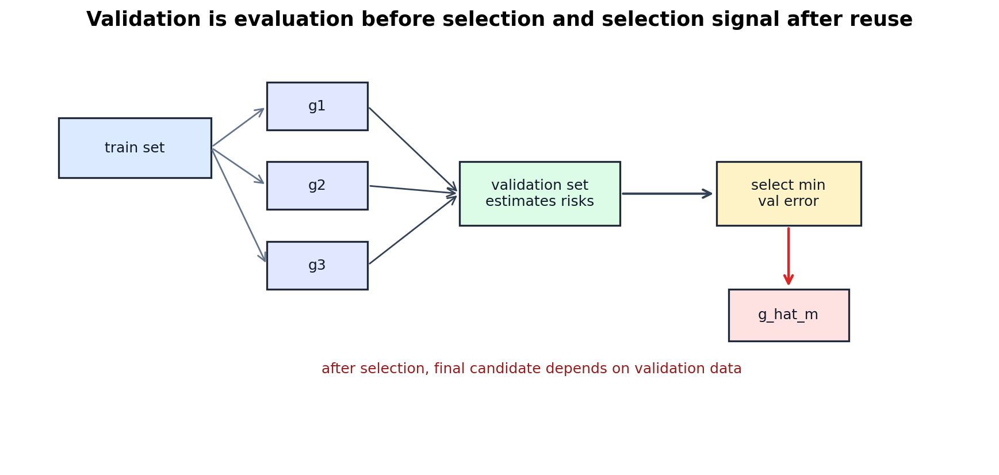
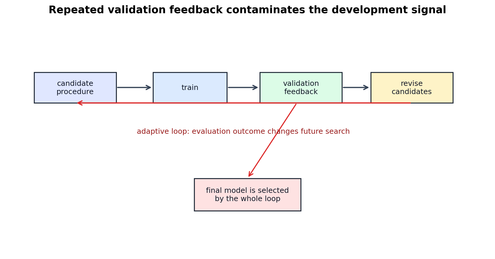
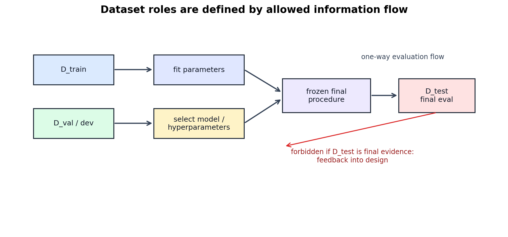

# Validation, Model Selection, and Data Contamination

[← Back to Learning From Data Theory Notebook](../README.md)

本章对应 Caltech `Learning From Data` Lecture 13: Validation。它是整个 theory track 的关键章节之一：一旦 validation data 影响 model choice，validation error 还意味着什么？



图 1：validation set 在 selection 前可评估多个 candidates；selection 后，最终 candidate 已经依赖 validation data。因此 validation error 不应再被当成 untouched final-test estimate。

## 0. Source Separation

### Caltech Core

Lecture 13 讨论 validation、model selection、data contamination 与 cross-validation。核心主线是：training error 不足以选择模型；validation data 可以帮助 model selection；但如果 evaluation data 被反复用于选择，它自身也会被污染。

### Formal Derivation

本章形式化 hold-out validation 的 candidate selection：

```math
\hat m
=
\arg\min_{m\in\mathcal{M}}
\hat R_{\mathrm{val}}(g_m)
```

并说明 $g_{\hat m}$ 是 validation-dependent object。

### Stanford CS229 Extension

CS229 的 model selection / cross-validation material 支持 train/dev/test split、K-fold CV 与 nested evaluation 的方法论解释。

### Stanford CS229M / Theory Extension

T2 的 simultaneous-selection logic 在这里扩展到 research process：outer hyperparameter search、checkpoint selection 与 researcher iteration 都会扩大 effective selection space。

## 1. Why Validation Is Needed

training error 用于 fitting parameters，但不能安全地选择 increasingly flexible alternatives。典型 dataset roles 是：

```text
Train
Validation / Dev
Test
```

各自角色应区分：

- **train set**：fit parameters；
- **validation/dev set**：select hyperparameters、features、architectures、thresholds、checkpoints 或 procedures；
- **test set**：在 final procedure 冻结后估计 performance。

如果 test set 参与了 tuning，它就不再是 final independent evaluation。

## 2. Hold-Out Validation

### Candidate Models

设候选 procedures 或 model classes 为：

```math
\mathcal{M}
=
\{M_1,\ldots,M_K\}
```

对每个 $M_m$：

1. 在 training set 上训练得到 $g_m$；
2. 在 validation set 上计算：

```math
\hat R_{\mathrm{val}}(g_m)
=
\frac{1}{n_{\mathrm{val}}}
\sum_{(x_i,y_i)\in D_{\mathrm{val}}}
\ell(g_m(x_i),y_i)
```

3. 选择：

```math
\hat m
=
\arg\min_{m\in\mathcal{M}}
\hat R_{\mathrm{val}}(g_m)
```

最终 candidate 是：

```math
g_{\hat m}
```

### What Validation Estimates Before Selection

对固定的 $g_m$，若 validation examples 独立同分布于目标 evaluation distribution，且 loss bounded 或满足相应 concentration 条件，则 $\hat R_{\mathrm{val}}(g_m)$ 可以作为 $R(g_m)$ 的 empirical estimate。

但是这句话里的 “fixed” 很重要。它适用于 selection 前的单个 candidate，而不是无条件适用于 selection 后的 minimum validation error。

## 3. Validation Is Itself Data-Dependent Selection

selection 后：

```math
g_{\mathrm{selected}}
=
g_{\hat m}
```

而：

```math
\hat m
=
\arg\min_{m\in\mathcal{M}}
\hat R_{\mathrm{val}}(g_m)
```

因此：

```math
g_{\mathrm{selected}}
=
A(D_{\mathrm{train}},D_{\mathrm{val}})
```

而不是：

```math
g=A(D_{\mathrm{train}})
```

### Consequence

validation data 不再只是“评估固定模型”的样本；它参与了 model selection。minimum validation error 往往 optimistic，因为它是多个 noisy estimates 的 minimum。

这与 T2 的 fixed hypothesis → selected hypothesis 断点完全同构：对单个 fixed candidate 的 concentration，不自动控制 data-selected candidate，除非考虑 candidate count、selection procedure、adaptive reuse 或额外独立 evaluation。

## 4. Validation Overfitting

validation overfitting 发生在研究者或 algorithm repeatedly tunes against the same validation set。常见来源：

- architecture search；
- hyperparameter tuning；
- early stopping；
- feature engineering；
- data augmentation tuning；
- prompt engineering；
- threshold selection；
- checkpoint choice；
- seed selection；
- preprocessing changes after inspecting validation failures。

每一次根据 validation outcome 修改 future candidates，都让 validation set 更像 training signal 的一部分。

### What This Does NOT Imply

validation set 仍然有用。问题不是“不能使用 validation”，而是必须承认：

- validation 可用于 development；
- validation-selected performance 不是 final independent estimate；
- repeated validation reuse 会降低 naive validation estimate 的可信强度；
- final test 需要在 development loop 外保持隔离。

## 5. Data Contamination

data contamination 不是单一机制，至少要区分：

### Direct Leakage

held-out labels、targets 或 future information 直接进入 training inputs。例如把 test label 派生的 feature 放进 training pipeline。

### Preprocessing Leakage

normalization、feature selection、imputation、PCA、token filtering 等 transformation 使用了本应 held-out 的数据估计统计量。

### Selection Leakage

validation/test performance 影响候选模型、hyperparameters、features、prompts 或 checkpoint 的选择。

### Benchmark Contamination

研究者或社区反复查看 benchmark results，并据此调整 systems。单个 paper 可能没有直接使用 test labels，但整个 development history 已经对 benchmark feedback 适应。

这些机制不完全相同。direct leakage 是数据管线错误；selection leakage 是 evidence role 被改变；benchmark contamination 是长期 adaptive interaction。

## 6. Effective Hypothesis Set of the Whole Research Process



图 2：每次 validation feedback 都可能改变后续 candidate generation。最终模型的 effective selection space 包含整个开发循环，而不只是最后一次训练的 architecture。

最终 reported model 通常不是从单一 fixed $\mathcal{H}$ 中一次性选出的。实际过程可能探索：

```text
architectures
hyperparameters
seeds
regularization strengths
preprocessing choices
augmentations
checkpoints
prompts
post-processing rules
human analysis iterations
```

因此 effective selection problem 不能只看 final architecture 的 parameter count 或 VC dimension。外层 candidate-generation 与 selection layer 也影响 generalization claim 的可信度。

### Research Discipline

不要为整个 adaptive research process 发明一个简单 exact VC dimension。更稳健的做法是记录：

- candidate space；
- data consulted；
- metrics consulted；
- number of attempts；
- selection rule；
- final freeze point；
- independent evaluation evidence。

## 7. Cross-Validation

### K-Fold CV

K-fold cross-validation 把数据分为 $K$ folds。每次用 $K-1$ folds 训练，用剩余 fold 验证，最后平均 validation error：

```math
\hat R_{\mathrm{CV}}
=
\frac{1}{K}
\sum_{k=1}^{K}
\hat R_{k}(g^{(-k)})
```

其中 $g^{(-k)}$ 是不使用第 $k$ 个 fold 训练出的 model。

### What CV Estimates

ordinary K-fold CV 估计的是某类 training procedure 在类似 sample-size 条件下的 expected validation performance。它提高数据利用率，但带来更高 computation cost，并且 folds 的 estimates 并非完全独立。

### What This Does NOT Imply

不能说：

```text
cross-validation removes model-selection bias
```

如果 CV 被用于 hyperparameter/model selection，那么 CV score 已经参与 selection。选完之后若要估计 completed selection procedure 的 final performance，仍需要独立 test 或 nested evaluation。

## 8. Nested Cross-Validation

### Modern Perspective

nested CV 区分 inner loop 与 outer loop：

```text
inner:
model / hyperparameter selection

outer:
evaluation of the selection procedure
```

在每个 outer split 中，inner training/validation 过程选择 model；outer held-out fold 评估整个 selection procedure 的表现。理论上重要的是：outer evaluation 不直接参与 inner selection。

### Boundary

nested CV 也不是万能保证。它仍依赖：

- sampled data 与 target population 的关系；
- folds 是否代表 deployment distribution；
- preprocessing 是否正确嵌入 folds；
- adaptive researcher decisions 是否在 outer loop 外影响 procedure；
- sample size 是否足够。

## 9. Final Test Isolation



图 3：train 可影响 parameters；validation/dev 可影响 model-selection decisions；final test 若要作为 final estimate，应只接收 frozen procedure 的 evaluation flow，不能把结果反馈到 development loop。

final test set 的角色是估计 completed selection procedure 的 performance。因此 final procedure 必须在 test evaluation 前冻结：

```text
all model / preprocessing / hyperparameter / threshold / checkpoint decisions frozen
→ run final test once
→ report result
```

### Canvas-Diagnostic-v1

Week 4 的 `Canvas-Diagnostic-v1` 被明确用作 diagnostic / development evidence。它帮助发现 real canvas distribution mismatch，因此不能在反复影响 preprocessing、model design 或 data collection 后再被声称为 final unbiased test。对应协议见：[Canvas dataset protocol](../../../reports/week4/13_canvas_dataset_protocol_and_next_stage_experiment_design.md)。

这不是说 diagnostic data 没价值；它非常有价值。但它支持的是 development diagnosis，不是 untouched final evaluation。

## 10. Research Lens

评估一篇 ML paper 或本仓库未来实验时，必须问：

- 哪些 data trained parameters？
- 哪些 data selected hyperparameters？
- 哪些 data selected architecture？
- 哪些 data changed preprocessing？
- 哪些 data changed the research hypothesis？
- 哪些 data produced the final reported number？
- 哪个时刻 final procedure 被 frozen？
- final evaluation 是否独立于 development loop？
- claimed population/distribution 是什么？

[← Back to Learning From Data Theory Notebook](../README.md)
