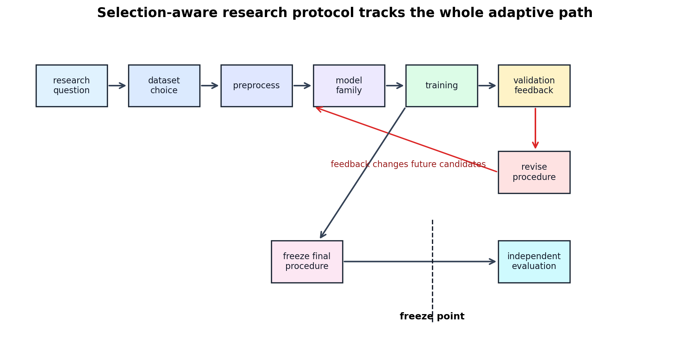

# Selection-Aware Machine Learning Research Protocol

[← Back to Learning From Data Theory Notebook](../README.md)

T2 的 [Generalization Claim Audit](../part2_generalization_theory/10_generalization_claim_audit_for_ml_research.md) 问的是：

```text
Is the generalization claim justified?
```

T3 的本文件问的是更过程化的问题：

```text
What entire sequence of data-dependent choices produced the reported model and number?
```

核心思想：effective learning procedure 不只是最后一次 optimizer call，而是所有影响 final model 和 final reported metric 的 data-dependent choices。



图 1：credible evaluation 需要识别 development loop 中哪些 information flows 回到了 candidate generation，并在 final evaluation 前明确 freeze point。

## 1. The Selection Graph

一个实际 ML project 的选择图通常像这样：

```text
Research question
↓
Dataset choice
↓
Preprocessing
↓
Model family
↓
Training
↓
Validation feedback
↓
Hyperparameter/model revision
↺
Repeated development loop
↓
Frozen final procedure
↓
Independent evaluation
```

关键是识别 backward information flow：

```text
evaluation outcome
→ changed future candidate generation
```

只要某个数据集的 outcome 改变了后续 model/procedure，它就参与了 selection。它可以仍然是有价值的 development evidence，但不能同时被解释为 untouched final test evidence。

## 2. Selection Ledger

对每个 project，应记录每个 data-influenced decision：

| Field | Meaning |
| ----- | ------- |
| Decision | 被选择的对象，例如 architecture、lambda、threshold、checkpoint |
| Candidate set | 实际考虑过哪些 alternatives |
| Data consulted | train、validation、diagnostic、test、benchmark、human feedback |
| Metric consulted | loss、accuracy、ECE、selective risk、qualitative errors |
| Number of attempts | 大致尝试次数或 search budget |
| Selection rule | pre-specified rule、manual choice、Bayesian optimization、grid search |
| Was choice pre-specified? | 是否在查看结果前确定 |
| Does this invalidate a held-out role? | 该数据是否仍可作为独立评估 |

### Research Use

这个 ledger 不只是管理文档。它帮助判断 final number 支持哪种强度的 claim：development observation、held-out empirical estimate、independent replication，还是 formal guarantee。

## 3. Dataset-Role Ledger

每个 dataset/split 都应有允许影响范围：

| Role | Allowed influence |
| ---- | ----------------- |
| Train | fit parameters and training-time statistics |
| Validation / Dev | select hyperparameters, checkpoints, thresholds, procedures |
| Diagnostic | identify failure modes; may guide future data/model changes |
| Calibration | fit calibration map or threshold policy, if separated |
| Policy-selection | choose abstention or decision rule |
| Test | evaluate frozen final procedure only |
| Deployment monitoring | detect post-deployment drift and failures |

### Canvas-Diagnostic-v1

`Canvas-Diagnostic-v1` 在本仓库中被用来发现真实 canvas input 的 distribution mismatch。它可以影响后续 preprocessing、data collection 或 model redesign；正因为如此，它不应再被当成 final unbiased test。

这解释了为什么先前协议强调它不能进入 training data，也不能在反复 development 后承担 final-test role。相关报告见：[Canvas protocol](../../../reports/week4/13_canvas_dataset_protocol_and_next_stage_experiment_design.md)。

## 4. Hyperparameter Search as Learning

hyperparameter tuner 本身是 learning / selection algorithm。若：

```math
\lambda_1,\ldots,\lambda_K
```

各自训练得到：

```math
g_{\lambda_1},\ldots,g_{\lambda_K}
```

并选择：

```math
\hat\lambda
=
\arg\min_{\lambda\in\{\lambda_1,\ldots,\lambda_K\}}
\hat R_{\mathrm{val}}(g_\lambda)
```

则 final model：

```math
g_{\hat\lambda}
```

依赖 validation set。搜索越广、越自适应，naive validation estimate 越容易 optimistic。这里的重点不是禁止 tuning，而是把 tuning 计入 learning procedure。

## 5. Researcher as Part of the Adaptive Loop

如果 human researcher 反复观察 validation/test outcomes 并修改实验，effective procedure 变成 adaptive to that evaluation data。

例如：

```text
inspect validation errors
→ change preprocessing
→ retrain
→ inspect validation again
→ change augmentation
→ retrain
→ choose best checkpoint
```

这个过程会把 validation set 的信息编码进最终 procedure。

### Boundary

ordinary classical bounds 不会自动量化 arbitrary researcher adaptivity。要严谨处理，需要额外假设、预注册 protocol、fresh holdout、nested evaluation、reusable holdout 方法或其他 adaptive-data-analysis 工具。

## 6. Evidence Dimensions / Claim Types

下面这些不是一个 universal strength order。它们是不同 evidence dimensions，回答不同问题，依赖不同 assumptions，也留下不同 unsupported claims。一个 formal bound 可能很严谨但 assumption-limited 或 numerically vacuous；强 empirical evidence 不能替代理论定理；same-distribution theorem 不 imply shift robustness；shift-specific testing 也不 imply arbitrary-distribution robustness。

| Evidence type | What question it answers | Assumptions it relies on | What it does NOT establish |
| ------------- | ------------------------ | ------------------------ | -------------------------- |
| Optimization / training evidence | optimizer 是否能降低 observed training objective | implementation 正确；training objective 定义清楚；training data/loop 如报告所述 | 不证明 generalization、calibration、robustness 或 mechanism |
| Development evidence | 调参过程中哪些 choices 看起来有用 | validation/dev role 被承认；selection loop 被记录；metric 与 task 有关 | 不提供 untouched final-test estimate |
| Untouched held-out empirical evidence | frozen procedure 在 held-out sample 上表现如何 | evaluation data 未影响 procedure；sampling distribution 明确；metric/loss 明确；样本量足够解释不确定性 | 不证明 causality、interpretability、calibration 或 arbitrary shift behavior |
| Independent replication evidence | 结果是否能在独立数据、实现或实验中重复 | replication 的 population、protocol 与 metric 可比较；独立性真实存在 | 不自动给出 formal guarantee，也不覆盖未测试环境 |
| Formal theoretical guarantee | 在明确 assumptions 下可推出什么 probability/expectation statement | assumptions 如 i.i.d.、bounded loss、capacity/stability/margin/control、distribution agreement 等成立 | 若假设不满足或 bound vacuous，不直接支持实际部署 claim |
| Shift-specific robustness evidence | 在指定 shifted environment 中表现如何 | shift type 明确定义；测试数据代表该 shift；evaluation 未被用于 selection 或 role 被明确 | 不证明任意 distribution shift、OOD generality 或 causal mechanism |

这些 evidence types 可以互相补充，但不能互相替代。credible ML research 应说明自己支持的是哪一种 claim，而不是把所有 evidence 压成一个单一“强弱等级”。

## 7. Freeze Point

freeze point 是 protocol 中的明确时刻：

```text
After this point,
the evaluation set must not influence model/procedure design.
```

冻结内容应包括：

- preprocessing；
- features；
- architecture；
- training objective；
- optimizer settings；
- hyperparameters；
- checkpoint-selection rule；
- calibration/threshold/abstention policy；
- random seed policy；
- evaluation metric。

如果 final test 结果导致任何这些元素改变，则需要新的 independent final evaluation 才能维持同样强度的 claim。

## 8. Final Audit Questions

未来阅读 paper 或设计实验时，至少回答：

- What was fit?
- What was selected?
- What was tuned?
- How many candidate procedures were effectively explored?
- Which split influenced each decision?
- When was the final procedure frozen?
- Was the final evaluation independent of the development loop?
- What population/distribution does the result speak about?
- Which claims remain unsupported?

## 9. Connection to T2 Claim Audit

T2 的 audit 关注 generalization claim 的假设、capacity control 与 evidence strength。本文件补上 T3 的 missing layer：

```text
data-dependent development process
```

如果不知道 final model 是如何被选择出来的，就无法判断 evaluation number 应该被解释为：

- fixed-model estimate；
- selected-model validation score；
- adaptive benchmark result；
- independent final-test result；
- 或只是 development diagnostic。

[← Back to Learning From Data Theory Notebook](../README.md)
