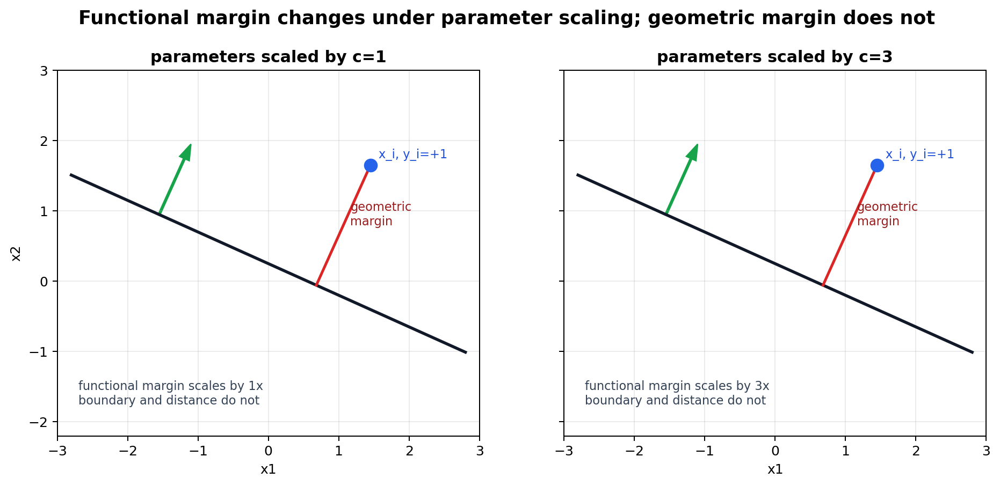
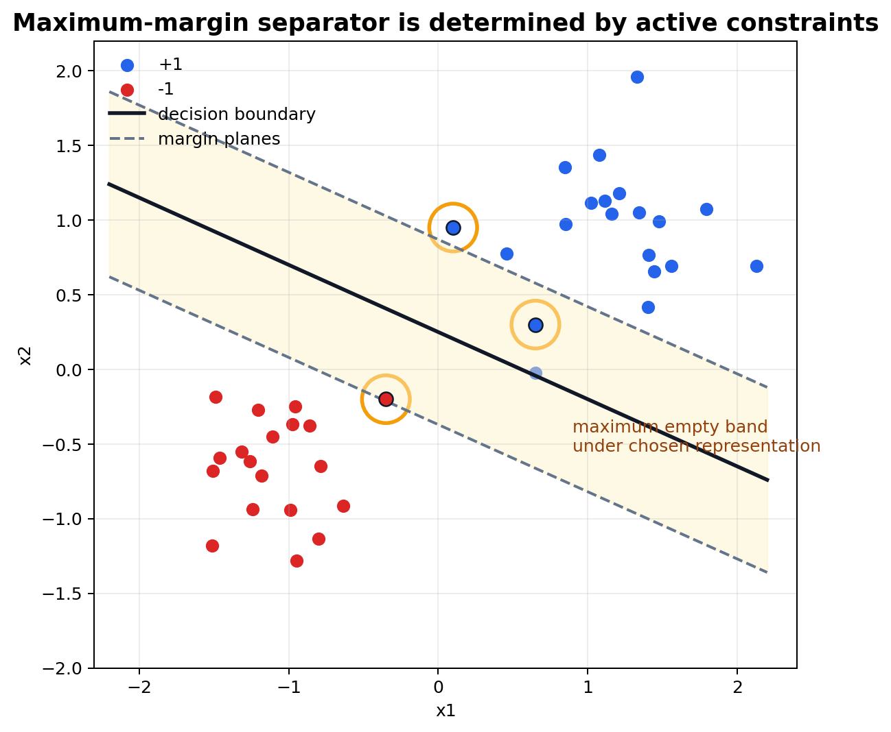
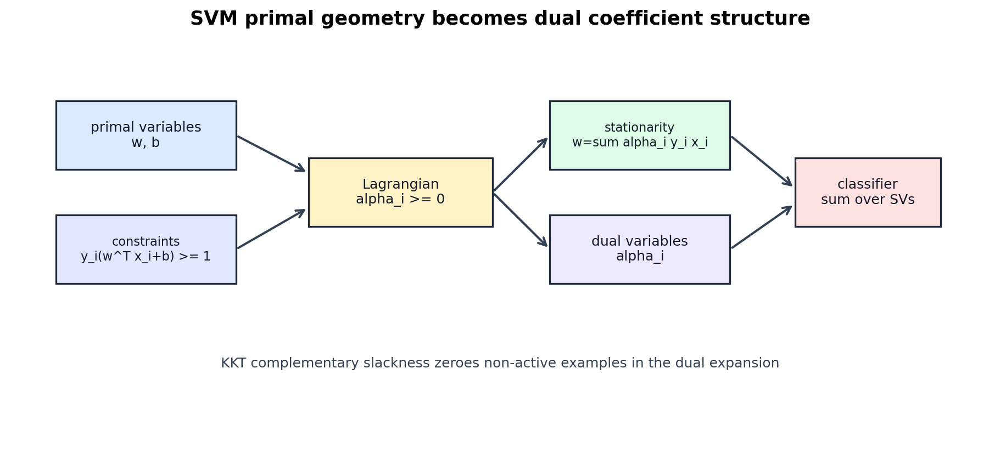

# Support Vector Machines: Margin, Geometry, and Duality

[Back to Learning From Data Theory Notebook](../README.md)

本章对应 Caltech `Learning From Data` Lecture 14: Support Vector Machines。这里的重点不是“多学一个 classifier”，而是把 SVM 看成 geometry、optimization、regularization、capacity 与 generalization 的交汇点。



图 1：把参数乘以正数不会改变 separating boundary，但会改变 functional margin。geometric margin 通过除以参数 norm 去掉这种任意 scale。



图 2：maximum-margin separator 由 margin constraints 和 dual coefficients 共同决定。optimal dual coefficient 非零的训练点称为 support vectors。



图 3：primal problem 用 $w,b$ 和 constraints 表达几何；dual problem 用 training examples 与 nonzero coefficients 表达同一个解。

## 0. Source Separation

### Caltech Core

Lecture 14 通过 separating hyperplane、margin maximization、support vectors 说明：maximum-margin classifier 不是任意 linear separator，而是带有明确几何偏好的 separator。

### Formal Derivation

本章给出 hard-margin primal、hyperplane distance、functional margin、geometric margin、Lagrangian dual、KKT conditions 与 support-vector solution structure。

### Stanford CS229 Extension

CS229 提供 functional margin / geometric margin、optimal-margin classifier、Lagrange duality、KKT conditions 与 support-vector interpretation 的标准数学推导。这里不会把 CS229 推导标成 Caltech 内容。

### Stanford CS229M / Theory Extension

CS229M 风格的连接只用于 capacity 讨论：modern generalization analysis 往往依赖 selected solution、norm、margin、stability 或 compression，而不只是 raw parameter count。

### Research Lens

SVM 对研究阅读的价值在于追问：representation 诱导了什么 geometry？learning algorithm 偏好哪类 simple solution？

## 1. Start from the Separating Hyperplane

binary labels 设为

```math
y_i\in\{-1,+1\},
```

affine score 为

```math
f(x)=w^\top x+b
```

classifier 为

```math
g(x)=\mathrm{sign}(f(x)).
```

decision boundary 是集合

```math
\{x:w^\top x+b=0\}.
```

当 $w\ne0$ 时，这是一个 hyperplane。$w$ 是 hyperplane 的 normal vector，因为任意两个边界上的点 $x_a,x_b$ 满足

```math
w^\top x_a+b=0,
\qquad
w^\top x_b+b=0.
```

相减得到

```math
w^\top(x_a-x_b)=0.
```

$x_a-x_b$ 是 hyperplane 内部方向，因此 $w$ 与所有 tangent direction 正交。

### Derivation: Point-to-Hyperplane Distance

#### Assumptions / 假设

- $w\ne 0$。
- hyperplane 为 $H=\{x:w^\top x+b=0\}$。
- $x_0$ 是任意输入点。

#### Claim / 结论

$x_0$ 到 $H$ 的 signed distance 是

```math
\frac{w^\top x_0+b}{\|w\|_2},
```

unsigned distance 是

```math
\frac{|w^\top x_0+b|}{\|w\|_2}.
```

#### Derivation / Proof Idea

沿 normal direction 从 $x_0$ 移动到 hyperplane。令

```math
x_\perp
=
x_0
-
t w.
```

要求 $x_\perp$ 满足 hyperplane equation：

```math
w^\top(x_0-tw)+b=0.
```

因此

```math
w^\top x_0
-
t\|w\|_2^2
+
b
=
0,
```

得到

```math
t
=
\frac{w^\top x_0+b}{\|w\|_2^2}.
```

位移长度为

```math
\|x_0-x_\perp\|_2
=
\|t w\|_2
=
\frac{|w^\top x_0+b|}{\|w\|_2}.
```

#### Interpretation / 解释

$w^\top x_0+b$ 本身不是 distance。只有除以 $\|w\|_2$ 后，它才成为当前 representation geometry 下的几何距离。

#### What This Does NOT Imply

这个距离只在当前 representation 的 geometry 中有意义。若 $x$ 本身是糟糕 representation，Euclidean hyperplane distance 不一定对应 semantic 或 mechanistic similarity。

#### Research Use

看到 margin claim 时要问：margin 在哪个 representation 中定义？用哪个 norm？feature scaling 是否改变结论？

## 2. Functional Margin

对 labeled example $(x_i,y_i)$，functional margin 定义为

```math
\hat\gamma_i
=
y_i(w^\top x_i+b).
```

它的 sign 表示分类是否正确：

- $\hat\gamma_i>0$：classified correctly；
- $\hat\gamma_i=0$：点在 decision boundary 上；
- $\hat\gamma_i<0$：misclassified。

它的 magnitude 是 label-aligned score 的数值大小。但问题是 scale dependence。对任意 $c>0$，

```math
\mathrm{sign}(cw^\top x+cb)
=
\mathrm{sign}(w^\top x+b),
```

所以 $(w,b)$ 和 $(cw,cb)$ 表示同一个 classifier。但 functional margin 变成

```math
y_i((cw)^\top x_i+cb)
=
c\,y_i(w^\top x_i+b)
=
c\hat\gamma_i.
```

因此 functional margin 不能单独刻画 classifier 的几何质量；它混入了任意 parameter scale。

## 3. Geometric Margin

geometric margin 用 $\|w\|_2$ 去掉参数 scale：

```math
\gamma_i
=
\frac{y_i(w^\top x_i+b)}{\|w\|_2}.
```

对 $c>0$，

```math
\frac{y_i((cw)^\top x_i+cb)}{\|cw\|_2}
=
\frac{c\,y_i(w^\top x_i+b)}{c\|w\|_2}
=
\gamma_i.
```

因此 geometric margin 对 positive rescaling 不变。它表示 $x_i$ 到 decision boundary 的 signed distance。

关键区别是：

```text
parameter scale
!=
decision-boundary geometry
```

functional margin 是 score 数值尺度；geometric margin 是 representation 与 norm 固定后，boundary 与 data 的几何关系。

## 4. Maximum-Margin Principle

separable data 意味着存在 $(w,b)$ 使得

```math
y_i(w^\top x_i+b)>0
\quad
\text{for all } i.
```

由于 scaling 任意，可以选择 canonical scale，使最小 functional margin 等于 $1$：

```math
\min_i y_i(w^\top x_i+b)=1.
```

等价地，

```math
y_i(w^\top x_i+b)\ge 1
\quad
\text{for all } i.
```

在这个 scale 下，minimum geometric margin 是

```math
\gamma
=
\min_i
\frac{y_i(w^\top x_i+b)}{\|w\|_2}
=
\frac{1}{\|w\|_2}.
```

两个 margin planes

```math
w^\top x+b=1
```

和

```math
w^\top x+b=-1
```

之间的距离是

```math
\frac{2}{\|w\|_2}.
```

因此 maximizing geometric margin 等价于 minimizing $\|w\|_2$。standard hard-margin SVM 写成

```math
\min_{w,b}
\frac12\|w\|_2^2
```

subject to

```math
y_i(w^\top x_i+b)\ge 1
\quad
i=1,\ldots,N.
```

因子 $1/2$ 是 computational convention：它让 $\frac12\|w\|_2^2$ 的 derivative 等于 $w$，避免 stationarity equation 中多一个 $2$。它不改变 optimizer。

## 5. Why Margin Can Act as Complexity Control

T2 说明：low training error 本身不能保证 generalization。learning procedure 必须控制它可能选择的 effective solution set。

large margin 不只是“点离边界远，所以更 confident”。SVM margin 是 geometric constraint：在当前 representation 中，所有能分开 training data 的 separators 里，algorithm 偏好 canonical scaling 下 $\|w\|_2$ 小、geometric separation 大的 separator。

这很重要，因为许多 linear separators 都可以完美分类 training set。maximum margin 通过 norm/margin preference 选出特定 separator。在某些 setting 中，margin- 或 norm-controlled family 的 generalization analysis 比 raw parameter count 更有信息量。这连接 T2 的 nominal class size vs effective capacity，也连接 T3 的 hypothesis family vs solution-selection procedure。

### What This Does NOT Imply

- large SVM margin 不自动等于 calibrated probability。
- margin alone 不普遍决定 generalization。
- training margin 大不自动证明 distribution shift 下 robust。
- margin 在 chosen representation 中测量；feature scaling 会改变它。

## 6. Primal Optimization Problem

hard-margin primal 是：

```math
\begin{aligned}
\min_{w,b}\quad
&
\frac12\|w\|_2^2
\\
\text{subject to}\quad
&
y_i(w^\top x_i+b)\ge 1,
\quad i=1,\ldots,N.
\end{aligned}
```

variables：

- $w\in\mathbb{R}^d$ 控制 normal direction 和 norm；
- $b\in\mathbb{R}$ 控制 offset；
- data $(x_i,y_i)$ 固定。

objective：minimize squared norm，也就是 maximize canonical geometric margin。

constraints：每个 training point 都必须在正确一侧并满足 margin constraint。

convexity：

- objective 对 $w$ 是 convex quadratic；
- constraints 对 $(w,b)$ 是 affine inequalities；
- 整体是 convex quadratic program。

这不同于 logistic regression：

```text
Logistic regression:
probabilistic conditional model + likelihood

Hard-margin SVM:
geometric separation + constrained optimization
```

Logistic regression 用 sigmoid score 建模 $p(y\mid x)$，优化 likelihood / cross entropy。hard-margin SVM 默认不输出 calibrated probability；它通过 maximizing margin 选择 separating boundary。二者不是简单的“谁更好”，而是建模目标和 objective geometry 不同。

## 7. Lagrangian Dual

### Theorem: Hard-Margin SVM Dual

#### Assumptions / 假设

- data 在当前 representation 中 linearly separable。
- primal problem 是上面的 hard-margin SVM。
- Lagrange multipliers $\alpha_i\ge0$ 对应 constraints

```math
y_i(w^\top x_i+b)-1\ge0.
```

#### Claim / 结论

dual problem 是

```math
\begin{aligned}
\max_{\alpha}\quad
&
\sum_i\alpha_i
-
\frac12
\sum_i\sum_j
\alpha_i\alpha_j y_i y_j x_i^\top x_j
\\
\text{subject to}\quad
&
\alpha_i\ge0,
\\
&
\sum_i\alpha_i y_i=0.
\end{aligned}
```

optimality 下，

```math
w
=
\sum_i\alpha_i y_i x_i.
```

#### Derivation / Proof Idea

从 Lagrangian 开始：

```math
L(w,b,\alpha)
=
\frac12\|w\|_2^2
-
\sum_i
\alpha_i
\left[
y_i(w^\top x_i+b)-1
\right],
```

其中

```math
\alpha_i\ge0.
```

展开：

```math
L(w,b,\alpha)
=
\frac12\|w\|_2^2
-
\sum_i\alpha_i y_i w^\top x_i
-
b\sum_i\alpha_i y_i
+
\sum_i\alpha_i.
```

对 $w$ stationarity：

```math
\nabla_w L
=
w
-
\sum_i\alpha_i y_i x_i
=
0,
```

所以

```math
w
=
\sum_i
\alpha_i y_i x_i.
```

对 $b$ stationarity：

```math
\frac{\partial L}{\partial b}
=
-
\sum_i\alpha_i y_i
=
0,
```

所以

```math
\sum_i\alpha_i y_i=0.
```

把 stationarity relations 代回 Lagrangian。因为

```math
\sum_i\alpha_i y_i w^\top x_i
=
w^\top
\sum_i\alpha_i y_i x_i
=
w^\top w
=
\|w\|_2^2
```

且 $b\sum_i\alpha_i y_i=0$，对 $w,b$ minimized 后的 Lagrangian 为

```math
\sum_i\alpha_i
-
\frac12\|w\|_2^2.
```

再用

```math
\|w\|_2^2
=
\left(
\sum_i\alpha_i y_i x_i
\right)^\top
\left(
\sum_j\alpha_j y_j x_j
\right)
=
\sum_i\sum_j
\alpha_i\alpha_j y_i y_j x_i^\top x_j,
```

得到 dual objective：

```math
\sum_i\alpha_i
-
\frac12
\sum_i\sum_j
\alpha_i\alpha_j y_i y_j x_i^\top x_j.
```

#### Interpretation / 解释

primal 用 $w$ 描述 geometric separator；dual 用 training examples 的 coefficients 和 inner products 描述同一个 solution。

#### What This Does NOT Imply

dual 不是代数装饰。它改变了 learned classifier 的 representation，并让 Lecture 15 的 kernelization 成为可能。但 dual 不会取消 representation choice 和 learning-procedure control 的必要性。

#### Research Use

dual 让我们追问：哪些 data points 直接决定 boundary？geometry 如何通过 pairwise inner products 进入算法？

## 8. KKT Conditions

hard-margin SVM 的 Karush-Kuhn-Tucker conditions 包括：

Primal feasibility：

```math
y_i(w^\top x_i+b)-1\ge0
\quad
\text{for all } i.
```

Dual feasibility：

```math
\alpha_i\ge0
\quad
\text{for all } i.
```

Stationarity：

```math
w
=
\sum_i\alpha_i y_i x_i,
\qquad
\sum_i\alpha_i y_i=0.
```

Complementary slackness：

```math
\alpha_i
\left[
y_i(w^\top x_i+b)-1
\right]
=
0
\quad
\text{for all } i.
```

complementary slackness 解释 support vectors。若某点严格在 margin 外：

```math
y_i(w^\top x_i+b)>1.
```

bracket 为正，因此 product 为零只能有

```math
\alpha_i=0.
```

若 $\alpha_i>0$，则 complementary slackness 强制 bracket 为零：

```math
y_i(w^\top x_i+b)=1.
```

dual solution 中的 support vector 定义为 optimal dual coefficient 非零的 training point，即 $\alpha_i>0$。因此 hard-margin problem 中每个 support vector 都在 active margin constraint 上。

不要反向理解为自动成立。在 degenerate optimum 中，active margin constraint 原则上可能有 zero multiplier。因此 “active constraint” 与 “nonzero support coefficient” 不能不加限定地当成逻辑等价。

这回答结构性问题：

```text
只有 optimal dual coefficient 非零的 training points 会直接出现在 w 中。
```

其他 points 仍然通过 feasibility constraints 间接影响 optimum；但一旦 optimum 固定，它们不出现在 $w$ 的 dual expansion 中。

## 9. Support Vectors as Solution Structure

因为

```math
w
=
\sum_i\alpha_i y_i x_i
```

且 support vectors 按 nonzero optimal coefficients 定义，solution 可写为

```math
w
=
\sum_{i\in SV}
\alpha_i y_i x_i.
```

classifier 为

```math
f(x)
=
w^\top x+b
=
\sum_{i\in SV}
\alpha_i y_i x_i^\top x
+
b.
```

这是 sparse dual-expansion structure：final classifier 可以直接只依赖 optimal dual coefficient 非零的 training points。

### What This Does NOT Imply

不能写成：

```text
few support vectors
=
automatic generalization guarantee
```

support-vector sparsity 是 solution structure。只有当它与具体 compression、margin、stability 或相关 theorem 连接时，才构成 generalization-control argument。support vector 的数量与位置、margin size、data distribution、feature scaling、kernel choice、regularization 和 sampling process 都影响能推出什么。

## 10. Research Lens

阅读 SVM 或 margin-based paper 时，问：

- representation 诱导了什么 geometry？
- 哪个 norm 定义 margin？
- 哪些 points 决定 learned boundary？
- algorithm 偏好什么 simplicity notion？
- representation 改变后会怎样？
- feature rescaling 后会怎样？
- reported margin 是否在 hyperparameter selection 前后计算？
- large training margin 是否说明 deployment robustness，还是只说明 training geometry？
- confidence 是否被解释成 calibrated probability？若是，calibration evidence 是什么？

### Existing Repository Links

- T1 Lecture 3 引入 nonlinear feature transforms：[feature transforms](../part1_learning_problem/03_caltech_l03_hypothesis_spaces_linear_models_feature_transforms.md)。
- T2 区分 capacity 与 parameter count：[VC dimension and capacity](../part2_generalization_theory/07_caltech_l07_vc_dimension_capacity_and_sample_complexity.md)。
- T3 说明 regularization 是 solution preference：[regularization](../part3_fitting_regularization_validation/12_caltech_l12_regularization_constraints_inductive_bias.md)。
- Week 2 logistic regression 提供 probabilistic score modeling 与 geometric separation 的对比：[Week 2 report](../../../reports/week2_linear_logistic_regression.md)。
- Week 5 calibration 说明 margin 与 probability reliability 是不同 claim：[calibration metrics](../../../reports/week5/02_calibration_metrics_and_reliability_diagrams.md)。

[Back to Learning From Data Theory Notebook](../README.md)
