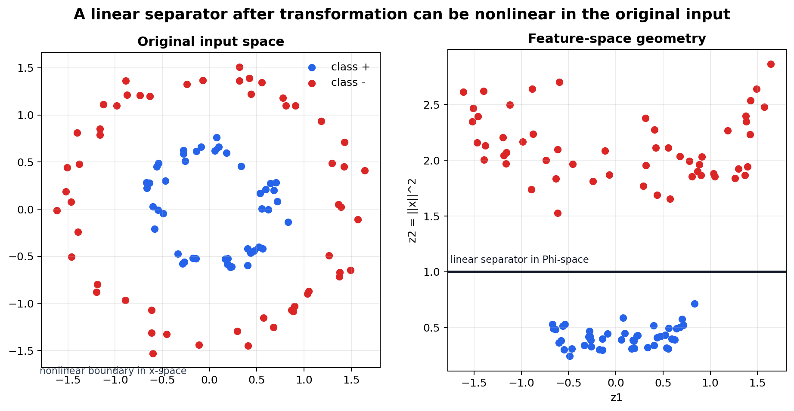
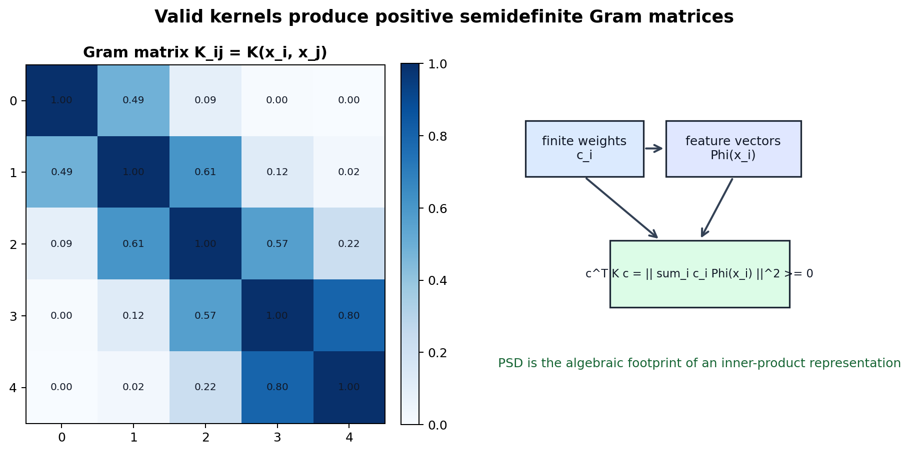
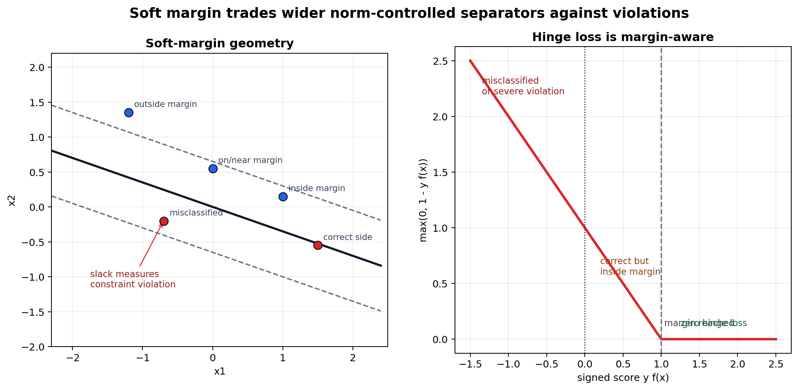

# Kernel Methods: Feature Spaces, Similarity, and Soft Margins

[Back to Learning From Data Theory Notebook](../README.md)

本章对应 Caltech `Learning From Data` Lecture 15: Kernel Methods。核心问题是：

```text
线性几何算法怎样在不显式构造 transformed feature vector 的情况下，
产生 nonlinear decision boundary？
```



图 1：原始 input space 中的 nonlinear pattern，经过 feature transformation 后可能在 feature space 中线性可分。kernel method 通过该空间中的 inner product 运算。



图 2：valid inner-product kernel 会产生 positive semidefinite Gram matrix，因为任意 quadratic form 都等于 feature space 中某个向量的 squared norm。



图 3：soft-margin SVM 用 slack variables 表示 margin violations；hinge-loss view 是同一 tradeoff 的 regularized unconstrained form，差别只在 scaling convention。

## 0. Source Separation

### Caltech Core

Lecture 15 把 SVM 推到 nonlinear transformations、kernels、kernel trick、nonseparable data 与 soft margins。Caltech 的主线是：改变 representation 后，线性 separator 可以表达原始空间中的非线性边界。

### Formal Derivation

本章给出 feature-space SVM dual、kernelized prediction form、PSD Gram-matrix derivation、soft-margin primal、hinge-loss equivalence，以及 soft-margin dual 中的 box constraint。

### Stanford CS229 Extension

CS229 提供 primal/dual SVM、kernelization、Lagrange duality、KKT conditions 与 soft-margin SVM 的标准数学支撑。这里使用这些推导作为形式化扩展，不把它们误标为 Caltech slide 内容。

### Stanford CS229M / Theory Extension

理论桥接只用于区分 ambient feature dimension 与 effective statistical complexity。即使 feature map 是 infinite-dimensional，只要 learning algorithm 对 norm、margin 或 selected solution 施加结构约束，仍可能得到统计上有意义的 learner。

### Modern Perspective

RKHS 语言只作为 preview 使用：许多 kernel 可以理解为某个 Hilbert space 中的 inner product。完整 RKHS theory 不在 T4 展开。

## 1. 回到 Nonlinear Feature Transforms

T1 Lecture 3 已经引入 feature transform：

```math
x
\mapsto
\Phi(x).
```

变换后，linear score 变为

```math
f(x)
=
w^\top\Phi(x)+b.
```

这里的 model 是：

```text
linear in feature space
```

但它在原始 input space 中诱导的 decision boundary 可以是 nonlinear：

```text
linear in Phi(x)
!=
linear in x
```

这正是 Lecture 3 与 kernel methods 的连接点。SVM 仍然在寻找 separating hyperplane，但这个 hyperplane 存在于 represented space，而不一定存在于 raw input space。

## 2. 为什么 Dual 重要

Lecture 14 的 hard-margin SVM dual 是：

```math
\begin{aligned}
\max_{\alpha}\quad
&
\sum_i\alpha_i
-
\frac12
\sum_i\sum_j
\alpha_i\alpha_j y_i y_j x_i^\top x_j
\\
\text{subject to}\quad
&
\alpha_i\ge0,
\\
&
\sum_i\alpha_i y_i=0.
\end{aligned}
```

注意 training examples 进入 objective 的方式：它们只通过 inner products $x_i^\top x_j$ 出现。

若先做 feature transform，primal score 是

```math
f(x)
=
w^\top\Phi(x)+b,
```

stationarity relation 变为

```math
w
=
\sum_i\alpha_i y_i\Phi(x_i).
```

代回 dual 后，原来的 $x_i^\top x_j$ 变成

```math
\Phi(x_i)^\top\Phi(x_j).
```

这就是通向 kernels 的桥：如果算法只需要这些 inner products，就不一定要显式构造 $\Phi(x)$。

## 3. Kernel Definition

kernel 是一个函数

```math
K(x,z)
=
\langle \Phi(x),\Phi(z)\rangle
```

其中 $\Phi$ 把输入映射到某个 inner-product space。

把 kernel 简写成下面这句话很常见，但不够精确：

```text
kernel = similarity function
```

更准确的说法是：

```text
kernel 是一种 similarity-like function，
但它必须具有可作为某个 feature space inner product 的数学结构。
```

这个区别很重要。SVM dual 和 prediction rule 需要 inner-product geometry，而不是任意 pairwise score。

## 4. Kernel Trick

kernel trick 的操作是：不显式计算

```math
\Phi(x),
```

而直接计算

```math
K(x,z).
```

feature-space dual 变成

```math
\begin{aligned}
\max_{\alpha}\quad
&
\sum_i\alpha_i
-
\frac12
\sum_i\sum_j
\alpha_i\alpha_j y_i y_j K(x_i,x_j)
\\
\text{subject to}\quad
&
\alpha_i\ge0,
\\
&
\sum_i\alpha_i y_i=0.
\end{aligned}
```

prediction rule 是

```math
f(x)
=
\sum_{i\in SV}
\alpha_i y_i K(x_i,x)
+
b.
```

因此，algorithm 可以像是在 feature space 中构造 linear separator 一样工作，但实际计算只调用 pairwise kernel function。

### What This Does NOT Imply

不要写成：

```text
kernel = nonlinear feature transform
```

feature map 与 kernel 是不同对象。feature map 把 input 映射到 represented space；kernel 计算与该 representation 对应的 inner product。kernel 不是“变换本身”，而是让 dual algorithm 间接使用该变换的函数。

## 5. High-Dimensional and Infinite-Dimensional Feature Spaces

有些 kernels 对应 very high-dimensional feature maps；有些对应 infinite-dimensional Hilbert-space representations。Gaussian kernel 是建立这种直觉的标准例子。

T4 的关键点是：

```text
infinite-dimensional representation
!=
uncontrolled learner
```

原因是：

```text
feature dimension
```

和

```text
effective statistical complexity
```

不是同一个对象。

需要分开三类东西：

**Structural / Generalization Control**

- feature-space norm control；
- margin control；
- soft-margin regularization；
- algorithmic stability 或 compression argument，仅在具体 theorem 使用时才成立；
- optimization problem 对 selected solution 的限制。

**Statistical Conditions**

- sample size 影响 estimation/generalization precision；
- i.i.d. 或其他 sampling assumptions 决定 classical generalization claim 的适用范围；
- target distribution 决定证据到底面向哪个 population。

**Selection / Evaluation Discipline**

- kernel hyperparameter selection；
- validation reuse；
- benchmark feedback；
- held-out final evaluation。

因此，不能把 sample size 或 validation protocol 当成 hypothesis capacity 本身。sample size 影响估计精度；validation discipline 保护 evidence credibility；它们不是 norm/margin 这种 structural control。

T2 提醒我们 raw hypothesis-class capacity 可能太粗，因为它忽略 selected solution。T3 说明 regularization 改变 solution preference。kernel SVM 把两点结合起来：非常丰富甚至 infinite-dimensional 的 representation，仍可能在 norm/margin control 与正确 evidence discipline 下形成可解释的 learner。

### What This Does NOT Imply

- infinite feature space 不自动意味着 overfitting；
- infinite feature space 也不自动安全；
- kernel method 仍然包含 representation 与 similarity assumptions；
- training distribution、validation process 与 hyperparameter search 仍然限制最终能声称什么。

## 6. Valid Kernels and PSD Gram Matrices

给定 points

```math
x_1,\dots,x_N,
```

定义 Gram matrix：

```math
K_{ij}
=
K(x_i,x_j).
```

### Theorem: Inner-Product Kernels Produce PSD Gram Matrices

#### Assumptions

- 存在 feature map $\Phi$，其 codomain 是 inner-product space；
- $K(x,z)=\langle \Phi(x),\Phi(z)\rangle$；
- $c\in\mathbb{R}^N$ 是任意有限 coefficient vector。

#### Claim

Gram matrix 是 positive semidefinite：

```math
c^\top K c\ge0.
```

#### Derivation / Proof Idea

从 quadratic form 出发：

```math
c^\top K c
=
\sum_i\sum_j c_i c_j K(x_i,x_j).
```

使用 kernel definition：

```math
c^\top K c
=
\sum_i\sum_j
c_i c_j
\langle \Phi(x_i),\Phi(x_j)\rangle.
```

利用 inner product 的 bilinearity：

```math
c^\top K c
=
\left\langle
\sum_i c_i\Phi(x_i),
\sum_j c_j\Phi(x_j)
\right\rangle.
```

于是

```math
c^\top K c
=
\left\|
\sum_i c_i\Phi(x_i)
\right\|^2
\ge
0.
```

#### Interpretation

PSD condition 不是形式上的附属要求。它是 finite sample 上“这些 kernel values 可以像 inner products 一样运算”的代数签名。

#### What This Does NOT Imply

这个推导说明：只要 inner-product feature representation 存在，Gram matrix 就是 PSD。它没有证明每个 symmetric similarity score 都是 valid kernel。

#### Research Use

当论文提出新的 kernel-like similarity 时，要检查 finite Gram matrices 是否 PSD。若不是，方法可能在使用 indefinite similarity，此时不能直接套用 standard kernel-SVM theory。

## 7. Mercer Theorem Caveat

常见错误是写成：

```text
any similarity function is a kernel
```

这是错的。

更精确的层次是：

- valid inner-product kernel 在任意 finite input set 上产生 symmetric PSD Gram matrices；
- 在许多 modern kernel-method treatments 中，finite Gram-matrix PSD condition 是有限数据算法所需的 operational condition；
- 在合适条件下，symmetric PSD kernel 有 associated Hilbert-space feature representation；
- classical Mercer theorem 的更强表述还需要 continuity、compactness 等 integral-operator 条件。

工作性结论是：

```text
kernel validity 是数学性质，
不是给任何直观相似度函数贴上的标签。
```

## 8. Common Kernels

### Linear Kernel

```math
K(x,z)=x^\top z.
```

这是原始 input-space inner product。它假设 raw features 或 engineered features 的坐标几何就是 relevant geometry。

### Polynomial Kernel

常见形式是

```math
K(x,z)
=
(x^\top z+c)^p.
```

degree $p$ 控制哪些 polynomial interactions 变得 linearly accessible；offset $c$ 改变 lower-order terms 的进入方式。这个 kernel 通过引入 interaction patterns 改变 feature-space geometry。

### Gaussian / RBF Kernel

```math
K(x,z)
=
\exp
\left(
-
\frac{\|x-z\|^2}{2\sigma^2}
\right).
```

width $\sigma$ 控制 similarity 随 distance 衰减的速度。较小 $\sigma$ 让 similarity 更 local；较大 $\sigma$ 让 similarity 更 broad。这里说的是 geometry，不是无条件的 bias-variance law；具体效果取决于 data distribution、feature scaling、sample size、regularization 与 metric 是否有意义。

### Hyperparameters Alter Geometry

kernel hyperparameters 不是无害的 implementation details。它们决定哪些 examples 在 induced feature geometry 中显得 close、aligned 或 similar。它们的选择属于 T3 的 validation 与 adaptive-selection 问题。

## 9. Soft-Margin SVM

真实数据通常不能在所选 feature space 中完全 separable；即使可分，强行 perfect separation 也可能是在 fitting noise。soft-margin SVM 引入 slack variables：

```math
\xi_i\ge0
```

约束为

```math
y_i(w^\top\Phi(x_i)+b)
\ge
1-\xi_i.
```

primal problem 是

```math
\begin{aligned}
\min_{w,b,\xi}\quad
&
\frac12\|w\|^2
+
C\sum_i\xi_i
\\
\text{subject to}\quad
&
y_i(w^\top\Phi(x_i)+b)\ge1-\xi_i,
\\
&
\xi_i\ge0.
\end{aligned}
```

tradeoff 是：

```text
margin preference
vs
training violations
```

coefficient $C$ 控制 slack 相对于 norm penalty 的代价。较大 $C$ 更强惩罚 violations；较小 $C$ 允许更多 margin violations 来换取 smaller norm。这正是 T3 的 regularization tradeoff。

## 10. Hinge-Loss View

定义 signed score：

```math
s_i
=
y_i f(x_i).
```

hinge loss 是

```math
\ell_{\mathrm{hinge}}(s_i)
=
\max(0,1-s_i)
=
\max(0,1-y_i f(x_i)).
```

对固定 $w,b$，满足

```math
\xi_i\ge0,
\qquad
\xi_i\ge 1-y_i f(x_i)
```

的最小 feasible slack 是

```math
\xi_i^*
=
\max(0,1-y_i f(x_i)).
```

把 optimal slacks 代回 soft-margin primal，得到 regularized hinge-loss objective：

```math
\min_{w,b}
\frac12\|w\|^2
+
C\sum_i
\max(0,1-y_i f(x_i)).
```

不同教材可能把 empirical loss 除以 $N$，或者把 regularization coefficient 放在不同位置。概念等价不变，但要注意 scaling convention。

解释四种位置：

- $y_i f(x_i)>1$：分类正确且在 margin 外，hinge loss 为零；
- $y_i f(x_i)=1$：正好在 margin 上，hinge loss 为零但 constraint active；
- $0<y_i f(x_i)<1$：分类正确但在 margin 内，hinge loss 为正；
- $y_i f(x_i)<0$：misclassified，hinge loss 大于 $1$。

### What This Does NOT Imply

hinge loss 不是 log loss，本身不产生 calibrated probabilities。较大的 positive SVM score 不自动等于“更高概率置信度”。

## 11. Soft-Margin Dual

### Theorem: Slack Variables Create Box Constraints

#### Assumptions

- soft-margin primal 使用 slack penalty $C\sum_i\xi_i$；
- $\alpha_i\ge0$ 是 margin constraints 的 multipliers；
- $\mu_i\ge0$ 是 slack nonnegativity constraints $\xi_i\ge0$ 的 multipliers。

#### Claim

dual objective 与 hard-margin dual 具有同样的 kernelized quadratic form，但 multipliers 满足

```math
0\le\alpha_i\le C
```

而不只是

```math
\alpha_i\ge0.
```

#### Derivation / Proof Idea

写出 Lagrangian：

```math
L
=
\frac12\|w\|^2
+
C\sum_i\xi_i
-
\sum_i\alpha_i
\left[
y_i(w^\top\Phi(x_i)+b)-1+\xi_i
\right]
-
\sum_i\mu_i\xi_i.
```

对 $\xi_i$ 的 stationarity 给出

```math
\frac{\partial L}{\partial \xi_i}
=
C-\alpha_i-\mu_i
=
0.
```

因为 $\mu_i\ge0$，

```math
\alpha_i
=
C-\mu_i
\le
C.
```

再加上 dual feasibility $\alpha_i\ge0$，得到

```math
0\le\alpha_i\le C.
```

对 $w$ 与 $b$ 的 stationarity 给出同样的结构方程：

```math
w
=
\sum_i\alpha_i y_i\Phi(x_i),
\qquad
\sum_i\alpha_i y_i=0.
```

dual objective 是

```math
\begin{aligned}
\max_{\alpha}\quad
&
\sum_i\alpha_i
-
\frac12
\sum_i\sum_j
\alpha_i\alpha_j y_i y_j K(x_i,x_j)
\\
\text{subject to}\quad
&
0\le\alpha_i\le C,
\\
&
\sum_i\alpha_i y_i=0.
\end{aligned}
```

#### Interpretation

upper bound $C$ 限制单个 training example 在 dual solution 中能承担的影响量。这是“允许 violations 但惩罚 violations”在 dual 中留下的结构。

#### What This Does NOT Imply

soft-margin SVM 中 $\alpha_i>0$ 的点不能简单称为 misclassified points。它们可能在 margin 上、在 margin 内，也可能 misclassified；解释取决于 $\alpha_i=0$、$0<\alpha_i<C$ 还是 $\alpha_i=C$。

#### Research Use

box constraint 是审计 fit-violation tradeoff 的简洁入口。要问 $C$ 怎样被选择、哪些数据影响了选择，以及 final evaluation 是否仍保持独立。

## 12. Research Lens

阅读 kernel-method paper 时，问：

- kernel 编码了什么 similarity notion？
- 它隐含哪些 invariance 或 smoothness assumptions？
- 这个 kernel 是否适合当前 domain representation？
- 应用 kernel 前，distance 本身是否有意义？
- performance 对 kernel hyperparameters 是否敏感？
- high-dimensional feature space 是否意味着 high effective complexity？通常不能仅凭 dimension 判断；
- selected solution 由什么 norm、margin 或 regularization mechanism 控制？
- distribution shift 改变 similarity geometry 时会发生什么？
- kernel 是否通过 validation 或 benchmark feedback 被选择？

### Existing Repository Links

- T1 Lecture 3 说明 feature transforms 与 linear-in-feature-space models：[feature transforms](../part1_learning_problem/03_caltech_l03_hypothesis_spaces_linear_models_feature_transforms.md)。
- T2 说明 capacity control 与 raw parameter counting 的局限：[modern capacity control](../part2_generalization_theory/09_modern_uniform_convergence_and_capacity_control.md)。
- T3 连接 regularization 与 validation selection：[regularization](../part3_fitting_regularization_validation/12_caltech_l12_regularization_constraints_inductive_bias.md)，[validation](../part3_fitting_regularization_validation/13_caltech_l13_validation_model_selection_data_contamination.md)。
- Week 4 的 Canvas shift 说明 representation/similarity geometry 可能在真实 input shift 下失效：[Canvas diagnostic](../../../reports/week4/15_canvas_diagnostic_v1_inventory_and_failure_taxonomy.md)。
- Week 5 的 calibration 材料说明 SVM margin 不应混同为 calibrated probability：[calibration metrics](../../../reports/week5/02_calibration_metrics_and_reliability_diagrams.md)。

[Back to Learning From Data Theory Notebook](../README.md)
