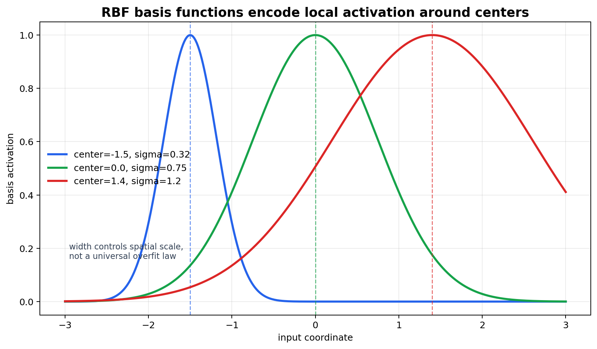
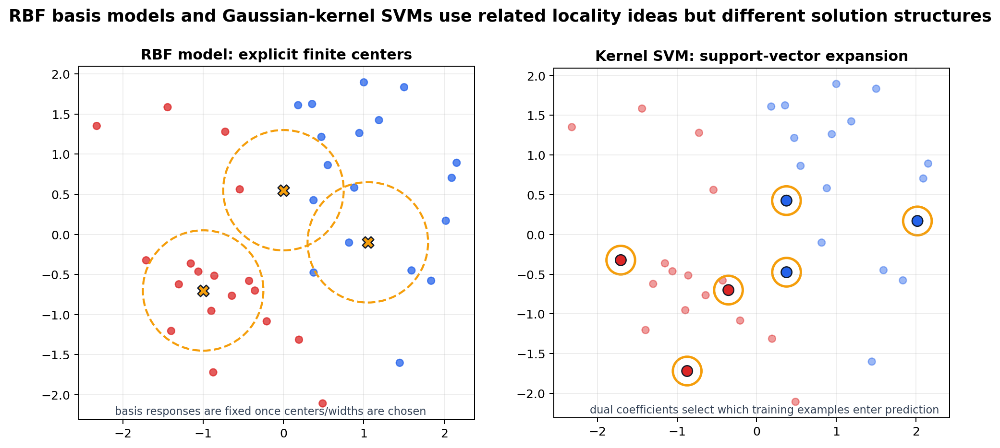

# Radial Basis Functions: Local Representation and Similarity

[Back to Learning From Data Theory Notebook](../README.md)

本章对应 Caltech `Learning From Data` Lecture 16: Radial Basis Functions。目标不是把所有带有 “RBF” 的说法混成同一个算法，而是理解 locality 本身是一种 representation assumption。

必须区分三个对象：

```text
RBF basis model
RBF / Gaussian kernel
kernel SVM
```

它们相关，但不是同一个东西。



图 1：RBF basis functions 围绕选定 centers 局部响应；width 控制在所选 metric 下的 spatial scale。



图 2：RBF model 使用显式有限 centers 作为 basis functions；Gaussian-kernel SVM 使用 dual optimization 选出的 support vectors 做 kernel evaluations。

## 0. Source Separation

### Caltech Core

Lecture 16 引入 radial basis functions、local representation、centers、widths，并说明 RBF 与若干 learning models / techniques 的关系。

### Formal Derivation

本章定义 RBF units、RBF models、固定 centers 与 widths 时的 design matrix，以及 basis responses 上的 linear fitting problem。

### Stanford CS229 Extension

CS229 的 kernel material 支撑 explicit feature map 与 kernelized dual prediction 的比较。RBF network / model 的讨论仍然与 kernel SVM 分开处理。

### Modern Perspective

现代桥接点是 representation learning：locality 只有在 distance 编码相关机制的 representation 中才有意义。本章只预览这一点，不展开深度 representation-learning theory。

## 1. Local Basis Representation

一个 RBF unit 可写为

```math
\phi_k(x)
=
\exp
\left(
-
\frac{\|x-c_k\|^2}{2\sigma_k^2}
\right).
```

其中：

- $c_k$ 是 center；
- $\sigma_k>0$ 是 width；
- $\|x-c_k\|$ 是所选 metric 下的 distance；
- $\phi_k(x)$ 在 $x$ 接近 $c_k$ 时最大，随着 $x$ 远离 center 而衰减。

`radial` 指该函数依赖于到 center 的距离；`basis` 指该 unit 成为 transformed representation 的一个 coordinate。

这是一个 similarity statement：

```text
靠近同一 center 的 points 会得到相关的 activations
```

但这句话只有在 “near” 所依赖的 distance 有意义时才成立。

## 2. RBF Network / Model

RBF model 可以写成

```math
g(x)
=
\sum_{k=1}^{K}
w_k\phi_k(x)
+
b.
```

这个模型可以拆成三层选择：

```text
center selection
-> 决定 representation

width selection
-> 决定 spatial scale / locality

weights
-> 决定 prediction
```

一旦 centers 和 widths 固定，learner 看到的是 transformed feature vector：

```math
z(x)
=
(\phi_1(x),\ldots,\phi_K(x)).
```

output layer 对 $z(x)$ 是 linear：

```math
g(x)=w^\top z(x)+b.
```

这直接连回 T1 Lecture 3：nonlinear feature transform 可以让 linear-in-parameters model 在原始 input space 中表现为 nonlinear。

## 3. Why Locality Matters

RBF representation 声称：在某个 metric 下相近的 points 应该有相关的 basis activations。因此 metric 本身就是 inductive assumption。

关键问题是：

```text
在 represented space 中，"nearby" 到底是什么意思？
```

如果 $x$ 是尺度合理的 physical measurements，Euclidean distance 可能有根据。若 $x$ 是 raw pixels、token counts、mixed tabular fields，或来自会变化的 measurement process，Euclidean distance 可能把 irrelevant variation 与 relevant structure 混在一起。

locality 不是小的 implementation detail，而是关于 representation 的主张：

```text
representation
-> distance
-> locality
-> prediction sharing
```

## 4. Center Selection

RBF centers 可以用多种方式选择：

- fixed centers on a grid；
- selected training examples；
- clustering centers，例如 k-means centers；
- learned centers，可以单独学习，也可以与 predictor 联合学习。

每种选择都会改变 effective representation。

如果 centers 在看数据前固定，representation 是 predetermined。若 centers 从 training data 中选择，或通过 clustering 得到，representation 就是 data-dependent。若 centers 与 predictor 一起学习，representation learning 与 output fitting 的边界会更不清楚。

没有一种 center-selection 方法是 universal。grid 在 high dimensions 中可能失效；training-example centers 可能过多或过度依赖样本；clustering 可能忽略 labels；learned centers 会引入更难的 nonconvex optimization 与额外 selection risk。

## 5. Width Selection

width $\sigma_k$ 控制 basis response 的 spatial scale。

Small width：

```text
locality 更强
sensitivity 更高
fitting 可能更 fragmented
```

Large width：

```text
影响更 broad / smooth
spatial resolution 更低
```

这只是 structural intuition，不是普遍定律。small width 是否 overfit，large width 是否 underfit，取决于 sample size、noise、target smoothness、center placement、regularization，以及 metric 是否表达了真正相关的差异。

当 widths 通过 validation 或 benchmark feedback 调整时，width selection 就属于 T3 的 hyperparameter-selection 与 evidence-discipline 问题。

## 6. Fit Output Weights

### Theorem: Fixed RBF Representation Makes Output Fitting Linear in Weights

#### Assumptions

- centers $c_1,\ldots,c_K$ 固定；
- widths $\sigma_1,\ldots,\sigma_K$ 固定；
- RBF basis functions 为

```math
\phi_k(x)
=
\exp
\left(
-
\frac{\|x-c_k\|^2}{2\sigma_k^2}
\right).
```

#### Claim

RBF model

```math
g(x)
=
\sum_{k=1}^{K}
w_k\phi_k(x)
+
b
```

对 output weights $w_1,\ldots,w_K,b$ 是 linear。

#### Derivation / Proof Idea

给定 dataset $x_1,\ldots,x_N$，定义 design matrix：

```math
Z_{ik}
=
\phi_k(x_i).
```

令 $\tilde Z$ 表示把 intercept 的一列 ones 接到 $Z$ 后面：

```math
\tilde Z
=
\begin{bmatrix}
Z & \mathbf{1}
\end{bmatrix}.
```

令

```math
\beta
=
(w_1,\ldots,w_K,b)^\top.
```

training set 上的 predictions 是

```math
\hat y
=
\tilde Z\beta.
```

对 squared loss，output fitting 变成 transformed representation 上的 linear least squares：

```math
\min_{\beta}
\|\tilde Z\beta-y\|_2^2.
```

若对 output weights 加 ridge regularization，则为

```math
\min_{\beta}
\|\tilde Z\beta-y\|_2^2
+
\lambda\|w\|_2^2.
```

#### Interpretation

在 centers 与 widths 固定后，nonlinearity 来自 representation construction，而不是 final output layer。

#### What This Does NOT Imply

如果 centers 或 widths 是 adaptively selected，整个 RBF modeling pipeline 就不能被简单称为 linear。center choice、width choice 与 validation loops 仍然属于 learning process。

#### Research Use

阅读论文时要分开 representation design 与 output fitting：哪些部分是在看数据前固定的？哪些部分由 data 或 validation feedback 选出？

## 7. RBF Model versus Gaussian Kernel

### RBF Model

RBF model 使用显式、有限的 basis functions，并围绕 selected centers 定义：

```math
z(x)
=
(\phi_1(x),\ldots,\phi_K(x)).
```

prediction 的形式是

```math
g(x)
=
\sum_{k=1}^{K}
w_k\phi_k(x)
+
b.
```

centers 可以是 grid points、prototypes、training examples、cluster centers 或 learned parameters。

### Gaussian / RBF Kernel

Gaussian kernel 是 pairwise function：

```math
K(x,z)
=
\exp
\left(
-
\frac{\|x-z\|^2}{2\sigma^2}
\right).
```

它在 kernel methods 中用于计算 implicit feature space 的 inner products。

必须保留这个区别：

```text
RBF basis function:
围绕一个 center 的显式 feature response

Gaussian/RBF kernel:
kernel method 中使用的 pairwise inner-product function
```

不要把这两个术语互换使用。

## 8. RBF Model versus Kernel SVM

RBF model 与 Gaussian-kernel SVM 都可能利用 local similarity，但 solution structure 不同。

```text
RBF model:
有限、显式的 basis centers

kernel SVM:
由 support vectors / kernel evaluations 组成的 dual expansion
```

RBF model 通过 chosen basis centers 预测：

```math
g_{\mathrm{RBF}}(x)
=
\sum_{k=1}^{K}
w_k
\exp
\left(
-
\frac{\|x-c_k\|^2}{2\sigma_k^2}
\right)
+
b.
```

Gaussian-kernel SVM 通过 support vectors 预测：

```math
f_{\mathrm{SVM}}(x)
=
\sum_{i\in SV}
\alpha_i y_i
\exp
\left(
-
\frac{\|x_i-x\|^2}{2\sigma^2}
\right)
+
b.
```

在 RBF model 中，centers 是 representation design 的一部分。在 kernel SVM 中，support vectors 是 margin optimization 与 KKT structure 选出来的 dual solution 结构。

## 9. Relation to Nearest-Neighbor Intuition

RBF methods 与 nearest-neighbor methods 共享一个直觉：local similarity matters。特别是 Gaussian width 较窄时，point 更受 nearby centers 或 nearby support vectors 的影响。

但 RBF 不等于 nearest neighbor。

nearest-neighbor methods 直接基于 nearby training examples 做 local decision rule。RBF models 构造 smooth basis representation，再拟合 output weights。kernel SVMs 解的是 margin-regularized dual problem，并使用 support-vector coefficients。这个比较只用于 locality intuition，不用于证明 algorithmic equivalence。

## 10. Curse of Dimensionality Caveat

在 high-dimensional spaces 中，Euclidean distance 可能变得不可靠：distances 可能 concentrate，irrelevant coordinates 可能主导，raw coordinate closeness 可能不对应 semantic 或 causal similarity。

因此：

```text
distance-based locality
```

依赖 meaningful representation。

这直接连接到 modern representation learning。learned embedding 可以看成一种尝试：构造一个 space，使 local distances、inner products、angles 与 neighborhoods 更接近 predictive mechanism。

### What This Does NOT Imply

representation learning 不会自动解决 locality。如果 learned representation 被 sampling artifacts、spurious features 或 validation feedback 偏置，induced geometry 仍可能在 deployment shift 下失效。

## 11. Research Lens

阅读 RBF 或 locality-based paper 时，问：

- 什么 metric 定义 locality？
- 这个 metric 是看数据前确定的，还是 data-dependent？
- centers 是否代表 target population？
- widths 如何选择？
- locality 在 distribution shift 下是否稳定？
- representation 是否保留 prediction-relevant mechanism？
- 两个 observationally close 的点是否可能 mechanistically different？
- 两个 observationally far 的点是否可能 predictively similar？
- pipeline 中哪部分是 explicit representation，哪部分是 learned solution selection？

### Existing Repository Links

- T1 Lecture 3 引入 nonlinear transforms 与 linear output fitting：[feature transforms](../part1_learning_problem/03_caltech_l03_hypothesis_spaces_linear_models_feature_transforms.md)。
- T3 Lecture 10 引入 neural networks 中的 learned representations：[neural networks and representation](../part3_fitting_regularization_validation/10_caltech_l10_neural_networks_backpropagation_representation.md)。
- T3 Lecture 13 说明 tuning centers、widths 与 kernel hyperparameters 属于 validation-selection issue：[validation](../part3_fitting_regularization_validation/13_caltech_l13_validation_model_selection_data_contamination.md)。
- Week 4 Canvas-Diagnostic-v1 给出 raw input shift 使 learned geometry 失效的具体例子：[Canvas diagnostic](../../../reports/week4/15_canvas_diagnostic_v1_inventory_and_failure_taxonomy.md)。

[Back to Learning From Data Theory Notebook](../README.md)
