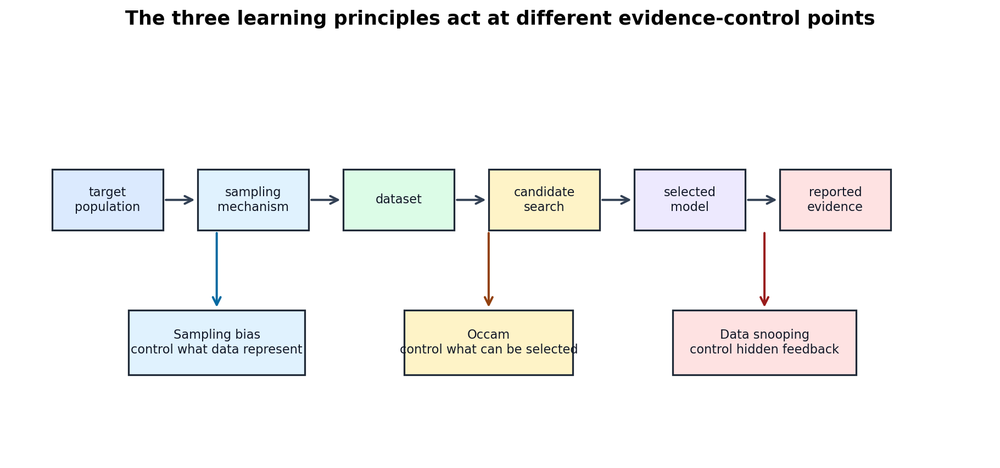

# Three Learning Principles: Occam, Sampling Bias, and Data Snooping

[Back to Learning From Data Theory Notebook](../README.md)

This chapter corresponds to Caltech `Learning From Data` Lecture 17: Three Learning Principles. It is not a list of practical tips. It is a synthesis of T1-T3 into three epistemic principles for ML research.



Figure 1: Occam, sampling bias, and data snooping act at different points in the evidence chain. They control what can be selected, what the data represent, and how data-dependent feedback enters the final claim.

## 0. Source Separation

### Caltech Core

Lecture 17 presents Occam's razor, sampling bias, and data snooping as central learning principles.

### Formal Derivation

This chapter uses the T2 fixed-versus-selected hypothesis logic and the T3 validation-selection framework to formalize why the principles matter.

### Stanford CS229 Extension

CS229 model-selection and validation methodology supports the data-snooping and held-out-evidence discussion.

### Stanford CS229M / Theory Extension

The theory bridge is algorithm-dependent complexity: "simplicity" may mean finite count, VC dimension, norm, margin, stability, compression, or solution-selection bias depending on the learner.

### Modern Perspective

Modern benchmark contamination, repeated benchmark feedback, and pretraining contamination are treated as extensions of the same evidence-discipline concern, without claiming that all mechanisms are mathematically identical.

## 1. Principle 1 - Occam's Razor

Caltech's principle can be stated as:

```text
Prefer simpler explanations or models when they fit the evidence adequately.
```

The immediate research question is:

```text
What does "simple" mean?
```

Do not reduce simplicity to parameter count. In learning theory, simplicity may be encoded by:

- finite hypothesis count;
- VC dimension;
- growth function;
- margin;
- norm;
- regularization penalty;
- hard constraint;
- compression;
- description length;
- smoothness;
- sparsity;
- algorithmic solution-selection preference.

Different notions of simplicity encode different inductive biases. A sparse linear model, a low-norm kernel classifier, a maximum-margin separator, a shallow decision tree, and a heavily regularized neural network are not "simple" for the same mathematical reason.

### What This Does NOT Imply

- Occam's razor does not say nature is always simple.
- It does not say smaller neural networks always generalize better.
- It does not say parameter count is the universal complexity measure.
- It does not license choosing a simpler model if it fails to capture the target mechanism.

## 2. Occam as Statistical Reasoning

Occam's razor becomes statistical when we account for search.

If a constrained family fits data well, the fit can be meaningful because there were fewer opportunities to fit accidental patterns. If a huge adaptively searched family fits data well, the same empirical fit carries weaker evidence unless the search process is controlled or independently evaluated.

The T2 chain is:

```text
selection opportunity
-> probability of accidental fit
-> need for simultaneous control
```

For a fixed hypothesis, concentration can compare empirical and population behavior. For a selected hypothesis, we need a statement that controls all candidates that could have been selected, or we need independent evaluation after selection.

### Evidence-Control Result

#### Assumptions

- A learning procedure selects from a candidate collection $\mathcal{H}$.
- The final empirical fit is interpreted as evidence about unseen data.
- The data used for fitting or selection contain finite-sample noise.

#### Claim

The evidential meaning of a good fit depends not only on the final hypothesis, but also on the size and structure of the selection process that produced it.

#### Derivation / Proof Idea

T2 showed the difference between fixed and selected hypotheses. For one fixed $h$, a concentration bound can control

```math
|\hat R_D(h)-R(h)|.
```

After selection,

```math
g
=
A(D),
```

the relevant event is closer to

```math
\sup_{h\in\mathcal{H}}
|\hat R_D(h)-R(h)|.
```

The more ways the procedure can search, the more opportunities it has to find a hypothesis with accidentally low empirical risk.

#### Interpretation

Occam's razor is not aesthetic minimalism. It is about restricting or accounting for the selection opportunity.

#### What This Does NOT Imply

There is no universal numeric penalty for arbitrary researcher adaptivity. The correction depends on the structure of the search, the data reuse, and the evaluation design.

#### Research Use

When reading a paper, ask what candidates could have been selected, not only what final architecture or equation appears in the paper.

## 3. What Occam Does NOT Imply

A precise Occam interpretation avoids three mistakes.

First:

```text
nature is always simple
```

is not a learning-theory theorem. The world can be complex, noisy, heterogeneous, and nonstationary.

Second:

```text
smaller neural network always generalizes better
```

is false. Optimization, representation, data augmentation, implicit bias, sample size, and problem structure can all matter.

Third:

```text
parameter count is the universal complexity measure
```

is false. T2 already separated raw parameterization from effective capacity. T4 adds a concrete example: an infinite-dimensional kernel representation can still be paired with norm/margin control.

## 4. Principle 2 - Population / Distribution Mismatch

Every generalization claim has a target population or distribution. Let

```math
(X,Y)\sim P_{\mathrm{target}}
```

represent the population about which the claim is intended.

The data used for learning and evaluation must represent that target under the assumptions used for inference. The broad failure is:

```text
Population / Distribution Mismatch
```

This broad concept has two related but distinct forms.

### Sampling / Selection Bias

Sampling or selection bias occurs when the collection or inclusion mechanism makes the observed data unrepresentative of the intended target population.

Examples:

- random sampling, where the sample is designed to represent the target population;
- self-selection, where participants choose whether to appear in the dataset;
- selective labeling or selective inclusion;
- missingness mechanisms;
- nonrepresentative sampling across groups, times, or settings.

### Distribution Shift

Distribution shift occurs when the training/source distribution differs from the target/deployment distribution:

```math
P_{\mathrm{train}}
\ne
P_{\mathrm{target}}.
```

Examples:

- covariate shift;
- temporal drift;
- spatial or domain shift.

For covariate shift, a careful formal statement is:

```math
P_{\mathrm{train}}(X)
\ne
P_{\mathrm{target}}(X).
```

Under the standard covariate-shift assumption, the conditional relationship is unchanged:

```math
P_{\mathrm{train}}(Y\mid X)
=
P_{\mathrm{target}}(Y\mid X).
```

This assumption should not be silently generalized. Temporal or spatial change may also alter the conditional mechanism:

```math
P_{\mathrm{train}}(Y\mid X)
\ne
P_{\mathrm{target}}(Y\mid X).
```

In that case, the problem is not merely covariate shift.

### Relationship between the Categories

The categories may overlap, but they are not identical. Biased sampling may create train/deployment distribution mismatch, but not every distribution shift is caused by biased sampling. For example, a representative training sample from 2020 can still fail in 2026 if the environment has changed.

This chapter does not become a causal-inference chapter. The point is more basic: a generalization theorem or held-out test speaks only about the population that the data-generating process supports.

## 5. Train/Test Distribution Agreement

Classical generalization theory commonly assumes that train and test examples arise from the same population or distributional process:

```math
(X_i,Y_i)\sim P
\quad
\text{i.i.d.}
```

Under that assumption, finite-sample generalization asks whether the selected hypothesis performs similarly on unseen draws from the same $P$.

Distribution shift asks a different question:

```math
P_{\mathrm{train}}
\ne
P_{\mathrm{deploy}}.
```

Then low test error on a held-out sample from $P_{\mathrm{train}}$ may fail to predict deployment behavior under $P_{\mathrm{deploy}}$.

Distinguish:

```text
finite-sample generalization
```

from

```text
distribution-shift generalization
```

The Week 4 Canvas-Diagnostic-v1 work is an example: the issue was not only finite sample size, but a mismatch between the training distribution and real canvas inputs.

## 6. Population Mismatch as World-Representation Failure

T1 used the chain:

```text
World
-> Observations
-> Representation
-> Hypothesis Set
-> Learning Algorithm
-> Learned Hypothesis
-> Error / Noise
```

Sampling and distribution mechanisms insert missing steps:

```text
World
-> Sampling mechanism
-> Dataset
```

and:

```text
Training environment
-> Dataset
-> Target / deployment environment
```

Even a perfect learning algorithm cannot recover information systematically absent from the sample without extra assumptions. More data from the same biased mechanism can preserve the bias. Separately, even representative source data can fail when the target environment changes.

This is a fundamental research principle:

```text
sample size does not repair a broken sampling mechanism by itself
```

The failure taxonomy should keep these distinguishable:

```text
sampling failure
!=
distribution / environment shift
```

They can interact, but their diagnoses and evidence requirements differ.

## 7. Principle 3 - Data Snooping

Data snooping means using information from data in a way not accounted for when interpreting the final evidence.

It is broader than direct test leakage. It includes:

- feature choice after inspecting performance;
- preprocessing choices informed by evaluation data;
- architecture revision after seeing validation or test behavior;
- hyperparameter tuning;
- validation reuse;
- test inspection;
- benchmark feedback;
- post-hoc subgroup selection;
- changing inclusion/exclusion criteria after seeing outcomes.

T3's key lesson was that once validation information influences selection, validation becomes part of the learning system. Data snooping is the same principle applied to the whole research process.

## 8. Data Snooping as Hidden Selection

The central mathematical intuition is:

```text
more adaptive choices
-> larger effective search process
-> greater chance of discovering accidental patterns
```

T2 distinguished a fixed hypothesis from a selected hypothesis:

```math
h
\quad
\text{fixed before data}
```

versus

```math
g
=
A(D).
```

Data snooping hides additional data-dependent choices inside the selection rule $A$. The published final model may look like one hypothesis, but the evidence has been shaped by many attempted hypotheses, feature choices, thresholds, preprocessing rules, and analysis decisions.

### What This Does NOT Imply

Data snooping is not ordinary finite-sample noise. Finite-sample noise is random variation in a fixed evaluation. Data snooping is the adaptive use of data to guide selection while still interpreting the final evidence as if it were untouched.

## 9. Modern Benchmark Contamination

Modern ML adds several benchmark-level versions of the same evidence problem.

Direct train-test leakage:

```text
evaluation examples enter training or preprocessing
```

Repeated benchmark feedback:

```text
many design iterations are guided by public benchmark performance
```

Benchmark-aware model development:

```text
architectures, prompts, data recipes, or tuning choices evolve around known benchmark behavior
```

Pretraining contamination:

```text
benchmark items or close variants appear in large-scale pretraining data
```

These mechanisms are related but not mathematically identical. Direct leakage, adaptive leaderboard reuse, benchmark-aware design, and pretraining contamination have different evidence paths and require different audits. The shared principle is that final evaluation loses force when the evaluated data have influenced the selected system in an unaccounted way.

## 10. Three Principles as One Structure

The three principles form one evidence-control structure:

```text
Occam
-> control what can be selected

Population / Distribution Mismatch
-> control what the data represent and which environment the claim concerns

Data Snooping
-> control how evidence enters selection
```

Together they unify T1-T3:

- T1 asks what world, observations, representation, and target are being studied.
- T2 asks whether finite data can justify a generalization claim after selection.
- T3 asks what adaptive selection process produced the final model or reported result.
- T4 asks how representation, geometry, similarity, margin, and locality shape the learner before evidence is interpreted.

## 11. Research Lens

For any ML result, ask:

- What counts as the target population?
- How was the sample obtained, and does the collection mechanism create sampling/selection bias?
- Does the training/source distribution match the target/deployment distribution?
- Which representation turns observations into model inputs?
- Which candidate models or procedures could have been selected?
- Which data influenced feature choices, preprocessing, hyperparameters, architecture, or reporting?
- Is the reported test set independent of the entire selection process?
- Is simplicity defined formally or only rhetorically?
- Does the evidence support same-distribution generalization, shift robustness, calibration, abstention reliability, or only a narrower metric?

### Existing Repository Links

- T2 fixed-versus-selected hypothesis control: [training/testing and model selection](../part2_generalization_theory/05_caltech_l05_training_testing_and_model_selection.md).
- T2 research audit: [generalization claim audit](../part2_generalization_theory/10_generalization_claim_audit_for_ml_research.md).
- T3 validation and contamination: [validation](../part3_fitting_regularization_validation/13_caltech_l13_validation_model_selection_data_contamination.md).
- T3 selection-aware protocol: [selection-aware research protocol](../part3_fitting_regularization_validation/15_selection_aware_ml_research_protocol.md).
- Week 4 Canvas-Diagnostic-v1: [Canvas diagnostic inventory](../../../reports/week4/15_canvas_diagnostic_v1_inventory_and_failure_taxonomy.md).
- Week 5 evaluation artifact audit: [evaluation artifact audit](../../../reports/week5/04_evaluation_artifact_audit_and_link_consistency.md).

[Back to Learning From Data Theory Notebook](../README.md)
