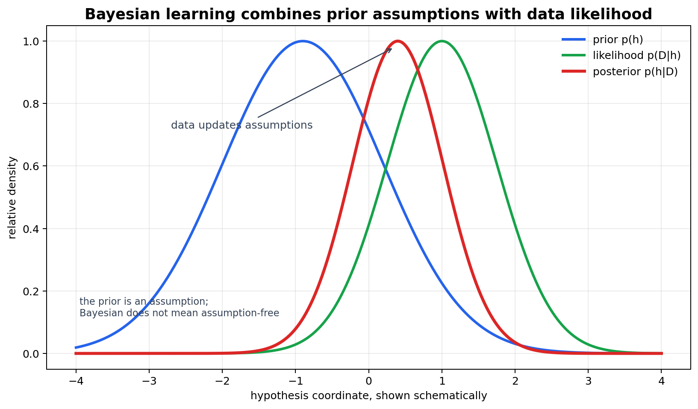
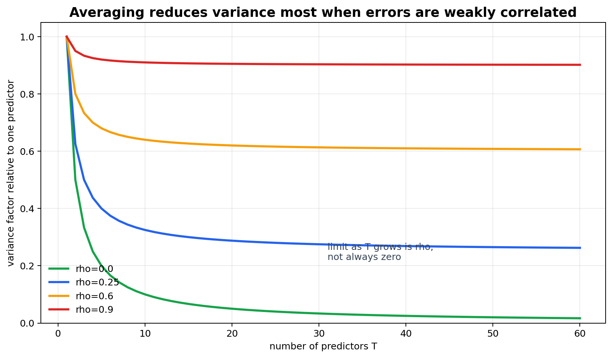

# Epilogue: Bayesian Learning, Aggregation, and the Map of Machine Learning

[Back to Learning From Data Theory Notebook](../README.md)

本章对应 Caltech `Learning From Data` Lecture 18: Epilogue。它关闭 classical `Learning From Data` 主线，但不把 T4 扩展成完整 Bayesian ML、ensemble learning 或 modern deep-learning theory 课程。



图 1：Bayesian learning 把 prior assumptions 与 data likelihood 结合成 posterior；posterior 不是 assumption-free object。



图 2：averaging 是否降低 variance，取决于 individual variance、number of learners 与 pairwise correlation。高度相关的 learners 很难靠简单平均获得大幅 variance reduction。

## 0. Source Separation

### Caltech Core

Lecture 18 作为 epilogue，回看 machine-learning map，并介绍 Bayesian learning、aggregation、bagging、boosting、blending 等思想。

### Formal Derivation

本章给出 Bayes rule、posterior predictive concept，以及 equal variance / pairwise correlation 假设下 aggregation variance 的推导。

### Stanford CS229 Extension

CS229 只作为 probability notation 与 supervised-learning background 的辅助来源；Lecture 18 的叙事主线仍是 Caltech。

### Stanford CS229M / Theory Extension

现代理论桥接只用于提醒：aggregation、priors、regularization 与 representation 都是 inductive bias 的不同表达。完整 PAC-Bayes、boosting theory、Gaussian processes 不在 T4 展开。

### Modern Perspective

现代视角用于避免过度表述：Bayesian 不等于 assumption-free；ensemble 不保证 error 一定降低；benchmark-driven blending 仍可能产生 data snooping。

## 1. Reconstruct the Machine-Learning Map

不要把 machine learning 的多个维度压成一个列表。一个算法至少可以从以下维度看：

### Paradigm

- supervised；
- unsupervised；
- reinforcement；
- online；
- active。

这些描述的是 data / feedback 的结构，不是具体 model family。

### Representation / Model

- linear；
- neural network；
- RBF；
- kernel；
- graphical / probabilistic。

这些描述的是 hypothesis structure 或 representation form。

### Learning / Selection Method

- ERM；
- maximum likelihood；
- regularization；
- margin optimization；
- Bayesian inference；
- aggregation。

这些描述的是 solution 如何从 candidates 中被选出。

### Theory / Evaluation

- VC / generalization；
- bias-variance；
- validation；
- learning principles。

这些描述的是 evidence 如何支持 claim。

这些 categories 不能合并。例如，logistic regression 是 supervised paradigm 下的 probabilistic conditional model，通常用 likelihood / regularization 学习；SVM 是 supervised paradigm 下的 margin-based geometric method；kernel SVM 又把 margin optimization 放在 implicit feature geometry 中。

## 2. Bayesian Learning

Bayesian learning 用 Bayes rule 更新 hypotheses 的可信度：

```math
p(h\mid D)
\propto
p(D\mid h)p(h).
```

其中：

- $p(h)$ 是 prior，表示观察 dataset 前对 hypotheses 的假设；
- $p(D\mid h)$ 是 likelihood，表示 hypothesis $h$ 下数据出现的概率；
- $p(h\mid D)$ 是 posterior，表示看见 data 后对 hypotheses 的更新分布。

### Theorem: Bayes Rule for Hypotheses

#### Assumptions

- hypotheses $h$ 构成可求和或可积分的 hypothesis space；
- prior $p(h)$ 已定义；
- likelihood $p(D\mid h)$ 已定义；
- evidence $p(D)$ 非零。

#### Claim

posterior 满足

```math
p(h\mid D)
=
\frac{p(D\mid h)p(h)}{p(D)}.
```

其中

```math
p(D)
=
\int p(D\mid h)p(h)\,dh
```

或在离散 hypothesis space 中写成求和。

#### Derivation / Proof Idea

由 joint probability 的两种分解：

```math
p(h,D)
=
p(h\mid D)p(D)
=
p(D\mid h)p(h).
```

两边相等并除以 $p(D)$，得到 Bayes rule。

#### Interpretation

posterior 是 prior assumptions 与 data likelihood 的结合。data 并不是在 vacuum 中说话；它通过 model class 与 likelihood 被解释。

#### What This Does NOT Imply

Bayesian 不等于 objective-free 或 assumption-free。prior 与 likelihood 都是 modeling assumptions。

#### Research Use

读 Bayesian paper 时问：prior 编码了什么 domain belief？likelihood 是否对应真实 data-generating process？posterior uncertainty 是否真正传到 prediction 与 decision？

## 3. MAP versus Full Posterior Inference

MAP estimate 选择 posterior 最大的一个 hypothesis：

```math
h_{\mathrm{MAP}}
=
\arg\max_h p(h\mid D).
```

等价地，

```math
h_{\mathrm{MAP}}
=
\arg\max_h
\left[
\log p(D\mid h)+\log p(h)
\right].
```

这与 T3 regularization 有直接联系：在许多模型中，negative log prior 会表现为 regularization penalty。

但必须区分：

```text
MAP point estimate：只选一个 posterior 最大的 hypothesis
```

和

```text
full posterior inference：保留 hypotheses 上的 posterior uncertainty
```

MAP 只保留一个点估计；full posterior 保留 hypotheses 上的不确定性结构。两者不是同一件事。

## 4. Posterior Predictive Idea

posterior predictive 把 hypothesis uncertainty 传播到 prediction：

```math
p(y\mid x,D)
=
\int
p(y\mid x,h)
p(h\mid D)
\,dh.
```

这表示：不是先选一个 hypothesis 再预测，而是对 posterior 下的 hypotheses 做加权平均。

### What This Does NOT Imply

posterior predictive 不自动保证 practical calibration。若 prior、likelihood、approximation method 或 data assumptions 错误，posterior uncertainty 也可能失真。

## 5. Bayesian Learning and Inductive Bias

prior information 改变观察 dataset 之前哪些 hypotheses 更 plausible。这是 inductive bias 的一种形式化表达。

因此 Bayesian learning 与 T1-T3 相连：

```text
representation / hypothesis space
-> prior
-> likelihood
-> posterior
-> prediction / decision
```

prior 不是因为写成 probability 就自动正确。它必须被解释、检验，并与 target problem 的 evidence discipline 一起理解。

## 6. Aggregation

aggregation 从多个 hypotheses

```math
h_1,\ldots,h_T
```

构造 combined predictor。

regression 中的常见形式是

```math
g(x)
=
\sum_{t=1}^{T}
\alpha_t h_t(x).
```

classification 中可以使用 unweighted vote 或 weighted vote。

aggregation 改变的是 selected solution 的结构：final predictor 不再是单个 learned hypothesis，而是多个 hypotheses 的组合。它可能改变 bias 与 variance，但不能保证一定降低 error。

## 7. Variance Reduction through Averaging

### Theorem: Variance of an Equally Weighted Average

#### Assumptions

- predictors $h_1,\ldots,h_T$ 对同一 input 的 prediction 被看作随机变量；
- 每个 predictor 的 variance 相同：

```math
\mathrm{Var}(h_t)=\sigma^2;
```

- 任意两个不同 predictors 的 pairwise correlation 相同：

```math
\mathrm{Corr}(h_s,h_t)=\rho
\quad
s\ne t.
```

#### Claim

equally weighted average

```math
\bar h
=
\frac1T\sum_{t=1}^{T}h_t
```

的 variance 为

```math
\mathrm{Var}(\bar h)
=
\sigma^2
\left[
\rho
+
\frac{1-\rho}{T}
\right].
```

#### Derivation / Proof Idea

从 variance of sum 开始：

```math
\mathrm{Var}(\bar h)
=
\mathrm{Var}
\left(
\frac1T\sum_t h_t
\right)
=
\frac1{T^2}
\mathrm{Var}
\left(
\sum_t h_t
\right).
```

展开：

```math
\mathrm{Var}
\left(
\sum_t h_t
\right)
=
\sum_t\mathrm{Var}(h_t)
+
2\sum_{s<t}\mathrm{Cov}(h_s,h_t).
```

由 equal variance 得到

```math
\sum_t\mathrm{Var}(h_t)
=
T\sigma^2.
```

由 pairwise correlation 得到

```math
\mathrm{Cov}(h_s,h_t)
=
\rho\sigma^2.
```

共有 $T(T-1)/2$ 个 pairs，因此

```math
2\sum_{s<t}\mathrm{Cov}(h_s,h_t)
=
T(T-1)\rho\sigma^2.
```

代回：

```math
\mathrm{Var}(\bar h)
=
\frac1{T^2}
\left[
T\sigma^2
+
T(T-1)\rho\sigma^2
\right].
```

化简：

```math
\mathrm{Var}(\bar h)
=
\sigma^2
\left[
\frac1T
+
\frac{T-1}{T}\rho
\right]
=
\sigma^2
\left[
\rho
+
\frac{1-\rho}{T}
\right].
```

#### Interpretation

若 $\rho=0$，variance 随 $1/T$ 下降。若 $\rho=1$，averaging 不降低 variance。因而 diversity / decorrelation 是 averaging 有效的关键。

#### What This Does NOT Imply

ensemble 不总是降低 error。若 learners 有共同 systematic bias，或错误高度相关，aggregation 可能帮助有限，甚至可能掩盖 failure mode。

#### Research Use

读 ensemble 结果时问：多个 learners 的错误是否独立或 decorrelated？diversity 从哪里来？validation 是否只是在 benchmark 上挑了一个 lucky mixture？

## 8. Bagging

bagging 的基本流程是：

```text
resample data
-> fit multiple learners
-> aggregate predictions
```

它试图利用 dataset-induced variability：对 unstable learner，用不同 bootstrap samples 训练多个版本，再通过 averaging / voting 降低 variance。

这连接 T2：finite data 会让 learned hypothesis 随 sample 波动。bagging 的目标不是改变 true mechanism，而是降低 sample-induced solution variance。

## 9. Boosting

boosting 顺序构造 learners，并根据之前的 errors 改变后续训练的 emphasis。它与 simple independent averaging 不同：

```text
bagging:
parallel / resampled learners

boosting:
由 previous errors 逐步塑造的 sequential learners
```

boosting 的 generalization 有多种解释，包括 margin、regularization、optimization path 等。T4 不把它压成单一原因。

## 10. Blending / Stacking

blending / stacking 把已有 models 的 predictions 作为新的 inputs，再学习一个 combiner。

这意味着 aggregation 本身又引入一层 learning / selection：

```text
base models
-> predictions
-> combiner
-> final predictor
```

因此，用来训练 combiner 的 data 必须有明确角色。若同一 validation evidence 同时用于选择 base models、调 combiner、报告 final performance，就会回到 T3 的 data snooping 问题。

## 11. Aggregation versus Joint Representation Learning

需要保留 Caltech 的重要区别：

```text
ensemble:
先学习多个 solutions，再组合它们

multilayer model:
components 作为一个 model 被 joint learning
```

ensemble 先学出多个 solutions，再组合它们。multilayer model 的 intermediate representations 与 output rule 通常一起通过一个 objective 联合学习。两者都可能产生 complex predictor，但 learning structure 不同。

## 12. Final Caltech Synthesis

整个 `Learning From Data` 主线可以重新写成一组问题：

```text
什么是 learning？
learning 为什么可能 generalize？
我们怎样 fit models？
models 为什么会失败？
怎样控制 selection？
geometry 与 representation 为什么重要？
evidence 应该怎样解释？
```

T1 建立 learning problem：

```text
World
-> Observations
-> Representation
-> Hypothesis Set
-> Learning Algorithm
-> Learned Hypothesis
-> Error / Noise
```

T2 建立 generalization discipline：

```text
Finite Data
-> Data-dependent Selection
-> Capacity
-> Uniform Control
-> VC Dimension
-> Generalization
-> Research Claim Discipline
```

T3 建立 fitting / selection discipline：

```text
Objective
-> Optimization
-> Fitting
-> Overfitting
-> Regularization
-> Validation
-> Adaptive Selection
-> Credible Final Evaluation
```

T4 把具体算法放回 geometry：

```text
Input Geometry
-> Representation
-> Similarity / Inner Product
-> Decision Geometry
-> Margin / Norm
-> Effective Complexity
-> Generalization
-> Sampling Assumptions
-> Selection Discipline
-> Credible Learning
```

Lecture 18 的 closure 是：machine learning 不是一组孤立 algorithms，而是一套关于 representation、hypothesis、objective、evidence 与 world assumptions 的系统。

### Existing Repository Links

- T1 ontology map：[world-data-generalization lens](../00_learning_theory_ontology_world_data_generalization_research_lens.md)。
- T2 generalization theory：[VC and capacity](../part2_generalization_theory/07_caltech_l07_vc_dimension_capacity_and_sample_complexity.md)。
- T3 validation and contamination：[validation](../part3_fitting_regularization_validation/13_caltech_l13_validation_model_selection_data_contamination.md)。
- T4 unified lens：[geometry representation capacity lens](19_geometry_representation_capacity_unified_lens.md)。

[Back to Learning From Data Theory Notebook](../README.md)
