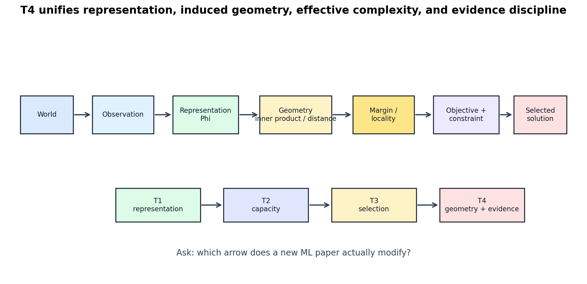

# Geometry, Representation, Capacity, and Inductive Bias: A Unified Lens

[Back to Learning From Data Theory Notebook](../README.md)

This note does not summarize Lectures 14-18 mechanically. It answers a deeper question:

```text
Why do apparently different algorithms often differ mainly in how they encode
representation, geometry, similarity, and solution preference?
```



Figure 1: T4 links representation to induced geometry, margin/locality, objective/constraint, selected solution, and evidence discipline.

## 0. Source Separation

### Caltech Core

The Caltech arc supplies the central ingredients: feature transformations, margin, kernels, RBF locality, learning principles, Bayesian learning, and aggregation.

### Formal Derivation

The derivations in Lectures 14-18 show how geometry becomes algebra: margins divide by norms, kernels become Gram matrices, RBFs become design matrices, Bayesian learning becomes posterior updating, and aggregation variance depends on covariance.

### Stanford CS229 Extension

CS229 supplies the SVM/kernel derivational backbone and the probabilistic/MAP contrast.

### Stanford CS229M / Theory Extension

The bridge is algorithm-dependent complexity: capacity cannot be read only from representation dimension or parameter count.

### Research Lens

This note turns T4 into a long-term paper-reading question:

```text
Which arrow does a new ML paper actually modify?
```

## 1. One Prediction Problem, Different Structures

Consider one supervised prediction problem. Different algorithms often differ less in the final input-output goal than in the structure they impose between inputs and predictions.

### Logistic Regression

Logistic regression builds a probabilistic score model:

```math
p(y=1\mid x)
=
\sigma(w^\top x+b).
```

Its core commitments are conditional probability modeling, likelihood/cross-entropy fitting, and a decision threshold possibly chosen later.

### SVM

SVM builds margin geometry:

```math
f(x)=w^\top x+b,
\qquad
g(x)=\mathrm{sign}(f(x)).
```

Its core commitment is geometric separation with norm/margin control. It does not natively produce calibrated probability.

### Kernel SVM

Kernel SVM keeps linear margin geometry but moves it to an implicit feature space:

```math
f(x)
=
\sum_{i\in SV}
\alpha_i y_i K(x_i,x)+b.
```

Its core commitment is a kernel-defined similarity geometry plus margin-regularized solution selection.

### RBF Model

An RBF model builds an explicit local basis representation:

```math
g(x)
=
\sum_{k=1}^{K}
w_k\phi_k(x)+b.
```

Its core commitment is that local responses around centers can support prediction.

### Neural Network

A neural network learns a representation:

```math
z
=
\Phi_\theta(x).
```

Its core commitment is that the representation itself can be selected from data through a joint optimization process.

## 2. Representation Determines Geometry

Given a representation

```math
z=\Phi(x),
```

geometric concepts are defined in represented space:

- distance;
- angle;
- inner product;
- margin;
- locality.

For example, an SVM margin is not an abstract property of the raw world. It is a property of the transformed data and the norm used in that space:

```math
\gamma_i
=
\frac{y_i(w^\top\Phi(x_i)+b)}{\|w\|}.
```

An RBF unit is local only after a metric and representation have been chosen:

```math
\phi_k(x)
=
\exp
\left(
-
\frac{\|\Phi(x)-c_k\|^2}{2\sigma_k^2}
\right).
```

Therefore:

```text
geometry is representation-dependent
```

This is a major conceptual point. A paper that claims a model uses locality, similarity, or margin must identify where that geometry comes from.

## 3. Kernel as Explicit Assumption about Similarity

A kernel effectively declares:

```text
which examples should appear similar
```

under the induced feature geometry.

The kernel is not merely a computational shortcut. It encodes inductive bias. A Gaussian kernel assumes distance-based smooth similarity. A polynomial kernel assumes useful coordinate interactions. A string or graph kernel would encode structure specific to sequences or graphs.

Kernel choice therefore belongs to the representation layer and the selection layer:

- the kernel defines geometry;
- its hyperparameters define the scale of that geometry;
- validation or benchmark tuning selects among geometries.

## 4. RBF as Explicit Locality Assumption

An RBF model says predictive structure can be represented through localized responses around centers:

```text
center
-> neighborhood of influence
-> weighted contribution to prediction
```

This is another inductive bias. It asserts that prediction can be assembled from local basis responses.

The key audit question is:

```text
Are local neighborhoods meaningful for the target mechanism?
```

If nearby raw images differ only by benign stroke style, locality may help. If nearby points differ in hidden causal mechanism, locality can mislead.

## 5. Neural Representation as Learned Geometry

T1 separated observation from representation. T3 showed that neural networks can learn hidden representations. Combining those ideas:

```math
\Phi_\theta(x)
```

means the geometry itself becomes data-dependent.

Distances, angles, margins, and local neighborhoods in hidden space are no longer fixed assumptions alone. They are selected by architecture, objective, optimizer, data, regularization, augmentation, and validation feedback.

This is why modern representation analysis is important. A neural network may generalize or fail because it learned a geometry that aligns or fails to align with the deployment mechanism.

## 6. Capacity Cannot Be Read from Dimension Alone

Kernels provide the key counterexample:

```text
feature dimension
!=
effective statistical complexity
```

A kernel may correspond to a high-dimensional or infinite-dimensional feature representation. But that fact alone does not determine the learner's effective behavior. Keep three categories separate.

### Structural / Generalization Control

These are mechanisms that restrict or prefer solutions in a way that can support a generalization argument when the assumptions of the relevant theorem or analysis are met:

- restricted hypothesis family;
- norm control;
- margin control;
- explicit regularization;
- algorithmic stability;
- compression only when a formal compression/generalization connection is actually invoked.

Support-vector expansion is structural information about the dual solution. It should not be called capacity control merely because the expansion may be sparse. A support-vector count becomes a generalization-control argument only when a specific compression, margin, stability, or related theorem is being used.

### Statistical Conditions

These determine how sharply finite data can speak about the target population:

- sample size;
- i.i.d. or other sampling assumptions;
- target distribution;
- noise and population heterogeneity.

Sample size affects estimation and generalization precision. It is not itself hypothesis capacity.

### Selection / Evaluation Discipline

These protect the credibility of evidence after choices have been made:

- validation protocol;
- hyperparameter search discipline;
- benchmark feedback control;
- held-out final evaluation.

Validation discipline can keep evidence interpretable, but it is not a capacity-control mechanism. It controls information flow in the research process.

Conversely, a low-dimensional feature space can overfit if the selection process is sufficiently adaptive or if the sample is biased.

The correct object is not dimension alone. It is the full learning system:

```text
representation
+ hypothesis family
+ objective
+ constraint
+ optimizer
+ sample
+ selection process
```

## 7. Three Axes of Inductive Bias

### Representation Bias

What distinctions are available to the learner?

Examples:

- raw pixels;
- handcrafted features;
- polynomial transforms;
- kernel-induced feature space;
- RBF basis responses;
- learned embeddings.

Representation bias determines which information is preserved, suppressed, or amplified.

### Geometric / Similarity Bias

What counts as nearby, aligned, similar, or separated?

Examples:

- Euclidean distance;
- dot product;
- cosine-like relation;
- kernel similarity;
- local neighborhoods;
- graph adjacency;
- hidden-space distance.

This bias determines how examples influence each other.

### Algorithmic Solution-Selection Bias

Which fitting solution is preferred?

Examples:

- maximum likelihood;
- minimum norm;
- maximum margin;
- sparsity;
- early stopping;
- optimizer implicit bias;
- ensemble averaging;
- prior-posterior updating.

The phrase "selection bias" is avoided here because it can be confused with statistical sampling-selection bias. The intended meaning is algorithmic solution-selection bias: the learning procedure prefers some solutions over others among those compatible with data.

## 8. Reliability Perspective

When a model fails, ask where the failure entered.

Did representation collapse relevant distinctions?

Did similarity geometry become invalid?

Did the hypothesis class miss the mechanism?

Did the objective optimize the wrong surrogate?

Did the optimizer select an unstable solution?

Did the sample fail to represent deployment?

Did validation or benchmark feedback contaminate evaluation?

Did irreducible uncertainty make the target unreliable?

These are different failure modes. Treating all of them as "overfitting" hides the diagnosis.

## 9. Full T4 Chain

The classical theory system now has the following chain:

```text
World
down
Observation
down
Representation Phi
down
Induced Geometry
down
Similarity / Distance / Margin / Locality
down
Hypothesis Structure
down
Objective + Constraint
down
Learning Algorithm
down
Selected Solution
down
Generalization under sampling assumptions
down
Evaluation under selection discipline
```

The long-term research question is:

```text
Which arrow does a new ML paper actually modify?
```

Examples:

- A new architecture may modify the representation arrow.
- A new kernel modifies induced similarity geometry.
- A new regularizer modifies objective/constraint and solution preference.
- A new optimizer may modify the selected solution without changing the nominal objective.
- A new dataset modifies the sampling/evidence layer.
- A new benchmark protocol modifies evaluation discipline.

## 10. Cross-Links to the Existing Theory Map

- T1: representation and nonlinear transforms: [Lecture 3](../part1_learning_problem/03_caltech_l03_hypothesis_spaces_linear_models_feature_transforms.md).
- T2: capacity and generalization: [VC dimension](../part2_generalization_theory/07_caltech_l07_vc_dimension_capacity_and_sample_complexity.md), [modern capacity control](../part2_generalization_theory/09_modern_uniform_convergence_and_capacity_control.md).
- T3: regularization and adaptive selection: [regularization](../part3_fitting_regularization_validation/12_caltech_l12_regularization_constraints_inductive_bias.md), [validation](../part3_fitting_regularization_validation/13_caltech_l13_validation_model_selection_data_contamination.md).
- Week 2: linear/logistic model contrast: [Week 2 report](../../../reports/week2_linear_logistic_regression.md).
- Week 3: MLP and optimizer solution selection: [MLP forward/backprop](../../../reports/week3/03_mlp_forward_and_backprop.md), [optimization algorithms](../../../reports/week3/01_optimization_algorithms.md).
- Week 4: distribution shift and canvas diagnostics: [Canvas diagnostic](../../../reports/week4/15_canvas_diagnostic_v1_inventory_and_failure_taxonomy.md).
- Week 5: calibration and abstention separate score geometry from probability reliability: [calibration](../../../reports/week5/02_calibration_metrics_and_reliability_diagrams.md), [abstention](../../../reports/week5/03_confidence_thresholding_and_abstention_policy.md).

[Back to Learning From Data Theory Notebook](../README.md)
