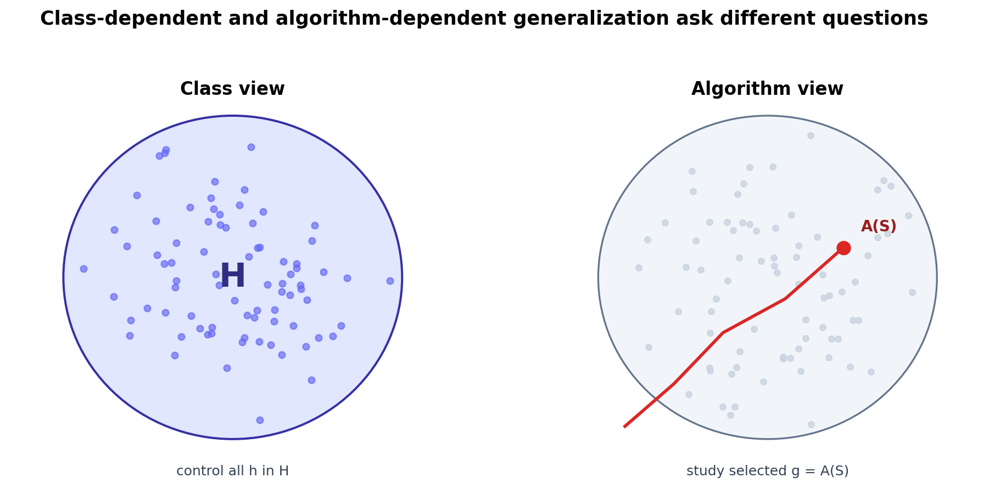

# Classical Theory Meets Modern Deep Learning

[Back to Learning From Data Theory Notebook](../README.md)

T5 的任务不是再写一轮 Caltech lecture summary。Caltech `Learning From Data` 的 classical spine 已经在 T1-T4 完成。T5 要处理的是 modern overparameterized learning 带来的张力：

```text
nominal hypothesis family 很大；
training error 可以为 0；
parameters 可以超过 samples；
同一 architecture 在不同 optimizer / initialization / trajectory 下会选出不同 functions；
representation 本身会在 training 中改变；
但某些 selected solutions 仍然 generalize well。
```

因此问题不再只是：

```text
How large is H?
```

而是：

```text
Which solution does A select from H,
on which data geometry,
under which representation,
and why should that selected solution generalize?
```



## 0. Source Separation

### Stanford CS229M / Theory Spine

Stanford STATS214 / CS229M 把 modern learning theory 组织在 generalization、deep-learning theory、non-convex optimization、Neural Tangent Kernel、implicit / algorithmic regularization 与 domain adaptation 这些主题上。T5 使用它作为 primary course spine，但不逐节复写课程。

### Primary Modern Sources

本章直接使用 Zhang et al. 的 random-label experiment 作为 modern generalization puzzle 的入口。后续章节分别使用 stability、Rademacher complexity、margin/norm、benign overfitting、implicit bias、NTK 与 domain adaptation 的 primary papers。

### Repository Synthesis

T5 的总链条是本仓库综合：

```text
Class-level capacity
down
Data-dependent complexity
down
Algorithm-dependent behavior
down
Optimization trajectory / implicit bias
down
Selected interpolating solution
down
Representation regime
down
Generalization under source distribution
down
Distribution / environment shift
down
Credible modern ML claim
```

一个核心结论必须提前写清楚：

```text
modern learning theory 不是一个已经完成的统一解释。
它是一组 assumptions 和 scope 不同的 explanatory lenses。
```

## 1. What Classical Theory Actually Says

T2 的 classical uniform-convergence theory 没有说：

```text
large model => bad generalization
```

它说的是：

```text
capacity affects worst-case simultaneous control
of empirical risk versus population risk
over a candidate class.
```

uniform convergence 控制的对象是：

```math
\sup_{h\in\mathcal H}
\left|
R(h)-\hat R_S(h)
\right|.
```

如果这个 supremum 很小，empirical selection inside $\mathcal H$ 才有统计意义。如果 bound 很大或 vacuous，不能推出 theorem 错了；只能说这个 theorem 对当前 regime 可能太粗。

必须区分：

```text
the theorem is incorrect
!=
the theorem is valid but not informative for this setting
```

classical theory 仍然是 foundation，因为它定义了 learning claim 必须面对的对象：finite-sample evidence 与 population behavior 之间的 gap。

## 2. Nominal Capacity Versus Observed Behavior

modern architecture 往往定义非常大的 nominal family：

```math
\mathcal H=\{h_\theta:\theta\in\Theta\}.
```

但 trained predictor 不是 $\mathcal H$ 中任意一个元素，而是：

```math
g=A(S).
```

这里 $A$ 包含 initialization、optimizer、learning-rate schedule、batch sampling、early stopping、regularization、architecture、numerical details 与 model-selection choices。

T5 因此固定两个对象：

```text
H = nominal function family
A(S) = actual data- and algorithm-dependent selected solution
```

同一个 architecture 可以在 random labels 上 memorize，也可以在 structured data 上选出 low-norm / large-margin / kernel-like / feature-learning solution。仅写出 $\mathcal H$ 不足以说明最终学到的 function。

## 3. Random-Label Experiment

### Phenomenon

Zhang et al. 的核心 empirical observation 是：standard deep networks 可以 fit real labels，也可以 fit randomized labels。

### Formal Model

这不是任意 neural network 的 universal theorem。实验比较的是：

```text
same architecture / training pipeline
real labels
versus
randomized labels
```

### Theorem

该实验本身不是 generalization theorem。它提供的是 expressivity / memorization capacity 的 evidence。

### Interpretation

能 fit random labels 说明 architecture-size explanation 不完整。如果 $\mathcal H$ 中存在大量 memorizing functions，现代解释必须说明为什么 structured data + training algorithm 会选出有用的 solution，而不是只说坏 solution 存在。

### Transfer Limitation

这个结果不证明：

- VC theory 是错的；
- regularization irrelevant；
- data structure irrelevant；
- deep learning 没有 inductive bias；
- random-label behavior 预测 deployment robustness。

它证明的是：简单的 architecture-size 或 parameter-count story 不足以解释 observed source-distribution generalization。

## 4. Four Different Questions

T5 反复区分四类问题。

### Expressivity

model 能否表示一个 fitting function？

这对应 $\mathcal H$ 和 approximation/specification。random-label fitting 是 expressivity / memorization capacity evidence。

### Optimization

optimizer 能否找到这样的 function？

这对应 $A$、objective、parameterization、initialization、batch noise 与 training trajectory。

### Generalization

selected function 是否在同一 source distribution 的 new samples 上表现好？

这是 T2 的 out-of-sample question，但对象从 arbitrary $h\in\mathcal H$ 转成 $g=A(S)$ 以及相关的 data-dependent / algorithm-dependent quantities。

### Robustness / Transfer

environment 改变后 predictor 是否仍然 useful？

这是 source-to-target question，不是 i.i.d. source generalization 的自动推论。

## 5. Classical Capacity May Still Matter

modern theory refine 的是 controlled object：

```text
whole class
-> data-dependent subclass
-> norm/margin-restricted region
-> algorithm output
-> training trajectory
-> source-target relation
```

这不是 replacement。VC dimension、growth function 与 uniform convergence 仍然给出 canonical warning：如果很多 candidate functions 都由同一 data 选择，empirical success alone 是弱证据。

变化在于：relevant candidate set 未必是整个 nominal architecture；它可能由 geometry、norm、margin、stability、optimizer bias 或 representation regime 决定。

## 6. Representation Coupling

T4 的链条是：

```text
World
down
Observation
down
Representation Phi
down
Geometry
down
Learning
```

modern learned-representation system 需要扩展成：

```text
World
down
Observation
down
Learned representation Phi_theta
up/down
optimization trajectory
down
selected geometry
down
prediction
```

prediction 使用的 geometry 本身是 training 产生的 random / data-dependent object。这使 representation、optimization 与 generalization 更深地耦合。当前理论只在一些 special regimes 中刻画这种耦合。

## 7. Research Lens

当一篇 paper 说：

```text
overparameterization explains generalization
```

要问：

- 观察到的 phenomenon 是什么？
- 分析的 mathematical model 是什么？
- 研究的 selected solution 是什么？
- theorem 具体证明了什么？
- theorem 的 model-regime boundary 是什么？
- risk 是 source distribution 还是 target environment？
- 哪一步是 theorem，哪一步是 extrapolation？

这可以防止把 surrogate theorem 静默升级成 arbitrary deep network 的完整解释。

## 8. Cross-Links

- T2 给出 classical uniform-convergence baseline：[growth function and uniform control](../part2_generalization_theory/06_caltech_l06_generalization_theory_growth_function_uniform_control.md)。
- T3 说明 objective、optimization、regularization 与 validation 如何成为 selection mechanism：[validation and data contamination](../part3_fitting_regularization_validation/13_caltech_l13_validation_model_selection_data_contamination.md)。
- T4 说明 representation-induced geometry 与 margin/norm control：[geometry representation capacity](../part4_margin_kernel_learning_principles/19_geometry_representation_capacity_unified_lens.md)。
- Week 3 optimizer experiments 可作为 algorithm dependence 的动机，但不是 stability theorem：[optimization algorithms](../../../reports/week3/01_optimization_algorithms.md)。
- Week 4 Canvas diagnostics 是 source/target separation 的具体例子：[Canvas diagnostic](../../../reports/week4/15_canvas_diagnostic_v1_inventory_and_failure_taxonomy.md)。

[Back to Learning From Data Theory Notebook](../README.md)
