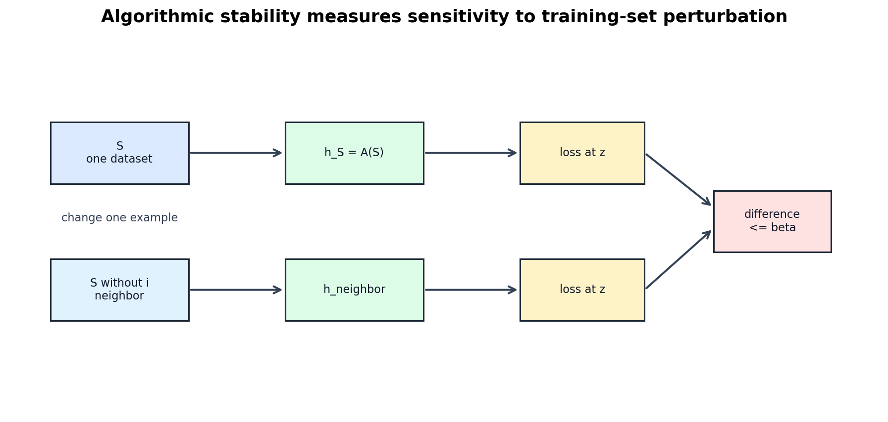

# Algorithmic Stability and Algorithm-Dependent Generalization

[Back to Learning From Data Theory Notebook](../README.md)

本章完成 T5 的一个关键转向：

```text
complexity of H
-> sensitivity of A
```

T2 问 entire class 是否被 uniform control。stability 问 selected learner 对 training data perturbation 是否敏感。



## 0. Source Separation

### Primary Sources

Bousquet and Elisseeff 给出 stability and generalization 的 classical framework。Hardt, Recht, and Singer 把 stability analysis 扩展到 stochastic gradient methods。

### Repository Synthesis

本章把 stability 连接到 T3 的 optimizer / regularization 视角，以及 Week 3 optimizer experiments。现有 repo experiments 只提供动机；它们不证明 formal stability guarantee。

## 1. Learning Algorithm as a Map

一个 observation 写作：

```math
z=(x,y)\in\mathcal Z.
```

training dataset 是：

```math
S=(z_1,\ldots,z_n).
```

learning algorithm 是 map：

```math
A:S\mapsto h_S.
```

对第 $i$ 个样本，remove-one neighboring dataset 写作：

```math
S^{\setminus i}
=
(z_1,\ldots,z_{i-1},z_{i+1},\ldots,z_n).
```

另一种常见 convention 是 replace-one neighbor：

```math
S^{(i)}
=
(z_1,\ldots,z_{i-1},z_i',z_{i+1},\ldots,z_n),
```

其中 $z_i'$ 是 independent fresh example。本章在 Bousquet-Elisseeff theorem 中使用 remove-one convention，在 expected proof skeleton 和 regularized ERM scaling 中说明 replace-one convention。

## 2. Uniform Stability

对 loss $\ell(h,z)$，如果对所有 sample $S$、所有 index $i$、所有 test point $z$ 都有：

```math
\left|
\ell(h_S,z)
-
\ell(h_{S^{\setminus i}},z)
\right|
\le
\beta,
```

则 algorithm $A$ 具有 remove-one uniform stability $\beta$。

关键是 supremum over $z$。stability 不只是 training loss 在被删样本上的变化，而是 learned predictor 在任意 test point 上的 loss behavior 是否只发生小变化。

## 3. Why Stability Can Imply Generalization

intuition 是：

```text
one sample has small influence
down
training-set-specific dependence is controlled
down
empirical risk is less able to exploit individual sample accidents
down
generalization gap can be controlled
```

### Theorem: Uniform Stability Controls Generalization

### Phenomenon

有些算法的 generalization 不能只从 raw class size 理解，因为 changing one training point hardly changes the learned predictor。

### Formal Model

抽象 learning algorithm $A$ 在 i.i.d. sample 上训练，loss bounded，并满足 remove-one uniform stability。

### Assumptions

- $S=(z_1,\ldots,z_n)$ i.i.d. drawn from source distribution $P$。
- loss bounded：$0\le \ell(h,z)\le M$。
- $A$ has remove-one uniform stability $\beta$。

### Objects and Randomness

$S$ 是 random object；$h_S=A(S)$ 通过 $S$ 随机。定义：

```math
R(h_S)
=
\mathbb E_{z\sim P}[\ell(h_S,z)]
```

```math
\hat R_S(h_S)
=
\frac1n\sum_{i=1}^n \ell(h_S,z_i).
```

### Claim

Bousquet and Elisseeff 的 high-probability stability bound 有如下形式：以至少 $1-\delta$ 的概率，

```math
R(h_S)
\le
\hat R_S(h_S)
+
2\beta
+
(4n\beta+M)
\sqrt{\frac{\log(1/\delta)}{2n}}.
```

常数依赖 bounded-loss 与 remove-one stability convention。不要在不同 convention 之间混用常数。

### Derivation / Proof Idea

uniform stability 先控制 expected generalization gap。然后用 bounded-differences argument 控制 gap around its mean 的 concentration。项 $4n\beta+M$ 记录改变 $S$ 的一个坐标时 generalization gap 可能变化的幅度。

### Interpretation

小 $\beta$ 表示单个 observation 对 learned predictor 的 influence 有限，因此 empirical risk 更难 exploit sample-specific accident。

### What This Does NOT Imply

它不说明同一个 $\mathcal H$ 下所有 algorithms 都 stable；不说明 stable source-distribution learning 等于 adversarial robustness 或 target-domain reliability。

### Research Use

比较 optimizer、early stopping 或 regularization 时，可以问 procedure 是否降低了 data perturbation sensitivity。但不能从 low validation error 直接推出 stability。

### Model-Regime Boundary

这是 bounded loss、i.i.d. source sampling、abstract stable algorithm 的 theorem。它本身不是 arbitrary deep-network theorem。

## 4. Expected Generalization Skeleton

expected argument 最能显示 ghost-example logic。

令 $z_i'$ 是 $z_i$ 的 independent copy，令 $S^{(i)}$ 用 $z_i'$ 替换 $z_i$。由 exchangeability：

```math
\mathbb E_S[R(h_S)]
=
\frac1n\sum_{i=1}^n
\mathbb E_{S,z_i'}
\left[
\ell(h_S,z_i')
\right].
```

empirical term 是：

```math
\mathbb E_S[\hat R_S(h_S)]
=
\frac1n\sum_{i=1}^n
\mathbb E_S
\left[
\ell(h_S,z_i)
\right].
```

比较 $\ell(h_S,z_i')$ 与 $\ell(h_{S^{(i)}},z_i')$。因为 $S^{(i)}$ 与 $S$ 同分布，后者的 expectation 与 $\ell(h_S,z_i)$ 的 expectation 相同。stability 控制从 $h_S$ 换成 $h_{S^{(i)}}$ 的损失变化。

因此，在对应 neighbor convention 下：

```math
\left|
\mathbb E_S
\left[
R(h_S)-\hat R_S(h_S)
\right]
\right|
\le
\beta.
```

核心机制是：

```text
exchangeability + one-sample output sensitivity control
```

## 5. Stability Is Algorithm-Dependent

uniform convergence 控制：

```text
all h in H
```

stability 控制：

```text
h_S = A(S)
```

这是两个不同 explanatory objects。很大的 class 可以配 stable 或 unstable algorithms；很小的 class 也可能通过 unstable adaptive procedure 被选择。两者没有自动支配关系。

## 6. Regularization and Stability

strongly convex regularized ERM 的 canonical intuition 是：

```text
strong curvature / regularization
-> perturbing one sample moves the optimum only a little
-> losses at test points change only a little
```

### Derivation: Replace-One Stability Scaling

### Phenomenon

regularization 可以让 fitted solution 对单个 data point 不那么敏感。

### Formal Model

定义：

```math
F_S(w)
=
\frac1n
\sum_{i=1}^n
\ell(w,z_i)
+
\frac{\lambda}{2}\|w\|_2^2.
```

令 $w_S$ 与 $w_{S'}$ 分别 minimize $F_S$ 与 $F_{S'}$，其中 $S'$ 与 $S$ 只差一个 example。

### Assumptions

- $\ell(\cdot,z)$ convex。
- $\ell(\cdot,z)$ is $L$-Lipschitz in $w$。
- regularizer 使 objective $\lambda$-strongly convex。
- 两个 samples 使用同一 empirical-objective normalization。

### Objects and Randomness

这个 derivation 对 fixed neighboring samples 是 deterministic。若 samples 后续从 $P$ 抽样，randomness 才进入。

### Claim

在 replace-one convention 下，standard scaling 是：

```math
\|w_S-w_{S'}\|_2
\le
\frac{2L}{\lambda n},
```

从而：

```math
\sup_z
\left|
\ell(w_S,z)-\ell(w_{S'},z)
\right|
\le
\frac{2L^2}{\lambda n}.
```

重要的是 dependence：

```text
stability improves with larger n and larger lambda
stability worsens with greater loss sensitivity L
```

### Derivation / Proof Idea

strong convexity 给出偏离 optimum 的 quadratic cost。替换一个 example 只改变 empirical objective 中的两个 average loss terms，这个变化由 $L\|w_S-w_{S'}\|_2/n$ 控制。把 $w_S$ 与 $w_{S'}$ 的 optimality inequalities 相加，可得：

```math
\lambda\|w_S-w_{S'}\|_2^2
\le
\frac{2L}{n}
\|w_S-w_{S'}\|_2.
```

若距离非零，消去一项得到 norm-change bound；再用 Lipschitzness 得到 loss-change bound。

### Interpretation

regularization 提供 curvature。curvature 把小的 objective perturbation 转换成小的 minimizer movement。

### What This Does NOT Imply

它不直接适用于 nonconvex deep networks、unbounded losses、nonsmooth losses 或 adaptive hyperparameter searches。更大的 $\lambda$ 也不总是提升 prediction；过强 regularization 可能增加 approximation bias。

### Research Use

当论文说 "regularization improves generalization"，要问 argument 是 stability、norm/margin control、Bayesian prior、validation discipline，还是 empirical correlation。

### Model-Regime Boundary

这是 convex strongly-convex regularized ERM 的 parameter-space derivation，不是 arbitrary neural-network training theorem。

## 7. SGD Stability

Hardt, Recht, and Singer 研究 perturbations 如何沿 SGD trajectory 传播。

### Theorem: Convex Smooth SGD Stability

### Phenomenon

同一 nominal class 下，不同 optimizer 或 training length 可能产生不同 generalization behavior。

### Formal Model

SGD 在 per-example loss 的 empirical objective 上运行。两个 neighboring datasets 诱导两个 coupled SGD trajectories，并尽可能使用同一 algorithmic randomness。

### Assumptions

clean convex statement 的典型假设是：

- 每个 per-example loss convex in parameters；
- 每个 loss is $L$-Lipschitz；
- 每个 loss is $\beta_{\mathrm{smooth}}$-smooth；
- step size 满足 smoothness restriction，例如 $\alpha_t\le 2/\beta_{\mathrm{smooth}}$；
- samples 来自 source distribution。

### Objects and Randomness

randomness 来自 training sample 与 SGD sampling。stability 在 neighboring datasets 与 algorithm randomness 上度量。

### Claim

Hardt-Recht-Singer 的 convex smooth result 给出 representative bound：

```math
\epsilon_{\mathrm{stab}}
\le
\frac{2L^2}{n}
\sum_{t=1}^T \alpha_t.
```

核心 dependence 是 sample size、learning rates、smoothness regime 与 number of steps。

### Derivation / Proof Idea

若两个 neighboring runs 当前采样到相同 example，在 convex smooth 且 step-size 合适时 gradient update 是 non-expansive。若采样到 differing example，两个 updates 可能分离。把每一步的 separation probability 与 magnitude 累加，得到 stability bound。

### Interpretation

SGD stability 是 trajectory-dependent。learning-rate schedule、training steps、smoothness 与 loss geometry 都会影响 one-sample perturbation 如何传播。

### What This Does NOT Imply

它不表示：

```text
fewer epochs always generalize better
```

也不表示：

```text
SGD is stable, therefore SGD always generalizes
```

optimization progress 与 theorem assumptions 同样重要。

### Research Use

Week 3 中 SGD、Momentum、Adam、early stopping 与 learning-rate schedules 的差异，可以用 stability 作为一个候选 lens，但不能说 stability alone explains all optimizer differences。

### Model-Regime Boundary

上面的 displayed bound 属于 convex smooth losses。Hardt et al. 也分析 nonconvex smooth settings，但那些结果同样不让 arbitrary finite neural networks 自动 stable。

## 8. Stability Versus Robustness

stability 与 robustness 不是同一个性质：

```text
algorithmic stability:
sensitivity to changing training examples

adversarial / distributional robustness:
sensitivity to changing inputs, environments, or distributions
```

一个 model 可以对 one-sample training perturbation stable，却在 input corruption 或 target-domain shift 下失败。反过来，adversarial training 也不自动给出 uniform-stability proof。

## 9. Research Connection

同一 $\mathcal H$ 可以在不同 procedure 下变成不同 effective learner：

- SGD；
- Momentum；
- Adam；
- early stopping；
- different learning-rate schedules；
- different initialization distributions。

algorithm-dependent lesson 是：

```text
H alone does not identify the learner.
```

但正确结论是 scoped：

```text
optimizer choice can affect selected solution and stability-like properties
```

而不是：

```text
stability alone explains every optimizer result
```

## 10. Cross-Links

- T2 class-wide control：[uniform control](../part2_generalization_theory/06_caltech_l06_generalization_theory_growth_function_uniform_control.md)。
- T3 optimizer and regularization roles：[regularization](../part3_fitting_regularization_validation/12_caltech_l12_regularization_constraints_inductive_bias.md)。
- T4 learning-algorithm anatomy：[algorithm anatomy](../part4_margin_kernel_learning_principles/20_learning_algorithm_anatomy_for_ml_research.md)。
- Week 3 optimizer implementations：[optimization algorithms](../../../reports/week3/01_optimization_algorithms.md)。

[Back to Learning From Data Theory Notebook](../README.md)
