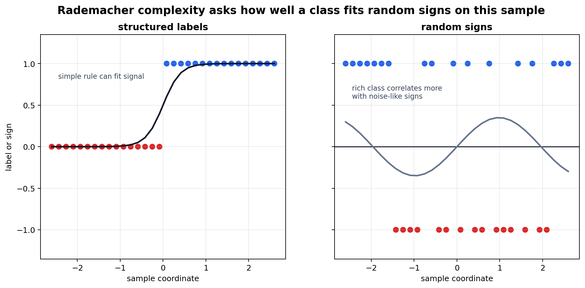
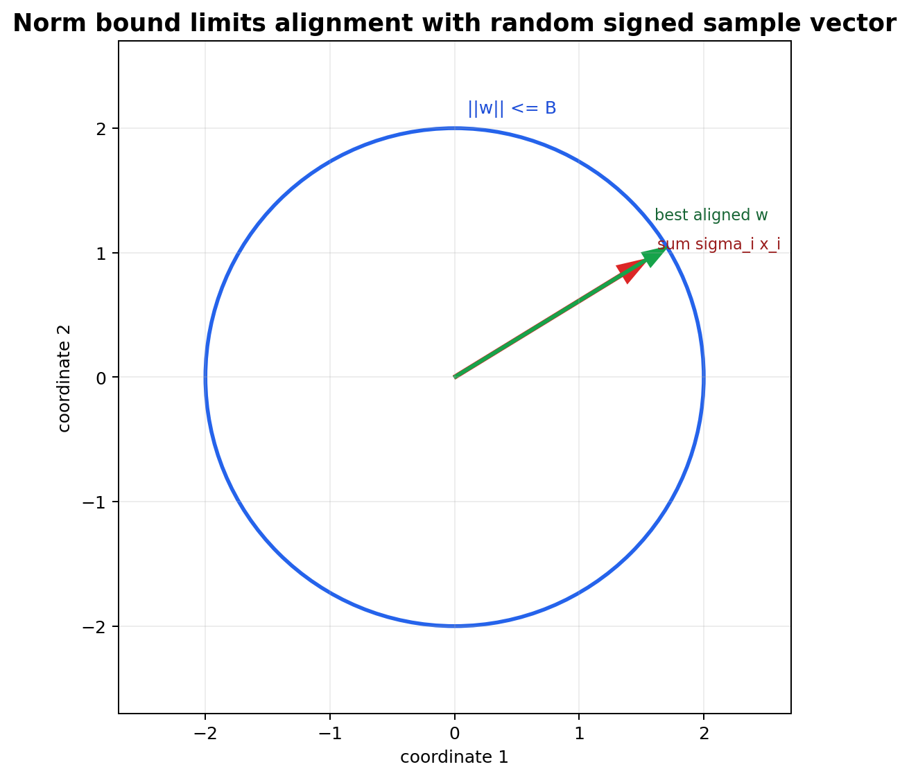

# Data-Dependent Complexity, Rademacher Complexity, Margin, and Norm

[Back to Learning From Data Theory Notebook](../README.md)

本章的中心问题是：

```text
能否度量与当前 sample 和当前 function values 相关的 complexity，
而不是只看 H 在最坏情形下的 combinatorial capacity？
```



## 0. Source Separation

### Primary Sources

Bartlett and Mendelson 是 Rademacher / Gaussian complexity 的主要来源。Bartlett, Foster, and Telgarsky 的 spectrally normalized margin bound 用作 deep network margin/norm theory 的 scoped example。

### Repository Synthesis

本章把 T2 的 uniform convergence 连接到 T4 的 margin/norm geometry 与 learned representation。这里不把 Rademacher complexity 写成唯一或最终的 complexity measure。

## 1. Why Move Beyond VC Dimension?

VC dimension 很强，因为它给 binary classification 提供 worst-case uniform control。但它也刻意粗粒度：

- 它围绕 dichotomy 与 shattering 定义；
- 它对 point configuration 取 worst case；
- 它处理 real-valued score 与 margin-sensitive loss 时不总是最自然；
- 它可能忽略 realized sample 上的 geometry。

这不表示 VC dimension 过时。它表示我们还需要其他 lens 来观察同一个 generalization problem。

## 2. Empirical Rademacher Complexity

令 $\sigma_1,\ldots,\sigma_n$ 是 independent Rademacher variables：

```math
\mathbb P(\sigma_i=1)
=
\mathbb P(\sigma_i=-1)
=
\frac12.
```

给定 real-valued function class $\mathcal F$ 与 sample $S=(z_1,\ldots,z_n)$，采用本章固定 convention：

```math
\widehat{\mathfrak R}_S(\mathcal F)
=
\mathbb E_\sigma
\left[
\sup_{f\in\mathcal F}
\frac1n
\sum_{i=1}^{n}
\sigma_i f(z_i)
\right].
```

直觉是：

```text
在这个 sample 上，F 中的 functions 能多强地贴合 random signs？
```

如果一个 class 可以轻易对 random signs 产生高相关，它在这个 sample 上就有较强的 noise-fitting ability。

## 3. Why Random Signs Measure Richness

random signs 抹掉 stable signal。若 $\mathcal F$ 仍能对很多随机符号模式对齐，说明它在当前 sample geometry 上足够 flexible，可以吸收 noise-like variation。

这与 T2 的 dichotomy 思想相近，但不是同一个对象：

```text
VC shattering:
H 能否在某组 points 上实现所有 binary labelings？

Rademacher complexity:
F 在当前 realized sample 上能多强地关联 random signed noise？
```

因此，即使 worst-case capacity 很大，若当前 geometry 良性，Rademacher complexity 仍可能较小。

## 4. Rademacher Generalization Bound

### Theorem: Bounded Loss-Class Bound

### Phenomenon

real-valued class 的 raw description 可能很大，但在当前 sample 上仍可能有 useful data-dependent control。

### Formal Model

考虑 loss class：

```math
\mathcal G
=
\{z\mapsto \ell(h,z):h\in\mathcal H\}.
```

### Assumptions

- $S$ 从 source distribution $P$ i.i.d. 抽样。
- 每个 $g\in\mathcal G$ 的取值在 $[0,1]$。
- empirical Rademacher complexity 使用第 2 节的 convention。

### Objects and Randomness

randomness 来自 sample $S$ 与辅助符号 $\sigma_i$。定义：

```math
R(h)=\mathbb E_{z\sim P}[\ell(h,z)]
```

```math
\hat R_S(h)=\frac1n\sum_{i=1}^n\ell(h,z_i).
```

### Claim

在本章 convention 下，一个 standard empirical Rademacher bound 是：以至少 $1-\delta$ 的概率，对所有 $h\in\mathcal H$，

```math
R(h)
\le
\hat R_S(h)
+
2\widehat{\mathfrak R}_S(\mathcal G)
+
3
\sqrt{
\frac{\log(2/\delta)}{2n}
}.
```

Bartlett-Mendelson 给出 closely related results，但它们的 complexity convention 使用 absolute value 与内部 $2/n$ factor。引用常数时必须固定 convention，不能混用。

### Derivation / Proof Idea

proof skeleton 是 symmetrization：先引入 independent ghost sample 比较 population average 与 empirical average，再用 Rademacher signs 表达 sample fluctuation。concentration step 把 expected complexity 转成 high-probability statement。supremum over $\mathcal G$ 则由 loss class 与 random signs 的相关能力控制。

### Interpretation

generalization gap 由 loss class 在 observed sample 上 fit random fluctuations 的能力控制。

### What This Does NOT Imply

它不取消 i.i.d. source-sampling assumption；不自动处理 distribution shift；也不说明 Rademacher complexity 是所谓 "true complexity"。

### Research Use

读 paper 时要问：它控制的是 whole class、norm/margin-restricted class、selected solution 附近的 localized class，还是只在 training 后报告一个 empirical complexity 数值？

### Model-Regime Boundary

这是 bounded loss 下的 class-dependent source-generalization theorem。它不是 algorithmic-stability theorem，也不是 target-domain adaptation theorem。

## 5. Linear Norm-Bounded Class Derivation



假设：

```math
\|w\|_2\le B,
\qquad
\|x_i\|_2\le R.
```

对 linear class：

```math
f_w(x)=w^\top x,
```

定义：

```math
\mathcal F
=
\{x\mapsto w^\top x:\|w\|_2\le B\}.
```

根据 empirical Rademacher complexity 的定义：

```math
\widehat{\mathfrak R}_S(\mathcal F)
=
\mathbb E_\sigma
\left[
\sup_{\|w\|_2\le B}
\frac1n
\sum_{i=1}^n
\sigma_i w^\top x_i
\right].
```

先把 $w$ 移到 sum 外面：

```math
\widehat{\mathfrak R}_S(\mathcal F)
=
\frac1n
\mathbb E_\sigma
\left[
\sup_{\|w\|_2\le B}
w^\top
\sum_{i=1}^n
\sigma_i x_i
\right].
```

由 Cauchy-Schwarz，也就是 Euclidean dual norm：

```math
\sup_{\|w\|_2\le B}
w^\top
\sum_{i=1}^n
\sigma_i x_i
=
B
\left\|
\sum_{i=1}^n
\sigma_i x_i
\right\|_2.
```

所以：

```math
\widehat{\mathfrak R}_S(\mathcal F)
=
\frac{B}{n}
\mathbb E_\sigma
\left\|
\sum_{i=1}^n
\sigma_i x_i
\right\|_2.
```

用 Jensen inequality：

```math
\mathbb E_\sigma
\left\|
\sum_{i=1}^n
\sigma_i x_i
\right\|_2
\le
\sqrt{
\mathbb E_\sigma
\left\|
\sum_{i=1}^n
\sigma_i x_i
\right\|_2^2
}.
```

展开平方：

```math
\mathbb E_\sigma
\left\|
\sum_{i=1}^n
\sigma_i x_i
\right\|_2^2
=
\mathbb E_\sigma
\sum_{i,j}
\sigma_i\sigma_j
x_i^\top x_j.
```

由于 independent Rademacher variables 满足 zero mean：

```math
\mathbb E[\sigma_i\sigma_j]=0
\quad
\text{for }i\ne j,
\qquad
\mathbb E[\sigma_i^2]=1.
```

因此 cross terms 消失：

```math
\mathbb E_\sigma
\left\|
\sum_{i=1}^n
\sigma_i x_i
\right\|_2^2
=
\sum_{i=1}^n
\|x_i\|_2^2
\le
nR^2.
```

合并各步：

```math
\widehat{\mathfrak R}_S(\mathcal F)
\le
\frac{B}{n}
\sqrt{nR^2}
=
\frac{BR}{\sqrt n}.
```

这是 T5 的核心推导之一：complexity 依赖 norm 与 input geometry，而不是只依赖 parameter count。

## 6. Representation Dependence

如果 inputs 先变成：

```math
z=\Phi(x),
```

同样推导中的 input-radius term 会变成：

```math
\|z_i\|_2=\|\Phi(x_i)\|_2.
```

因此 norm、margin 与 Rademacher complexity 都依赖 $\Phi$ 诱导的 geometry。T4 的 representation chain 在这里变成 statistical control：

```text
Representation Phi
-> geometry
-> norms and margins
-> complexity bound
```

对 learned representation $\Phi_\theta$ 而言，这个 geometry 本身又是 training 的输出。

## 7. Margin and Norm Bounds

两个 classifiers 即使来自同一个巨大 parameterized family，只要它们的下面 quantities 不同，generalization bound 也可能完全不同：

- margin；
- input norm；
- weight norm；
- operator norm；
- layerwise sensitivity。

Bartlett, Foster, and Telgarsky 的 spectrally normalized margin bounds 是一个 carefully scoped neural-network example。结构上，feedforward network 的 margin-loss bound 会依赖 layer spectral norms 的乘积和 layerwise norm ratios 等量，而不只是 raw parameter count。

### Model-Regime Boundary

这是在指定 network architecture、margin loss 与 norm assumptions 下的 class-dependent margin/norm result。它不说明每个 trained deep network 都有 small non-vacuous bound；也不说明 optimizer 一定会选到被该 bound 控制的区域，除非另有 implicit-bias 或 training-dynamics argument。

## 8. Data-Dependent Does Not Mean Assumption-Free

Rademacher analysis 仍然需要：

- source sampling assumption；
- 明确定义的 class 或 localized class；
- boundedness 或 Lipschitz / composition conditions；
- loss class；
- population risk target。

它不自动解决 distribution shift。

## 9. Preview of Other Lenses

还有一些 modern lenses 控制不同对象：

| Lens | Controlled object |
| --- | --- |
| PAC-Bayes | 相对 prior 的 posterior predictor distribution |
| Compression | 编码或重构 learned predictor 所需的信息量 |
| Localized complexities | low-risk 或 selected region 附近的 complexity |

这些内容在 T5 中只放入 map，不展开成完整章节。

## 10. Cross-Links

- T2 uniform convergence baseline：[modern uniform convergence](../part2_generalization_theory/09_modern_uniform_convergence_and_capacity_control.md)。
- T4 margin geometry：[SVM margin geometry](../part4_margin_kernel_learning_principles/14_caltech_l14_support_vector_machines_margin_geometry_duality.md)。
- T4 representation geometry：[unified lens](../part4_margin_kernel_learning_principles/19_geometry_representation_capacity_unified_lens.md)。

[Back to Learning From Data Theory Notebook](../README.md)
