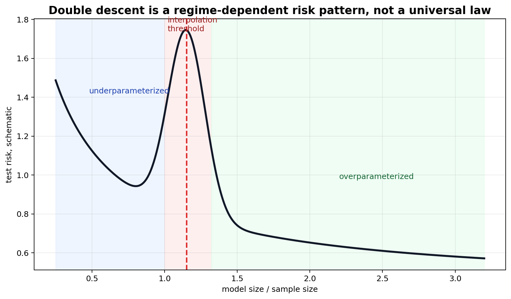
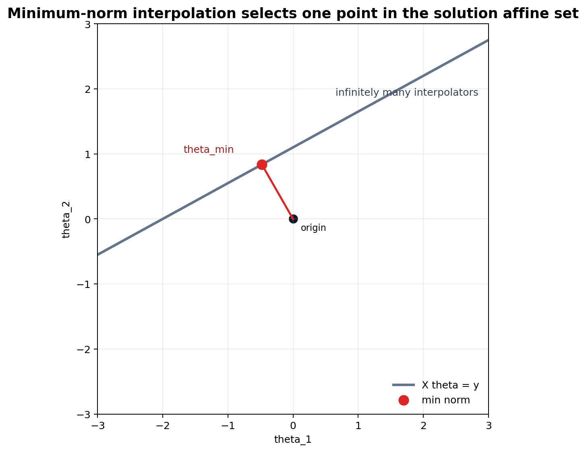

# Overparameterization, Interpolation, Double Descent, and Benign Overfitting

[Back to Learning From Data Theory Notebook](../README.md)

本章处理一个现代张力：

```text
training error 可以为 0；
parameters 可以多于 samples；
在某些 regimes 中 test error 仍然可以很低。
```

目标不是把这个 observation 写成 universal law，而是分清哪些现象、哪些模型、哪些 theorem、哪些 extrapolation。



## 0. Source Separation

### Primary Sources

Belkin et al. 用于 modern bias-variance reconciliation。Nakkiran et al. 用于 deep double descent 的 empirical and conceptual taxonomy。Bartlett, Long, Lugosi, and Tsigler 用于 linear regression 中 benign overfitting 的 formal model。

### Repository Synthesis

本章用 linear interpolation 作为 solution selection 的 tractable model。它不声称 linear benign-overfitting theory 解释 arbitrary transformers 或 finite neural networks。

## 1. Parameter Count Versus Interpolation Threshold

三种 regime 可以这样理解：

```text
underparameterized:
model 不能 fit all training labels

interpolation threshold:
model 第一次具备 exact fit training set 的能力

overparameterized:
可能存在许多 fitting solutions
```

interpolation 表示 relevant training loss 或 training error 可以为零：

```math
\hat R_S(h)=0.
```

它本身不说明 population risk 是高还是低。

## 2. Minimum-Norm Interpolating Linear Regression



考虑 linear system：

```math
X\theta=y,
```

其中 $X\in\mathbb R^{n\times d}$，$d>n$，并且 $X$ has full row rank $n$。如果 system consistent，那么 solutions 不唯一。

minimum-Euclidean-norm interpolator 解的是：

```math
\min_\theta
\frac12\|\theta\|_2^2
\quad
\text{subject to}
\quad
X\theta=y.
```

### Derivation

写出 Lagrangian：

```math
\mathcal L(\theta,\lambda)
=
\frac12\|\theta\|_2^2
+
\lambda^\top(y-X\theta).
```

对 $\theta$ 的 stationarity condition 是：

```math
\nabla_\theta \mathcal L
=
\theta-X^\top\lambda
=
0.
```

因此：

```math
\theta=X^\top\lambda.
```

代入 constraint：

```math
X\theta
=
XX^\top\lambda
=
y.
```

因为 $X$ full row rank，$XX^\top$ invertible，所以：

```math
\lambda
=
(XX^\top)^{-1}y.
```

得到：

```math
\hat\theta_{\min}
=
X^\top(XX^\top)^{-1}y.
```

所有 interpolators 都可写成：

```math
\hat\theta_{\min}+v,
\qquad
Xv=0.
```

minimum-norm rule 选择 nullspace 正交方向上的 component。这直接连接 implicit bias：当 fitting solutions 无限多时，algorithm 仍会选出其中一个。

## 3. Why Interpolation Can Be Harmful

noise 可以被 exact fit。classical warning 是：

```text
如果 model 拟合了 sample-specific noise，
population prediction 可能变差。
```

这个 warning 仍然有效。不能普遍成立的是：

```text
interpolation => poor generalization
```

population effect 取决于 data geometry、noise、selected interpolator、representation 与 evaluation distribution。

## 4. Double Descent

### Phenomenon

Belkin et al. 与 Nakkiran et al. 描述了一类现象：test risk 可能先下降、在 interpolation threshold 附近上升、随后在某些 overparameterized regimes 中再次下降。

### Formal Model

不同 paper 分析不同模型：linear regression、random features、kernel methods 与 neural networks。共同对象是 risk 如何随 model size、sample size 或 training time 变化。

### Theorem

不存在一个 theorem 说明 every model exhibits double descent。具体论文只在指定 model 和 data assumptions 下证明或观察 double-descent-like behavior。

### Interpretation

在 interpolation threshold 附近，selected solution 可能 high norm 或 poorly conditioned。超过 threshold 后，额外 degrees of freedom 在某些 geometry 中可能允许 lower-complexity interpolation。

### Transfer Limitation

double descent 不表示：

```text
larger models always improve test error
```

它是某些 regimes 中观察到的 phenomenon，不是 monotonic scaling law。

## 5. Why the Interpolation Threshold Is Special

在 interpolation 附近，如果 design ill-conditioned，小的 data 或 label perturbation 可能导致很大的 parameter change。selected interpolator 可能表现出：

- high norm；
- high variance；
- label noise sensitivity；
- poor margin；
- 与 data covariance 的 unfavorable alignment。

在某些 overparameterized regimes 中，更多 degrees of freedom 可能绕开部分 instability。但这取决于 problem structure。

## 6. Benign Overfitting

### Phenomenon

benign overfitting 指：

```text
training error reaches zero,
possibly fitting noise,
while population prediction error remains small or near optimal.
```

中文上可以理解为：模型可能完全拟合训练集，甚至拟合 noise，但在 population prediction 上仍然接近良性。

### Formal Model

Bartlett, Long, Lugosi, and Tsigler 分析的是 linear regression 中的 minimum-norm interpolation，条件涉及 data covariance、signal、noise 与 overparameterized design。

### Assumptions

完整 theorem 使用 technical conditions，包括：

- covariance spectrum；
- signal alignment；
- noise level；
- sample size；
- minimum-norm interpolation；
- 由 spectrum 定义的 effective dimensions。

### Objects and Randomness

training inputs 与 noise 是 random。selected predictor 是 minimum-norm least-squares interpolator。

### Claim

在某些 high-dimensional linear-regression regimes 中，minimum-norm interpolator 可以 exact fit training sample，同时具有 small excess prediction risk。

### Derivation / Proof Idea

proof idea 是按 covariance eigendirections 分解 signal 与 noise。若许多 low-variance directions 可以吸收 noise，而这些方向对 population prediction 的贡献很小，interpolation 就可能是 benign。effective dimension 与 spectral decay 决定这种情况是否发生。

### Interpretation

overparameterization 有时会提供足够多的 directions，使 noise 被拟合在 population consequence 较低的方向上。

### What This Does NOT Imply

它不表示：

```text
zero training error = benign overfitting
```

benign overfitting 还要求 good population prediction。它也不表示 minimum norm 是 universally simplest / best solution；simplicity 依赖 representation 与 geometry。

### Research Use

当 paper 声称 benign overfitting，要问：model 是什么？selected interpolator 是什么？covariance structure 和 noise model 是什么？risk target 是 source 还是 target？

### Model-Regime Boundary

该 formal result 属于 spectral assumptions 下的 linear regression minimum-norm interpolation。它不是 arbitrary deep network theorem。

## 7. Benign Does Not Mean Universal

interpolation 可能是：

```text
benign,
tempered,
or catastrophic,
depending on problem structure.
```

这些词只是 diagnostic descriptions，不是本章引入的 universal taxonomy。同样的 zero training error 可能对应低、中、高三种完全不同的 test risk。

## 8. Bias-Variance Revisited

T2 的 bias-variance decomposition 不是错的。需要修正的是过度简化的 cartoon：

```text
complexity increases
-> variance monotonically increases forever
```

modern results 表明，当 model family、interpolation 与 algorithmic solution selection 同时改变时，bias 与 variance terms 的行为可以 non-monotone。

因此，数学分解可以仍然正确，而 qualitative curve 不再等于经典教材里的单峰图像。

## 9. Research Lens

当 ML paper 报告 scaling model size 带来收益时，要问：

- 是否涉及 interpolation？
- optimizer 选择了什么 solution？
- data covariance 或 geometry 是什么？
- 改善来自 model size、optimization、regularization，还是 representation？
- label noise 下会发生什么？
- source-distribution performance 在 shift 下是否仍然可靠？

## 10. Cross-Links

- T2 bias-variance：[bias-variance and learning curves](../part2_generalization_theory/08_caltech_l08_bias_variance_learning_curves.md)。
- T3 overfitting：[overfitting and effective complexity](../part3_fitting_regularization_validation/11_caltech_l11_overfitting_noise_and_effective_complexity.md)。
- T4 norm/margin geometry：[SVM margin geometry](../part4_margin_kernel_learning_principles/14_caltech_l14_support_vector_machines_margin_geometry_duality.md)。
- Week 3 overfitting experiment：[week3 optimization and MLP](../../../reports/week3_optimization_and_mlp.md)。

[Back to Learning From Data Theory Notebook](../README.md)
