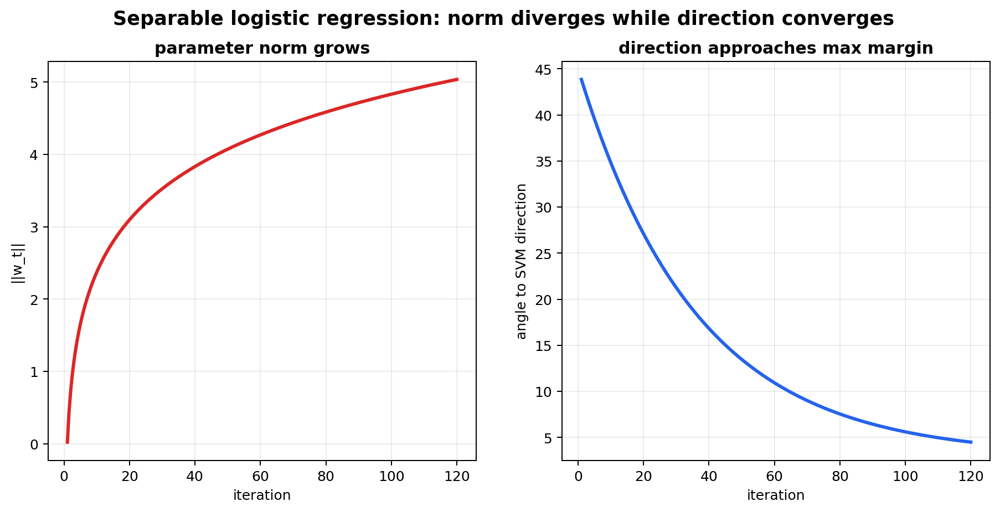
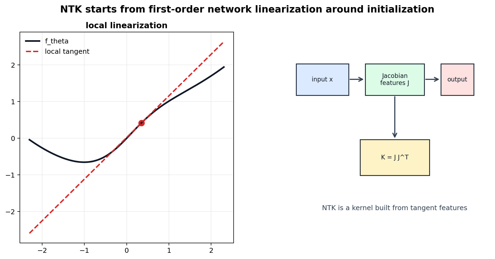
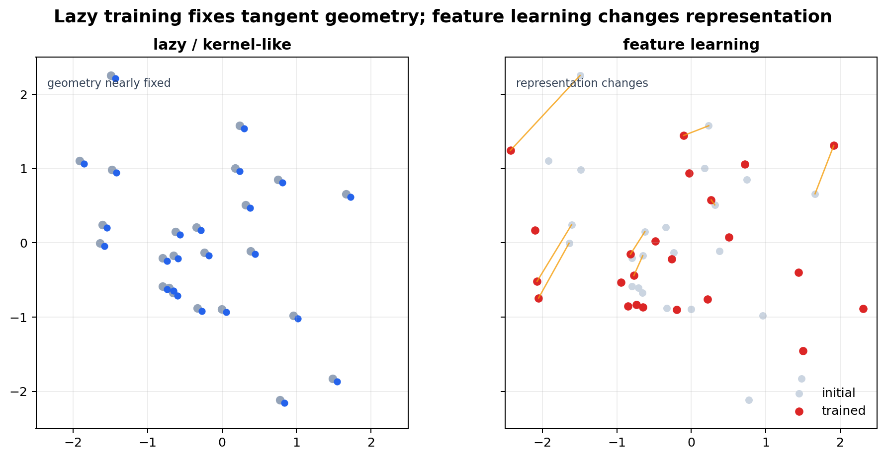

# Implicit Bias, Optimization Dynamics, and Neural Tangent Kernels

[Back to Learning From Data Theory Notebook](../README.md)

本章把 T3 的 optimization 与 T4 的 margin geometry 接起来。核心问题是：

```text
当 objective 和 nominal H 都不足以唯一确定 solution 时，
training dynamics 会偏向哪一个 solution？
```



## 0. Source Separation

### Primary Sources

Soudry et al. 用于 separable logistic regression 的 implicit-bias theorem。Jacot, Gabriel, and Hongler 用于 Neural Tangent Kernel。Gunasekar et al. 只作为 optimization geometry 的延伸背景，不在本章展开完整 theorem。

### Repository Synthesis

本章把 separable logistic regression 的 max-margin result、T4 的 margin geometry、以及 NTK 的 tangent-feature regime 放到同一张 map 中。它不声称这些 theorem 自动解释 arbitrary finite neural networks。

## 1. Explicit Versus Implicit Solution Preference

explicit regularization 是 objective 或 constraint 中显式写出的 preference：

```math
\hat R_S(\theta)+\lambda\Omega(\theta)
```

或：

```math
\Omega(\theta)\le C.
```

implicit bias 指的是：即使 objective 中没有显式 penalty，training dynamics 仍可能在多个 fitting solutions 中偏向某些 solutions。

本章优先使用 `implicit bias`。只有当某个 theorem 明确建立了等价 regularizer 或等价 constrained problem 时，才把它称为 `implicit regularization`。

## 2. Separable Logistic Regression

考虑 linearly separable binary data。使用 unregularized logistic loss 时，如果存在 $w$ 使所有 $y_i w^\top x_i>0$，则 loss infimum 可以趋近 0，但 finite minimizer 不存在：

```math
\|w_t\|_2\to\infty.
```

关键是：parameter norm 发散，不代表 classifier direction 没有结构。

### Theorem: Gradient Descent Direction Converges to Max-Margin

### Phenomenon

unregularized gradient descent 在 separable data 上可以让 norm diverge，但 direction 变得稳定，并接近 max-margin separator。

### Formal Model

这是 linear prediction model 上的 separable classification。loss 是 logistic / exponential-tail 类型，optimization 是 gradient descent。

### Assumptions

- data linearly separable；
- loss 满足 Soudry et al. 的 tail 与 smoothness 条件，logistic loss 是核心例子；
- gradient descent step size 处于 theorem 允许的 regime；
- 没有显式 norm regularization。

### Objects and Randomness

theorem 通常对 fixed separable dataset 分析 deterministic gradient descent trajectory。若 dataset 随机抽样，那是额外的 statistical layer。

### Claim

令 $w_{\mathrm{SVM}}$ 是 hard-margin SVM direction。Soudry et al. 的核心 directional statement 是：

```math
\frac{w_t}{\|w_t\|}
\to
\frac{w_{\mathrm{SVM}}}{\|w_{\mathrm{SVM}}\|}.
```

不要写成 $w_t$ 收敛到 finite SVM vector；$w_t$ 的 norm 发散。

### Derivation / Proof Idea

loss 的 exponential tail 使 large-margin points 的 gradient contribution 快速衰减，support-vector-like points 主导 long-time dynamics。trajectory 在 scale 上继续增长，但 direction 被 margin geometry 约束，最终趋向 L2 hard-margin separator。

### Interpretation

同一个 objective 和 nominal linear class 并不完整描述 learned classifier。optimizer trajectory 会把无显式 regularization 的 separable logistic regression 推向 max-margin direction。

### What This Does NOT Imply

这个 theorem 不说明：

```text
implicit bias theorem for logistic regression
explains deep neural networks.
```

它也不说明所有 optimizers、所有 losses、所有 parameterizations 都偏向同一个 margin notion。

### Research Use

看到 "implicit bias explains generalization" 时，要问 theorem 的 setting 是否是 separable linear model、matrix factorization、homogeneous network、NTK regime，还是只是 heuristic analogy。

### Model-Regime Boundary

该 result 属于 separable linear classification 与 gradient descent dynamics。它不是 arbitrary nonlinear finite-width network theorem。

## 3. Why This Matters

同一个：

```text
objective
+
nominal H
```

可能不足以预测 learned function。还必须说明：

- parameterization；
- optimizer；
- initialization；
- learning-rate schedule；
- stopping time；
- batch sampling；
- explicit regularization；
- numerical regime。

这正是 T5 从 class-level analysis 转向 algorithm-dependent analysis 的原因。

## 4. Optimization Geometry

不同 optimization geometry 会偏好不同的 simplicity notion。Euclidean gradient descent 与其他 steepest-descent geometries 对 "short step" 的定义不同，因此 implicit bias 也可能不同。

简化地说：

```text
optimizer geometry
-> trajectory
-> selected fitting solution
-> effective simplicity notion
```

本章不展开 Gunasekar-style full theory，只保留这个研究问题：当 paper 声称 optimizer 有 implicit regularization 时，必须说明是哪个 geometry 下的 bias。

## 5. From Nonlinear Networks to Local Linearization

对 neural network：

```math
f_\theta(x),
```

在 initialization $\theta_0$ 附近做 first-order approximation：

```math
f_\theta(x)
\approx
f_{\theta_0}(x)
+
\nabla_\theta f_{\theta_0}(x)^\top
(\theta-\theta_0).
```

这里的：

```math
\nabla_\theta f_{\theta_0}(x)
```

可以看作 tangent feature 或 Jacobian feature。这个 approximation 的含义是：把 network 在 initialization 附近的 local tangent features 固定下来，然后在这些 features 上学习。



## 6. Neural Tangent Kernel

Neural Tangent Kernel 定义为：

```math
K_\theta(x,x')
=
\nabla_\theta f_\theta(x)^\top
\nabla_\theta f_\theta(x').
```

这与 T4 的 kernel view 相连：NTK 是由 network parameterization 的 tangent features 构造出的 kernel。

在 finite training set $x_1,\ldots,x_n$ 上，令 Jacobian matrix 为：

```math
J_\theta
=
\begin{bmatrix}
\nabla_\theta f_\theta(x_1)^\top\\
\vdots\\
\nabla_\theta f_\theta(x_n)^\top
\end{bmatrix}.
```

则 training-set kernel matrix 是：

```math
K_\theta
=
J_\theta J_\theta^\top.
```

## 7. Gradient-Flow Dynamics

对 squared loss：

```math
L(\theta)
=
\frac12
\|f_\theta(X)-y\|_2^2,
```

其中 $f_\theta(X)$ 表示 training outputs vector。gradient flow 满足：

```math
\dot\theta_t
=
-
\nabla_\theta L(\theta_t)
=
-
J_t^\top(f_t-y).
```

对 outputs 求导：

```math
\dot f_t
=
J_t\dot\theta_t
=
-
J_tJ_t^\top(f_t-y).
```

因此：

```math
\dot f_t
=
-
K_t(f_t-y).
```

这说明 training dynamics 可以在 function space 中由 time-varying kernel $K_t$ 描述。

在 infinite-width 或相应 scaling regime 中，Jacot et al. 分析了 $K_t$ 在 training 中接近 initialization kernel 的情形。此时 dynamics 接近 fixed-kernel learning。

## 8. Lazy Training Versus Feature Learning



### Lazy / Kernel-Like Regime

在 lazy training regime 中，parameters 可能变化，但 tangent features 或 induced kernel 变化很小：

```text
K_t \approx K_0.
```

学习主要发生在 initialization 给出的 tangent-feature space 中。

### Feature-Learning Regime

在 feature-learning regime 中，internal representations materially change。此时 model 不只是使用 fixed tangent features，而是在训练中改变 geometry：

```text
\Phi_{\theta_0}(x)
!=
\Phi_{\theta_t}(x).
```

### Mandatory Distinction

NTK theory 的价值正是它 isolated a regime。它不是 neural network training 的同义词，也不是 learned representation 的 universal explanation。

## 9. Connection to Representation Research

如果一个 model 的 generalization 主要来自 kernel-like dynamics，那么要问：

```text
representation 实际学到了什么？
```

如果 internal representation 强烈变化，则要问：

```text
哪一个 classical kernel analogy 失效了？
```

这不是哲学问题，而是 technical regime question：training 是否可由 fixed tangent geometry 近似，还是必须分析 evolving learned geometry。

## 10. Cross-Links

- T3 logistic regression 与 separation caveat：[logistic regression](../part3_fitting_regularization_validation/09_caltech_l09_logistic_regression_likelihood_gradient_descent.md)。
- T3 neural networks and backpropagation：[neural networks](../part3_fitting_regularization_validation/10_caltech_l10_neural_networks_backpropagation_representation.md)。
- T4 margin geometry：[SVM margin geometry](../part4_margin_kernel_learning_principles/14_caltech_l14_support_vector_machines_margin_geometry_duality.md)。
- T4 kernel geometry：[kernel methods](../part4_margin_kernel_learning_principles/15_caltech_l15_kernel_methods_feature_spaces_soft_margins.md)。

[Back to Learning From Data Theory Notebook](../README.md)
