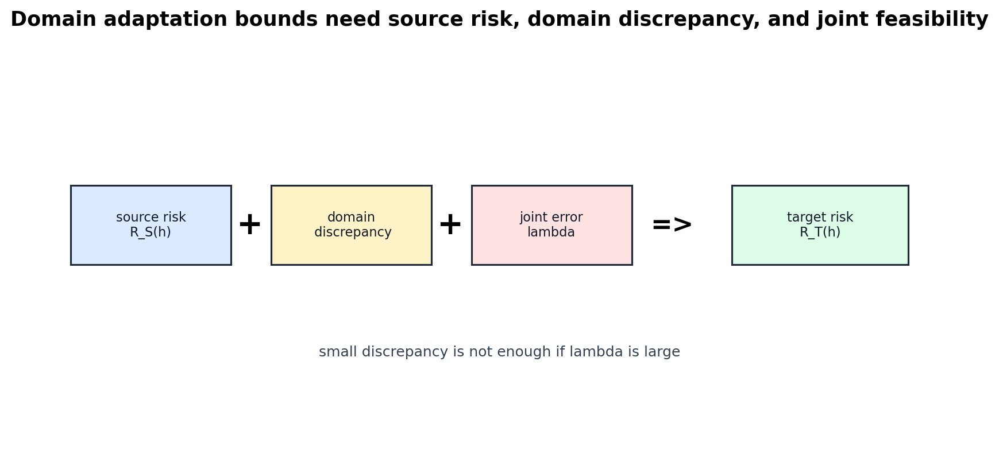
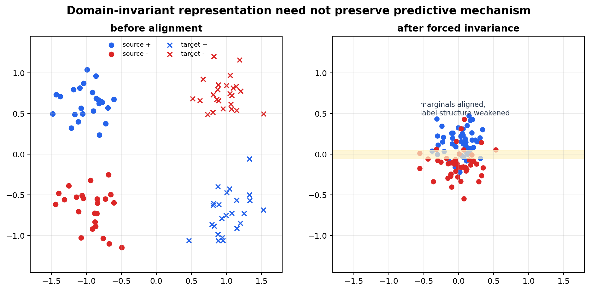

# Distribution Shift, Domain Adaptation, and Representation

[Back to Learning From Data Theory Notebook](../README.md)

本章的中心问题是：

```text
当 E_out 在不同于 training data 的 environment 中评估时，
learning-theory claim 需要额外说明什么？
```

T2 主要处理同一 source distribution 下的 generalization。domain adaptation 问的是 source 到 target 的 relation。



## 0. Source Separation

### Primary Sources

Ben-David et al. 用于 $\mathcal H\Delta\mathcal H$ divergence 与 source-target risk bound。Zhao et al. 用于 invariant representation 的 limitation。

### Repository Synthesis

本章把 T4 的 representation/geometry view 与 Week 4 Canvas shift、Week 5 calibration/abstention evidence discipline 连接起来。domain-adaptation theory 不是 real-world shift 的完整解法，而是用于拆分 claim 的 formal lens。

## 1. Source and Target Risks

设 source distribution 为 $P_S$，target distribution 为 $P_T$。对 hypothesis $h$，定义：

```math
R_S(h)
=
\mathbb E_{(X,Y)\sim P_S}
\left[
\ell(h(X),Y)
\right],
```

```math
R_T(h)
=
\mathbb E_{(X,Y)\sim P_T}
\left[
\ell(h(X),Y)
\right].
```

T2 的 classical source generalization 主要关心：

```text
\hat R_S(h) 是否接近 R_S(h)
```

domain adaptation 关心：

```text
R_T(h) 是否可由 source evidence 加上 source-target assumptions 控制
```

## 2. Why Source Generalization Is Insufficient

即使：

```math
\hat R_S(h)
\approx
R_S(h),
```

也不会自动得到：

```math
R_S(h)
\approx
R_T(h).
```

这句话是 T5 的永久区分：

```text
i.i.d. source generalization
!=
distribution-shift reliability
```

从 source 到 target 需要第二个 argument。

## 3. H-Delta-H Divergence

Ben-David-style domain adaptation 使用 disagreement-based discrepancy。对 binary hypothesis class $\mathcal H$，定义 symmetric-difference class：

```math
\mathcal H\Delta\mathcal H
=
\{x\mapsto h(x)\oplus h'(x):h,h'\in\mathcal H\}.
```

对应 divergence 可写成：

```math
d_{\mathcal H\Delta\mathcal H}(P_S^X,P_T^X)
=
2
\sup_{h,h'\in\mathcal H}
\left|
\Pr_{X\sim P_S^X}[h(X)\ne h'(X)]
-
\Pr_{X\sim P_T^X}[h(X)\ne h'(X)]
\right|.
```

直觉是：

```text
如果 H 中的 hypotheses 在 source 和 target 上的 disagreement pattern 很不同，
那么这两个 domains 对 H 来说就是不同的。
```

它不是 generic Euclidean distribution distance；它取决于 $\mathcal H$ 能看见的 distinctions。

## 4. Domain-Adaptation Bound

### Theorem: Ben-David-Style Target-Risk Bound

### Phenomenon

source 上表现好不一定 target 上表现好；需要 source risk、domain discrepancy 与 joint feasibility 同时控制。

### Formal Model

binary classification；source 和 target 有不同 marginal distributions；risk 通常用 0/1 classification error。

### Assumptions

- hypotheses 来自 $\mathcal H$；
- source 和 target distributions 明确定义；
- $\mathcal H\Delta\mathcal H$ divergence 可定义；
- risk 使用与 theorem 一致的 0/1 loss convention。

### Objects and Randomness

bound 可先写成 population form。若用 finite samples 估计 divergence，还需要额外 sample-complexity argument。

### Claim

canonical structure 是：对所有 $h\in\mathcal H$，

```math
R_T(h)
\le
R_S(h)
+
\frac12
d_{\mathcal H\Delta\mathcal H}(P_S^X,P_T^X)
+
\lambda,
```

其中：

```math
\lambda
=
\min_{h\in\mathcal H}
\left[
R_S(h)+R_T(h)
\right].
```

### Derivation / Proof Idea

proof idea 是把 target error 与 source error 的差异转成 hypotheses disagreement，再由 $\mathcal H\Delta\mathcal H$ divergence 控制 domains 上 disagreement probabilities 的差。$\lambda$ 项记录是否存在一个 hypothesis 能同时在 source 和 target 上表现好。

### Interpretation

target risk 不是只由 source risk 决定。还需要：

```text
source-target discrepancy small
+
shared good hypothesis exists
```

### What This Does NOT Imply

它不说明 marginal alignment 一定提升 target accuracy；不说明 small source-target marginal discrepancy 表示 mechanisms 相同；也不覆盖 arbitrary structured shifts。

### Research Use

当 paper 声称 domain adaptation 成功，要问它控制了 source risk、domain discrepancy、joint error 中的哪几项。

### Model-Regime Boundary

这是 binary classification/domain adaptation 的 population-bound lens。它不是 calibration theorem、adversarial robustness theorem，也不是 real-world mechanism-shift 完整理论。

## 5. Why Lambda Matters

$\lambda$ 是：

```math
\min_{h\in\mathcal H}
\left[
R_S(h)+R_T(h)
\right].
```

它表示是否存在一个 shared hypothesis 同时适合 source 与 target。

更精确地说，$\lambda$ 衡量的是相对于当前 $\mathcal H$ 的 shared-hypothesis / joint-predictive feasibility。

因此，即使 representation 被做成 domain-invariant，使 discrepancy 很小，target prediction 仍可能失败：如果 no shared hypothesis performs well on both domains，$\lambda$ 会很大。

但 $\lambda$ 不诊断 shared feasibility 为什么失败。large $\lambda$ 可以与多种情况一致：

- observational conditional relationship 改变；
- hypothesis-class misspecification；
- representation information loss；
- source / target labeling incompatibility；
- 其他 source-target structural mismatch。

它暴露的是 distribution alignment 的限制：small domain discrepancy 不足以保证 target performance，当 chosen representation / hypothesis family 缺少 jointly good predictor 时仍会失败。至于原因是否是 underlying mechanism change，需要单独的 structural argument。

## 6. Covariate Shift, Conditional Shift, and Mechanism Change

沿用 T4 的 taxonomy。

### Covariate Shift

standard covariate-shift assumption 是：

```math
P_S(X)\ne P_T(X),
```

但：

```math
P_S(Y|X)=P_T(Y|X)
```

在相关区域成立。

### Conditional / Concept Shift

更困难的情况是：

```math
P_S(Y|X)
\ne
P_T(Y|X)
```

在重要区域发生改变。

这是关于 observational conditional relationship 的 statistical statement。它说明 prediction-relevant conditional behavior 在 source 和 target 之间不同，但它本身不识别原因。

### Structural / Causal / Dynamical Mechanism Change

mechanism-change claim 更强。它声称 underlying data-generating structural mechanism 发生改变，例如 causal equation、dynamical law、intervention target、measurement process 或 structural relation 改变。

必须明确：

```text
P_S(Y|X) != P_T(Y|X)
does not by itself identify or prove
a change in the underlying causal/dynamical mechanism.
```

要提出 mechanism-change claim，需要 explicit structural model 和额外 assumptions。反过来，observed conditional behavior 改变也可能来自多种原因：latent-variable distribution 改变、measurement / selection process 改变、conditioning structure 改变、label definition 改变，或 underlying mechanism 改变。

本章不展开 causal inference；这里只要求不要把 conditional shift 与 structural mechanism change 混为一谈。

## 7. Representation Adaptation

令：

```math
Z=\Phi(X).
```

许多 adaptation 方法试图让：

```math
P_S(Z)
```

与：

```math
P_T(Z)
```

变得相似。这样做可能有帮助，因为 classifier 在 represented space 中看到的 source 和 target 更接近。

但必须追问：

```text
让 marginal representations invariant，
是否保留了 predictive information？
```



## 8. Limits of Invariant Representation

Zhao et al. 的核心提醒是：domain invariance alone can be insufficient。它们的 analysis / counterexamples 表明，在 source-target incompatibility 下，representation alignment 加上 low source error 仍可能与 large target or joint error 共存；相关条件包括 label-distribution relationships。

这不是说 invariant representation 永远没用，而是说：

```text
domain-invariant representation
!=
guaranteed target accuracy
```

除非有更强 assumptions 说明被保留的 representation 同时保留了 target-relevant predictive information。

作为 repository synthesis，还要进一步区分：

```text
invariant representation
!=
mechanism-preserving representation
```

这个 distinction 不是 Zhao et al. 的 arbitrary mechanism-shift theorem，而是本仓库用来审计 marginal representation alignment claims 的概念边界。

### Model-Regime Boundary

Zhao et al. 的结果针对 domain adaptation 中的 representation alignment 设置。不要把它泛化成所有 invariance methods 都失败；也不要把它升级成 arbitrary mechanism shift theorem；也不要把 domain invariance 当作 target accuracy 的充分条件。

## 9. Connection to Real-World Dynamic Systems

real-world shift 可以分成几个 diagnostic axes：

```text
Observation mechanism change
State-distribution change
Spatial interaction change
Conditional prediction relationship change
Structural / causal / dynamical mechanism change
Label / target-definition change
```

Week 4 Canvas shift 更接近 observation mechanism change：模型在 sklearn digits source 上的 behavior，不自动说明真实 canvas 输入下的 behavior。若 label meaning、observational conditional relationship 或 structural mechanism 也改变，则问题更强，但这些需要分别论证。

existing domain-adaptation theory 不解决所有这些变化。它提供的是可审计的 formal decomposition。

## 10. Research Lens

对 robustness / adaptation paper，至少问：

- source 与 target 之间到底改变了什么？
- 哪个 distributional quantity 被假设 stable？
- representation alignment 是否足够？
- 是否有 target-domain information？
- claim 是 adaptation、robustness、invariance，还是 shift detection？
- 如果 observed conditional relationship 改变，会发生什么？
- 如果 claim 涉及 structural mechanism change，structural model 和 assumptions 是什么？

## 11. Cross-Links

- T1 source distribution 与 target environment：[theory ontology](../00_learning_theory_ontology_world_data_generalization_research_lens.md)。
- T4 sampling bias versus environment shift：[three learning principles](../part4_margin_kernel_learning_principles/17_caltech_l17_three_learning_principles_occam_sampling_snooping.md)。
- Week 4 Canvas diagnostic：[Canvas-Diagnostic-v1](../../../reports/week4/15_canvas_diagnostic_v1_inventory_and_failure_taxonomy.md)。
- Week 5 calibration and abstention show separate reliability claims：[calibration metrics](../../../reports/week5/02_calibration_metrics_and_reliability_diagrams.md)，[abstention policy](../../../reports/week5/03_confidence_thresholding_and_abstention_policy.md)。

[Back to Learning From Data Theory Notebook](../README.md)
