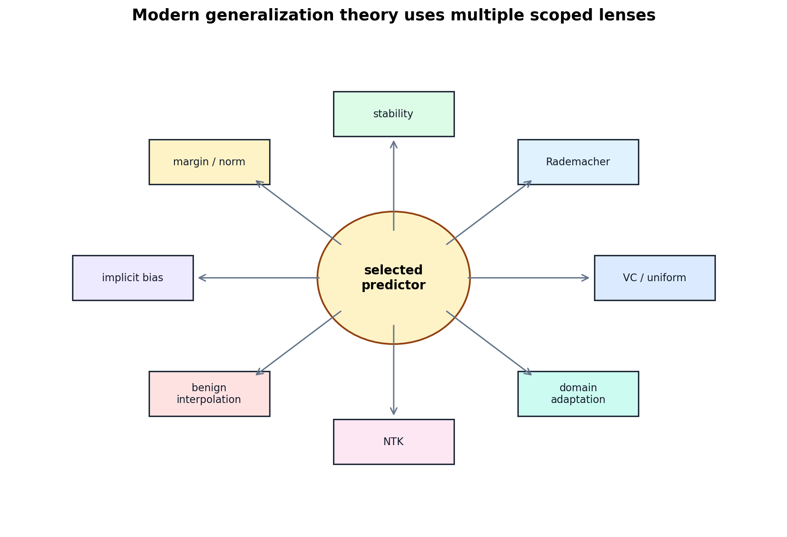

# A Unified Map of Modern Generalization Theory

[Back to Learning From Data Theory Notebook](../README.md)

本章是 T5 synthesis note。它明确拒绝一个想法：

```text
modern generalization 可以由一个 universal scalar complexity measure 解释。
```

更可靠的理解是：不同 theory lens 控制不同对象，回答不同问题。



## 0. Source Separation

本章不新增 theorem。它综合 T2-T5 已经引用的 uniform convergence、Rademacher complexity、stability、margin/norm、implicit bias、benign overfitting、NTK 与 domain adaptation sources。

## 1. The Classical Lens

```text
H
-> capacity
-> uniform convergence
```

问题是：

```text
Can every allowed hypothesis generalize?
```

它适合控制 class-wide selection risk，但在巨大 overparameterized family 中可能过粗或 vacuous。

## 2. Data-Dependent Complexity Lens

```text
H + observed S
-> empirical complexity
```

问题是：

```text
这个 class 在当前 sample / geometry 上有多 rich？
```

Rademacher complexity、localized complexity 与 margin-sensitive bounds 都属于这个方向。

## 3. Stability Lens

```text
A + neighboring datasets
-> output sensitivity
```

问题是：

```text
data 轻微改变时，learning procedure 是否剧烈改变？
```

它直接关注 $h=A(S)$，因此是 algorithm-dependent lens。

## 4. Margin / Norm Lens

```text
selected solution
-> geometric / functional complexity
```

问题是：

```text
巨大 family 内部选出的是否是 low-complexity solution？
```

T4 的 SVM margin、T5 的 linear norm-bounded Rademacher derivation 与 neural-network spectral-norm bounds 都属于这一方向。

## 5. Compression Lens

conceptual question 是：

```text
learned predictor 能否用有限 training information 编码或重构？
```

compression bounds 试图把 "effective information used by the predictor" 与 generalization 连接。本章不展开 theorem。

## 6. Implicit-Bias Lens

```text
optimizer + parameterization + trajectory
-> solution preference
```

问题是：

```text
training 在多个 interpolating solutions 中选了哪一个？
```

Soudry et al. 的 separable logistic regression theorem 是 scoped example。

## 7. Kernel / Lazy-Training Lens

```text
network tangent geometry
-> kernel-like dynamics
```

问题是：

```text
training 是否可近似为 fixed tangent-kernel regime？
```

NTK 的价值是刻画一个 regime，而不是把所有 neural-network training 都化约成 kernel method。

## 8. Feature-Learning Lens

```text
representation changes during training
```

问题是：

```text
learned geometry 本身如何演化？
```

这在一般 deep networks 中更难理论刻画。它是当前 modern theory 的核心开放区域之一。

## 9. Distribution-Shift Lens

```text
source
-> target
```

问题是：

```text
跨 environments 时，哪些结构保持 stable？
```

source generalization 与 shift reliability 必须永久分开。

## 10. These Are Different Explanatory Objects

| Lens | Controlled object | Main assumptions | Typical theorem output | What it explains | What it does not explain | Connection to T1-T4 |
| --- | --- | --- | --- | --- | --- | --- |
| VC / uniform convergence | all $h\in\mathcal H$ | i.i.d. source sampling, finite VC/growth control | high-probability uniform gap | class-wide selection validity | optimizer path, learned representation, shift | T2 capacity spine |
| Rademacher complexity | class behavior on sample | bounded/Lipschitz losses, defined class | sample-dependent uniform gap | richness on observed geometry | algorithm output sensitivity, target shift | T2 refined by T4 geometry |
| Algorithmic stability | $A(S)$ sensitivity | neighboring datasets, loss bounded/smoothness | generalization gap via stability | algorithm-dependent generalization | adversarial robustness, domain shift | T3 optimizer/regularization |
| Margin/norm | selected region or restricted class | norm/margin bounds, representation geometry | complexity bound for low-norm/high-margin predictors | why huge family can contain simple solutions | why optimizer selected them unless added argument | T4 margin/kernel |
| Implicit bias | optimizer-selected solution | specific optimizer, loss, separability/geometry | asymptotic solution preference | which interpolator/direction is selected | arbitrary architectures without bridge | T3 optimization + T4 margin |
| Benign-overfitting models | minimum-norm interpolator | linear model, covariance/noise spectrum | population risk despite interpolation | when interpolation can be harmless | universal deep-learning explanation | T2 bias-variance revised |
| NTK | tangent-kernel dynamics | infinite-width or lazy regime | kernel-like training dynamics | one regime of neural training | feature learning in general finite networks | T4 kernel + T3 neural nets |
| Domain adaptation | source-target relation | $\mathcal H\Delta\mathcal H$ discrepancy, joint feasibility | target-risk upper bound | why source risk alone is insufficient | mechanism shift without assumptions | T1 distribution + T4 shift |

## 11. Class-Dependent Versus Algorithm-Dependent Generalization

### Class-Dependent Theory

class-dependent theory studies：

```text
all h in H
```

或某个 restricted / localized subset。例子包括：

- VC dimension；
- Rademacher complexity；
- margin/norm-restricted classes。

### Algorithm-Dependent Theory

algorithm-dependent theory studies：

```text
h=A(S)
```

以及 selection mechanism。例子包括：

- stability；
- implicit bias；
- training dynamics。

边界不是绝对的。Rademacher complexity 也可以用于 data-dependent 或 localized classes；stability 也可能和 explicit regularization 结合。关键是问：controlled object 是 class、region、algorithm output，还是 trajectory？

## 12. Explanation Versus Bound

generalization bound 可以 mathematically valid，但：

```text
numerically vacuous
```

或：

```text
不能预测 observed model ranking。
```

反过来，一个 empirical phenomenon 可以很稳定，却缺少完整 theorem。

必须区分：

```text
valid upper bound
tight bound
predictive theory
mechanistic explanation
```

这四者不是同义词。一个 theorem 可以 rigorous 但解释力有限；一个 experiment 可以现象清楚但理论未完成。

## 13. No Single Lens Is the Winner

一个 theory 可以在不同维度上表现不同：

- mathematically rigorous；
- non-vacuous；
- predictive of experiments；
- mechanistically explanatory；
- useful for designing interventions；
- relevant under distribution shift。

这些性质不会自动同时成立。成熟的 research reading 应该分别记录，而不是把 "有 theorem"、"bound 不 vacuous"、"解释机制" 混成一个等级。

## 14. Failure Taxonomy Extension

T5 不新增互斥 failure categories，而是在原 taxonomy 上添加 diagnostic modifiers：

```text
information / representation failure
approximation / specification error
estimation / generalization error
optimization / computation error
sampling / selection mechanism failure
distribution / environment shift
adaptive selection / evaluation failure
irreducible stochastic uncertainty
```

T5 的 modifiers 包括：

```text
algorithmic instability
high-norm / low-margin solution
representation drift
source-target discrepancy
```

这些是 signals/properties，不是新的互斥 failure types。

## 15. Cross-Links

- T2 claim audit：[generalization claim audit](../part2_generalization_theory/10_generalization_claim_audit_for_ml_research.md)。
- T3 selection protocol：[selection-aware protocol](../part3_fitting_regularization_validation/15_selection_aware_ml_research_protocol.md)。
- T4 algorithm anatomy：[learning algorithm anatomy](../part4_margin_kernel_learning_principles/20_learning_algorithm_anatomy_for_ml_research.md)。

[Back to Learning From Data Theory Notebook](../README.md)
