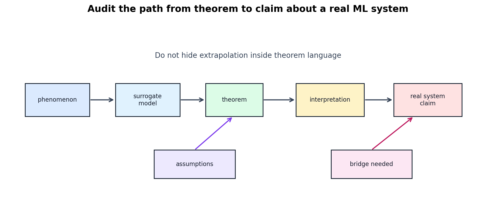

# Modern ML Theory Claim Audit

[Back to Learning From Data Theory Notebook](../README.md)

这是 T5 的 research tool。它继承但不重复：

- T2 Generalization Claim Audit；
- T3 Selection-Aware Research Protocol；
- T4 Learning Algorithm Anatomy。

T5 额外问：

```text
这篇 modern ML paper 实际声称了哪种 theoretical explanation？
evidence 是否支撑这个 explanation？
```



## 0. Source Separation

本工具是 repository synthesis。它使用 T5 前面章节的 source-scoped theorem discipline，但本身不新增 theorem。

## 1. Identify the Phenomenon

先记录 paper 观察到的 phenomenon。例子：

```text
low test error
interpolation
scaling behavior
optimizer dependence
shift robustness
representation invariance
calibration or abstention behavior
```

不要一开始就写 "because of implicit regularization"。先写 observation。

## 2. Identify the Theoretical Object

paper 控制或解释的对象是什么？

- hypothesis class；
- sample-dependent complexity；
- parameter norm；
- margin；
- algorithm stability；
- optimization trajectory；
- covariance spectrum；
- tangent kernel；
- source-target divergence；
- representation invariance。

不同对象不能互相替代。控制 source-target divergence 不等于控制 calibration；控制 margin 不等于解释 optimizer 为什么选了该 margin。

## 3. Identify the Model Regime

必须记录：

- linear / nonlinear；
- convex / non-convex；
- finite width / infinite width；
- interpolation / non-interpolation；
- separable / non-separable；
- i.i.d. / shifted environment；
- fixed representation / learned representation；
- source-risk / target-risk claim。

没有 model-regime boundary 的 theory claim 不可审计。

## 4. The Theorem-Evidence Ladder

不要把 evidence strength 写成单一等级。分别检查六个维度。

### Mathematical Validity

theorem 是否从 assumptions 推出？proof 是否控制了 stated object？

### Assumption Realism

assumptions 与 empirical system 有多接近？例如 infinite-width assumption 是否只是 surrogate？

### Numerical Informativeness

bound 是否 non-vacuous？是否能区分实际 models？

### Phenomenological Agreement

theory 是否预测或至少组织了 observed behavior？

### Mechanistic Relevance

theory 是否解释 why this specific algorithm / representation behaves this way？

### Transfer Scope

theory 只谈 source distribution，还是也谈 target environments？

## 5. Simplified-Model Extrapolation Audit

常见 extrapolation 是：

```text
linear benign overfitting
-> deep neural network
```

或：

```text
separable logistic-regression implicit bias
-> transformer training
```

审计时必须写出 bridge：

- 是否有 architecture-specific theorem？
- 是否有 empirical evidence 说明 real system 落在 surrogate regime？
- 是否有 representation analysis？
- 是否只是在做 heuristic interpretation？

若 bridge 不存在，要记录为 open inference，而不是藏在结论里。

## 6. Competing Explanations

同一个 observation 可能有多个解释。future paper notes 应至少问：

- norm/margin 是否足以解释？
- stability 是否相关？
- optimizer implicit bias 是否相关？
- data geometry 是否相关？
- representation learning 是否相关？
- explicit regularization 是否相关？
- sampling / validation selection 是否相关？
- source-target shift 是否相关？

不要强行制造 false exclusivity。

## 7. Claim Classification

把 claim 标成清楚的类型：

```text
formal theorem
formal theorem in surrogate model
empirical mechanism evidence
empirical correlation
heuristic interpretation
open conjecture
```

这些 categories 必须 visibly distinct。不要把 "formal theorem in surrogate model" 写成 "the real system is explained"。

## 8. Final Research-Theory Checklist

读一篇 modern ML theory paper 时，按下面顺序填：

| Question | Record |
| --- | --- |
| What was observed? | phenomenon, dataset, metric, regime |
| What was proved? | theorem statement and controlled object |
| What was assumed? | sampling, loss, model, optimization, representation |
| What was selected? | algorithm output, trajectory, early stopping, hyperparameters |
| What was extrapolated? | surrogate-to-real-system bridge |
| What remains unexplained? | representation change, optimizer dependence, shift, calibration |
| What would falsify or weaken the interpretation? | counter-regime, noise, shift, alternative optimizer |

## 9. Conceptual Trap Audit

future notes should explicitly avoid these statements:

```text
VC theory is wrong for deep learning.
```

```text
large networks generalize because of implicit regularization.
```

```text
SGD is stable, therefore SGD always generalizes.
```

```text
Rademacher complexity is the true complexity.
```

```text
zero training error = benign overfitting.
```

```text
double descent means larger models always improve test error.
```

```text
minimum norm = universally simplest / best solution.
```

```text
implicit bias theorem for logistic regression explains deep neural networks.
```

```text
NTK = neural network training.
```

```text
infinite width = actual practical network.
```

```text
domain-invariant representation => target-domain accuracy.
```

```text
small source-target marginal divergence => mechanisms are the same.
```

```text
generalization under i.i.d. sampling => distribution-shift robustness.
```

```text
a non-vacuous theorem automatically gives mechanistic explanation.
```

```text
theory failed because its assumptions do not match every empirical neural network.
```

更准确的写法是：

```text
the theorem is valid under its assumptions;
its explanatory scope for this empirical system is limited or still unbridged.
```

## 10. Cross-Links

- T2 audit：[generalization claim audit](../part2_generalization_theory/10_generalization_claim_audit_for_ml_research.md)。
- T3 protocol：[selection-aware protocol](../part3_fitting_regularization_validation/15_selection_aware_ml_research_protocol.md)。
- T4 anatomy：[learning algorithm anatomy](../part4_margin_kernel_learning_principles/20_learning_algorithm_anatomy_for_ml_research.md)。
- Week 5 calibration and abstention show that accuracy generalization is not reliability generalization：[calibration](../../../reports/week5/02_calibration_metrics_and_reliability_diagrams.md)，[abstention](../../../reports/week5/03_confidence_thresholding_and_abstention_policy.md)。

[Back to Learning From Data Theory Notebook](../README.md)
